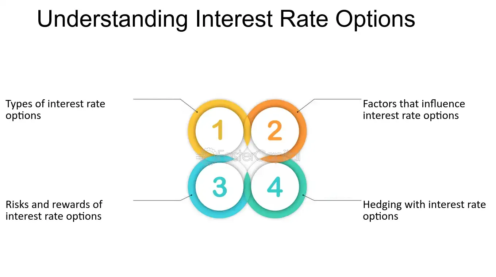

## Table of Contents

## What are interest rate options?

Interest rate options are financial contracts that give the buyer the right, but not the obligation, to buy or sell an interest rate at a specific price on or before a certain date. These options are used by investors and businesses to manage the risk of fluctuating interest rates. For example, if a company expects interest rates to rise, it might buy an interest rate option to lock in a lower rate.

There are two main types of interest rate options: calls and puts. A call option gives the buyer the right to benefit from rising interest rates, while a put option allows the buyer to benefit from falling interest rates. These options can be based on various underlying assets, such as government bonds or interest rate futures. By using interest rate options, investors can protect themselves against adverse movements in interest rates or speculate on future rate changes.

## How do interest rate options work?

Interest rate options work by giving the buyer the right to either buy or sell an interest rate at a set price before a certain date. This set price is called the strike price. The buyer doesn't have to use this right if they don't want to. They can choose to let the option expire if it's not in their favor. The buyer pays a fee, called a premium, to get this right. The seller of the option, on the other hand, has to fulfill the contract if the buyer decides to use it.

These options can help people and businesses manage the risk of changing interest rates. For example, if someone thinks interest rates will go up, they might buy a call option. This would let them benefit from higher rates. If they think rates will go down, they might buy a put option to protect against lower rates. By using [interest rate](/wiki/interest-rate-trading-strategies) options, people can either protect themselves from bad changes in interest rates or try to make money by guessing what will happen to rates in the future.

## What are the basic types of interest rate options?

There are two basic types of interest rate options: call options and put options. A call option gives the buyer the right to benefit from rising interest rates. If interest rates go up, the buyer can use the option to get a higher rate than what they would have gotten without it. On the other hand, a put option gives the buyer the right to benefit from falling interest rates. If rates go down, the buyer can use the put option to protect themselves from the lower rates.

These options work by setting a specific interest rate, called the strike price, that the buyer can choose to use before a certain date. The buyer pays a fee, called a premium, to have this choice. If the interest rates move in a way that benefits the buyer, they can use the option. If not, they can let it expire without using it. This helps people and businesses manage the risk of changing interest rates or try to make money by guessing what will happen to rates in the future.

## Who are the typical users of interest rate options?

The typical users of interest rate options are businesses and financial institutions. Companies use these options to manage the risk of changing interest rates that could affect their loans or investments. For example, a company with a big loan might use an interest rate option to protect itself from higher rates that would make the loan more expensive. Financial institutions, like banks, use interest rate options to balance their portfolios and manage the risks they face from lending and borrowing money at different rates.

Another group of users includes investors and speculators. Investors might use interest rate options to protect their bond investments from falling interest rates, which can lower the value of their bonds. Speculators, on the other hand, use these options to try to make money by guessing what will happen to interest rates. They buy options hoping that rates will move in a way that makes their options more valuable, allowing them to sell the options at a profit.

## What are the key differences between interest rate options and other types of options?

Interest rate options are different from other types of options mainly because they are based on interest rates, not stocks or commodities. For example, stock options give you the right to buy or sell a certain stock at a set price, while interest rate options let you do the same thing but with interest rates. This means that interest rate options are used to manage risks related to borrowing and lending money, which is very different from the risks involved in owning stocks or commodities.

Another key difference is that interest rate options can be used in more ways than other types of options. They are often used by banks and big companies to protect themselves from changes in interest rates that could affect their loans or investments. On the other hand, stock options are usually used by individual investors or traders who want to make money from changes in stock prices. So, while both types of options give you the right to buy or sell something at a set price, the reasons people use them and the risks they help manage are very different.

## How are interest rate options priced?

Interest rate options are priced using a model called the Black-Scholes model, which is also used for pricing other types of options. This model looks at several things to figure out the price of an option. These things include the current interest rate, the strike price of the option, the time until the option expires, and how much interest rates might change in the future. The model uses these factors to calculate what the option is worth today.

The price of an interest rate option also depends on whether it's a call option or a put option. A call option, which benefits from rising interest rates, will be more expensive if people think rates are going to go up a lot. A put option, which benefits from falling rates, will be more expensive if people think rates are going to go down a lot. The premium, or the price the buyer pays for the option, reflects these expectations about future interest rate movements. So, the price of an interest rate option is really a mix of what's happening with interest rates now and what people think will happen in the future.

## What are the main factors that affect the value of interest rate options?

The value of interest rate options depends on several things. One big thing is the current interest rate. If the current rate is close to the strike price of the option, the option might be worth more because it's more likely to be used. Another important thing is how much time is left until the option expires. The more time there is, the more chance there is for interest rates to move in a way that makes the option valuable, so the option might cost more.

Another [factor](/wiki/factor-investing) is how much people think interest rates might change in the future. If people think rates will move a lot, the option might be more expensive because there's a bigger chance it will be useful. Also, the type of option matters. A call option, which you use if rates go up, will be more valuable if people think rates are going to rise a lot. A put option, which you use if rates go down, will be more valuable if people think rates are going to fall a lot. So, the price of an interest rate option is really a mix of what's happening with interest rates now and what people think will happen in the future.

## What are cap and floor options and how do they relate to interest rate options?

Cap and floor options are types of interest rate options. A cap option sets a maximum interest rate that a borrower has to pay. It's like a ceiling that stops the interest rate from going too high. If the interest rate goes above the cap, the option pays out the difference. This helps borrowers protect themselves from high interest rates. On the other hand, a floor option sets a minimum interest rate that a lender will receive. It's like a floor that stops the interest rate from going too low. If the interest rate falls below the floor, the option pays out the difference. This helps lenders protect themselves from low interest rates.

Cap and floor options are related to interest rate options because they both help manage the risk of changing interest rates. They are special kinds of options that focus on setting limits on interest rates, rather than just giving the right to buy or sell an interest rate at a certain price. Both cap and floor options work by paying out money if the interest rate moves outside the set limit. This makes them useful tools for businesses and financial institutions that want to keep their interest rate costs or income within a certain range.

## How can interest rate options be used for hedging?

Interest rate options can be used for hedging by helping businesses and investors protect themselves from changes in interest rates. For example, if a company has a big loan with a floating interest rate, it might be worried that the rate will go up and make the loan more expensive. To protect against this, the company can buy an interest rate cap. This cap sets a maximum rate that the company will have to pay, even if the actual interest rate goes higher. By doing this, the company can keep its loan payments within a certain range, no matter what happens to interest rates.

Another way to use interest rate options for hedging is by buying a floor option. This can be useful for someone who is lending money and wants to make sure they get a minimum interest rate. If the interest rate falls below the floor, the option pays out the difference, so the lender still gets the income they expected. Both cap and floor options help businesses and investors manage the risk of changing interest rates by setting limits on how high or low those rates can go. This way, they can plan their finances more easily and avoid big surprises from unexpected rate changes.

## What are the risks associated with trading interest rate options?

Trading interest rate options comes with some risks. One big risk is that the interest rates might not move the way you expect. If you buy a call option hoping rates will go up but they don't, you could lose the money you paid for the option. The same thing can happen if you buy a put option thinking rates will go down, but they stay the same or go up instead. This is called market risk, and it's a big part of trading options.

Another risk is called [liquidity](/wiki/liquidity-risk-premium) risk. This means that sometimes it can be hard to buy or sell an option quickly, especially if it's not a very common type of option. If you need to get out of a trade fast and can't find someone to buy your option, you might have to sell it for less than it's worth. Also, there's the risk of losing more money than you put in if you're selling options. If you sell a call option and rates go up a lot, you might have to pay a big amount to the buyer. So, it's important to understand these risks before trading interest rate options.

## How do interest rate options impact monetary policy?

Interest rate options can affect monetary policy because they show what people think about future interest rates. When the central bank, like the Federal Reserve, wants to control the economy, it changes the interest rates. If a lot of people are buying interest rate options, it might mean they think rates will go up or down. The central bank watches these options to see what people expect. If everyone thinks rates will go up, the central bank might decide to keep rates steady or even raise them to match what people expect.

Also, interest rate options can help the central bank see how well its policies are working. If the central bank raises rates to slow down the economy but people keep buying options that bet on lower rates, it might mean the policy isn't working as planned. By looking at these options, the central bank can get a better idea of what to do next. So, interest rate options give the central bank important information that helps them make decisions about the economy.

## What advanced strategies can be employed using interest rate options?

One advanced strategy using interest rate options is called a straddle. This involves buying both a call option and a put option at the same time, with the same strike price and expiration date. The idea is to make money no matter which way interest rates move. If rates go up a lot, the call option becomes valuable. If rates go down a lot, the put option becomes valuable. This strategy is good if you think interest rates will move a lot but you're not sure which way. The downside is that it costs more because you're buying two options, and if rates don't move much, you could lose the money you paid for both options.

Another strategy is called a collar. This is used to protect against big changes in interest rates while still allowing for some movement. To do a collar, you buy a cap option to set a maximum interest rate and sell a floor option to set a minimum interest rate. This means you're protected if rates go up too high, but you also give up some of the benefits if rates go down too low. It's like putting a limit on how much risk you're willing to take. This strategy is often used by businesses that want to keep their interest costs within a certain range without spending too much on options.

## References & Further Reading

[1]: Hull, J. C. (2018). ["Options, Futures, and Other Derivatives"](https://www.semanticscholar.org/paper/Options%2C-Futures%2C-and-Other-Derivatives-Hull/89bdee500c8623864fc9eb7a471546aa713acc44) (10th ed.). Pearson.

[2]: Black, F., & Scholes, M. (1973). ["The Pricing of Options and Corporate Liabilities."](https://www.cs.princeton.edu/courses/archive/fall09/cos323/papers/black_scholes73.pdf) Journal of Political Economy, 81(3), 637–654.

[3]: ["Interest Rate Option Models: Understanding, Analysing and Using Models for Exotic Interest Rate Options"](https://www.amazon.com/Interest-Rate-Option-Models-Understanding-Engineering/dp/0471979589) by J. Hunt and P. Kennedy

[4]: ["Algorithmic Trading and DMA"](https://www.amazon.com/Algorithmic-Trading-DMA-introduction-strategies/dp/0956399207) by Barry Johnson

[5]: ["The Volatility Surface: A Practitioner's Guide"](https://www.amazon.com/Volatility-Surface-Practitioners-Guide/dp/0471792519) by Jim Gatheral