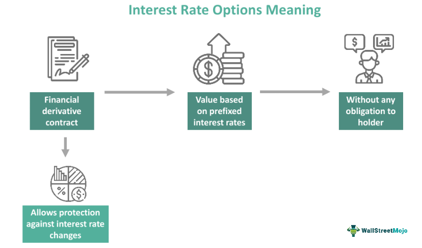

Interest rate fluctuations significantly impact various financial markets, shaping the landscape of investment strategies and influencing the valuation and use of financial derivatives. Among these derivatives, interest rate options present unique opportunities for traders and investors. Unlike traditional options, which derive value from underlying stock prices, interest rate options derive value from changes in interest rates. This distinct characteristic allows market participants to engage in speculation on future interest rate movements or implement effective hedging strategies to mitigate associated risks.

Interest rate options come in two primary forms: call options and put options. Call options grant the holder the right, but not the obligation, to benefit from rising interest rates, whereas put options are advantageous in scenarios of declining rates. Such flexibility makes these financial instruments valuable tools for managing financial exposure in volatile markets.



This article explores the multifaceted role of interest rate options as financial derivatives. By examining their usage in interest rate hedging, we can understand how these options integrate into comprehensive risk management strategies. Furthermore, the article highlights the use of algorithmic trading to refine and enhance the effectiveness of trading strategies involving interest rate options. Algorithmic trading technology, driven by sophisticated models and data analysis, offers increased precision in executing trades, thereby optimizing outcomes and providing a significant edge in navigating complex financial environments. Understanding these dynamics is crucial for investors and institutions seeking to maximize their risk-return profiles in an ever-evolving market.

## Table of Contents

## Understanding Financial Derivatives: Interest Rate Options

Interest rate options are a specific category of financial derivatives whose value is intrinsically linked to fluctuations in interest rates. Much like equity options, which derive their value from the underlying stock prices, interest rate options offer investors a contingent claim based on the future level of interest rates. This derivative instrument provides flexibility and potential profit opportunities stemming from market expectations about interest rate movements.

Interest rate options can be categorized into two basic types: call options and put options. Call options on interest rates confer the holder the right, but not the obligation, to benefit from rising interest rates. This is particularly important in a scenario where interest rates increase beyond a certain threshold, offering potential gains from the differential between the market rate and the strike rate of the option. Conversely, put options are advantageous when interest rates decrease, enabling holders to benefit from declining rates by allowing them to lock in higher rates than prevailing market conditions.

One practical application of interest rate options is hedging. Financial institutions, corporations, and individual investors can use these derivatives to protect against unfavorable movements in interest rates. By employing interest rate options, entities can safeguard their fixed-income portfolios or debt obligations against rate volatility. For instance, a company concerned about rising interest costs on its floating-rate debt might purchase an interest rate call option to set an upper limit on future interest payments, thereby effectively managing their financial exposure.

Beyond hedging, [interest rate](/wiki/interest-rate-trading-strategies) options are frequently utilized for speculative purposes. Traders speculating on future interest rate changes can leverage these options to position themselves advantageously, betting on outcomes based on their market predictions. A speculator anticipating a rise in interest rates might buy call options on interest rates to capitalize on this belief, thereby reaping potential benefits if their forecast proves accurate.

The use of interest rate options is grounded in their ability to offer strategic flexibility and risk management tools in the face of interest rate [volatility](/wiki/volatility-trading-strategies). These characteristics make them indispensable instruments for a diverse set of market participants aiming to optimize financial outcomes in dynamic and sometimes unpredictable market environments.

## Interest Rate Hedging and Its Significance

Interest rate hedging plays a pivotal role for financial institutions, corporations, and investors aiming to mitigate the risks arising from interest rate volatility. Such volatility can significantly impact financial outcomes, necessitating robust risk management strategies.

One common strategy involves employing interest rate caps, floors, and collars. These instruments provide protective boundaries for interest rate fluctuations. An interest rate cap sets a maximum limit on the interest rate an investor has to pay. If rates rise above this threshold, the cap compensates the holder, effectively putting a ceiling on borrowing costs. Conversely, an interest rate floor ensures a minimum interest rate return on an investment, benefiting the holder when rates fall below a set level. Collars combine both caps and floors to create a range within which interest rates can fluctuate, offering a balance between protection and cost.

Swaptions, or options on interest rate swaps, are another advanced hedging tool. They allow the holder to enter into an interest rate swap at a specified date in the future, at terms defined today. This flexibility enables customized hedging strategies tailored to specific exposure periods and interest rate scenarios.

The precision offered by these instruments stems from their capability to closely match hedge needs with specific risk exposures, making them integral to risk management frameworks. For example, an organization with floating rate debt might use a cap to ensure interest payments do not exceed a budgeted level. Similarly, an investor with future fixed-income securities might utilize a swaption to preserve advantageous interest rates in an uncertain market environment.

Effectively, the strategic use of interest rate derivatives like caps, floors, collars, and swaptions allows various entities to manage potential adverse outcomes of interest rate changes, ultimately contributing to financial stability and predictability. The ability to tailor hedging approaches precisely according to market forecasts and individual risk tolerances underscores their value in comprehensive risk management practices.

## Algorithmic Trading in Interest Rate Options

Algorithmic trading harnesses advanced computational techniques to facilitate the execution of trades based on predefined criteria, optimizing both speed and precision while significantly reducing human-induced errors. Within the context of interest rate options, [algorithmic trading](/wiki/algorithmic-trading) enables the swift and effective deployment of sophisticated trading strategies such as volatility [arbitrage](/wiki/arbitrage) and delta hedging.

Volatility arbitrage involves capitalizing on differences between the implied volatility of interest rate options and the actual market volatility. By identifying anomalies or predictable patterns, algorithms can execute trades that exploit these variances for profits. Delta hedging, on the other hand, is used to mitigate the risk associated with the directional movement of interest rates. It involves maintaining a delta-neutral position, where the portfolio is adjusted dynamically to offset the sensitivity (delta) of option prices to changes in underlying interest rates. This is often accomplished through the continuous recalibration of the portfolio as market conditions evolve, a task well-suited for automated algorithms due to its complexity and need for rapid execution.

The integration of [machine learning](/wiki/machine-learning) and big data analysis in algorithmic trading adds another layer of sophistication. Machine learning algorithms can process vast datasets encompassing historical interest rate movements, macroeconomic indicators, and other relevant financial factors. Through pattern recognition and predictive modeling, these algorithms can forecast potential market shifts, allowing for preemptive adjustments in trading strategies. For instance, machine learning models may employ techniques like regression analysis or neural networks to anticipate interest rate changes, providing traders with actionable insights.

Big data further enhances algorithmic trading by offering comprehensive datasets that improve model accuracy and reliability. The ability to analyze diverse and high-[volume](/wiki/volume-trading-strategy) data streams equips traders with a more nuanced understanding of market dynamics and emerging trends. Consequently, this increased granularity in data interpretation boosts the predictive accuracy of trading algorithms, especially in volatile interest rate environments.

Overall, algorithmic trading in interest rate options combines precision, speed, and advanced analytical capabilities. By leveraging technology, traders can efficiently manage complex portfolios, adapt to rapid market changes, and optimize their risk-return profiles in an environment characterized by interest rate uncertainty.

## Case Studies and Examples

Historical case studies offer key insights into the strategic use of interest rate options in various economic climates. Particularly during periods of shifting interest rates, these financial derivatives have proven to be effective tools for both speculation and hedging.

One notable example occurred during a period of anticipated rate hikes. Traders who forecasted an increase in interest rates strategically used call options on U.S. Treasury bonds. This approach allowed them to hedge against the potential losses associated with declining bond prices that typically accompany rising rates. By purchasing call options, traders gained the right, but not the obligation, to buy Treasury bonds at a predetermined price, ensuring they could benefit from any potential increase in bond yields without facing the downside risk of holding the actual bonds. This strategy effectively acted as an insurance policy, providing protection against adverse price movements.

In a different scenario involving economic contraction and the expectation of decreasing interest rates, put options have been utilized. During such periods, investors may anticipate a drop in interest rates leading to an increase in bond prices. By purchasing put options on interest rate futures, traders could profit from price movements without taking on the full exposure of holding the underlying assets. The flexibility provided by put options enabled these investors to capitalize on falling rates for speculative gains while managing risk exposure.

These case studies demonstrate the practical application of interest rate options across different market conditions. Whether hedging against rate hikes with call options or capitalizing on rate declines with put options, these derivatives offer versatile strategies tailored to specific economic forecasts. The strategic deployment of interest rate options thereby highlights their vital role in advanced financial planning, enabling traders and investors to navigate the uncertainties of interest rate fluctuations effectively.

## Challenges and Limitations

Interest rate options provide a versatile tool for hedging and speculation in response to interest rate movements. However, they come with inherent challenges and limitations that investors must carefully consider. One of the primary complexities involves the pricing models used for these derivatives. Pricing models for interest rate options require sophisticated mathematical frameworks, typically incorporating stochastic calculus and differential equations. The widely used models, such as the Black-Scholes model for equity options, must be adapted for interest rate derivatives; this adaptation often leads to increased complexity due to the need to account for the dynamic nature of interest rates. 

For example, the Heath-Jarrow-Morton (HJM) framework or the Black-Derman-Toy model are commonly employed to model interest rate options. These models require a deep understanding of financial mathematics and assumptions about interest rate volatility and future rate paths. Investors or traders lacking proficiency in these complex models may struggle to accurately price and manage their options, leading to potential mispricing and resultant financial exposure.

Another limitation concerns the structure of the options themselves. European-style options, which are exercisable only at maturity, can limit strategic flexibility. This can be disadvantageous compared to American-style options, which allow exercise at any time before expiration, offering greater strategic maneuverability to respond to changing market conditions. European-style options may sometimes inhibit timely responses to market shifts, potentially reducing effectiveness in rapid or unexpected rate transitions.

Additionally, the costs associated with interest rate options, including the premiums paid, can be significant. These premiums reflect the option's intrinsic and time value, demanding careful consideration of the cost-benefit balance. High premiums can erode potential gains or savings achieved through hedging strategies, particularly in volatile market environments where premium levels are elevated.

Liquidity is another critical consideration. Not all interest rate options enjoy deep and liquid markets. Limited [liquidity](/wiki/liquidity-risk-premium) can exacerbate trading costs and lead to price slippage, where the execution price deviates from the expected price. This liquidity risk can be particularly acute in less popular or specialized interest rate options, potentially making them unsuitable for large-scale transactions.

In summary, while interest rate options are powerful instruments for managing interest rate risk and capitalizing on market movements, they require a sophisticated understanding of complex pricing dynamics and careful consideration of structural constraints. Investors must weigh these factors, including cost implications and liquidity risks, to effectively incorporate interest rate options into their portfolios. As financial environments continue to evolve, these considerations remain pivotal in optimizing the use of interest rate derivatives.

## Conclusion

Interest rate options, as financial derivatives, play a crucial role in both hedging against and speculating on fluctuations in interest rates. They offer a strategic tool for investors to manage exposure to risk stemming from interest rate volatility, enabling more controlled financial decision-making in uncertain environments. 

Algorithmic trading has augmented the efficiency and precision with which these options can be utilized. By integrating pre-set trading criteria and leveraging advanced technologies, algorithmic trading enhances the ability of investors to execute strategies swiftly and accurately. This technological support minimizes human error, offering a significant advantage in the ever-evolving financial landscape. Tools such as machine learning and big data analytics further empower these algorithms, offering predictive insights that are invaluable in volatile markets.

As financial markets transform, adapting to new economic conditions and technological advancements, the skillful deployment of interest rate options remains essential for investors and institutions. Mastery of these derivatives is critical not only for safeguarding against potential losses but also for capitalizing on favorable market movements. Understanding and effectively applying interest rate options will continue to be integral for optimizing risk-return profiles, ensuring that financial strategies are robust against the complexities of future market shifts.

## FAQs on Interest Rate Options

**How do interest rate options differ from other types of options?**

Interest rate options are a specific type of derivative that derive their value from fluctuations in interest rates, unlike other options such as equity options, which are dependent on stock prices. This distinction is fundamental due to the different underlying assets. Equity options are attached to specific stock prices, while interest rate options are linked to interest rate indices, such as the LIBOR or Treasury yields. The pricing of interest rate options typically involves more complex models due to the nature of interest rate movements, which tend to be more stable but less predictable compared to stock price movements.

**What are the main factors driving the demand for interest rate options?**

The demand for interest rate options is influenced by several key factors:

1. **Interest Rate Volatility:** Higher volatility increases the uncertainty of interest rate movements, prompting investors to seek hedging strategies.
2. **Economic Conditions:** During periods of economic instability, entities tend to use interest rate options to manage potential financial risks.
3. **Inflation Expectations:** Shifts in inflation expectations can alter interest rate forecasts, affecting the demand for derivatives that hedge interest rate exposure.
4. **Regulatory Changes:** Modifications in financial regulations may necessitate risk management strategies that include interest rate options.

**Can interest rate options predict future interest rate movements?**

While interest rate options are primarily used for hedging and speculative purposes, they do not predict future interest rate movements on their own. Instead, they reflect the market participants' collective expectations and risk assessments regarding future interest rate trends. Analyzing option pricing and implied volatility can offer insights into market sentiment and potential future scenarios, but cannot provide definite predictions. Traders and analysts often combine these observations with macroeconomic data and forecasts to guide their strategies.

**What role does algorithmic trading play in optimizing the trading of interest rate options?**

Algorithmic trading has transformed the landscape of trading interest rate options by allowing for the execution of complex and high-speed strategies with precision. Algorithms can automatically implement sophisticated strategies such as volatility arbitrage and delta hedging based on predefined criteria. By doing so, they help minimize human error and emotional bias while reacting to market conditions more swiftly than manual trading methods. The integration of machine learning techniques and big data analytics further enhances these capabilities, enabling algorithms to adapt to and predict market patterns effectively, thus optimizing trading outcomes in volatile interest rate environments.

Here is a simple Python example of a basic algorithmic trading strategy that reacts to interest rate changes:

```python
import numpy as np

def trade_decision(current_rate, historical_data):
    if current_rate > np.mean(historical_data):
        return "Buy Call Option"
    elif current_rate < np.mean(historical_data):
        return "Buy Put Option"
    else:
        return "Hold"

# Example usage
current_rate = 2.5
historical_rates = [2.1, 2.3, 2.4, 2.2, 2.6]
decision = trade_decision(current_rate, historical_rates)
print(decision)
```
This script makes a simplified decision based on whether the current interest rate is above or below the historical average, illustrating how algorithmic trading can incorporate statistical analysis for decision-making.

## References & Further Reading

[1]: Hull, J. C. (2018). ["Options, Futures, and Other Derivatives"](https://www.semanticscholar.org/paper/Options%2C-Futures%2C-and-Other-Derivatives-Hull/89bdee500c8623864fc9eb7a471546aa713acc44) (10th ed.). Pearson.

[2]: Black, F., & Scholes, M. (1973). ["The Pricing of Options and Corporate Liabilities."](https://www.cs.princeton.edu/courses/archive/fall09/cos323/papers/black_scholes73.pdf) Journal of Political Economy, 81(3), 637–654.

[3]: ["Interest Rate Option Models: Understanding, Analysing and Using Models for Exotic Interest Rate Options"](https://www.amazon.com/Interest-Rate-Option-Models-Understanding-Engineering/dp/0471979589) by J. Hunt and P. Kennedy

[4]: ["Algorithmic Trading and DMA"](https://www.amazon.com/Algorithmic-Trading-DMA-introduction-strategies/dp/0956399207) by Barry Johnson

[5]: ["The Volatility Surface: A Practitioner's Guide"](https://www.amazon.com/Volatility-Surface-Practitioners-Guide/dp/0471792519) by Jim Gatheral