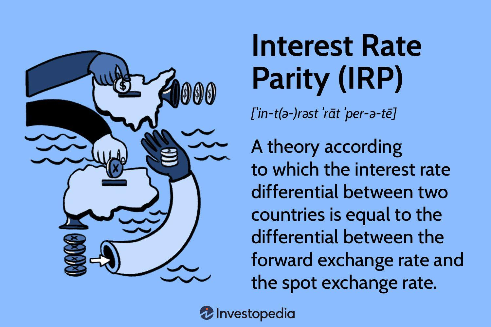

## Table of Contents

## What is interest rate parity and why is it important in forex trading?

Interest rate parity is a theory that says the difference in interest rates between two countries should be equal to the difference in the forward and spot exchange rates of their currencies. In simpler terms, if you can borrow money in one country at a low interest rate and invest it in another country at a higher interest rate, you should not make a profit because the exchange rate will change to cancel out that profit. This theory helps explain why currencies move the way they do based on interest rates.

In forex trading, interest rate parity is important because it helps traders understand how interest rates affect currency values. If a country raises its interest rates, its currency might become more valuable because investors want to earn that higher interest. But, if the interest rate difference is too big, the exchange rate will adjust so that there's no easy profit to be made. Traders use this idea to predict how currencies might move and make their trading decisions based on these predictions.

## How does interest rate parity affect currency exchange rates?

Interest rate parity helps explain why currency exchange rates change based on the interest rates of different countries. If one country has a higher interest rate than another, its currency might become more valuable. People want to invest their money where they can earn more interest, so they buy that country's currency. This demand makes the currency's value go up compared to other currencies.

But, if the difference in interest rates between two countries gets too big, the exchange rate will change to balance things out. This means that even though you can earn more interest in one country, the value of its currency might go down when you want to change it back to your own currency. So, you won't make as much profit as you thought. This keeps the system fair and stops people from making easy money just by moving money between countries with different interest rates.

## What are the differences between covered and uncovered interest rate parity?

Covered interest rate parity (CIP) and uncovered interest rate parity (UIP) are two ways to understand how interest rates affect currency exchange rates. Covered interest rate parity happens when you use a forward contract to lock in an exchange rate for the future. This means you know exactly how much money you will get when you change your money back. With CIP, the interest rate difference between two countries should equal the difference between the forward and spot exchange rates. This way, you can't make easy money by borrowing in one country and investing in another because the exchange rate change will balance it out.

Uncovered interest rate parity (UIP) is different because it doesn't use a forward contract. Instead, it assumes that people expect the future exchange rate to change in a way that balances out the interest rate difference. So, if one country has higher interest rates, people might invest there, but they also expect that country's currency to lose value in the future. UIP says that the expected change in the exchange rate should be equal to the interest rate difference. However, UIP is more of a theory because it's hard to predict future exchange rates accurately, so it doesn't always work out in real life.

## Can you explain the formula for calculating interest rate parity?

The formula for calculating covered interest rate parity (CIP) is pretty straightforward. It says that the interest rate difference between two countries should equal the difference between the forward exchange rate and the spot exchange rate. In simple terms, if you borrow money in one country at a low interest rate and invest it in another country at a higher interest rate, the exchange rate will change so that you don't make a profit. The formula looks like this: (1 + i_domestic) = (1 + i_foreign) * (F/S), where i_domestic is the domestic interest rate, i_foreign is the foreign interest rate, F is the forward exchange rate, and S is the spot exchange rate.

Uncovered interest rate parity (UIP) is a bit trickier because it doesn't use a forward contract. Instead, it assumes that people expect the future exchange rate to change in a way that balances out the interest rate difference. The formula for UIP is: (1 + i_domestic) = (1 + i_foreign) * (E(S_future)/S), where E(S_future) is the expected future spot exchange rate. This means that if one country has higher interest rates, people might invest there, but they also expect that country's currency to lose value in the future. So, the expected change in the exchange rate should be equal to the interest rate difference.

## What role do central banks play in influencing interest rate parity?

Central banks play a big role in influencing interest rate parity because they set the interest rates for their countries. When a central bank changes its interest rate, it can affect how much people want to invest in that country's currency. If a central bank raises its interest rate, it makes the country's currency more attractive to investors because they can earn more money. This can make the currency's value go up compared to other currencies. On the other hand, if a central bank lowers its interest rate, it can make the currency less attractive, and its value might go down.

These changes in interest rates by central banks can lead to shifts in the exchange rates between currencies. If one country's central bank raises its interest rate while another country's central bank keeps its rate the same, the difference in interest rates can cause the currency of the country with the higher rate to become more valuable. This is where interest rate parity comes in. It helps explain how these interest rate changes should balance out with changes in the exchange rates, so people can't make easy money just by moving money between countries. Central banks, by setting interest rates, directly influence this balance and the overall dynamics of interest rate parity.

## How can traders use interest rate parity to predict currency movements?

Traders can use interest rate parity to predict how currencies might move by looking at the differences in interest rates between countries. If one country's central bank raises its interest rate, traders might expect that country's currency to become more valuable because investors will want to invest there to earn the higher interest. On the other hand, if a country lowers its interest rate, traders might predict that its currency will become less valuable because it's less attractive to investors. By understanding these interest rate differences, traders can make guesses about where exchange rates might go in the future.

However, traders also need to think about covered and uncovered interest rate parity. With covered interest rate parity, traders can use forward contracts to lock in exchange rates, which helps them predict how much money they'll get back when they convert their investments. This can make their predictions more accurate. With uncovered interest rate parity, traders don't use forward contracts, so they have to guess how exchange rates might change based on their expectations. This makes predicting currency movements trickier, but traders can still use interest rate differences to guide their guesses. By paying attention to central bank actions and using interest rate parity, traders can make better predictions about currency movements.

## What are the common misconceptions about interest rate parity among forex traders?

A common misconception among forex traders is that interest rate parity always works perfectly in real life. Many traders think that if one country has a higher interest rate, its currency will always become more valuable. But this isn't always true. Interest rate parity is a theory, and in the real world, other things like economic news, political events, and market feelings can change how currencies move. So, traders need to remember that interest rate parity is just one part of the puzzle and not a perfect rule.

Another misconception is that traders can easily make money by using interest rate parity. Some traders think they can borrow money in a country with low interest rates, invest it in a country with high interest rates, and always make a profit. But interest rate parity says that the exchange rate will change to balance out any profit. This means that even if you earn more interest in one country, the value of its currency might go down when you want to change it back to your own currency. So, traders need to be careful and understand that interest rate parity is about keeping things fair, not about making easy money.

## How does interest rate parity relate to arbitrage opportunities in the forex market?

Interest rate parity helps explain why it's hard to make easy money through arbitrage in the forex market. Arbitrage is when traders try to make a profit by buying a currency in one place where it's cheap and selling it in another place where it's more expensive. If one country has a lower interest rate and another has a higher interest rate, traders might think they can borrow money in the country with the low rate, invest it in the country with the high rate, and make a profit. But interest rate parity says that the difference in interest rates should be balanced out by the difference in the exchange rates. So, if you try to do this, the exchange rate will change, and you won't make as much money as you thought.

This means that interest rate parity makes arbitrage opportunities less common in the forex market. If interest rate parity worked perfectly, there would be no way to make a profit just by moving money between countries with different interest rates. But in the real world, things like market feelings, economic news, and unexpected events can create small windows where arbitrage might be possible. Still, these opportunities are usually short-lived because other traders will quickly notice them and act, causing the market to adjust and close the gap. So, while interest rate parity helps explain why arbitrage is tough, it's not a perfect rule, and traders need to be smart and quick to spot and use any small chances that come up.

## What are the limitations and challenges of applying interest rate parity in real-world trading?

Interest rate parity is a useful theory, but it has some limitations when traders try to use it in the real world. One big challenge is that the theory assumes that markets are perfect and that everyone has the same information. But in real life, markets are not perfect, and different people have different information. This means that the exchange rates might not always change in the way that interest rate parity predicts. Also, things like political events, economic news, and even people's feelings about the market can make currency values move in unexpected ways. So, traders need to be careful and not rely only on interest rate parity to make their decisions.

Another challenge is that interest rate parity doesn't always work perfectly because of transaction costs and other real-world factors. When traders try to use arbitrage to make money from interest rate differences, they have to pay fees for buying and selling currencies. These costs can eat into any profits they might make. Plus, it can take time to move money between countries, and during that time, exchange rates can change. This means that even if interest rate parity says there should be no profit from arbitrage, in the real world, there might be small chances to make money if traders are quick and smart. But these opportunities are usually short-lived and hard to predict, so traders need to be ready to act fast.

## How have historical events demonstrated the effects of interest rate parity on forex markets?

Historical events have shown how interest rate parity can affect forex markets. For example, during the 1980s, the United States raised its interest rates to fight inflation. This made the US dollar more attractive to investors because they could earn more interest by holding dollars. As a result, the value of the US dollar went up compared to other currencies. This is what interest rate parity would predict: higher interest rates should lead to a stronger currency. But, as the dollar got stronger, it also made US exports more expensive, which hurt the economy. So, even though interest rate parity helped explain why the dollar got stronger, other things like trade and economic health also played a role.

Another example is the Asian Financial Crisis in the late 1990s. Some countries in Asia, like Thailand, had pegged their currencies to the US dollar. When the US raised its interest rates, it put pressure on these countries to keep their interest rates high too. But this made it hard for them to grow their economies. Eventually, investors started to worry and pulled their money out of these countries, causing their currencies to crash. This shows that while interest rate parity can explain some currency movements, real-world events and investor feelings can cause big changes that don't always follow the theory. So, traders need to look at more than just interest rates when trying to predict how currencies will move.

## What advanced strategies can expert traders employ that involve interest rate parity?

Expert traders can use a strategy called carry trade, which involves borrowing money in a country with low interest rates and investing it in a country with high interest rates. They hope to make a profit from the difference in interest rates. But they need to be careful because interest rate parity says that the exchange rate will change to balance out this profit. So, traders need to watch the exchange rates closely and use forward contracts to lock in rates, which is part of covered interest rate parity. This can help them predict how much money they'll get back when they convert their investments and protect them from big losses if the exchange rate moves against them.

Another advanced strategy is to use uncovered interest rate parity to predict future exchange rates. Traders look at the interest rate differences between countries and guess how the exchange rate might change in the future. This is trickier because it's hard to predict exchange rates accurately, but if traders are right, they can make big profits. They might use economic data, central bank announcements, and other information to help them make these guesses. By understanding how interest rate parity works, expert traders can make better decisions and find opportunities to make money in the forex market, even though it's not always easy or guaranteed.

## How does interest rate parity interact with other economic theories and models in forex trading?

Interest rate parity works together with other economic theories and models to help traders understand how currencies move. One important theory is the purchasing power parity (PPP), which says that currencies should have the same buying power in different countries. If a burger costs $5 in the US and 4 euros in Europe, the exchange rate should be about 1.25 dollars per euro. Interest rate parity and PPP both help explain why exchange rates change, but they look at different things. Interest rate parity focuses on interest rates, while PPP looks at prices. Together, they give traders a fuller picture of what might happen to currency values.

Another model that works with interest rate parity is the expectations theory. This theory says that what people think will happen in the future can affect currency values today. If people expect a country's interest rates to go up, they might start buying that country's currency now, making it more valuable. Interest rate parity helps traders understand how these expectations might affect exchange rates. By combining interest rate parity with other theories and models, traders can make better predictions about how currencies will move and find more chances to make money in the forex market.

## What is Interest Rate Parity and How Can It Be Understood?

Interest rate parity (IRP) is a fundamental principle in international finance that describes the relationship between interest rates and currency exchange rates. It posits that the difference in national interest rates for financial instruments of similar risk and maturity should be equal to the differential between the forward exchange rate and the spot exchange rate. This ensures that investors achieve a return on investments that is consistent when accounting for hedging or expected changes in exchange rates, thereby preventing arbitrage opportunities across different currencies.

There are two main types of interest rate parity: covered interest rate parity (CIRP) and uncovered interest rate parity (UIRP).

**Covered Interest Rate Parity**

Covered [interest rate](/wiki/interest-rate-trading-strategies) parity involves the use of forward contracts to eliminate the risks associated with exchange rate fluctuations. According to CIRP, the relationship is defined as:

$$

(1 + i_d) = \frac{F}{S}(1 + i_f) 
$$

where:
- $i_d$ is the domestic interest rate,
- $i_f$ is the foreign interest rate,
- $F$ is the forward exchange rate,
- $S$ is the spot exchange rate.

This equation indicates that the returns from investing in a domestic asset or converting the funds into a foreign currency at the spot rate and investing in the foreign asset, while simultaneously locking the exchange rate using a forward contract, should be equivalent. Deviations from than this parity condition can lead to [arbitrage](/wiki/arbitrage) opportunities, which traders can exploit until the CIRP condition is restored.

**Uncovered Interest Rate Parity**

Uncovered interest rate parity, in contrast, does not involve hedging through forward contracts. Instead, it postulates that expected changes in currency values are influenced by the interest rate differentials between two countries. Mathematically, UIRP is articulated as:

$$

E(S_{t+1}) = S_t \times \left(\frac{1 + i_d}{1 + i_f}\right) 
$$

where:
- $E(S_{t+1})$ represents the expected future spot rate,
- $S_t$ is the current spot rate.

UIRP assumes that the future spot rate is determined by interest rate differentials, implying that an investor expects to earn the same return from an investment in multiple currencies when adjusting for expected changes in the exchange rate.

While UIRP provides a theoretical framework for predicting currency movements based on interest rate differentials, it is subject to predictive inaccuracies due to market imperfections and behavioral factors. Consequently, UIRP is less consistently observed in practice compared to CIRP, because it relies on expectations, which are inherently uncertain.

Understanding the mechanisms and conditions of interest rate parity is critical for currency traders and financial analysts, as these principles can inform more effective hedging strategies and investment decisions within currency markets.

## What is the Role of Forward Rates in Forex Trading?

Forward rates play a fundamental role in the [forex](/wiki/forex-system) market by serving as a mechanism for assessing the expected future movements of currency exchange rates. These rates are derived from the current spot rates adjusted for the interest rate differentials between two currencies. This relationship can be mathematically expressed through the formula:

$$
F = S \times \left( \frac{1 + i_d}{1 + i_f} \right)
$$

where $F$ represents the forward rate, $S$ is the spot rate, $i_d$ is the domestic interest rate, and $i_f$ is the foreign interest rate. Forward rates are utilized under the theory of interest rate parity, which posits that in a perfect market, the differences between national interest rates should equal the forward premium or discount between the respective currencies.

Despite their theoretical importance, forward rates often fail to accurately predict future spot rates. This discrepancy, sometimes referred to as the forward rate bias, indicates that the forward rate can diverge significantly from the actual future spot rate. Various factors contribute to this unreliability, including market inefficiencies, unanticipated economic events, and trader sentiment, which can all influence actual currency movements, diverging from the expected outcomes implied by forward rates.

Arbitrage opportunities arise when there are discrepancies between forward rates and the actual market conditions. Traders can exploit these opportunities by placing simultaneous long and short positions in different markets. For example, if a trader identifies that the forward rate is mispriced compared to their expectations of future spot movements, they might take a position that profits if the market corrects this discrepancy. Such strategies leverage the principle that if the theoretical forward rate does not match market perceptions or economic fundamentals, price adjustments are likely to occur.

In summary, while forward rates are integral to calculating interest rate parity and evaluating currency expectations, their predictive limitations and the existence of market inefficiencies create opportunities for skilled traders to implement arbitrage strategies. Understanding these dynamics is essential for participants in the forex market seeking to navigate and leverage currency fluctuations effectively.

## What are strategies incorporating interest rate parity?

Arbitrage strategies in forex trading capitalize on discrepancies in interest rates, forward premiums, or discounts between currencies. These strategies involve exploiting the inefficiencies in currency exchange rates to generate risk-free profits. A central concept underpinning these strategies is interest rate parity, which suggests that the difference in interest rates between two countries will be reflected in the forward exchange rate. This ensures that there are no arbitrage opportunities in perfect markets.

One popular strategy is the interest rate [carry](/wiki/carry-trading) trade. Here, traders borrow money in a currency with a lower interest rate and invest it in a currency with a higher interest rate. The profitability of this trade depends on stable exchange rates and the difference in interest rates. The formula for the interest carry trade profit can be expressed as follows:

$$
\text{Profit} = (i_y - i_x) - (S_f - S_s)
$$

where $i_y$ is the interest rate of the investment currency, $i_x$ is the borrowed currency’s interest rate, $S_f$ is the forward exchange rate, and $S_s$ is the spot exchange rate. The goal is for the interest rate differential $(i_y - i_x)$ to surpass any potential loss due to exchange rate movements $(S_f - S_s)$.

Algorithmic trading models can enhance the effective management of risk and returns in these trades. By utilizing pre-defined rules and automation, algorithms swiftly identify lucrative opportunities and execute trades with high precision. The code snippet below demonstrates a basic framework to identify carry trades using Python:

```python
def identify_carry_trade(opportunities, threshold):
    carry_trades = []
    for op in opportunities:
        interest_diff = op['investment_rate'] - op['borrowing_rate']
        forward_diff = op['forward_rate'] - op['spot_rate']
        profit_potential = interest_diff - forward_diff
        if profit_potential > threshold:
            carry_trades.append(op)
    return carry_trades

# Example usage
opportunities = [
    {'investment_currency': 'USD', 'borrowing_currency': 'JPY', 'investment_rate': 0.05, 'borrowing_rate': 0.01, 'forward_rate': 110, 'spot_rate': 108},
    # More opportunities
]

profitable_carry_trades = identify_carry_trade(opportunities, threshold=0.01)
```

Another crucial aspect is risk management. Hedging techniques can shield investors from potential exchange rate [volatility](/wiki/volatility-trading-strategies) inherent in carry trades. Hedging, through derivatives like options and futures, can set a limit on losses if currencies move unfavorably. The protection against unexpected and adverse market movements preserves the profitability of the arbitrage strategy. Moreover, continuous monitoring of interest rates and fiscal policies is vital as unexpected changes can substantially affect trade outcomes.

Traders employing interest rate parity strategies should account for transaction costs, as these might diminish the potential advantages of arbitrage. Real-world markets are affected by factors like [liquidity](/wiki/liquidity-risk-premium) and geopolitical events, which can lead to deviations from strictly theoretical models. Implementing a robust risk management framework helps mitigate risks associated with these factors, thereby fostering a more systematic and disciplined approach to forex trading.

## Question: Can you provide a case study on the USDCAD example?

The USDCAD currency pair, representing the exchange rate between the US dollar (USD) and the Canadian dollar (CAD), offers insightful illustrations of interest rate parity in forex trading. When observing this pair, investors can evaluate how differences in interest rates between the United States and Canada potentially influence currency movements over time.

Interest rate parity suggests that the forward exchange rate should incorporate the interest rate differentials between the two countries. This equilibrium is expressed in the formula:

$$
F = S \times \left(1 + r_{usd}\right)/\left(1 + r_{cad}\right)
$$

Where:
- $F$ represents the forward exchange rate,
- $S$ is the current spot exchange rate,
- $r_{usd}$ is the interest rate in the United States,
- $r_{cad}$ is the interest rate in Canada.

Assuming that the US interest rate ($r_{usd}$) is higher than the Canadian rate ($r_{cad}$), the forward rate $F$ would typically be set at a premium to the spot rate $S$. This indicates an expectation that the USD may depreciate relative to the CAD, reflecting the increased cost of holding USD due to its higher interest rates.

Using forward contracts allows traders to lock in these forward rates to manage risk exposure effectively. For instance, an investor anticipating US dollar depreciation can enter into a forward contract at the higher forward rate, protecting against potential losses if the spot rate decreases as predicted.

Example Python code illustrating forward rate calculation:

```python
def calculate_forward_rate(spot_rate, interest_usd, interest_cad):
    forward_rate = spot_rate * ((1 + interest_usd) / (1 + interest_cad))
    return forward_rate

# Example values
spot_rate = 1.25  # Example spot rate for USDCAD
interest_usd = 0.03  # US interest rate: 3%
interest_cad = 0.02  # Canadian interest rate: 2%

forward_rate = calculate_forward_rate(spot_rate, interest_usd, interest_cad)
print("Forward Rate:", forward_rate)
```

This forward rate calculation helps traders determine the future value of a currency pair, enabling them to strategize more effectively. In practice, if the forward rate indicates USD depreciation, stakeholders can hedge against such risks by utilizing these contracts. Overall, integrating forward contracts and understanding interest rate differentials is pivotal for risk mitigation and stable returns in forex trading involving the USDCAD pair.

## References & Further Reading

[1]: Frenkel, J. A., & Levich, R. M. (1975). ["Covered Interest Arbitrage: Unexploited Profits?"](https://www.semanticscholar.org/paper/Covered-Interest-Arbitrage%3A-Unexploited-Profits-Frenkel-Levich/821eba98de82ae37fc13559470279ba830327de4) Journal of Political Economy, 83(2), 325-338.

[2]: Shapiro, A. C. (2018). ["Multinational Financial Management"](https://www.amazon.com/Multinational-Financial-Management-Alan-Shapiro/dp/1118572386), 10th Edition. Wiley.

[3]: Sarno, L., & Taylor, M. P. (2002). ["The Economics of Exchange Rates"](https://www.cambridge.org/core/books/economics-of-exchange-rates/F22FD7DD178640CED493AE33FA4EB3DD). Cambridge University Press.

[4]: Naranjo, A., & Nelson, D. B. (2000). ["Inference in Term Structure Models with Discrete Jumps in Interest Rates"](https://www.sciencedirect.com/science/article/pii/S0304407601000859) The Journal of Financial and Quantitative Analysis, 35(2), 297-316.

[5]: Dacorogna, M. M., Gençay, R., Müller, U. A., Olsen, R. B., & Pictet, O. V. (2001). ["An Introduction to High-Frequency Finance"](https://archive.org/details/an-introduction-to-high-frequency-finance). Academic Press.