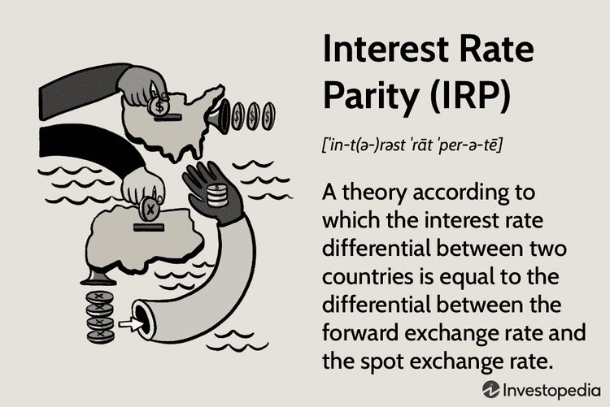

The currency markets are pivotal to the global financial system, facilitating a vast array of trading strategies and financial interactions. These markets allow for the exchange of currencies, driven significantly by the concept of interest rate parity (IRP). IRP is an essential theory that provides a link between interest rates and currency exchange rates, stipulating that the difference in interest rates between two countries will equal the rate at which the currencies are expected to change over time. Essentially, it bridges the gap between monetary policy interest rates and exchange rates, laying a foundation for understanding currency movement and the potential for arbitrage.

Arbitrage opportunities arise in the forex market when discrepancies occur, allowing traders to benefit from price differentials in different markets or forms. By understanding and applying the principles of interest rate parity, traders can identify situations where the market has not aligned with the expected parity, thereby enabling profit through the strategic purchase and sale of currency pairs.



Algorithmic trading has revolutionized forex trading by introducing automation and a higher level of sophistication in trade executions. Through pre-programmed criteria, algorithmic trading systems can execute trades with greater speed and precision than manual trading. This sophistication allows traders to react swiftly to changing market conditions and capitalize on interest rate differentials and other patterns that influence currency prices. The intersection of algorithmic trading and interest rate parity theory empowers traders to design trading strategies that are both efficient and theoretically sound.

This article investigates how the intersection of currency market dynamics, interest rate parity, and algorithmic trading can be harnessed to develop effective trading strategies. Understanding these elements equips traders with the knowledge and tools necessary to optimize their approach in the competitive forex market landscape.

## Table of Contents

## Understanding Interest Rate Parity

Interest rate parity (IRP) is a fundamental principle in international finance that describes the relationship between interest rates and currency exchange rates. It posits that the difference in national interest rates for financial instruments of similar risk and maturity should be equal to the differential between the forward exchange rate and the spot exchange rate. This ensures that investors achieve a return on investments that is consistent when accounting for hedging or expected changes in exchange rates, thereby preventing arbitrage opportunities across different currencies.

There are two main types of interest rate parity: covered interest rate parity (CIRP) and uncovered interest rate parity (UIRP).

**Covered Interest Rate Parity**

Covered [interest rate](/wiki/interest-rate-trading-strategies) parity involves the use of forward contracts to eliminate the risks associated with exchange rate fluctuations. According to CIRP, the relationship is defined as:

$$

(1 + i_d) = \frac{F}{S}(1 + i_f) 
$$

where:
- $i_d$ is the domestic interest rate,
- $i_f$ is the foreign interest rate,
- $F$ is the forward exchange rate,
- $S$ is the spot exchange rate.

This equation indicates that the returns from investing in a domestic asset or converting the funds into a foreign currency at the spot rate and investing in the foreign asset, while simultaneously locking the exchange rate using a forward contract, should be equivalent. Deviations from than this parity condition can lead to [arbitrage](/wiki/arbitrage) opportunities, which traders can exploit until the CIRP condition is restored.

**Uncovered Interest Rate Parity**

Uncovered interest rate parity, in contrast, does not involve hedging through forward contracts. Instead, it postulates that expected changes in currency values are influenced by the interest rate differentials between two countries. Mathematically, UIRP is articulated as:

$$

E(S_{t+1}) = S_t \times \left(\frac{1 + i_d}{1 + i_f}\right) 
$$

where:
- $E(S_{t+1})$ represents the expected future spot rate,
- $S_t$ is the current spot rate.

UIRP assumes that the future spot rate is determined by interest rate differentials, implying that an investor expects to earn the same return from an investment in multiple currencies when adjusting for expected changes in the exchange rate.

While UIRP provides a theoretical framework for predicting currency movements based on interest rate differentials, it is subject to predictive inaccuracies due to market imperfections and behavioral factors. Consequently, UIRP is less consistently observed in practice compared to CIRP, because it relies on expectations, which are inherently uncertain.

Understanding the mechanisms and conditions of interest rate parity is critical for currency traders and financial analysts, as these principles can inform more effective hedging strategies and investment decisions within currency markets.

## Role of Forward Rates in Forex Trading

Forward rates play a fundamental role in the [forex](/wiki/forex-system) market by serving as a mechanism for assessing the expected future movements of currency exchange rates. These rates are derived from the current spot rates adjusted for the interest rate differentials between two currencies. This relationship can be mathematically expressed through the formula:

$$
F = S \times \left( \frac{1 + i_d}{1 + i_f} \right)
$$

where $F$ represents the forward rate, $S$ is the spot rate, $i_d$ is the domestic interest rate, and $i_f$ is the foreign interest rate. Forward rates are utilized under the theory of interest rate parity, which posits that in a perfect market, the differences between national interest rates should equal the forward premium or discount between the respective currencies.

Despite their theoretical importance, forward rates often fail to accurately predict future spot rates. This discrepancy, sometimes referred to as the forward rate bias, indicates that the forward rate can diverge significantly from the actual future spot rate. Various factors contribute to this unreliability, including market inefficiencies, unanticipated economic events, and trader sentiment, which can all influence actual currency movements, diverging from the expected outcomes implied by forward rates.

Arbitrage opportunities arise when there are discrepancies between forward rates and the actual market conditions. Traders can exploit these opportunities by placing simultaneous long and short positions in different markets. For example, if a trader identifies that the forward rate is mispriced compared to their expectations of future spot movements, they might take a position that profits if the market corrects this discrepancy. Such strategies leverage the principle that if the theoretical forward rate does not match market perceptions or economic fundamentals, price adjustments are likely to occur.

In summary, while forward rates are integral to calculating interest rate parity and evaluating currency expectations, their predictive limitations and the existence of market inefficiencies create opportunities for skilled traders to implement arbitrage strategies. Understanding these dynamics is essential for participants in the forex market seeking to navigate and leverage currency fluctuations effectively.

## Algorithmic Trading in Forex

Algorithmic trading in the forex market leverages automated systems to execute buy and sell orders based on pre-defined criteria. This contemporary approach to trading is designed to enhance execution speed, precision, and overall efficiency, surpassing the capabilities of manual trading methods. By systematically analyzing vast amounts of market data, [algorithmic trading](/wiki/algorithmic-trading) facilitates decision-making processes that can adapt to constantly changing forex conditions.

One of the main advantages of algorithmic trading is its ability to swiftly analyze market conditions, identify patterns, and assess interest rate differentials. Algorithms can detect arbitrage opportunities and trends that may be imperceptible to human traders, enabling timely capitalizations on potential profit scenarios. For instance, an algorithm might continuously monitor the spread between two currencies and execute trades when predefined criteria are met, optimizing the entry and [exit](/wiki/exit-strategy) points more efficiently than human intervention alone.

Algorithmic trading also supports the implementation of complex mathematical models that identify trade opportunities. These models can incorporate various factors, such as moving averages, [momentum](/wiki/momentum) indicators, and [statistical arbitrage](/wiki/statistical-arbitrage) strategies. In Python, traders often use libraries like `numpy` and `pandas` for numerical computations and data manipulation, while `scikit-learn` can assist in implementing [machine learning](/wiki/machine-learning) models to predict currency movements based on historical data.

```python
import numpy as np
import pandas as pd
from sklearn.linear_model import LinearRegression

# Sample code to compute moving averages and implement a basic predictive model
data = pd.DataFrame({
    'exchange_rate': np.random.rand(100),  # Dummy exchange rate data
    'interest_rate_diff': np.random.rand(100)  # Dummy interest rate differential data
})

# Compute a simple moving average
data['sma_10'] = data['exchange_rate'].rolling(window=10).mean()

# Fit a simple linear model to predict future exchange rates
X = data[['exchange_rate', 'interest_rate_diff']]
y = data['sma_10'].shift(-1)  # Target variable shifted for future prediction

model = LinearRegression().fit(X[:-1], y[:-1])

# Predict the next exchange rate
next_pred = model.predict(X.iloc[[-1]])
```

Despite its advantages, algorithmic trading is not without risks. System failures can have catastrophic consequences if not properly mitigated, potentially resulting in substantial financial losses. Additionally, market anomalies, such as flash crashes, can render algorithms susceptible to unexpected behaviors and exploitation. Robust risk management protocols, comprehensive testing, and constant monitoring are essential to secure the integrity and reliability of algorithmic trading systems. 

Overall, algorithmic trading in forex empowers traders with enhanced capabilities to navigate the markets efficiently, grounding their strategies in rigorous data analysis and automated execution. However, maintaining vigilance against technological and market risks is paramount to ensuring consistent trading success.

## Strategies Incorporating Interest Rate Parity

Arbitrage strategies in forex trading capitalize on discrepancies in interest rates, forward premiums, or discounts between currencies. These strategies involve exploiting the inefficiencies in currency exchange rates to generate risk-free profits. A central concept underpinning these strategies is interest rate parity, which suggests that the difference in interest rates between two countries will be reflected in the forward exchange rate. This ensures that there are no arbitrage opportunities in perfect markets.

One popular strategy is the interest rate [carry](/wiki/carry-trading) trade. Here, traders borrow money in a currency with a lower interest rate and invest it in a currency with a higher interest rate. The profitability of this trade depends on stable exchange rates and the difference in interest rates. The formula for the interest carry trade profit can be expressed as follows:

$$
\text{Profit} = (i_y - i_x) - (S_f - S_s)
$$

where $i_y$ is the interest rate of the investment currency, $i_x$ is the borrowed currency’s interest rate, $S_f$ is the forward exchange rate, and $S_s$ is the spot exchange rate. The goal is for the interest rate differential $(i_y - i_x)$ to surpass any potential loss due to exchange rate movements $(S_f - S_s)$.

Algorithmic trading models can enhance the effective management of risk and returns in these trades. By utilizing pre-defined rules and automation, algorithms swiftly identify lucrative opportunities and execute trades with high precision. The code snippet below demonstrates a basic framework to identify carry trades using Python:

```python
def identify_carry_trade(opportunities, threshold):
    carry_trades = []
    for op in opportunities:
        interest_diff = op['investment_rate'] - op['borrowing_rate']
        forward_diff = op['forward_rate'] - op['spot_rate']
        profit_potential = interest_diff - forward_diff
        if profit_potential > threshold:
            carry_trades.append(op)
    return carry_trades

# Example usage
opportunities = [
    {'investment_currency': 'USD', 'borrowing_currency': 'JPY', 'investment_rate': 0.05, 'borrowing_rate': 0.01, 'forward_rate': 110, 'spot_rate': 108},
    # More opportunities
]

profitable_carry_trades = identify_carry_trade(opportunities, threshold=0.01)
```

Another crucial aspect is risk management. Hedging techniques can shield investors from potential exchange rate [volatility](/wiki/volatility-trading-strategies) inherent in carry trades. Hedging, through derivatives like options and futures, can set a limit on losses if currencies move unfavorably. The protection against unexpected and adverse market movements preserves the profitability of the arbitrage strategy. Moreover, continuous monitoring of interest rates and fiscal policies is vital as unexpected changes can substantially affect trade outcomes.

Traders employing interest rate parity strategies should account for transaction costs, as these might diminish the potential advantages of arbitrage. Real-world markets are affected by factors like [liquidity](/wiki/liquidity-risk-premium) and geopolitical events, which can lead to deviations from strictly theoretical models. Implementing a robust risk management framework helps mitigate risks associated with these factors, thereby fostering a more systematic and disciplined approach to forex trading.

## Case Study: USDCAD Example

The USDCAD currency pair, representing the exchange rate between the US dollar (USD) and the Canadian dollar (CAD), offers insightful illustrations of interest rate parity in forex trading. When observing this pair, investors can evaluate how differences in interest rates between the United States and Canada potentially influence currency movements over time.

Interest rate parity suggests that the forward exchange rate should incorporate the interest rate differentials between the two countries. This equilibrium is expressed in the formula:

$$
F = S \times \left(1 + r_{usd}\right)/\left(1 + r_{cad}\right)
$$

Where:
- $F$ represents the forward exchange rate,
- $S$ is the current spot exchange rate,
- $r_{usd}$ is the interest rate in the United States,
- $r_{cad}$ is the interest rate in Canada.

Assuming that the US interest rate ($r_{usd}$) is higher than the Canadian rate ($r_{cad}$), the forward rate $F$ would typically be set at a premium to the spot rate $S$. This indicates an expectation that the USD may depreciate relative to the CAD, reflecting the increased cost of holding USD due to its higher interest rates.

Using forward contracts allows traders to lock in these forward rates to manage risk exposure effectively. For instance, an investor anticipating US dollar depreciation can enter into a forward contract at the higher forward rate, protecting against potential losses if the spot rate decreases as predicted.

Example Python code illustrating forward rate calculation:

```python
def calculate_forward_rate(spot_rate, interest_usd, interest_cad):
    forward_rate = spot_rate * ((1 + interest_usd) / (1 + interest_cad))
    return forward_rate

# Example values
spot_rate = 1.25  # Example spot rate for USDCAD
interest_usd = 0.03  # US interest rate: 3%
interest_cad = 0.02  # Canadian interest rate: 2%

forward_rate = calculate_forward_rate(spot_rate, interest_usd, interest_cad)
print("Forward Rate:", forward_rate)
```

This forward rate calculation helps traders determine the future value of a currency pair, enabling them to strategize more effectively. In practice, if the forward rate indicates USD depreciation, stakeholders can hedge against such risks by utilizing these contracts. Overall, integrating forward contracts and understanding interest rate differentials is pivotal for risk mitigation and stable returns in forex trading involving the USDCAD pair.

## Risks and Challenges

Interest rate parity (IRP) serves as a crucial theoretical underpinning in forex trading; however, market imperfections can lead to deviations from its predictions. These deviations present both challenges and opportunities for traders. One prominent challenge is the forward premium puzzle, which highlights discrepancies between theoretical expectations and actual market behavior. According to interest rate parity, the difference in interest rates between two countries should equal the expected change in exchange rates. However, empirical evidence frequently contradicts this, as currencies with higher interest rates tend to appreciate rather than depreciate, a phenomenon that remains a focal point of research and debate in financial economics.

In addition to theoretical discrepancies, practical risks are inherent in algorithmic trading within the forex market. Although algorithms offer enhanced efficiency and precision by automating trade executions based on pre-defined criteria, they are not immune to vulnerabilities. Technological failures, such as software glitches or hardware malfunctions, pose significant risks. These failures can lead to unintended trades, resulting in substantial financial losses. Moreover, algorithmic systems are designed based on historical data and market assumptions, which may not hold true in atypical or volatile market conditions. Such unexpected market anomalies can lead to the breakdown of these systems, exacerbating the risk.

Algorithmic trading also faces the challenge of high-frequency trading ([HFT](/wiki/high-frequency-trading-strategies)) strategies that can momentarily inflate market volatility and liquidity. While these strategies can identify and exploit minute arbitrage opportunities extraordinarily quickly, they also contribute to potential "flash crashes." These are rapid, deep, and volatile price moves that can quickly unravel positions. To mitigate these risks, traders must implement robust risk management mechanisms, such as circuit breakers and stop-loss orders, to prevent excessive losses.

The combination of interest rate parity deviations and technological risk in algorithmic trading necessitates a careful balance. Traders must continuously monitor and adapt their strategies to account for both market inefficiencies and the technical reliability of their trading systems. Understanding these risks and integrating proactive measures are essential for safeguarding against potential pitfalls while navigating the complexities of the forex market.

## Conclusion

Interest rate parity (IRP) remains a cornerstone concept for forex traders who aim for consistent and sustainable returns. By linking the differences in interest rates between two countries to the expected changes in exchange rates, IRP provides a theoretical foundation for understanding currency movements. This concept guides traders in making informed decisions regarding currency pair investments and hedging strategies.

Algorithmic trading, with its automation and precision, complements interest rate parity remarkably well. Through the deployment of sophisticated algorithms, traders can quickly process massive amounts of data, recognize patterns, and execute trades with high accuracy. This accelerates the decision-making process and mitigates human errors, thus aligning well with interest rate parity strategies. 

By understanding the interaction between interest rates and exchange rates, traders can develop advanced strategies that are both efficient and effective. An algorithmic approach allows for the simultaneous analysis of multiple currency pairs, enabling traders to identify arbitrage opportunities and profit from interest rate differentials. For example, an algorithm could be designed to automatically execute trades that exploit discrepancies between the forward rate implied by interest rate parity and the actual forward rate in the market.

However, successful implementation requires traders to remain vigilant and informed. The forex market is dynamic and influenced by numerous factors, including economic indicators, geopolitical events, and market sentiment, which can lead to deviations from theoretical predictions. Therefore, continuous learning and adaptation are crucial to navigating these complexities. Moreover, technical risks, such as system failures or algorithmic biases, necessitate robust risk management and regular system audits to ensure the reliability and validity of trading strategies.

In conclusion, integrating interest rate parity insights with the capabilities of algorithmic trading represents a powerful approach for enhancing forex trading strategies. By maintaining a balance between theoretical understanding and practical application, traders can improve their performance and achieve more successful outcomes in the forex market.

## References & Further Reading

[1]: Frenkel, J. A., & Levich, R. M. (1975). ["Covered Interest Arbitrage: Unexploited Profits?"](https://www.semanticscholar.org/paper/Covered-Interest-Arbitrage%3A-Unexploited-Profits-Frenkel-Levich/821eba98de82ae37fc13559470279ba830327de4) Journal of Political Economy, 83(2), 325-338.

[2]: Shapiro, A. C. (2018). ["Multinational Financial Management"](https://www.amazon.com/Multinational-Financial-Management-Alan-Shapiro/dp/1118572386), 10th Edition. Wiley.

[3]: Sarno, L., & Taylor, M. P. (2002). ["The Economics of Exchange Rates"](https://www.cambridge.org/core/books/economics-of-exchange-rates/F22FD7DD178640CED493AE33FA4EB3DD). Cambridge University Press.

[4]: Naranjo, A., & Nelson, D. B. (2000). ["Inference in Term Structure Models with Discrete Jumps in Interest Rates"](https://www.sciencedirect.com/science/article/pii/S0304407601000859) The Journal of Financial and Quantitative Analysis, 35(2), 297-316.

[5]: Dacorogna, M. M., Gençay, R., Müller, U. A., Olsen, R. B., & Pictet, O. V. (2001). ["An Introduction to High-Frequency Finance"](https://archive.org/details/an-introduction-to-high-frequency-finance). Academic Press.