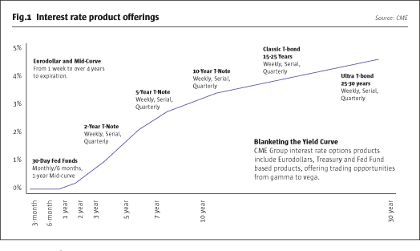

## Table of Contents

## What are interest rate products?

Interest rate products are financial tools that help people and businesses manage the risks associated with changes in interest rates. These products can be used to either protect against rising interest rates or to take advantage of falling rates. Common examples include interest rate swaps, futures, options, and forward rate agreements. They are often used by banks, corporations, and investors to stabilize their finances or to speculate on future interest rate movements.

For instance, an interest rate swap allows two parties to exchange interest rate payments, typically one fixed rate for one floating rate. This can help a company that has a loan with a variable interest rate to convert it into a fixed rate, providing more predictable payments. On the other hand, interest rate futures and options allow investors to bet on where they think interest rates will go in the future. These products are traded on financial markets and can be complex, but they play a crucial role in managing financial risk.

## Who is the CME Group and what is their role in financial markets?

The CME Group is a company that runs big markets where people and businesses can trade things like futures and options. These are special kinds of contracts that help people guess and plan for future prices of things like crops, oil, and even interest rates. The CME Group is made up of four exchanges: the Chicago Mercantile Exchange, the Chicago Board of Trade, the New York Mercantile Exchange, and the Commodity Exchange, Inc. Together, they make it easier for people all over the world to buy and sell these contracts.

The role of the CME Group in financial markets is very important. They help make trading safer and more organized by setting rules and making sure everyone follows them. This helps people trust the market more. The CME Group also creates new kinds of contracts that meet the needs of traders, which can help the economy grow. By providing a place where people can manage risks and make plans for the future, the CME Group helps keep the financial world running smoothly.

## What types of interest rate products does CME Group offer?

The CME Group offers many types of [interest rate](/wiki/interest-rate-trading-strategies) products that help people and businesses manage the risks of changing interest rates. They have products like interest rate futures and options. These are contracts that let people bet on where interest rates will go in the future. For example, if someone thinks interest rates will go up, they can buy a futures contract to lock in today's lower rate. If they're wrong and rates go down, they might lose money, but if they're right, they can save money or make a profit.

They also offer interest rate swaps, which are agreements between two parties to exchange interest rate payments. One party might pay a fixed rate while the other pays a floating rate that changes with market conditions. This can help a business that has a loan with a variable interest rate to turn it into a fixed rate, making their payments more predictable. The CME Group makes it easy for people to trade these swaps and other interest rate products on their platform, helping to keep the financial markets running smoothly.

## How do interest rate futures work?

Interest rate futures are contracts that let people bet on what interest rates will be in the future. They are traded on big markets like the ones run by the CME Group. When someone buys an interest rate future, they are agreeing to buy or sell something at a set interest rate on a specific date in the future. For example, if you think interest rates will go up, you can buy a futures contract now to lock in today's lower rate. If rates do go up, you can make money or save money on a loan.

These contracts are used by banks, businesses, and investors to manage the risk of changing interest rates. If a company has a loan with a variable interest rate, they might use futures to turn it into a fixed rate, making their payments more predictable. On the other hand, someone who thinks rates will go down might sell a futures contract, hoping to buy it back later at a lower price. This way, they can make a profit if they guess right. Interest rate futures help make the financial world more stable by giving people tools to plan for the future.

## What are the key features of interest rate swaps offered by CME Group?

Interest rate swaps offered by the CME Group are agreements between two parties to exchange interest rate payments. One party pays a fixed rate, while the other pays a floating rate that changes with market conditions. This can help a business that has a loan with a variable interest rate turn it into a fixed rate, making their payments more predictable. The CME Group makes it easy for people to trade these swaps on their platform, which helps keep the financial markets running smoothly.

The key feature of these swaps is that they help people manage the risk of changing interest rates. If a company thinks interest rates will go up, they can use a swap to lock in a lower rate now. This can save them money or make their finances more stable. The CME Group's platform also makes it easy to find someone to swap with, and they set rules to make sure the trading is fair and safe. This helps everyone trust the market more and makes it easier to plan for the future.

## How can interest rate options be used for hedging?

Interest rate options are special contracts that give people the right, but not the obligation, to buy or sell something at a set interest rate in the future. They can be used for hedging, which means protecting against the risk of interest rates changing. For example, if a business has a loan with a variable interest rate, they might be worried that the rate will go up and make their payments higher. They can buy an interest rate option to lock in a maximum rate they will pay, even if the market rates go up. This way, they can feel more secure about their future payments.

On the other hand, if a company is expecting to receive money in the future and they think interest rates might go down, they can use an interest rate option to lock in a minimum rate they will receive. This can help them plan their finances better because they know the lowest rate they will get. The CME Group offers these options, making it easy for people to trade them and manage their interest rate risks. By using interest rate options for hedging, businesses and investors can protect themselves from unexpected changes in interest rates, making their financial planning more stable and predictable.

## What are the differences between short-term and long-term interest rate products at CME Group?

Short-term interest rate products at the CME Group are used to manage the risk of interest rates changing over a short period, usually less than a year. These products include things like Eurodollar futures and options, which are based on the interest rates banks charge each other for short-term loans. They are popular with banks and businesses that need to plan for their short-term borrowing and lending needs. For example, a company might use these products to lock in a good interest rate for a short-term loan they need to take out soon.

Long-term interest rate products, on the other hand, are used to manage the risk of interest rates changing over a longer period, often several years. These products include Treasury bond futures and options, which are based on the interest rates of long-term government bonds. They are used by investors and businesses that need to plan for their long-term financial needs, like funding a big project or managing a long-term loan. For example, a company might use these products to turn a long-term loan with a variable interest rate into a fixed rate, making their payments more predictable over many years.

## How does the CME Group's interest rate products contribute to global financial stability?

The CME Group's interest rate products help keep the global financial world stable by giving people and businesses tools to manage the risk of changing interest rates. When interest rates go up or down, it can affect loans, investments, and the overall economy. By using products like interest rate futures, options, and swaps, people can protect themselves from these changes. For example, a business might use these products to lock in a good interest rate for a loan, making their future payments more predictable. This helps them plan better and avoid big financial surprises, which can make the economy more stable.

These products also help the global financial system work more smoothly by making it easier for people to trade and manage their risks. The CME Group sets rules and provides a platform where people can safely buy and sell these interest rate products. This builds trust in the market because everyone knows the trading is fair and organized. When people trust the market, they are more likely to use it to manage their risks, which helps prevent big financial problems from spreading around the world. Overall, the CME Group's interest rate products play a big role in keeping the global economy stable and predictable.

## What are the trading volumes and liquidity levels for CME Group's interest rate products?

The CME Group's interest rate products have high trading volumes and good [liquidity](/wiki/liquidity-risk-premium). This means a lot of people are buying and selling these products every day, and it's easy to find someone to trade with. For example, the Eurodollar futures, which are based on short-term interest rates, are some of the most traded products in the world. This high trading [volume](/wiki/volume-trading-strategy) helps keep the market stable because there are always people ready to buy or sell.

Liquidity is important because it makes it easier for people to manage their risks. If you need to buy or sell an interest rate product quickly, you can do it without worrying about big price changes. The CME Group's interest rate swaps, futures, and options all have strong liquidity, which means they are popular and trusted by banks, businesses, and investors around the world. This helps keep the global financial system running smoothly and safely.

## How have recent economic changes affected the performance of CME Group's interest rate products?

Recent economic changes have had a big impact on the performance of CME Group's interest rate products. When the economy goes through big changes, like when interest rates go up or down a lot, more people use these products to protect themselves or to try to make money. For example, when interest rates started to rise because of inflation, more businesses and investors used interest rate futures and options to lock in lower rates. This led to higher trading volumes for these products at the CME Group.

Also, when central banks around the world changed their interest rate policies to deal with economic problems, it made people more interested in using interest rate swaps to manage their risks. These changes made the market for CME Group's interest rate products more active and liquid. Overall, the recent economic changes have made these products more important and popular, helping the CME Group stay a key part of the global financial system.

## What advanced strategies can traders employ using CME Group's interest rate products?

Traders can use advanced strategies with CME Group's interest rate products to make money or protect themselves from big changes in interest rates. One strategy is called a "spread trade." This means buying one interest rate future and selling another at the same time. For example, a trader might buy a short-term interest rate future and sell a long-term one if they think short-term rates will go up more than long-term rates. This can help them make money from the difference between the two rates.

Another advanced strategy is using "options strategies" like straddles or strangles. A straddle involves buying both a call option and a put option on the same interest rate future with the same expiration date and strike price. This can help traders make money if interest rates move a lot in either direction. A strangle is similar, but the call and put options have different strike prices. Traders use these strategies to take advantage of big changes in interest rates without having to guess which way they will go. These advanced strategies help traders manage risk and make the most of the opportunities in the interest rate market.

## How does CME Group ensure the integrity and transparency of its interest rate products?

The CME Group works hard to make sure its interest rate products are fair and clear for everyone. They do this by setting strict rules that all traders have to follow. These rules help stop people from cheating or doing anything that could harm the market. The CME Group also watches the market all the time to make sure everything is going smoothly. If they see something wrong, they can step in and fix it quickly. This helps everyone trust the market more because they know it's safe and well-managed.

Another way the CME Group keeps things clear is by sharing a lot of information with the public. They publish data about trading volumes, prices, and other important details every day. This helps people see what's happening in the market and make better decisions. The CME Group also has a system where all trades are recorded and can be checked later. This transparency makes the market more open and honest, which is important for keeping the financial world stable and fair.

## References & Further Reading

[1]: Hull, J. C. (2017). ["Options, Futures, and Other Derivatives"](https://www.semanticscholar.org/paper/Options%2C-Futures%2C-and-Other-Derivatives-Hull/89bdee500c8623864fc9eb7a471546aa713acc44) (9th Edition). Pearson.

[2]: ["Interest Rate Markets: A Practical Approach to Fixed Income"](https://onlinelibrary.wiley.com/doi/book/10.1002/9781119200949) by Siddhartha Jha

[3]: Vatsa, N. (2019). ["Understanding Algorithmic Trading"](https://www.investopedia.com/terms/a/algorithmictrading.asp). Journal of Financial Markets, 45, 152-169.

[4]: CME Group. (2023). ["CME Group Interest Rate Products"](https://www.cmegroup.com/markets/interest-rates.html). Retrieved from CME Group website.

[5]: MacKenzie, D. A. (2019). ["Trading at the Speed of Light: The Rise of HFT"](https://www.degruyter.com/document/doi/10.1515/9780691217796/html) Princeton University Press.

[6]: Federal Reserve Bank of New York. (2021). ["Transition from LIBOR to SOFR"](https://www.newyorkfed.org/medialibrary/Microsites/arrc/files/2021/USD-LIBOR-transition-progress-report-mar-21.pdf) - Alternative Reference Rates Committee.