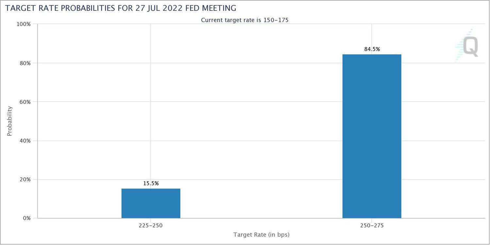

Financial markets represent a complex system characterized by intricate interactions among various instruments. Within this ecosystem, interest rate derivatives play a pivotal role. These instruments allow investors to hedge against fluctuations in interest rates, thereby managing risk and optimizing investment strategies. CME Group, a prominent global exchange, stands out as a key player in this domain. It offers an extensive range of interest rate products tailored to meet the diverse needs of market participants with varying risk profiles.

As a leading exchange, CME Group provides a platform for trading a plethora of interest rate derivatives, including futures and options on interest rate products. These instruments are integral to both short- and long-term financial planning, enabling corporations, traders, and financial institutions to handle exposure to interest rate variability effectively.

The evolution of trading technologies, particularly algorithmic trading, has significantly transformed the dynamics of trading interest rate derivatives. Algorithmic trading employs complex algorithms to automate the buying and selling of these financial instruments, improving market efficiency and liquidity. This transformation marks a departure from traditional trading methods, reflecting broader trends in the financial sector toward automation and electronic trading.

In exploring CME Group's interest rate derivatives, this article addresses various aspects, including an overview of its offerings, historical developments, and the regulatory environment that governs these products. Additionally, it examines how algorithmic trading has influenced the trading of these derivatives and considers the future trajectory shaped by innovation and regulation within the financial markets. This comprehensive approach offers insights into the significance of interest rate derivatives in contemporary financial practices and CME Group's role in facilitating these transactions.

## Table of Contents

## Understanding CME Group's Interest Rate Products

CME Group provides a comprehensive range of interest rate futures and options, making them a critical player in the management of interest rate risks globally. Among their offerings, Eurodollar futures stand out due to their widespread use in gauging market expectations of future U.S. interest rates. These contracts are based on the implied forward rates derived from the London Interbank Offered Rate (LIBOR).

The transition from LIBOR to the Secured Overnight Financing Rate (SOFR) marked a significant shift in interest rate benchmarks. In response, CME Group introduced one- and three-month SOFR futures, providing market participants with the necessary tools to navigate this new benchmark environment. The SOFR futures help in managing exposure to the short-term interest rates effectively.

Additionally, CME Group offers U.S. Treasury futures, which cover the entire U.S. dollar-denominated yield curve. These products include futures contracts on 2-year, 5-year, 10-year, and 30-year U.S. Treasury bonds, as well as ultra-long bond futures. These contracts allow investors to hedge against [interest rate](/wiki/interest-rate-trading-strategies) [volatility](/wiki/volatility-trading-strategies) over varying durations, thereby enabling effective management of medium- to long-term interest rate risks.

Interest rate swaps available through CME Group further extend their capabilities, providing customized solutions for managing risk. These swaps include both fixed-to-floating and floating-to-fixed exchanges of cash flows, which are standard instruments for hedging interest rate exposure and are available in various maturities to suit specific investment requirements.

Beyond the domestic U.S. market, CME Group's interest rate products offer global reach by managing risks associated with interest rates in Europe and Asia. This expansion allows investors to mitigate region-specific risks while taking advantage of market opportunities in different economic environments.

Overall, CME Group’s diverse suite of interest rate products ensures that market participants have the flexibility and tools necessary to manage diverse interest rate risk profiles effectively, catering to both short-term tactical moves and long-term strategic positioning.

## The Evolution and Impact of Algorithmic Trading

Algorithmic trading has significantly reshaped the landscape of interest rate derivatives trading by employing sophisticated algorithms to execute trades at speeds and efficiencies unattainable by human traders. This transformation is primarily facilitated by electronic trading platforms such as CME Globex, which have largely superseded traditional trading pits. These platforms enable market participants to engage in trades around the clock from anywhere in the world. 

The essence of [algorithmic trading](/wiki/algorithmic-trading) lies in its ability to process vast amounts of data and execute transactions based on pre-determined criteria, enabling traders to capitalize on fleeting market opportunities. A basic example of an algorithmic trading strategy might involve a moving average crossover, where an algorithm buys or sells interest rate futures when the short-term moving average crosses the long-term average. This automation minimizes human error, enhances execution speed, and allows for a greater number of transactions in a short period, contributing to increased market efficiency.

High-frequency trading ([HFT](/wiki/high-frequency-trading-strategies)), a subset of algorithmic trading, takes these advantages further by executing a large number of orders in fractions of a second. HFT strategies often rely on the slightest market imbalances, making rapid decisions on buying or selling based on real-time data analysis. The introduction of such strategies has improved [liquidity](/wiki/liquidity-risk-premium), as HFTs continually provide buy and sell offers, narrowing bid-ask spreads. However, these benefits come with challenges; HFT can contribute to market volatility, evidenced by events like the Flash Crash of 2010, where the abrupt withdrawal of liquidity by HFT firms led to extreme market movements.

From a regulatory perspective, the rapid evolution of algorithmic trading introduces complexities. Regulators and exchanges like CME Group are tasked with ensuring market integrity while accommodating these technological advancements. Monitoring algorithms and implementing measures such as circuit breakers are crucial to maintaining stability in rapidly moving markets. Additionally, the need for transparent and real-time data reporting becomes more pronounced to prevent manipulative or destabilizing trading practices.

In summary, algorithmic trading has indelibly altered the trading of interest rate derivatives by increasing transaction speed, efficiency, and market liquidity. Nevertheless, it also imposes new challenges related to market stability and regulatory oversight, necessitating ongoing adjustments to the regulatory framework to balance innovation with market integrity.

## Regulatory Framework and Clearing Mechanism

CME Group operates under the strict regulatory oversight of the Commodity Futures Trading Commission (CFTC), an independent agency of the U.S. government established to maintain the integrity and transparency of the financial markets. This regulatory framework is critical, as it ensures that trading practices are fair and that the derivatives markets function smoothly, even as they become increasingly complex with technological advancements like algorithmic trading.

Central to maintaining this framework is CME Clearing, the institution's central futures clearing house. CME Clearing acts as an intermediary between buyers and sellers in the derivatives market, effectively mitigating counterparty risk. By standing in as the buyer to every seller and the seller to every buyer, CME Clearing provides significant creditworthiness to the transactions. This role is particularly important given the massive scale and [volume](/wiki/volume-trading-strategy) of transactions handled by the CME Group, where any lapse in credit assurance could lead to market destabilization.

The clearing process involves several crucial steps, starting from trade execution to trade confirmation and finally settlement. The clearing house ensures that all trades are honored, even if one party defaults. This risk management mechanism includes marking positions to market daily, maintaining margin requirements, and employing a system of collateral management and default procedures.

With the surge of algorithmic trading, markets have become faster and more complex, posing new challenges for regulatory bodies. Algorithmic trading involves using pre-programmed instructions to execute trades at speeds not comprehensible by human traders. While this can increase market liquidity and efficiency, it also raises concerns about market manipulation and flash crashes, where prices drop dramatically in seconds. Thus, the CFTC's role, complemented by the operational robustness of CME Clearing, becomes even more essential in monitoring trading activities and ensuring adherence to market rules.

In summary, the regulatory and clearing framework established by the CFTC and CME Clearing is indispensable for fostering a stable and reliable trading environment. This structure not only supports the integrity of transactions but also helps build investor trust in a rapidly evolving derivatives market landscape.

## Historical Milestones and New Product Innovations

CME Group has been a pioneer in the derivatives market, particularly with interest rate products. The merger with the Chicago Board of Trade in 2007 significantly bolstered its position, allowing the combined entity to innovate and expand its product offerings. One of the key historical milestones was the introduction of Eurodollar futures in the early 1980s. These contracts, which are based on the interest rate offered on U.S. dollar-denominated deposits held outside the United States, became a benchmark for short-term interest rates. The success of Eurodollar futures paved the way for the development of cash-settled contracts, a standard that has been widely adopted across financial markets.

In response to evolving market demands and regulatory shifts, CME Group has continued to innovate. A noteworthy addition to its product lineup is the futures on the Secured Overnight Financing Rate (SOFR) index. With LIBOR being phased out due to regulatory concerns, SOFR has emerged as a preferred alternative reference rate, prompting the launch of SOFR futures. These futures provide market participants with an effective tool for hedging interest rate exposures linked to the new benchmark.

CME Group has also introduced ultra-long bond futures, catering to the needs of investors managing long-duration risks. These products are designed to offer enhanced duration trading and hedging opportunities, aligning with the changing preferences of the market participants seeking to navigate the shifting interest rate landscape.

These innovations underscore CME Group's proactive approach in adapting to market trends and regulatory changes. By continually expanding its product suite, CME Group ensures that it meets the diverse needs of its clients, while also maintaining its position as a leader in the derivatives market.

## Other Key Products and Market Areas

CME Group stands as a crucial entity in the global financial arena, thanks to its diversified array of financial products that extend beyond interest rate derivatives. Among its comprehensive offerings are commodities, foreign currencies, stock indices, and more, making CME Group a versatile platform for various investment strategies.

In the commodities sector, CME Group provides future and options contracts on key physical commodities, such as energy products ([crude oil](/wiki/crude-oil), natural gas), metals (gold, silver), and agricultural products (corn, wheat). These contracts help investors hedge against price volatility in the commodities markets and are essential for producers and consumers seeking to stabilize income or costs. For instance, the WTI Crude Oil futures contract is one of the most traded contracts globally, highlighting its significance in the energy sector.

Foreign currency futures and options enable market participants to hedge against foreign exchange risk or capitalize on currency market movements. CME Group offers a wide range of currency products, including the popular Euro, Japanese Yen, and British Pound futures contracts, allowing traders to manage exposure in major currency pairs. These products provide a robust mechanism for managing the risks associated with fluctuating exchange rates, which is crucial in today's interconnected global economy.

Beyond commodities and currencies, CME Group's products also span into stock indices, offering futures and options on major indices such as the S&P 500, NASDAQ-100, and Dow Jones Industrial Average. These index products are vital for investors aiming to gain broad market exposure and implement diverse investment strategies, such as hedging portfolio risks or pursuing [arbitrage](/wiki/arbitrage) opportunities.

The diversification of CME Group's offerings underscores its pivotal role in global financial markets. By catering to a wide array of investment strategies, CME Group not only enhances market liquidity and efficiency but also provides comprehensive risk management solutions across different asset classes. This wide array of financial instruments allows investors to execute diverse strategies to capitalize on global economic trends, protect against potential risks, and explore new opportunities in evolving markets.

## Conclusion

Interest rate derivatives play a crucial role in managing financial risks and formulating investment strategies in modern markets. These financial instruments enable investors and institutions to hedge against interest rate fluctuations, ensuring stable financial planning and portfolio management. CME Group has established itself as a leader in the interest rate derivatives sector, consistently adapting its product offerings to meet the evolving needs of market participants. 

In recent years, CME Group has embraced technological advancements such as algorithmic trading. This innovation has enhanced market efficiency and liquidity, allowing for faster and more precise execution of trades. Algorithmic trading utilizes complex algorithms and mathematical models, automating the decision-making process and facilitating the trading of derivatives with minimal human intervention.

However, alongside technological progress, regulatory frameworks have also evolved. Regulations aim to uphold market integrity and transparency, providing a safeguard against potential systemic risks posed by high-speed and automated trading. CME Group's operations are under the purview of the Commodity Futures Trading Commission (CFTC), ensuring compliance with stringent market standards.

Looking to the future, the ongoing interplay between regulation, innovation, and technology will continue to mold the landscape of interest rate derivatives. CME Group's commitment to innovation and adherence to regulatory changes positions it well to navigate this dynamic environment. The development of new products, coupled with advancements in trading technology, will undoubtedly shape how interest rate derivatives are utilized, providing market participants with versatile tools to optimize their financial strategies.

## References & Further Reading

[1]: Hull, J. C. (2017). ["Options, Futures, and Other Derivatives"](https://www.semanticscholar.org/paper/Options%2C-Futures%2C-and-Other-Derivatives-Hull/89bdee500c8623864fc9eb7a471546aa713acc44) (9th Edition). Pearson.

[2]: ["Interest Rate Markets: A Practical Approach to Fixed Income"](https://onlinelibrary.wiley.com/doi/book/10.1002/9781119200949) by Siddhartha Jha

[3]: Vatsa, N. (2019). ["Understanding Algorithmic Trading"](https://www.investopedia.com/terms/a/algorithmictrading.asp). Journal of Financial Markets, 45, 152-169.

[4]: CME Group. (2023). ["CME Group Interest Rate Products"](https://www.cmegroup.com/markets/interest-rates.html). Retrieved from CME Group website.

[5]: MacKenzie, D. A. (2019). ["Trading at the Speed of Light: The Rise of HFT"](https://www.degruyter.com/document/doi/10.1515/9780691217796/html) Princeton University Press.

[6]: Federal Reserve Bank of New York. (2021). ["Transition from LIBOR to SOFR"](https://www.newyorkfed.org/medialibrary/Microsites/arrc/files/2021/USD-LIBOR-transition-progress-report-mar-21.pdf) - Alternative Reference Rates Committee.