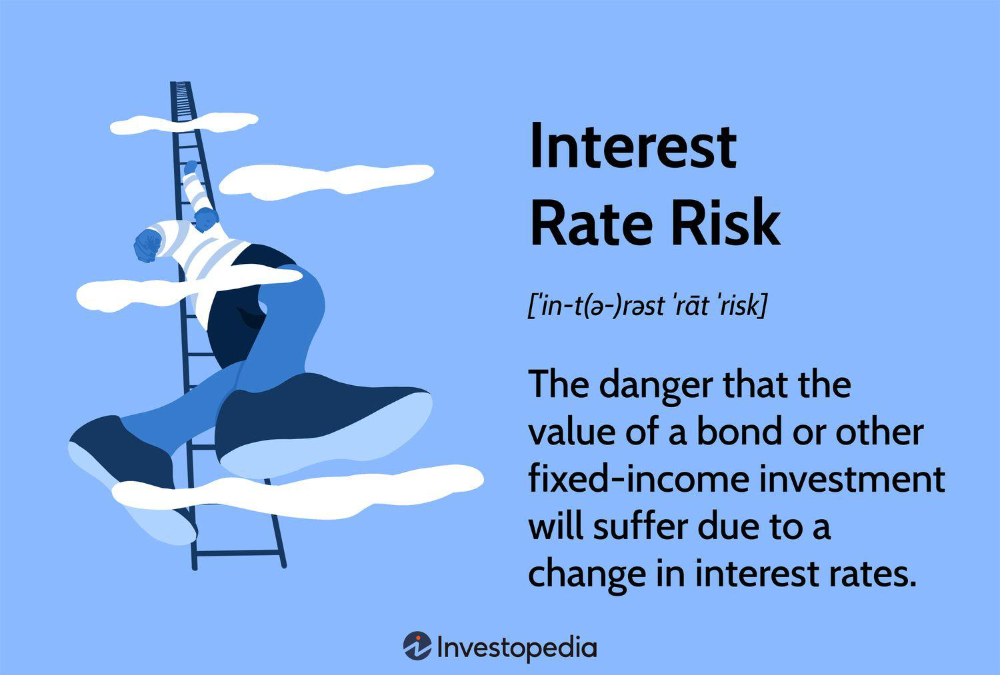

The financial markets are a complex and dynamic ecosystem, influenced by a myriad of factors that impact asset prices. Among these factors, interest rates and bond prices exhibit a fundamental and significant inverse relationship. Bonds, as fixed-income securities, have their prices inversely affected by fluctuations in interest rates. This inverse relationship arises because when interest rates rise, the fixed coupon payments offered by existing bonds become less attractive compared to new bonds issued at higher rates, leading to a decrease in the market value of existing bonds. Conversely, when interest rates fall, existing bonds with higher coupon rates become more desirable, resulting in an increase in their prices.

In recent years, the rise of algorithmic trading has significantly transformed the trading landscape. Algorithmic trading involves using automated systems to execute trades based on pre-defined criteria and market conditions. This approach allows traders to efficiently analyze vast amounts of financial data and execute trades at speeds unachievable by humans, capitalizing on market opportunities with precision. Algorithmic trading systems are particularly adept at navigating the volatility and rapid changes commonly observed in financial markets.



This article will explore the intricate interplay between bond prices, financial risks, interest rate risk, and the utilization of algorithmic trading. Interest rate risk is a primary concern for bond investors, as changes in interest rates can significantly affect the market value of bonds. Understanding how bond prices react to interest rate fluctuations is crucial for investors seeking to optimize their investment strategies and manage associated risks effectively.

Our focus will be to examine the specific impact of interest rate changes on bond pricing. We will explore how algorithmic approaches can be employed to trade bonds under varying interest rate conditions successfully. By leveraging the power of algorithmic trading, investors can enhance their ability to mitigate risks and capitalize on emerging market opportunities, ultimately leading to more efficient and profitable investment strategies.

## Table of Contents

## Understanding Bond Prices and Interest Rates

Bonds are financial instruments that operate as debt securities issued by various entities such as governments, municipalities, and corporations to raise capital. When an investor purchases a bond, they are essentially lending money to the issuer in exchange for predetermined periodic interest payments, known as coupon payments, and the return of the bond's face value, or principal, upon maturity.

A critical feature of bonds is the inverse relationship between bond prices and interest rates. This relationship arises because the coupon payments of a bond are fixed at issuance. When market interest rates rise, newer bonds are issued with higher coupon rates to reflect the increased rates, making existing bonds with lower coupons less attractive. Consequently, the price of existing bonds decreases to adjust the yield in line with the new market rates. Conversely, when market interest rates fall, existing bonds with higher coupon rates become more attractive, thereby increasing their price.

To better understand this mechanism, consider the formula for a bond's yield, which reflects the bond's expected return based on its current price and coupon rate. The yield to maturity (YTM) is a widely used metric to evaluate a bond's return, calculated as:

$$
YTM = \frac{C + \frac{F - P}{n}}{\frac{F + P}{2}}
$$

where:
- $C$ is the annual coupon payment,
- $F$ is the face value of the bond,
- $P$ is the current market price of the bond,
- $n$ is the number of years until maturity.

As market interest rates change, the bond's price $P$ adjusts to ensure that the YTM matches the new [interest rate](/wiki/interest-rate-trading-strategies) environment. This adjustment maintains a balance between the bond's fixed coupon payments and the prevailing market conditions.

The bond's coupon rate, the annual interest payment as a percentage of the bond's face value, significantly impacts an investor's decision-making process. Higher coupon rates generally offer more substantial periodic income, which can offset falls in bond prices to some extent. Investors thus weigh the coupon rate alongside bond yields to estimate potential returns accurately.

Understanding these relationships is crucial for investors as they navigate the bond market. Changes in interest rates can substantially influence bond portfolios' market value, necessitating a comprehensive understanding of bond valuation and yield calculations. With these foundations, investors can make informed decisions to maximize returns while managing interest rate risks effectively.

## Mechanics of the Inverse Relationship

The inverse relationship between bond prices and interest rates is a fundamental principle in bond markets that can be attributed to the fixed nature of bond coupon payments. When interest rates increase, new bonds are generally issued with higher yields to attract investors, rendering existing bonds with lower coupon rates less attractive. Consequently, the prices of these older bonds must decrease to offer a yield comparable to new issues. Conversely, when interest rates decline, existing bonds with higher coupon rates become more valuable, driving their prices up.

To illustrate this, consider a bond with a face value of $1,000 and a fixed annual coupon rate of 5%. If prevailing market interest rates rise to 6%, the bond's price must decrease to offer an effective yield that is competitive with new issues. The mathematical relationship can be captured using the formula for the present value of a bond:

$$
P = \sum \frac{C}{(1 + r)^t} + \frac{F}{(1 + r)^n}
$$

where $P$ is the price of the bond, $C$ is the annual coupon payment, $r$ is the market interest rate, $F$ is the face value, $t$ is the time period for each coupon payment, and $n$ is the number of periods until maturity.

Agents of this inverse relationship are key metrics like duration and convexity. Duration measures a bond's sensitivity to interest rate changes and provides an estimate of how much a bond's price will change in response to interest rate movements. The modified duration formula, which accounts for periodic coupon payments, is given by:

$$
D = \frac{\sum \left( \frac{t \times C}{(1 + r)^t} \right) + \frac{n \times F}{(1 + r)^n}}{P}
$$

Convexity further refines this measurement by capturing the curvature in the price-yield relationship, offering a more precise estimate of price changes, especially for large shifts in interest rates. Convexity can be calculated as:

$$
Convexity = \frac{1}{P} \sum \left( \frac{t(t + 1) \times C}{(1 + r)^{t+2}} \right) + \frac{n(n + 1) \times F}{(1 + r)^{n+2}}
$$

These metrics are crucial tools for investors in assessing the risk associated with interest rate fluctuations and are instrumental in various bond valuation and risk management strategies. Understanding the mechanics of this inverse relationship helps investors make informed decisions based on expected interest rate movements and aligns their investment strategies accordingly.

## Financial Risks: Interest Rate Risk and Beyond

Interest rate risk stands as a fundamental concern for bond investors due to its direct impact on the market value of bonds as interest rates fluctuate. This risk arises because bonds typically pay a fixed interest, known as the coupon rate, throughout their tenure. When prevailing interest rates in the broader market increase, existing bonds with lower coupon rates become less attractive, leading to a decrease in their price. Conversely, when interest rates decline, these bonds become more desirable, causing their prices to rise. This inverse relationship forms the core of interest rate risk, necessitating strategies for mitigation.

Apart from interest rate risk, bond investments are also subject to [liquidity](/wiki/liquidity-risk-premium) risk and credit risk. Liquidity risk refers to the difficulty of quickly buying or selling bonds without influencing their price substantially. This can be particularly critical in times of financial stress, where even high-quality bonds may become illiquid, forcing investors to accept substantial discounts to liquidate their holdings.

Credit risk, on the other hand, involves the probability that a bond issuer may fail to make the required coupon or principal payments, potentially leading to default. The credit rating of a bond provides a measure of this risk, with higher-rated bonds generally perceived as safer investments compared to lower-rated ones.

Effective management of these financial risks involves various strategies. Duration matching is a popular technique used to manage interest rate risk. Duration measures the sensitivity of a bond's price to changes in interest rates; by matching the durations of assets and liabilities, investors can hedge against the impact of interest rate fluctuations. The formula for bond duration is:

$$
D = \sum \left( \frac{t \times C}{(1 + y)^t} \right) / P
$$

where $D$ is the duration, $t$ is the time period, $C$ is the cash flow (coupon payment), $y$ is the yield to maturity, and $P$ is the current price of the bond.

Diversification is another crucial risk management strategy. By holding a diversified portfolio of bonds with varying maturities, credit qualities, and issuers, investors can reduce their exposure to specific risks associated with any single issuer or interest rate change.

Implementing these risk management techniques can be essential for maintaining a balanced investment approach that adequately considers the multi-dimensional risks associated with bond investments, thus optimizing potential returns while minimizing vulnerabilities.

## Algorithmic Trading Strategies for Bond Markets

Algorithmic trading in bond markets involves the use of automated systems to analyze market data and execute trades based on pre-defined criteria. These algorithms are designed to identify patterns and exploit opportunities that arise due to interest rate fluctuations, ultimately aiming to enhance trading efficiency and profitability.

One of the primary ways algorithms interact with bond markets is by analyzing real-time data to assess how interest rate changes impact bond prices. For example, when interest rates rise, bond prices typically fall, providing potential trading opportunities for automated systems programmed to recognize and respond to these shifts. Algorithms can process large volumes of historical and real-time data to predict future movements and execute orders at optimal prices.

High-frequency trading ([HFT](/wiki/high-frequency-trading-strategies)) is a strategy employed in [algorithmic trading](/wiki/algorithmic-trading) that involves executing a large number of orders at extremely high speeds. In bond markets, HFT can be used to take advantage of short-lived price discrepancies. These algorithms use statistical and quantitative techniques to identify [arbitrage](/wiki/arbitrage) opportunities—price differences of the same bond across different markets or platforms—and quickly execute trades to profit from these discrepancies. An example of an HFT algorithm could be a mean reversion strategy, where the algorithm identifies when the bond price deviates from its average historical price and trades to benefit from the expected reversal to the mean.

Arbitrage strategies are another crucial component of algorithmic trading in bond markets. They involve exploiting price differences that should not exist in efficient markets. For instance, algorithms might detect inconsistencies between the cash and derivative markets of bonds, allowing them to simultaneously buy and sell the same or equivalent securities across different markets to lock in risk-free profits.

To implement such algorithmic strategies, coding plays a critical role. Here is a simple Python code snippet illustrating how an algorithm might identify arbitrage opportunities in bond prices:

```python
# Python code to identify arbitrage opportunities

def identify_arbitrage(prices_market1, prices_market2, threshold=0.01):
    arbitrage_opportunities = []
    for bond, price1 in prices_market1.items():
        price2 = prices_market2.get(bond)
        if price2:
            price_diff = abs(price1 - price2)
            if price_diff > threshold:
                arbitrage_opportunities.append((bond, price1, price2))
    return arbitrage_opportunities

# Example bond prices from two markets
market1_prices = {'BondA': 100.5, 'BondB': 101.7, 'BondC': 99.9}
market2_prices = {'BondA': 100.4, 'BondB': 102.0, 'BondC': 99.88}

# Identify arbitrage opportunities
opportunities = identify_arbitrage(market1_prices, market2_prices)
print(opportunities)
```

In this example, the function `identify_arbitrage` compares prices of bonds between two markets and highlights arbitrage opportunities based on a defined price difference threshold (e.g., 0.01). Such algorithms are foundational to building sophisticated trading systems capable of navigating complex bond market landscapes.

Overall, algorithmic trading strategies in bond markets, empowered by technologies like high-frequency trading and arbitrage, offer traders unprecedented speed and efficiency, enabling them to maximize returns in rapidly changing interest rate environments.

## Challenges and Risks in Algo Trading with Bonds

Algorithmic trading in bond markets is subject to various challenges and risks that traders need to navigate. Among the most pressing are market and operational risks, which can disrupt trading efficiency and lead to financial losses.

Market risk arises from the inherent [volatility](/wiki/volatility-trading-strategies) and unpredictability of bond prices and interest rates, which can fluctuate due to economic events, policy changes, or shifts in investor sentiment. This risk is exacerbated in algorithms programmed with high sensitivity to market signals, potentially leading to adverse trading outcomes if not managed properly. Operational risk encompasses the failures of technology and systems, including hardware malfunctions, software bugs, and data feed errors, which can cause execution delays or errors in trade orders.

Regulatory challenges present significant hurdles in the bond markets, where compliance with financial laws and trading regulations is crucial. Regulatory bodies such as the Securities and Exchange Commission (SEC) in the United States or the European Securities and Markets Authority (ESMA) in Europe impose strict guidelines on trading practices. Algorithmic traders must ensure that their systems are designed to adhere to these regulations, avoiding market abuse practices like spoofing or layering, which can result in penalties or trading bans.

Precision in execution technology is another vital consideration. Algorithms require low latency systems to process vast amounts of market data and execute trades within milliseconds. The necessity for such precision demands significant investment in infrastructure, including high-speed internet connections, powerful computing resources, and co-location services, where servers are placed close to exchange data centers to minimize transmission time.

Risk management techniques are essential to address these challenges. Portfolio diversification reduces the impact of any single bond price movement on the overall portfolio. Additionally, implementing stop-loss orders and position limits can protect against excessive losses during volatile market periods. Tailoring risk management to algorithmic trading environments involves setting risk parameters within the algorithm itself, including volatility thresholds and liquidity constraints, to ensure trades are made under favorable conditions only.

Overall, while algorithmic trading offers opportunities for improved efficiency and profitability, it requires careful consideration of the various challenges and risks present in the bond markets. Traders must develop robust systems and strategies that incorporate risk mitigation measures to succeed in this dynamic trading landscape.

## Technological and Future Trends in Algo Trading for Fixed Income

Recent advancements in technology continue to shape the future of algorithmic trading in bond markets. The integration of Artificial Intelligence (AI) and Machine Learning (ML) offers traders sophisticated analytical capabilities and enhanced automation potential, enabling more efficient processing of vast amounts of data. These technologies facilitate pattern recognition and predictive analytics, allowing traders to anticipate market trends and make more informed decisions.

AI algorithms are particularly adept at identifying subtle patterns in large datasets that may not be immediately apparent to traditional analytical methods. By leveraging [machine learning](/wiki/machine-learning) models, traders can automate the identification of opportunities, optimizing trade execution based on historical data and real-time market conditions. An example of such a model is a supervised learning algorithm like the Random Forest, which can be trained on past market data to predict bond price movements based on changing interest rates and other economic indicators.

```python
from sklearn.model_selection import train_test_split
from sklearn.ensemble import RandomForestClassifier
import pandas as pd

# Example of using a RandomForest to predict bond market trends
data = pd.read_csv('bond_market_data.csv')  # hypothetical dataset
X = data[['interest_rate', 'inflation_rate', 'economic_growth']]
y = data['bond_price_trend']

X_train, X_test, y_train, y_test = train_test_split(X, y, test_size=0.2, random_state=42)

model = RandomForestClassifier(n_estimators=100, random_state=42)
model.fit(X_train, y_train)

predictions = model.predict(X_test)
```

The continuous evolution of trading platforms and data analytics also plays a crucial role in enhancing the efficiency and success of algorithmic strategies. Modern trading platforms are equipped with high-speed data processing capabilities and low-latency connectivity, essential for executing high-frequency trades that capitalize on fleeting market opportunities. Enhanced data analytics tools provide traders with insights not only into current market conditions but also into potential future trends, allowing for preemptive strategy adjustments.

Real-time analytics and enhanced visualization techniques allow traders to monitor complex indicators and metrics at a glance. For instance, deploying data streaming technologies can ensure the latency reduction, crucial for executing high-frequency trades.

Furthermore, the development of distributed ledger technologies, such as blockchain, offers the potential to revolutionize transparency and security in bond trading processes. This technology enhances the traceability of transactions and reduces the risk of errors and fraud, thereby increasing market confidence and participation.

In conclusion, the synergy of AI, machine learning, advanced trading platforms, and emerging technologies is set to redefine algorithmic trading in bond markets. As these technologies evolve, they will continue to offer substantial benefits in terms of efficiency, accuracy, and strategic sophistication, empowering traders to better navigate the complexities of financial markets.

## Conclusion

The effective comprehension of bond prices, financial risks, interest rates, and algorithmic trading is essential for contemporary investors looking to navigate complex financial landscapes. These components are vital in forming a cohesive strategy that not only mitigates risk but also identifies and capitalizes on available market opportunities.

Understanding the inverse relationship between bond prices and interest rates, for instance, allows investors to make informed decisions about when to buy or sell bonds. An increase in interest rates typically results in a decrease in bond prices, which can negatively affect the market value of existing bonds. This relationship is critical for formulating strategies that protect portfolios against adverse interest rate movements.

Financial risks, including interest rate risk, liquidity risk, and credit risk, require vigilant management to safeguard investments. Addressing these risks through strategies such as duration matching—an approach to align the duration of assets and liabilities—can help stabilize returns under volatile market conditions.

Algorithmic trading emerges as a powerful tool within this framework, leveraging data-driven strategies to optimize trading decisions and enhance profitability. The ability to automatically execute trades based on predefined criteria allows traders to respond swiftly to market changes, a significant advantage in dynamic trading environments. Moreover, as bonded markets adopt high-frequency trading and other algorithmic techniques, the potential for improved efficiency and reduced transaction costs becomes apparent.

Looking forward, the future of algorithmic trading is promising, buoyed by advancements in [artificial intelligence](/wiki/ai-artificial-intelligence) and machine learning. These technologies offer sophisticated analytical capabilities, enabling more precise prediction of market trends and faster adaptation to shifting conditions. As trading platforms continue to evolve, offering enhanced data analytics and execution technologies, traders who master these complexities are likely to experience substantial benefits.

In summary, the confluence of bond pricing understanding, risk management, and algorithmic trading equips investors with a robust arsenal to navigate financial markets strategically. The evolving landscape, driven by technological advancements, underscores the need for continuous learning and adaptation to fully leverage the potential of these interconnected elements.

## References & Further Reading

[1]: ["The Handbook of Fixed Income Securities"](https://www.amazon.com/Handbook-Fixed-Income-Securities-Ninth/dp/1260473899) by Frank J. Fabozzi

[2]: ["Interest Rate Risk Modeling: The Fixed Income Valuation Course"](https://www.amazon.com/Interest-Rate-Risk-Modeling-Valuation/dp/0471427241) by Sanjay K. Nawalkha, Gloria M. Soto, and Natalia A. Beliaeva

[3]: Cagliarini, A., & Kulish, M. (2013). ["Solving the Price Puzzle"](https://www.semanticscholar.org/paper/Solving-Linear-Rational-Expectations-Models-with-Cagliarini-Kulish/043944e6c5d20c60dd7e903904db6b903d891c8d) Reserve Bank of Australia Research Discussion Paper.

[4]: Chordia, T., Roll, R., & Subrahmanyam, A. (2005). ["Evidence on the speed of convergence to market efficiency."](https://www.anderson.ucla.edu/documents/areas/fac/finance/17-01.pdf) Journal of Financial Economics.

[5]: ["Algorithmic Trading and DMA: An introduction to direct access trading strategies"](https://archive.org/details/algorithmictradi0000john) by Barry Johnson

[6]: Malz, A. M. (2011). ["Financial Risk Management: Models, History, and Institutions"](https://books.google.com/books/about/Financial_Risk_Management.html?id=rFX2f6AxH1QC) ISBN 978-0470481806.

[7]: ["Algorithmic and High-Frequency Trading"](https://www.cambridge.org/us/universitypress/subjects/mathematics/mathematical-finance/algorithmic-and-high-frequency-trading) by Álvaro Cartea, Sebastian Jaimungal, & José Penalva

[8]: ["Fixed Income Securities: Tools for Today's Markets"](https://www.amazon.com/Fixed-Income-Securities-Markets-Finance/dp/1119835550) by Bruce Tuckman & Angel Serrat