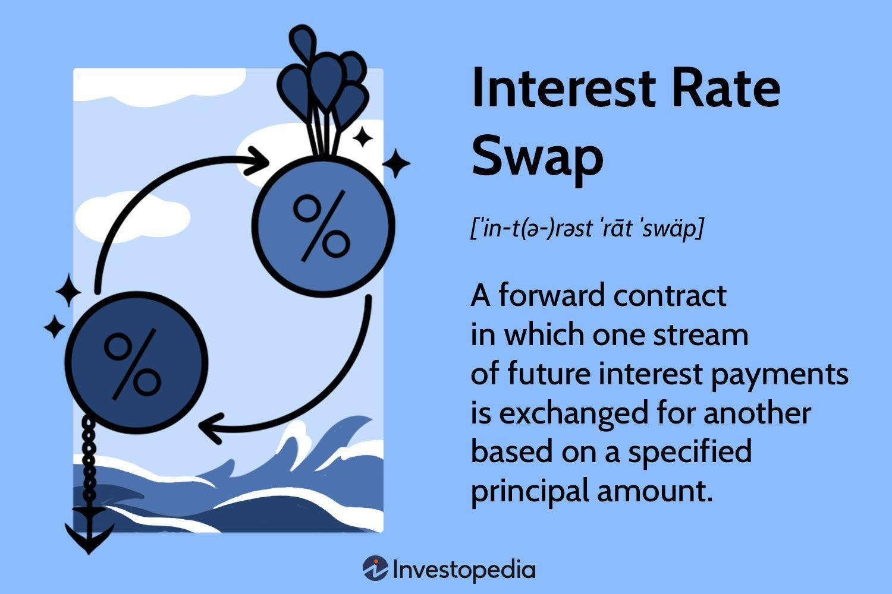

## Table of Contents

## What is an interest rate swap?

An interest rate swap is a financial agreement between two parties to exchange interest payments over a set period. One party agrees to pay a fixed interest rate, while the other pays a floating interest rate, which is usually based on a benchmark like the LIBOR or the federal funds rate. This swap helps both parties manage their exposure to interest rate fluctuations. For example, a company with a loan that has a floating interest rate might use a swap to switch to a fixed rate, providing more predictable payments.

Interest rate swaps are commonly used by businesses and financial institutions to hedge against interest rate risks or to speculate on future rate changes. They can be customized to meet the specific needs of the parties involved, including the duration of the swap, the notional amount, and the frequency of payments. By entering into a swap, a company can better manage its cash flow and reduce uncertainty about future interest expenses.

## What are the basic types of interest rate swaps?

There are two main types of interest rate swaps: fixed-for-floating swaps and basis swaps. A fixed-for-floating swap is the most common type. In this swap, one party agrees to pay a fixed interest rate on a notional amount, while the other party pays a floating interest rate on the same notional amount. This helps businesses manage their interest rate risk by turning variable rate loans into fixed rate loans, or vice versa.

The other type is a basis swap, which involves exchanging two different floating interest rates. For example, one party might pay a floating rate based on the LIBOR, while the other pays a floating rate based on the federal funds rate. Basis swaps are useful for companies that have loans or investments tied to different interest rate benchmarks and want to manage the risk of those rates moving differently.

Both types of swaps help businesses manage their exposure to interest rate changes. They can be tailored to fit the specific needs of the parties involved, including the amount of money involved, how long the swap lasts, and how often payments are made.

## How does a plain vanilla interest rate swap work?

A plain vanilla interest rate swap is the most common type of interest rate swap. In this swap, two parties agree to exchange interest payments on a certain amount of money, called the notional amount. One party pays a fixed interest rate, while the other pays a floating interest rate, which is usually based on a benchmark like the LIBOR or the federal funds rate. The fixed rate stays the same throughout the swap, but the floating rate can change over time. This swap helps companies manage their interest rate risk by turning a loan with a variable interest rate into one with a fixed rate, or vice versa.

For example, imagine a company has a loan with a floating interest rate. They might enter into a plain vanilla interest rate swap to switch to a fixed rate, which can make their future payments more predictable. In this case, the company would agree to pay a fixed rate to the other party in the swap, while receiving a floating rate in return. The floating rate they receive would then be used to pay the interest on their loan. This way, even if the floating rate goes up, the company's net payments remain the same because they are protected by the fixed rate they are paying in the swap.

## What is the purpose of entering into an interest rate swap?

The main reason companies enter into an interest rate swap is to manage their risk from changes in interest rates. Imagine a company has a loan where the interest rate can go up or down. This can make it hard for them to plan their future payments. By using an interest rate swap, the company can turn this variable rate into a fixed rate, making their payments more predictable. This helps them manage their money better and avoid surprises from rising rates.

Another reason is to save money. Sometimes, a company might find that they can get a better deal on a loan if they agree to a variable rate, but they still want the security of a fixed rate. By entering into a swap, they can take advantage of the lower variable rate on their loan and then swap it for a fixed rate. This way, they can save money on their loan while still having predictable payments. Interest rate swaps are a useful tool for companies to control their financial risks and plan for the future.

## Can you explain the difference between fixed and floating rates in swaps?

In an interest rate swap, a fixed rate is a set percentage that stays the same for the whole time of the swap. When you agree to pay a fixed rate, you know exactly how much you'll be paying each time. This can be helpful if you want to make sure your payments don't change, even if the market rates go up or down. For example, if you have a loan with a variable rate but you want to make your payments predictable, you can swap to a fixed rate.

A floating rate, on the other hand, changes over time. It's usually based on a benchmark like the LIBOR or the federal funds rate. This means your payments can go up or down depending on what's happening in the market. If you're receiving a floating rate in a swap, you might benefit if rates go down, but you could also end up paying more if rates go up. Companies might choose a floating rate if they think rates will stay low or if they want to take advantage of falling rates.

## What are some common uses of interest rate swaps for businesses?

Businesses often use interest rate swaps to manage their risk from changing interest rates. Imagine a company has a loan where the interest rate can go up or down. This can make it hard for them to plan their future payments. By using an interest rate swap, the company can turn this variable rate into a fixed rate, making their payments more predictable. This helps them manage their money better and avoid surprises from rising rates. For example, if a company expects interest rates to go up, they can lock in a lower fixed rate now, protecting themselves from future increases.

Another common use of interest rate swaps is to save money. Sometimes, a company might find that they can get a better deal on a loan if they agree to a variable rate, but they still want the security of a fixed rate. By entering into a swap, they can take advantage of the lower variable rate on their loan and then swap it for a fixed rate. This way, they can save money on their loan while still having predictable payments. Interest rate swaps are a useful tool for companies to control their financial risks and plan for the future.

## How are interest rate swaps priced?

Interest rate swaps are priced by looking at the difference between the fixed rate and the expected future floating rates. This difference is called the swap rate. To figure out the swap rate, people use something called a swap curve, which is like a graph that shows what the market thinks future interest rates will be. The swap rate is what makes the present value of the fixed rate payments equal to the present value of the expected floating rate payments. If the fixed rate is higher than what the market expects for the floating rate, then the swap will cost money to enter. If it's lower, then the swap will pay money to enter.

Another thing that affects the price of an interest rate swap is the credit risk of the two parties involved. If one party might not be able to make their payments, then the other party will want to be paid more to take on that risk. This is called the credit spread, and it's added to the swap rate. So, the final price of the swap is the swap rate plus any credit spread. This way, the price of the swap takes into account both the expected future interest rates and the risk that one party might not be able to pay.

## What are the risks associated with interest rate swaps?

Interest rate swaps can help businesses manage their risk from changing interest rates, but they also come with their own risks. One big risk is called interest rate risk. This happens when the floating rate in the swap moves differently than expected. If the floating rate goes up a lot, the company paying the floating rate might end up paying more than they planned. On the other hand, if the floating rate goes down a lot, the company receiving the floating rate might not get as much as they hoped.

Another risk is credit risk. This is the chance that the other party in the swap won't be able to make their payments. If one party goes bankrupt or has money problems, they might not be able to pay what they owe. This can leave the other party in a tough spot, especially if they were counting on those payments to cover their own costs. To manage this risk, companies often check the creditworthiness of the other party before entering into a swap and might ask for collateral to protect themselves.

There's also something called basis risk, which happens when the floating rate in the swap doesn't match up perfectly with the rate on the loan or investment it's meant to hedge. For example, if a company has a loan based on one benchmark rate and the swap is based on a different benchmark rate, the two rates might move differently. This can leave the company still exposed to some interest rate risk, even after entering into the swap. To manage these risks, businesses need to carefully plan their swaps and keep an eye on how rates and credit conditions are changing.

## What is a basis swap and how does it differ from other swaps?

A basis swap is a type of interest rate swap where both parties exchange two different floating interest rates. For example, one party might pay a floating rate based on the LIBOR, while the other pays a floating rate based on the federal funds rate. This kind of swap is useful for companies that have loans or investments tied to different interest rate benchmarks and want to manage the risk of those rates moving differently. By entering into a basis swap, a company can balance out the differences between the two rates and make their financial planning easier.

Basis swaps differ from other swaps, like fixed-for-floating swaps, in that both rates involved are variable. In a fixed-for-floating swap, one party pays a fixed rate and the other pays a floating rate, which helps companies switch from a variable rate loan to a fixed rate loan or vice versa. With a basis swap, since both rates can change, it's more about managing the risk that comes from the difference between two floating rates rather than switching from a floating to a fixed rate. This makes basis swaps a specialized tool for companies dealing with multiple interest rate benchmarks.

## Can you provide an example of a cross-currency interest rate swap?

A cross-currency interest rate swap is a deal between two companies from different countries. One company might have a loan in one currency, like dollars, but they need to make payments in another currency, like euros. So, they swap their dollar payments for euro payments with another company. This helps them manage the risk of the exchange rate changing between the two currencies. For example, a U.S. company with a dollar loan might enter into a swap with a European company to pay euros instead. They would agree to exchange the principal and interest payments in dollars for euros at a set rate.

In this swap, the U.S. company would pay interest on the euro amount at a fixed or floating rate, and the European company would pay interest on the dollar amount at a different fixed or floating rate. At the end of the swap, they would also exchange the principal amounts back. This way, the U.S. company can make its payments in euros, which is what they need, and the European company can make its payments in dollars. It's a useful tool for companies doing business in different countries to manage their money and reduce the risk of currency changes.

## How do regulatory requirements affect interest rate swap transactions?

Regulatory requirements play a big role in how interest rate swap transactions are done. After the 2008 financial crisis, governments and financial watchdogs made new rules to make the financial system safer. One big change is that many interest rate swaps now have to be traded through a special kind of marketplace called a swap execution facility (SEF). This makes the swaps more open and easier to keep an eye on. Another rule is that many swaps must be cleared through a central clearinghouse, which acts like a middleman to make sure both sides of the swap can pay what they owe. This helps lower the risk that one side won't be able to pay.

These rules can make interest rate swaps more expensive and complicated for companies. They might need to pay fees to use the SEF and the clearinghouse, and they have to follow strict rules about how they report and keep track of their swaps. But these rules also make the market safer and more fair. Companies have to be careful to follow all the rules, or they could get in trouble with the regulators. Even though it's more work, these regulations help make sure that interest rate swaps are used in a way that's good for the whole financial system.

## What advanced strategies can be employed using interest rate swaps?

Interest rate swaps can be used in advanced strategies like hedging and speculation. Hedging is when a company uses a swap to protect itself from interest rate changes. For example, if a company has a big loan with a floating rate, they might use a swap to turn it into a fixed rate. This way, they can make sure their payments stay the same, even if rates go up. They might also use a basis swap to manage the risk of different floating rates moving differently. This can help them balance out their financial risks and make their planning easier.

Speculation is another strategy where companies or investors use swaps to bet on where interest rates are going. If someone thinks rates will go up, they might enter into a swap where they pay a fixed rate and receive a floating rate. If rates do go up, they'll make money on the swap because the floating rate they receive will be higher than the fixed rate they pay. On the other hand, if they think rates will go down, they might do the opposite and pay a floating rate while receiving a fixed rate. This way, they can make money if their guess about future rates is right. Both hedging and speculation show how swaps can be powerful tools for managing and taking advantage of interest rate changes.

## What is an Interest Rate Swap?

An [interest rate](/wiki/interest-rate-trading-strategies) swap is a financial derivative contract where two parties agree to exchange sets of cash flows based on differing interest rates applied to a notional principal amount. The principal is typically not exchanged, serving only as the basis for calculating the interest payments that the two parties will swap.

In a standard interest rate swap, one party exchanges a series of fixed interest payments for the other party's variable interest payments, which are usually tied to a benchmark interest rate such as the London Interbank Offered Rate (LIBOR) or the Secured Overnight Financing Rate (SOFR). The primary motivation for engaging in such an exchange is to manage exposure to interest rate fluctuations, providing cash flow stability and risk mitigation.

Mathematically, the interest payment exchanged can be expressed using the formulas:

$$
\text{Fixed Payment} = \text{Notional Principal} \times \frac{\text{Fixed Rate}}{\text{Payment Frequency}}
$$

$$
\text{Floating Payment} = \text{Notional Principal} \times \frac{\text{Floating Rate}}{\text{Payment Frequency}}
$$

Where:
- **Fixed Rate** is the agreed-upon rate the fixed payer will use.
- **Floating Rate** is determined by the current benchmark rate at each payment period.
- **Payment Frequency** determines how often payments are exchanged, such as quarterly or annually.

Interest rate swaps allow companies to convert their interest rate obligations from fixed to floating or from floating to fixed, depending on their financial strategy. For instance, a company with a floating-rate loan might enter into an interest rate swap to fix its future debt payments, thereby avoiding the risk of rising interest rates. Conversely, a company with fixed-rate debt might prefer to have floating payments if it anticipates a decrease in market interest rates, allowing it to benefit from potential reductions in interest expense.

In summary, interest rate swaps are instrumental in tailoring financial exposure to align with corporate risk management goals, offering companies a way to stabilize volatile cash flows due to fluctuations in interest rates.

## What are the types of interest rate swaps?

Interest rate swaps are essential instruments in the world of financial derivatives, allowing counterparties to manage and hedge their interest rate risk. There are several types of interest rate swaps that cater to different risk management needs:

1. **Fixed-to-Floating Swaps**: In this widely utilized type of interest rate swap, one counterparty agrees to pay a fixed interest rate, while receiving a floating interest rate from the other party. The floating rate is commonly tied to a benchmark such as the London Interbank Offered Rate (LIBOR). Companies opt for fixed-to-floating swaps to benefit from potential decreases in interest rates. Here's a simplified example of how this swap might be structured:
$$
   \text{Fixed payment = Fixed rate} \times \text{Notional principal}

$$
$$
   \text{Floating payment = (LIBOR + Spread)} \times \text{Notional principal}

$$

2. **Floating-to-Fixed Swaps**: As the inverse of fixed-to-floating swaps, these involve one party paying a floating interest rate, such as LIBOR, while receiving a fixed interest rate. Companies facing uncertain interest rate environments might use this swap to lock in predictable payment structures, mitigating the risk of rising interest rates. In essence, this swap provides budgeting certainty for entities looking to stabilize their interest costs.

3. **Basis Swaps**: In basis swaps, both counterparties exchange floating interest rates, but these rates are often tied to different benchmarks or indices. For instance, swapping a rate tied to the Euro Interbank Offered Rate (EURIBOR) for one tied to LIBOR. Basis swaps are particularly beneficial for managing the risk associated with spread movements between different benchmark rates. They enable organizations to optimize their interest rate terms according to market conditions.

By offering various structures, these swaps provide companies with diverse strategies to manage interest rate exposure, enhancing financial stability and strategic planning.

## What are some real-world examples of interest rate swaps?

In the corporate finance landscape, companies often utilize interest rate swaps to manage their borrowing costs and stabilize cash flows. A noteworthy example is a company like PepsiCo, which may use these financial instruments to swap a variable interest rate for a fixed one. This strategic move allows PepsiCo to mitigate the risk associated with interest rate fluctuations and maintain more predictable financial statements.

To understand the mechanics of such a swap, consider PepsiCo's debt obligations that incur variable interest rates linked to benchmark rates such as LIBOR (London Interbank Offered Rate) or SOFR (Secured Overnight Financing Rate). These rates can vary based on market conditions, leading to [volatility](/wiki/volatility-trading-strategies) in interest payments. To counter this, PepsiCo can enter into an interest rate swap agreement with a financial institution. Under this agreement, PepsiCo agrees to make payments based on a predetermined fixed interest rate, while the counterparty pays a floating rate, effectively transferring the interest rate risk.

The swap can be represented mathematically as follows:

$$
\text{Net Payment} = (\text{Fixed Rate} - \text{Floating Rate}) \times \text{Notional Principal}
$$

Where:
- **Fixed Rate** is the interest rate payed by PepsiCo.
- **Floating Rate** is the market-indexed rate payed by the counterparty.
- **Notional Principal** is the hypothetical principal amount used to calculate payments.

By securing a fixed interest rate, PepsiCo achieves stability in its financial forecasting and budgeting processes. This proactive risk management strategy allows the company to focus resources on its core operations, while also potentially benefiting from favorable fixed rates negotiated during periods of low market interest rates.

Such financial maneuvers are commonplace among large corporations that must navigate complex financial environments, demonstrating the vital role of interest rate swaps in maintaining financial equilibrium and enhancing corporate financial strategy.

## References & Further Reading

[1]: ["Principles of Financial Engineering"](https://www.sciencedirect.com/book/9780123735744/principles-of-financial-engineering) by Salih N. Neftci

[2]: ["Interest Rate Swaps and Other Derivatives"](https://cup.columbia.edu/book/interest-rate-swaps-and-other-derivatives/9780231159647) by Howard Corb

[3]: ["Advances in Financial Machine Learning"](https://www.amazon.com/Advances-Financial-Machine-Learning-Marcos/dp/1119482089) by Marcos Lopez de Prado

[4]: ["The Handbook of Fixed Income Securities"](https://www.amazon.com/Handbook-Fixed-Income-Securities-Ninth/dp/1260473899) by Frank J. Fabozzi

[5]: [Hull, J. C. (2018). "Options, Futures, and Other Derivatives"](https://www.semanticscholar.org/paper/Options%2C-Futures%2C-and-Other-Derivatives-Hull/89bdee500c8623864fc9eb7a471546aa713acc44). Pearson.

[6]: ["Machine Learning for Algorithmic Trading"](https://github.com/PacktPublishing/Machine-Learning-for-Algorithmic-Trading-Second-Edition) by Stefan Jansen

[7]: ["Quantitative Finance For Dummies"](https://www.wiley.com/en-us/Quantitative+Finance+For+Dummies-p-9781118769461) by Steve Bell