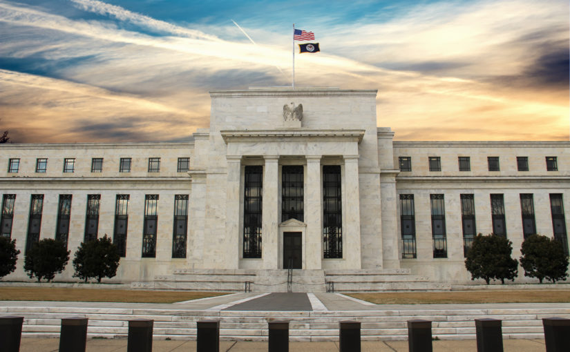

Interest rate trading refers to the buying and selling of financial instruments primarily influenced by changes in interest rates. It encompasses a broad range of activities, from trading bonds and interest rate derivatives, like futures, swaps, and options, to engaging in strategies directly affected by central bank policies. In essence, interest rate trading focuses on the movement of rates set by central banks, which in turn affect the cost of borrowing and lending in the economy. These changes can significantly impact various financial markets, influencing the value of currencies, bonds, and other interest-sensitive assets.

The importance of interest rates in financial markets cannot be overstated. They serve as a fundamental barometer of a nation's economic health and monetary policy. Central banks use interest rate adjustments as a tool to control economic growth, inflation, and currency value. For traders, understanding interest rate movements is crucial for making informed decisions. Changes in interest rates can lead to substantial shifts in market sentiment, influencing the direction of forex, stock, and bond markets. Hence, interest rate trading is not just about predicting rate changes but also about understanding their broader impact on the global financial landscape. This form of trading requires a deep comprehension of economic indicators, central bank policies, and global economic trends.

## Table of Contents

## Fundamentals of Interest Rates

### Understanding Interest Rates, Yields, and Bonds

Interest rates, yields, and bonds are interconnected concepts crucial in financial markets, each playing a unique role in interest rate trading.

**Interest Rates:** These are essentially the cost of borrowing money, typically expressed as an annual percentage. Central banks set benchmark interest rates, like the Federal Funds Rate in the United States, which influence general economic activity. Higher interest rates can slow economic growth, while lower rates can stimulate it. In trading, interest rates are pivotal because they affect the value of a country's currency and the overall investment climate.

**Yields:** Yield refers to the earnings generated and realized on an investment over a particular period. It's most commonly associated with bonds and is expressed as an annual percentage. The yield of a bond inversely correlates with its price; as bond prices increase, yields decrease and vice versa. Yields are influenced by various factors, including interest rates set by central banks. For traders, monitoring yield movements is crucial, especially in government bonds, as it reflects investor sentiment and economic outlook.

**Bonds:** Bonds are debt securities issued by entities such as governments or corporations to raise capital. When you buy a bond, you're essentially lending money to the issuer in exchange for periodic interest payments and the return of the bond's face value at maturity. Bonds are sensitive to interest rate changes: as rates rise, new bonds with higher yields make existing bonds less attractive, reducing their market price.

**Relationships Among These Concepts:** The dynamic between these three is fundamental to understanding financial markets. Interest rate changes can lead to fluctuations in bond prices and yields. For instance, when central banks lower interest rates, bonds issued previously with higher rates become more valuable, increasing their price but decreasing their yield. Conversely, rising interest rates can decrease the market price of existing bonds and increase their yield.

In summary, interest rate trading involves understanding how these elements interact and influence each other. Market participants need to comprehend the nuances of these relationships to make informed trading decisions, particularly in markets sensitive to interest rate changes, such as forex and bond markets.

### Role of Central Banks

Central banks play a pivotal role in shaping the financial landscape, primarily through their influence on interest rates. Understanding their function is crucial for any trader engaged in interest rate trading.

Central banks, such as the Federal Reserve in the United States or the European Central Bank in the Eurozone, set the benchmark interest rates for their respective economies. These rates are the costs at which banks can borrow money from the central bank. The setting of these rates is a powerful tool used to control monetary policy and economic growth. Lowering interest rates generally stimulates economic growth by encouraging borrowing and spending, while raising rates can help cool an overheating economy and control inflation.

The interest rates set by central banks directly impact all segments of the financial markets. For instance, lower interest rates can make bonds less attractive, leading investors to seek higher returns in stock markets. Conversely, higher rates can increase bond yields, potentially drawing investment away from equities.

Interest rate decisions are closely watched by traders and can have immediate effects on the markets. For example, a surprise rate hike might lead to a sell-off in the stock market, while an unexpected rate cut could boost it. In currency markets, higher interest rates often strengthen the national currency, as they attract foreign investors seeking better returns on their investments.

Central banks also influence markets through forward guidance, which is the communication of future policy intentions. Traders often scrutinize these communications for clues about future interest rate changes. Market expectations can shift based on this guidance, leading to volatility in bond, stock, and currency markets.

Traders develop strategies around central bank announcements and meetings. These strategies can range from speculative trades based on expected decisions to hedging tactics designed to mitigate risk in case of unexpected announcements.

In summary, the role of central banks in setting interest rates is a fundamental aspect of financial market dynamics. Interest rate traders must stay informed about central bank policies and statements, as these can significantly impact their trading strategies and the broader financial markets.

## Types of Interest Rate Markets

### Overview of Different Markets

Interest rate markets are diverse and multifaceted, each offering unique opportunities and risks for traders. Understanding these markets is crucial for effective interest rate trading.

**Treasury Bond Market:** This is perhaps the most prominent interest rate market. Treasury bonds are government debt securities with a fixed interest rate, which the U.S. Department of the Treasury issues. These bonds are considered low-risk investments since they are backed by the government. The treasury bond market is a primary indicator of long-term interest rates and significantly influences other financial markets.

**Federal Funds Market:** This market involves overnight lending between banks, with the interest rate set by the Federal Reserve (often referred to as the Fed Funds Rate). It's a crucial market as it reflects the cost of liquidity in the banking system and is a key indicator of monetary policy.

**Municipal Bond Market:** Comprising bonds issued by local governments or agencies, this market offers opportunities to invest in local development projects. The interest rates on municipal bonds vary based on the creditworthiness of the issuer and the project's nature.

**Corporate Bond Market:** Corporations issue bonds to raise capital, and these bonds' interest rates reflect the issuing company's credit risk. The corporate bond market is diverse, with offerings ranging from highly secure, low-yield bonds to high-risk, high-yield (junk) bonds.

**Money Markets:** These are markets for short-term debt instruments, such as certificates of deposit, commercial paper, and Treasury bills. Interest rates in money markets are generally lower than those in long-term debt markets but can provide a useful insight into short-term interest rate trends.

**Eurodollar Market:** This is an international market for U.S. dollars deposited outside the United States, predominantly in Europe. The interest rates in this market are a crucial benchmark for international finance and reflect global demand for U.S. dollars.

**Interest Rate Derivatives Markets:** These markets, including interest rate futures and swaps, allow traders to hedge against or speculate on changes in interest rates. They are critical for managing interest rate exposure and tailoring risk profiles.

### Short-Term vs. Long-Term Rates

In the landscape of interest rate trading, understanding the distinction between short-term and long-term rates is fundamental. These rates, influenced by different economic factors, play unique roles in the financial markets.

**Short-Term Rates**

Short-term rates refer to the interest rates applied on debts or financial instruments maturing in less than a year.

A prime example is the Federal Funds Rate, which is the rate at which banks lend balances to each other overnight. This rate is pivotal as it's set by the Federal Reserve and influences monetary policy and liquidity in the financial system.

Short-term rates are typically more volatile than long-term rates. They respond quickly to changes in monetary policy and economic news, making them crucial indicators for traders, especially in the forex and money markets.

These rates are closely aligned with the current economic conditions, often used by central banks as tools to control inflation, manage employment levels, and influence economic growth.

**Long-Term Rates**

Long-term rates apply to financial instruments with maturities longer than a year. They reflect the long-term outlook of the economy.

A key example is Treasury Yields, like the 10-year or 30-year U.S. Treasury bonds. These yields are benchmarks for mortgage rates and other important financial metrics.

Generally more stable, long-term rates are used to gauge the market's future outlook on inflation, economic growth, and overall financial stability.

Long-term rates, especially those on government bonds, are seen as indicators of investor confidence. Lower long-term yields often suggest that investors are seeking safety, anticipating lower growth or inflation in the future.

**Interplay Between Short-Term and Long-Term Rates**

The relationship between these rates can provide insights into market expectations. For instance, an inverted yield curve, where short-term rates are higher than long-term rates, can signal economic downturns. Traders use this relationship to identify trading opportunities, assess risk, and make strategic decisions in portfolio management.

## Interest Rate Derivatives

Interest rate derivatives are contracts whose value is derived from the underlying interest rates or interest rate indexes. Unlike direct interest rate instruments like bonds, these derivatives do not represent a borrowing or lending agreement but a contractual agreement to exchange cash flows or settlements based on interest rate movements. Common forms of interest rate derivatives include futures, options, swaps, and forward rate agreements (FRAs).

- **Interest rate futures** are standardized contracts traded on exchanges, obligating the buyer to purchase a financial instrument (like a bond) at a set price on a future date. Forward rate agreements, on the other hand, are over-the-counter (OTC) agreements that lock in an interest rate to be paid or received on an obligation at a future date.
- **Interest rate options** provide the buyer the right, but not the obligation, to buy or sell a bond or other debt instrument at a specified rate on or before a specified date. These are used for hedging against interest rate movements or speculating on future interest rate changes.
- **Interest rate swaps** are agreements between two parties to exchange interest rate payments. The most common type, a plain vanilla swap, involves swapping fixed interest rate payments for floating rate payments. Swaps are used by institutions to manage the risk associated with their interest rate exposures.

Interest rate derivatives are vital tools for managing interest rate risk. Financial institutions, corporations, and investors use them to hedge against unfavorable movements in interest rates that could impact their bond investments, loans, or other interest-sensitive assets and liabilities.

Traders utilize these instruments to speculate on future movements in interest rates. By analyzing economic indicators and central bank policies, traders can take positions in interest rate derivatives to profit from anticipated changes in rates.

Certain strategies involving interest rate derivatives, such as selling options or engaging in swap contracts, can generate income for investors and institutions.

In summary, interest rate derivatives are versatile tools in the financial markets, allowing participants to manage interest rate risk, speculate on rate movements, and generate income. Their functioning revolves around contractual agreements based on the future movements of interest rates, making them indispensable in modern financial strategies.

## Trading Strategies

### Trading Interest Rate Futures

Interest rate futures are a key instrument for traders looking to gain exposure to movements in interest rates. These futures contracts are based on financial instruments such as government bonds or interest rate benchmarks. Successful trading in interest rate futures requires a blend of market insight, strategic planning, and risk management. Here are some effective strategies for trading interest rate futures:

| Strategy | Approach | Execution |
| --- | --- | --- |
| Trend Following | This involves identifying and following the prevailing trends in interest rates. Traders can use technical analysis to detect these trends. | Once a trend is identified, enter a position in the direction of the trend. For instance, if rates are trending upwards, consider going long on interest rate futures. |
| Hedging Interest Rate Risk | This strategy is used primarily by investors holding bonds or bond portfolios to protect against adverse interest rate movements. | If you anticipate a rise in interest rates (which can lower bond prices), taking a short position in interest rate futures can offset potential losses in your bond investments. |
| Arbitrage Opportunities | Look for pricing inefficiencies between the futures market and the underlying bond market. | This could involve buying (or selling) the futures contract while simultaneously selling (or buying) the corresponding bond, aiming to profit from the convergence of prices. |
| Spread Trading | This involves exploiting the price differences between two related interest rate futures contracts. | For example, if you expect short-term rates to rise more than long-term rates, you could go long on short-term interest rate futures and short on long-term rate futures. |
| Central Bank Policy Trades | Central bank meetings and announcements can have a significant impact on interest rates. | Position yourself in interest rate futures based on your prediction of central bank decisions. For example, if you expect a rate cut, go long on interest rate futures. |
| Seasonal Trading Patterns | Some interest rate futures exhibit seasonal patterns due to fiscal policies, budget cycles, or economic cycles. | Identify these patterns through historical analysis and position your trades accordingly. |
| Event-Driven Strategies | Major economic reports and geopolitical events can influence interest rate expectations. | Position your futures trades in anticipation of these events or in reaction to unexpected news. |
| Using Technical Indicators | Employ technical indicators like moving averages, RSI, or MACD to guide your trading decisions. | Use these indicators to time your entry and exit points in interest rate futures trades. |
| Interest Rate Swap Futures | These are futures contracts based on the swap rate, which is the fixed rate in an interest rate swap. | This can be a sophisticated strategy, suitable for experienced traders to speculate or hedge interest rate swap exposure. |

Each of these strategies requires an understanding of the broader economic environment and monetary policy, as well as the specific mechanics of interest rate futures markets. It’s also crucial to have a solid risk management plan in place, as interest rate markets can be volatile and susceptible to rapid changes due to external factors.

### Conventional Asset Trading

Trading conventional assets in response to interest rate changes is a critical aspect of financial market operations. Interest rates, set by central banks, play a pivotal role in influencing the value of a range of traditional assets, including stocks, bonds, and real estate. Here's how traders and investors can navigate these markets in the context of changing interest rates:

**Stock Market Response**

When interest rates rise, borrowing costs increase, which can reduce corporate profits and, consequently, stock prices. Conversely, lower interest rates can boost stock markets as borrowing becomes cheaper and consumers tend to spend more.

👉 **Strategy:** Monitor central bank announcements and economic data to anticipate rate changes. Consider adjusting equity positions based on expected interest rate movements. For example, in a low-rate environment, growth stocks might be more appealing, whereas in high-rate scenarios, defensive stocks might fare better.

**Bond Market Dynamics**

Bonds have an inverse relationship with interest rates. As rates rise, bond prices typically fall, and vice versa. This is because new bonds will be issued at the new, higher rates, making existing bonds with lower rates less attractive.

👉 **Strategy:** In a rising interest rate environment, shorter-duration bonds may be less impacted than longer-duration bonds. Conversely, in a falling rate environment, longer-duration bonds might offer more capital appreciation potential.

**Real Estate Investments**

Interest rates significantly impact the real estate market since they affect mortgage rates. Lower interest rates can lead to increased demand for property, driving up prices.

👉 **Strategy:** Consider real estate investment trusts (REITs) or direct property investments in low-interest-rate environments. However, be cautious about investing in real estate when rates are high or expected to rise.

**Dividend Stocks and Interest Rates**

Companies that pay high dividends can become more attractive in lower interest rate environments, as investors seek income-generating investments.

👉 **Strategy:** Focus on high-quality dividend-paying stocks when rates are low or declining. However, be mindful of the company's overall financial health and sustainability of dividends.

**Sector-Specific Impacts**

Different sectors react differently to interest rate changes. For instance, financial institutions may benefit from higher rates, while consumer discretionary businesses might struggle with higher borrowing costs.

👉 **Strategy:** Diversify across sectors and adjust portfolio weightings based on anticipated rate changes and the expected sectorial impact.

**Currency Markets**

Higher interest rates can attract foreign capital looking for the best return on investments, leading to a rise in the currency's value.

👉 **Strategy:** In forex trading, consider the interest rate differential between two currencies. A currency pair involving a country with rising interest rates might appreciate against a currency from a country with stable or falling rates.

**Inflation-Linked Bonds**

These bonds can be an effective hedge against inflation, which often accompanies changing interest rates.

👉 **Strategy:** Include inflation-linked bonds in your portfolio during times of expected inflation increases due to changing interest rates.

**Risk Management**

Always incorporate risk management strategies, as interest rate movements can be unpredictable and influenced by numerous external factors.

👉 **Strategy:** Use stop-loss orders, diversify your portfolio, and regularly review and adjust your investment strategy in response to changing economic indicators.

By understanding these dynamics, traders and investors can make informed decisions on how to position their portfolios in response to interest rate fluctuations. It's important to stay informed about monetary policy changes, economic indicators, and market trends to effectively navigate conventional asset trading amidst interest rate changes.

### Effect on Currencies and Metals

Interest rates play a pivotal role in influencing the currency and metal markets, with their movements creating ripples across these financial landscapes. Understanding this relationship is crucial for traders to strategize effectively.

**Exchange Rates**

Higher interest rates in a country typically attract foreign investment, leading to a stronger currency due to increased demand. Conversely, lower interest rates can result in a weaker currency as investors seek better returns elsewhere.

**Carry Trade Strategy**

Traders often borrow in currencies with low-interest rates and invest in currencies with higher rates, a strategy known as carry trade. This can lead to substantial gains but carries risks, especially when the interest rate differential narrows or exchange rates fluctuate unexpectedly.

**Gold and Interest Rates**

Gold is traditionally seen as a hedge against inflation and currency devaluation. When interest rates are low, gold prices often increase as it becomes a more attractive investment. Higher interest rates can lead to lower gold prices as the opportunity cost of holding non-yielding assets like gold increases.

**Industrial Metals**

Interest rates can indirectly affect industrial metals like copper and aluminum. Higher rates can signal economic growth, potentially increasing demand for these metals. Conversely, rising rates can also increase the cost of financing for large infrastructure projects, potentially reducing demand for industrial metals.

### Techniques for Day Trading

Day trading in the context of interest rate movements requires an intricate understanding of how these rates impact various financial instruments. The following are specific techniques that day traders can employ to leverage interest rate movements effectively:

**News-Based Trading**

Focus on economic announcements, particularly those related to interest rate decisions by central banks like the Federal Reserve or the European Central Bank. Develop a strategy to trade immediately before and after these announcements, as they can lead to significant market volatility.

**Interest Rate Arbitrage**

Utilize interest rate differentials between different financial instruments or markets. For example, if one country raises interest rates, its currency might strengthen; a trader could then execute forex trades to capitalize on this movement.

Be mindful of the risks involved, including the possibility of rapid reversals in exchange rates.

**Scalping on Rate Changes**

Scalping involves making numerous trades for small profits. When a central bank changes rates, it can create predictable, short-term movements in certain markets. This technique requires fast execution and a high tolerance for risk, as gains are minimal and fees can accumulate quickly.

**Bond Futures Trading**

Day traders can speculate on bond prices through bond futures, which often react quickly to interest rate changes. Understanding the relationship between bond prices and interest rates is crucial. Typically, bond prices fall when interest rates rise and vice versa.

**Pair Trading with Rate Sensitives**

Pair trading involves taking opposing positions in two different assets. Identify stocks or sectors that are particularly sensitive to interest rate changes (like financials or real estate) and pair them against less sensitive assets. The goal is to profit from the differential in the assets' responses to interest rate movements.

**Leverage Economic Calendars**

Use economic calendars to stay informed about upcoming interest rate announcements and other economic events. This will help in planning trades and anticipating market movements.

## Trading Strategies Around Central Bank Announcements

Central bank announcements, particularly those related to interest rates, are significant market-moving events. Trading around these announcements requires a strategic approach to capitalize on volatility and manage risks. Here are key strategies traders can adopt:

**Pre-Announcement Positioning**

Before a central bank announcement, analyze market expectations and position accordingly. If the market expects a rate hike, consider positions that might benefit from such an outcome, like shorting bonds or certain currency pairs. Adjust your positions based on your analysis of the likely outcome versus market expectations.

**Utilizing Interest Rate Derivatives**

Interest rate futures, options, and swaps can be effective tools to trade around central bank announcements. These derivatives allow traders to speculate on or hedge against interest rate movements. Options strategies like straddles or strangles can be particularly useful when expecting significant volatility but unsure of the direction.

**Liquidity and Order Types**

Around announcements, markets can become extremely volatile and illiquid. Use limit orders to control execution price and avoid significant slippage. Be prepared for wide spreads and rapid price changes, especially in the minutes following an announcement.

**Event-Driven Trading**

Develop a strategy based on potential scenarios of the announcement. If the central bank surprises the market, expect larger moves and position accordingly. Keep an eye on related financial news and analysts' interpretations during this period as they can influence market sentiment.

**Risk Management**

Implement strict risk management strategies. Central bank announcements can lead to unpredictable market reactions. Set stop-loss orders to protect your capital from adverse movements and be ready to adjust them quickly if needed.

**Short-Term vs Long-Term Trading**

Short-term traders might look to capitalize on immediate volatility, while long-term traders may focus on how the announcement affects the broader economic outlook. Adjust your trading horizon based on your trading style and risk tolerance.

**Currency Trading Strategies**

Forex markets react sharply to interest rate decisions. If a central bank raises rates, the respective currency might strengthen; a cut might lead to weakening. Consider pair trading, where you buy a currency with a rising interest rate and sell one with a falling or static rate.

**Sector Analysis**

Different sectors react differently to interest rate changes. Financials might benefit from higher rates, whereas utilities or real estate might suffer. Consider sector ETFs or individual stocks to take advantage of these sectoral shifts.

**Post-Announcement Strategy**

After the initial reaction, markets may adjust as traders digest the news. This phase can offer opportunities for those who missed the initial move. Look for overreactions or corrections in the market to enter or adjust positions.

**Global Perspective**

For traders dealing in multiple markets, consider the global implications of a major central bank's decision, as it can affect global risk sentiment. Diversify across different asset classes and geographical locations to mitigate risk.

In conclusion, trading around central bank announcements involves a mix of analytical forecasting, tactical positioning, and vigilant risk management. By understanding the nuances of these events and preparing adequately, traders can navigate these potentially turbulent periods with greater confidence and strategic insight.

## Conclusion

In summary, the world of interest rate trading is multifaceted and dynamic, shaped by a range of factors from central bank policies to global economic trends. 

Interest rates are a crucial component of the financial markets, influencing a variety of assets from bonds to currencies. Their understanding is essential for any trader in the financial markets. The landscape of interest rate markets is diverse, encompassing short-term rates like the Federal Funds Rate to long-term government bond yields. Each market has its unique characteristics and risks. 

Interest rate derivatives, including futures, options, and swaps, offer traders a spectrum of instruments to express their market views and hedge risks. Effective trading strategies around interest rates involve understanding central bank decisions, responding to global economic shifts, and employing day trading techniques tailored to interest rate movements.

Risk management is paramount in interest rate trading. Awareness of potential risks and regulatory changes is crucial for sustainable trading practices.

As we look to the future, traders must continue to adapt to the evolving landscape of interest rate markets, balancing keen market insights with rigorous risk management. In a world where economic conditions and policies are ever-changing, the ability to navigate interest rate trading with agility and informed strategy remains a key to success in the financial markets.

💡 **Read more:**

- Trading strategies papers with code on [Equities](https://wiki.paperswithbacktest.com/trading-strategies/equities), [Cryptocurrencies](https://wiki.paperswithbacktest.com/trading-strategies/cryptocurrencies), [Commodities](https://wiki.paperswithbacktest.com/trading-strategies/commodities), [Currencies](https://wiki.paperswithbacktest.com/trading-strategies/currencies), [Bonds](https://wiki.paperswithbacktest.com/trading-strategies/bonds), [Options](https://wiki.paperswithbacktest.com/trading-strategies/options)
- [A curated list](https://github.com/paperswithbacktest/awesome-systematic-trading) of awesome libraries, packages, strategies, books, blogs, and tutorials for systematic trading
- [A bunch of datasets](https://huggingface.co/paperswithbacktest) for quantitative trading
- [A website to help you](https://paperswithbacktest.com/) become a quant trader and achieve financial independence

## Frequently Asked Questions

**What is interest rate trading?**

Interest rate trading involves speculating on the future direction of interest rates or trading financial instruments whose values are impacted by changes in interest rates. This includes a range of assets from bonds to derivatives like interest rate futures.

**How do central banks influence interest rate trading?**

Central banks, like the Federal Reserve in the U.S., set benchmark interest rates, which influence the cost of borrowing and lending throughout the economy. Changes in these rates can significantly impact various markets, making central bank policies and announcements crucial for interest rate traders.

**What are the main types of interest rate markets?**

The primary interest rate markets include the treasury bond market for long-term rates and markets for short-term rates such as the Federal Funds Rate. These markets react differently to economic data and central bank decisions.

**How do interest rate changes affect bonds?**

Bond prices inversely correlate with interest rates. When rates rise, bond prices typically fall, and vice versa. This relationship is crucial for bond trading strategies in response to interest rate changes.

**Can interest rate trading affect currencies?**

Yes, interest rate differentials between countries can significantly affect currency values. Higher interest rates generally attract foreign capital looking for the best return, potentially increasing the value of the nation's currency.

**What are interest rate derivatives?**

Interest rate derivatives are financial contracts whose value is derived from the underlying interest rates. Common types include futures, options, and swaps, which are used for hedging interest rate risks or speculating on rate movements.

Are there specific strategies for trading around central bank announcements?

Yes, trading strategies around central bank announcements involve anticipating policy shifts based on economic indicators and positioning accordingly. These strategies require a deep understanding of monetary policy and market psychology.

**What risk management techniques are relevant in interest rate trading?**

Effective risk management in interest rate trading includes diversification, setting stop-loss orders, and staying informed about economic indicators and central bank policies. Understanding the underlying market dynamics and potential volatility is crucial.

**How can I maximize returns in interest rate trading?**

Maximizing returns involves a combination of strategic trading, continuous market analysis, and adapting to changing trends and regulations. It's also important to analyze past strategies to understand what has been profitable over time.

**Are there any global trends affecting interest rate trading currently?**

Yes, global economic conditions, geopolitical events, and central bank policies worldwide influence interest rate markets. Current trends can include shifts towards more accommodative policies by central banks or reactions to global economic crises.

**Where can I learn more about interest rate trading?**

To learn more, consider reading financial literature, following market news, and enrolling in specialized courses or webinars. Books and research papers on monetary policy and financial markets can also provide valuable insights.

**How do regulations impact interest rate trading?**

Regulations can affect trading by altering the structure and accessibility of financial markets, influencing the transparency of transactions, and modifying the risk associated with various financial instruments. Staying updated with regulatory changes is crucial for compliance and effective trading.

## References & Further Reading

- ["Interest Rate Markets: A Practical Approach to Fixed Income"](https://www.amazon.com/Interest-Rate-Markets-Practical-Approach/dp/0470932201) by Siddhartha Jha: This book offers a comprehensive overview of the fixed income market, explaining key concepts and practical strategies in interest rate trading.
- ["The Bond Book" by Annette Thau](https://www.amazon.com/Bond-Book-Everything-Treasuries-Municipals/dp/0071358625): A detailed guide to bonds, this book is perfect for understanding how interest rates impact bond prices and investment strategies.
- ["Interest Rate Swaps and Their Derivatives: A Practitioner's Guide"](https://www.amazon.com/Interest-Rate-Swaps-Their-Derivatives-ebook/dp/B002M0HH6Q) by Amir Sadr: This resource delves into the intricacies of interest rate swaps and derivatives, essential for anyone looking to trade these instruments.