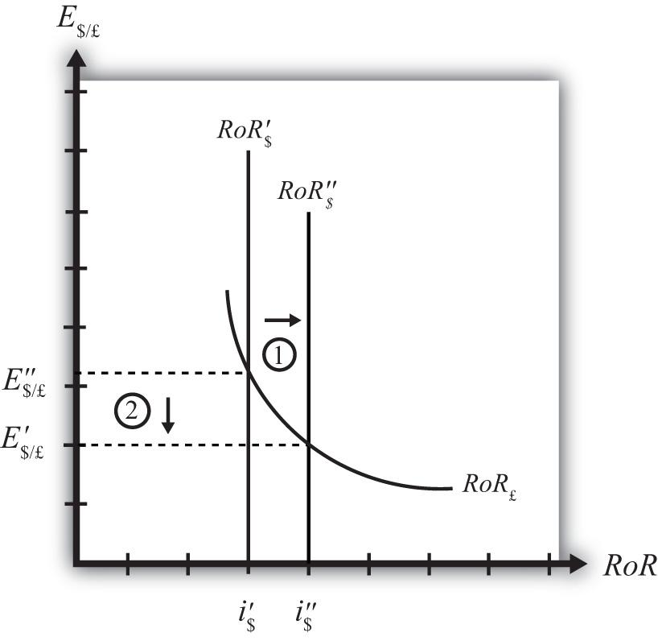

## Table of Contents

## What are interest rates?

Interest rates are the cost of borrowing money or the reward for saving money. When you take out a loan, like a car loan or a mortgage, you pay interest to the lender. This is how banks and other lenders make money from loans. On the other hand, when you put money in a savings account, the bank pays you interest for keeping your money with them. This encourages people to save more.

Interest rates can change and are influenced by many things, like the economy and decisions made by central banks. When the economy is doing well, interest rates might go up to control spending and inflation. When the economy is not doing well, interest rates might go down to encourage people to borrow and spend more money. Understanding interest rates is important because they affect how much it costs to borrow money and how much you can earn from saving.

## How do interest rates affect the economy?

Interest rates have a big impact on the economy. When interest rates are low, it's cheaper for people and businesses to borrow money. This means they can take out loans to buy things like houses, cars, or to start new projects. When more people are borrowing and spending, it helps the economy grow. Low interest rates also make it easier for businesses to expand and hire more workers, which can lead to more jobs and higher incomes.

On the other hand, when interest rates are high, borrowing money becomes more expensive. This can make people and businesses think twice before taking out loans. They might decide to spend less and save more instead. When spending goes down, it can slow down the economy. High interest rates can also make it harder for businesses to grow, which might lead to fewer jobs and slower economic growth. So, interest rates are a powerful tool that can help control how fast or slow the economy is moving.

## What is the relationship between interest rates and currency value?

When interest rates in a country go up, it can make the country's currency stronger. This happens because higher interest rates attract more foreign investors looking for better returns on their money. They will buy the country's currency to invest in its bonds or savings accounts, increasing the demand for that currency. When more people want a currency, its value goes up compared to other currencies.

On the other hand, when interest rates go down, the country's currency might become weaker. Lower interest rates make it less attractive for foreign investors to put their money in that country. They might move their money to other countries with higher interest rates, reducing the demand for the currency. When fewer people want a currency, its value goes down compared to other currencies. So, interest rates play a big role in how strong or weak a country's currency is.

## How do higher interest rates influence currency demand?

When a country raises its interest rates, it makes its currency more attractive to foreign investors. These investors want to earn more money from their investments, so they move their money to the country with higher interest rates. This increases the demand for that country's currency because more people want to buy it to invest. As more people buy the currency, its value goes up compared to other currencies.

For example, if the United States raises its interest rates, foreign investors might decide to buy U.S. dollars to invest in American bonds or savings accounts. This increased demand for U.S. dollars can make the dollar stronger against other currencies like the euro or the yen. So, higher interest rates can lead to a stronger currency because they attract more foreign money.

## What impact do lower interest rates have on a currency's value?

When a country lowers its interest rates, it can make its currency weaker. This happens because lower interest rates make the country less attractive to foreign investors. These investors want to earn more money from their investments, so they move their money to countries with higher interest rates. When investors pull their money out of a country with lower interest rates, there is less demand for that country's currency. This lower demand can make the currency's value go down compared to other currencies.

For example, if Japan lowers its interest rates, foreign investors might decide to sell their Japanese yen and move their money to a country with higher interest rates, like the United States. This selling of yen reduces the demand for it, making the yen weaker against other currencies like the U.S. dollar. So, lower interest rates can lead to a weaker currency because they encourage foreign investors to take their money elsewhere.

## How do interest rate differentials affect exchange rates?

Interest rate differentials are the differences in interest rates between two countries. When one country has higher interest rates than another, it can affect the exchange rate between their currencies. If the interest rates in Country A are higher than in Country B, investors will want to move their money to Country A to get better returns. This means they will buy more of Country A's currency, increasing its demand. When demand for a currency goes up, its value goes up too. So, the currency of Country A will become stronger compared to the currency of Country B.

On the other hand, if the interest rates in Country B are lower than in Country A, investors will move their money away from Country B. They will sell Country B's currency to buy Country A's currency. This reduces the demand for Country B's currency, making its value go down. So, the currency of Country B will become weaker compared to the currency of Country A. Interest rate differentials are a big reason why exchange rates change, as investors always look for the best places to earn more money.

## What role do central banks play in setting interest rates?

Central banks are really important when it comes to setting interest rates. They are like the big bosses of the economy who decide how much it costs to borrow money. When the central bank thinks the economy is growing too fast and might cause prices to go up too much, they might raise interest rates. This makes borrowing more expensive, so people and businesses might spend less, which can help keep prices under control. On the other hand, if the economy is not doing well and people are not spending enough, the central bank might lower interest rates to make borrowing cheaper. This can encourage people to take out loans and spend more, helping the economy grow.

Sometimes, central banks use something called a "target [interest rate](/wiki/interest-rate-trading-strategies)" to guide the economy. This is the interest rate they want banks to use when they lend money to each other overnight. By changing this target rate, the central bank can influence all other interest rates in the economy, like those for mortgages, car loans, and savings accounts. So, central banks have a big job in making sure the economy stays balanced by adjusting interest rates up or down based on what's happening in the country.

## Can you explain the carry trade and its relation to interest rates?

The [carry](/wiki/carry-trading) trade is a way for people to make money using interest rates. It's when someone borrows money from a place with low interest rates and then uses that money to invest in a place with high interest rates. For example, if Japan has low interest rates and the United States has high interest rates, someone might borrow money in Japan and then use that money to buy U.S. bonds. They earn more money from the high U.S. interest rates than they pay in interest on the loan from Japan.

This strategy works well when the interest rate difference stays big and the exchange rate between the two countries stays stable. But it can be risky. If the interest rates change or the currency values change a lot, the carry trade can lose money. If the currency they borrowed in (like the Japanese yen) gets stronger compared to the currency they invested in (like the U.S. dollar), it can wipe out the profits from the interest rate difference. So, while the carry trade can be a good way to make money, it's important to watch the interest rates and currency values carefully.

## How do market expectations of future interest rates influence currency values?

Market expectations about future interest rates can have a big impact on how strong or weak a country's currency is. If people think that a country's interest rates are going to go up in the future, they might want to buy that country's currency now to get a good deal. This is because higher interest rates make a currency more attractive to investors. They can earn more money from their investments in that country, so more people want to buy the currency, which makes its value go up.

On the other hand, if people expect that a country's interest rates will go down, they might start selling that country's currency. Lower interest rates mean less money to be made from investments, so investors might move their money to other countries with better returns. When lots of people sell a currency, its value goes down. So, what people think will happen with interest rates in the future can make a big difference in how much a currency is worth right now.

## What are the effects of interest rate changes on forex markets?

When interest rates change, it can have a big effect on the [forex](/wiki/forex-system) markets. The forex market is where people trade different currencies. If a country raises its interest rates, it makes its currency more attractive to investors. They want to earn more money from their investments, so they buy more of that country's currency. This makes the demand for the currency go up, and when more people want a currency, its value goes up too. So, higher interest rates can make a country's currency stronger compared to others.

On the other hand, if a country lowers its interest rates, it can make its currency less attractive to investors. They might move their money to countries with higher interest rates to earn more. When investors sell a currency, the demand for it goes down, and its value can drop. So, lower interest rates can make a country's currency weaker. These changes in interest rates can cause a lot of movement in the forex markets, as traders and investors react to the new rates and try to make the best decisions for their money.

## How do global economic conditions influence the impact of interest rates on exchange rates?

Global economic conditions play a big role in how interest rates affect exchange rates. When the world economy is doing well, countries with higher interest rates can attract more foreign money. Investors want to put their money where they can earn the most, so they'll buy the currency of a country with high interest rates. This makes that currency stronger compared to others. But if the global economy is not doing well, even high interest rates might not be enough to attract investors. They might be more worried about the risk of losing money, so they keep their money in safer places, even if it means [earning](/wiki/earning-announcement) less.

Sometimes, big events like economic crises or changes in trade policies can also change how interest rates affect exchange rates. For example, if there's a lot of uncertainty in the world, investors might not care as much about interest rates. They might focus more on how safe their money is. In this case, a country with high interest rates might not see its currency get stronger if investors think the country is risky. So, the impact of interest rates on exchange rates can be different depending on what's happening around the world.

## What advanced strategies can traders use to capitalize on interest rate movements?

Traders can use a strategy called interest rate [arbitrage](/wiki/arbitrage) to make money from interest rate movements. This means they borrow money from a place with low interest rates and then invest that money in a place with high interest rates. For example, if Japan has low interest rates and the United States has high interest rates, a trader might borrow money in Japan and use it to buy U.S. bonds. The difference between the interest they pay in Japan and the interest they earn in the U.S. is their profit. But this strategy can be risky because if the currencies change a lot, it can wipe out the profits. Traders need to watch the interest rates and currency values closely to make this work.

Another strategy is to use interest rate futures and options. These are like bets on what interest rates will do in the future. If a trader thinks interest rates will go up, they might buy interest rate futures or options that will pay off if rates go up. This can help them make money if their guess is right. If they think rates will go down, they might sell these futures or options. This strategy can be good for making money from interest rate changes, but it's also risky. If the trader's guess is wrong, they can lose money. So, they need to do a lot of research and keep up with what's happening in the economy to use these strategies well.

## References & Further Reading

Bank for International Settlements. Triennial Central Bank Survey: The Triennial Central Bank Survey, published by the Bank for International Settlements (BIS), provides comprehensive insights into the global foreign exchange market activities. It covers market size, structure, and trends, which are crucial for understanding the forex market dynamics and the [volume](/wiki/volume-trading-strategy) of transactions happening on a global scale. The BIS survey is instrumental for traders, policymakers, and financial analysts alike, providing data that informs decisions regarding currency value assessments and forex market strategies.

Aldridge, Irene. High-Frequency Trading: A Practical Guide: This book serves as an essential resource for understanding the complex and rapidly evolving world of high-frequency trading ([HFT](/wiki/high-frequency-trading-strategies)). Irene Aldridge provides practical guidance on the strategies used in [algorithmic trading](/wiki/algorithmic-trading), the role of algorithms in forex markets, and their implications for [liquidity](/wiki/liquidity-risk-premium) and efficiency. This guide highlights the technological advancements and strategies that have transformed trading practices in forex markets.

Bodie, Z., Kane, A., & Marcus, A. J. Investments: The textbook "Investments" by Bodie, Kane, and Marcus is a fundamental resource for grasping the principles of investment. It includes sections on foreign exchange and its implications for international portfolio management. The book elucidates the impact of exchange rates on asset valuation, risk management, and investment strategies, offering a comprehensive introduction to finance and investment concepts, including those relevant to forex trading.

Krugman, P., Obstfeld, M., & Melitz, M. International Economics: The book "International Economics" by Krugman, Obstfeld, and Melitz provides an in-depth examination of trade and finance from a global perspective. It covers the fundamental theories of international trade, exchange rates, and policy implications, providing readers with the necessary theoretical frameworks to understand exchange rate movements and their effects on the global economy. This text is invaluable for individuals seeking to comprehend the macroeconomic factors influencing forex markets.

Lopez de Prado, M. Advances in Financial Machine Learning: Lopez de Prado's "Advances in Financial Machine Learning" explores the intersection of finance and [machine learning](/wiki/machine-learning), offering techniques and tools for improving financial modeling and forecasting. This resource is particularly relevant to those interested in the use of [artificial intelligence](/wiki/ai-artificial-intelligence) and machine learning in algorithmic trading within the forex markets. The book provides insights into developing robust algorithms and strategies that enhance predictive accuracy and risk management in trading operations.

