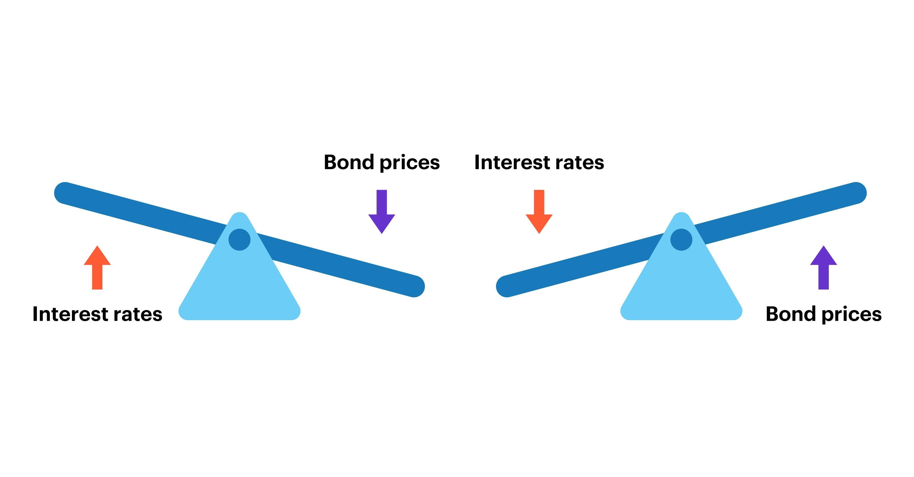

## Table of Contents

## What is an interest rate?

An interest rate is the amount of money a bank or lender charges you for borrowing money, or the amount of money they pay you for saving money with them. It's usually shown as a percentage of the total amount of money you borrow or save. For example, if you borrow $100 with an interest rate of 5%, you will have to pay back the $100 plus an extra $5 in interest.

Interest rates are important because they affect how much it costs to borrow money and how much you can earn by saving money. When interest rates are high, borrowing money becomes more expensive, which can make people and businesses think twice before taking out loans. On the other hand, high interest rates can be good for savers because they earn more money on their savings. When interest rates are low, borrowing is cheaper, which can encourage spending and investment, but savers earn less on their money.

## How does inflation affect the economy?

Inflation is when the prices of things we buy go up over time. This can make the money we have worth less because we can't buy as much with it as before. When inflation happens, it can change how people spend and save their money. If people think prices will keep going up, they might buy things now instead of later. This can make the economy grow faster because more people are spending money. But if inflation gets too high, it can cause problems. People might start to worry that their money won't be worth much in the future, so they might not want to save or invest as much.

If inflation is too high, it can also make it hard for businesses to plan for the future. They might not know how much to charge for their products or how much their costs will go up. This can slow down the economy because businesses might not want to grow or hire new workers if they're unsure about the future. On the other hand, a little bit of inflation can be good for the economy. It can encourage people to spend and invest, which helps businesses grow and create jobs. The key is to keep inflation at a level that helps the economy without causing too many problems.

## What are bonds and how do they work?

Bonds are like IOUs that governments or companies give to people who lend them money. When you buy a bond, you are lending money to the issuer, which could be a government or a company. In return, they promise to pay you back the money you lent them, called the principal, on a specific date in the future. They also pay you interest regularly, usually every six months, until they pay back the principal. The interest is a way of saying thank you for lending them the money.

Bonds can be a safe way to invest your money because they usually pay you back the principal at the end. But, like everything, they have risks too. If the company or government that issued the bond runs into money problems, they might not be able to pay you back. Also, if interest rates go up after you buy a bond, the value of your bond might go down because new bonds will pay more interest. But if you hold onto your bond until it matures, you will still get the principal back, as long as the issuer can pay it.

## How do interest rates impact bond prices?

Interest rates and bond prices move in opposite directions. When interest rates go up, the price of existing bonds goes down. This happens because new bonds that are issued will have higher interest rates, making them more attractive to investors. If you have an old bond with a lower interest rate, you might need to sell it for less money to make it appealing to someone else who could buy a new bond with a better rate.

On the other hand, when interest rates go down, the price of existing bonds goes up. This is because the interest rate on your old bond is now higher than what new bonds are offering. People will want to buy your bond because it pays more interest, so you can sell it for more money. This relationship between interest rates and bond prices is important for investors to understand because it affects how much money they can make or lose when they buy and sell bonds.

## What is the relationship between inflation and interest rates?

Inflation and interest rates are closely linked. When inflation goes up, it means that the prices of things are rising. To control this, central banks often raise interest rates. Higher interest rates make borrowing money more expensive. This can slow down spending because people and businesses might not want to take out loans if they have to pay more interest. By slowing down spending, central banks hope to bring inflation back to a more normal level.

On the other hand, when inflation is low or even going down, central banks might lower interest rates. Lower interest rates make borrowing cheaper, which can encourage people and businesses to spend more money. This can help to boost the economy and push inflation up a little bit. The goal is to find a balance where inflation is just right—not too high and not too low—so the economy can grow steadily.

## How can changes in interest rates affect inflation?

When interest rates go up, it can help slow down inflation. Higher interest rates make it more expensive for people and businesses to borrow money. If borrowing costs more, people might spend less on things like cars and houses, and businesses might not want to take out loans to grow. When spending goes down, the demand for goods and services decreases, which can stop prices from going up too fast. This is how central banks try to keep inflation under control by making borrowing more expensive.

On the other hand, when interest rates go down, it can make inflation go up a bit. Lower interest rates make borrowing cheaper, so people and businesses might be more willing to take out loans. This can lead to more spending on things like homes, cars, and other big purchases. When more people are buying things, the demand for goods and services goes up, which can push prices higher. Central banks might lower interest rates to encourage spending and help the economy grow when inflation is too low.

## What are the different types of bonds and their risks?

There are different types of bonds, and each comes with its own risks. Government bonds are issued by governments and are often seen as the safest type because governments are usually good at paying back their debts. Treasury bonds, for example, are backed by the full faith and credit of the government. But even government bonds can have risks if the government has money problems. Another type is municipal bonds, which are issued by local governments or cities. These can be a bit riskier than Treasury bonds because the financial health of a city can change.

Corporate bonds are issued by companies and can be riskier than government bonds. The risk depends on how healthy the company is financially. If a company does well, its bonds are safer, but if the company runs into trouble, it might not be able to pay back the bond. Corporate bonds are split into two groups: investment-grade bonds, which are from financially stable companies, and high-yield or "junk" bonds, which are from companies that are riskier but offer higher interest rates to make up for it. 

There are also other types of bonds like agency bonds, which are issued by government-sponsored enterprises, and international bonds, which can be issued by foreign governments or companies. These can have extra risks because of changes in currency values or political issues in other countries. All bonds [carry](/wiki/carry-trading) some risk, so it's important to understand the risks before you decide to buy one.

## How do central banks use interest rates to control inflation?

Central banks use interest rates to control inflation by making borrowing money more or less expensive. When inflation is too high, central banks raise interest rates. This makes loans cost more, so people and businesses might borrow less money. When they borrow less, they spend less, which can help slow down the rise in prices. By doing this, the central bank tries to bring inflation back to a level that's good for the economy.

On the other hand, when inflation is too low, central banks might lower interest rates. This makes loans cheaper, so people and businesses are more likely to borrow money. When they borrow more, they spend more, which can help push prices up a little bit. The goal is to get inflation to a level where it helps the economy grow without causing too many problems. By adjusting interest rates, central banks try to keep inflation just right.

## What is the yield curve and what does it indicate about future interest rates and inflation?

The yield curve is a graph that shows the interest rates of bonds with different times until they pay back the money you lent. Usually, the longer you have to wait to get your money back, the higher the interest rate will be. This makes the yield curve look like it's going uphill. When the yield curve looks normal, it means that people think the economy will keep growing and inflation will stay steady.

Sometimes, the yield curve can change shape and tell us something different about the future. If the yield curve gets flat, it means that the interest rates for short-term and long-term bonds are almost the same. This can happen when people think that interest rates and inflation won't change much. If the yield curve turns upside down, or "inverts," it means that short-term interest rates are higher than long-term rates. This can be a warning sign that people think the economy might slow down or even go into a recession, and that inflation might go down too.

## How do inflation-indexed bonds work and why are they important?

Inflation-indexed bonds are special types of bonds that protect you from inflation. When you buy one, the amount of money you get back at the end, called the principal, goes up if inflation goes up. This means that even if prices go up, the bond will still be worth the same amount in terms of what you can buy with it. The interest you earn on these bonds also goes up with inflation, so you keep [earning](/wiki/earning-announcement) the same amount in real terms. In the United States, these bonds are called Treasury Inflation-Protected Securities, or TIPS.

Inflation-indexed bonds are important because they help people and investors protect their money from losing value because of inflation. If you're worried about prices going up and making your savings worth less, these bonds can be a safe place to put your money. They make sure that the money you get back will still buy the same amount of things, even if inflation goes up. This can be really helpful for people who want to make sure their money keeps its value over time.

## What advanced strategies can investors use to manage bond portfolios in varying interest rate and inflation environments?

Investors can use a strategy called laddering to manage their bond portfolios in different interest rate and inflation environments. Laddering means buying bonds that mature at different times. For example, you might buy some bonds that will pay you back in one year, some in three years, and some in five years. This way, if interest rates go up, you can reinvest the money from the bonds that mature soon at the new, higher rates. If interest rates go down, you still have bonds that are paying you the old, higher rates. Laddering helps you balance the risk of interest rate changes and keep a steady flow of money coming in.

Another strategy is to use inflation-indexed bonds, like TIPS in the United States, to protect against inflation. These bonds adjust the principal and interest payments based on inflation, so your money keeps its value even if prices go up. By including some inflation-indexed bonds in your portfolio, you can make sure that part of your money is safe from inflation. You can also mix these with regular bonds to balance the risk and reward. This way, you can have some protection against inflation while still trying to earn more from regular bonds if interest rates are good.

## How do global economic factors influence interest rates, inflation, and bond markets?

Global economic factors can have a big impact on interest rates, inflation, and bond markets. When big economies like the United States or China do well or badly, it can affect the whole world. If these countries are growing fast, they might need more money to invest, which can push up interest rates everywhere. On the other hand, if these countries are slowing down, they might lower interest rates to encourage spending, which can affect rates in other countries too. Also, if a country has a lot of debt, investors might worry about getting their money back, so they might demand higher interest rates to lend to that country.

Inflation can also be affected by what's happening around the world. If the price of oil goes up because of problems in oil-producing countries, it can make everything more expensive and push up inflation everywhere. Or, if countries are trading a lot with each other and the value of their money changes, it can affect the prices of things they buy and sell, which can lead to inflation. Central banks around the world watch these things closely and might change their interest rates to try to keep inflation under control.

These global factors also influence bond markets. If investors think that interest rates will go up because of what's happening in the world, they might sell their bonds, which can make bond prices go down. On the other hand, if they think rates will stay low or go down, they might buy more bonds, pushing prices up. Also, if there's a lot of uncertainty because of global economic problems, investors might want safer investments like government bonds, which can affect the demand and prices of bonds from different countries.

## What is the role of bonds in the economy and how can we understand them?

Bonds are fixed-income financial instruments that represent a loan made by an investor to a borrower, typically corporate or governmental. They are characterized by their face value (the principal loan amount), the coupon rate (the interest paid to bondholders), and the maturity date (when the face value is repaid). Bonds are unique in that they provide a predictable income stream, which makes them an attractive choice for investors seeking stability.

Governments and corporations use bonds to raise capital by borrowing money from investors. When an entity issues a bond, it is essentially taking a loan from the bondholder and agreeing to pay back the principal, along with periodic interest payments, until the bond matures. For governments, bonds are crucial tools for funding public projects and managing budget deficits. Corporations issue bonds to finance various activities such as expanding operations, developing new products, or refinancing existing debt.

The yield of a bond, effectively the return on investment for the bondholder, is an essential aspect of bonds. Bond yields are influenced by several factors including the credit quality of the issuer, prevailing interest rates, and time to maturity. The yield can be understood through the formula:

$$
\text{Yield} = \frac{\text{Coupon payment}}{\text{Price of bond}}
$$

The bond price and yield have an inverse relationship: when bond prices rise, yields fall, and vice versa. This occurs because the fixed coupon payments become more or less attractive compared to other available investments when interest rates fluctuate.

Bonds play an important role in portfolio diversification and risk management. As steady income-generating assets, they can offset the [volatility](/wiki/volatility-trading-strategies) associated with equities. Including bonds, which generally exhibit lower risk profiles compared to stocks, can reduce the overall risk of an investment portfolio. Furthermore, bonds are often utilized as a hedge against economic downturns, as they tend to maintain value and income potential when stock markets underperform.

In summary, bonds serve critical economic functions for both issuers and investors, allowing for [capital raising](/wiki/hedge-fund-capital-raising) and offering benefits in terms of yield and portfolio stability. Understanding their dynamics enriches an investor's ability to strategize effectively in various economic conditions.

## What is the impact of inflation on bonds?

Inflation is the rate at which the general level of prices for goods and services increases, eroding purchasing power over time. For bondholders, inflation presents a significant risk as it reduces the real value of fixed interest payments. Typically, when inflation is high, the purchasing power of future bond cash flows decreases since the payments are fixed in nominal terms. As a result, the real rate of return on bonds—calculated as the nominal yield minus the inflation rate—diminishes.

$$
\text{Real Rate of Return} = \text{Nominal Interest Rate} - \text{Inflation Rate}
$$

This fundamental equation highlights how inflation impacts bond investing by effectively lowering the real yield received by investors.

Inflation is inversely related to bond prices. As inflation expectations rise, interest rates tend to increase as central banks, like the Federal Reserve, may hike policy rates to control inflation. Rising interest rates lead to a decrease in existing bond prices due to the inverse relationship between bond prices and yields: as yields increase, prices fall. This relationship can be intuitive when considering that new bonds are likely to be issued at higher yields due to rising rates, making existing bonds with lower yields less attractive.

Historically, certain periods have vividly illustrated the effects of inflation on bond markets. The late 1970s and early 1980s in the United States, often referred to as "The Great Inflation," saw inflation rates soar to double digits. Such high levels of inflation led to significant losses in the bond market as the Federal Reserve implemented aggressive [interest rate](/wiki/interest-rate-trading-strategies) hikes, causing bond prices to plummet. This period underscored the profound impact inflation can have on fixed-income securities and the importance of inflation expectations in bond pricing.

More recently, the COVID-19 pandemic prompted widespread fiscal stimulus measures and supply chain disruptions, rekindling inflation concerns. As inflation expectations rise, the anticipation of central bank intervention drives volatility in bond markets, impacting pricing and yields.

In managing portfolios, investors often seek inflation-protected securities to mitigate these risks. Treasury Inflation-Protected Securities (TIPS) are one such instrument that offers a hedge, as their principal value adjusts with inflation, preserving the purchasing power of the return. Understanding inflation's influence on bonds is critical for navigating the interplay between these financial variables, enabling better investment decisions in a dynamic market environment.

## How do interest rates influence bond markets?

Interest rates are a critical [factor](/wiki/factor-investing) in the dynamics of bond markets, with central banks playing a pivotal role in their determination and implementation. Central banks set interest rates primarily through monetary policy tools. The most common tool is the adjustment of the policy interest rate, such as the Federal Funds Rate in the United States or the European Central Bank's main refinancing operations rate. These rates influence the cost of borrowing and the yield on savings, thereby affecting economic activity. Central banks may also employ open market operations, controlling the supply of money by buying or selling government securities to influence short-term interest rates and the amount of money in the economy.

The relationship between interest rates and bond prices is inverse: as interest rates rise, existing bond prices tend to fall, and conversely, as interest rates decline, bond prices rise. This inverse relationship is due to the fixed nature of bond coupon payments. When new bonds are issued at higher interest rates, existing bonds with lower coupon rates become less attractive, causing their market prices to drop to yield returns equivalent to newly issued bonds.

To better understand the mathematical aspect of this relationship, consider the bond pricing equation:

$$
P = \frac{C}{(1+r)^1} + \frac{C}{(1+r)^2} + \cdots + \frac{C+F}{(1+r)^n}
$$

where $P$ represents the bond price, $C$ is the coupon payment, $F$ is the face value of the bond, $r$ is the yield or prevailing interest rate, and $n$ is the number of periods until maturity. As $r$ increases, the present value of future cash flows ($C$ and $F$) decreases, leading to a reduction in bond prices.

Changes in interest rates directly affect bond yields. As rates rise, the yields on existing bonds must increase to remain competitive, achieved by decreasing their price. Conversely, when interest rates fall, the yields on existing bonds become more attractive, driving up their market price.

Monetary policy significantly influences the interest rate environment. Through monetary policy, central banks aim to achieve macroeconomic objectives such as controlling inflation, managing employment levels, and fostering economic growth. For instance, during periods of economic stagnation or recession, central banks may lower interest rates to stimulate borrowing and spending, thus boosting economic activity. Conversely, during times of high inflation, central banks might raise interest rates to curtail excessive spending and borrowing, thereby stabilizing price levels.

The influence of interest rates on bond markets underscores the importance for investors to monitor central bank policies closely. Understanding the mechanisms through which interest rates affect bond prices and yields can provide insights into potential investment opportunities and risks within bond markets.

## References & Further Reading

[1]: Fabozzi, F. J., Mann, S. V., & Choudhry, M. (2010). ["The Handbook of Fixed Income Securities."](https://www.mhebooklibrary.com/doi/book/10.1036/9781260473902?contentTab=true) McGraw-Hill Education.

[2]: Mishkin, F. S. (2018). ["The Economics of Money, Banking, and Financial Markets,"](https://www.pearsonhighered.com/assets/preface/0/1/3/4/0134855388.pdf) Pearson Education Limited.

[3]: Choudhry, M. (2011). ["Bond and Money Markets: Strategy, Trading, Analysis."](https://books.google.com/books/about/Bond_and_Money_Markets.html?id=c1N36C7LxU4C) Butterworth-Heinemann.

[4]: Lopez de Prado, M. (2018). ["Advances in Financial Machine Learning."](https://www.amazon.com/Advances-Financial-Machine-Learning-Marcos/dp/1119482089) Wiley.

[5]: Hull, J. C. (2018). ["Options, Futures, and Other Derivatives,"](https://www.semanticscholar.org/paper/Options%2C-Futures%2C-and-Other-Derivatives-Hull/89bdee500c8623864fc9eb7a471546aa713acc44) Pearson.