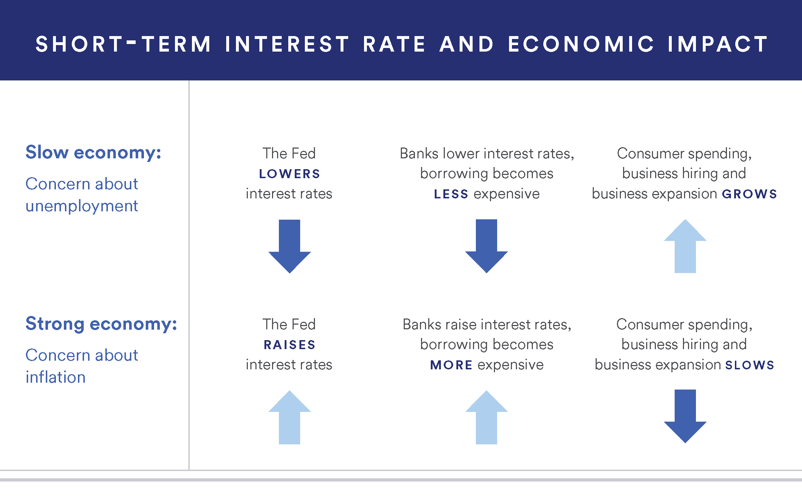

## Table of Contents

## What are interest rates and why are they important for investors?

Interest rates are the cost of borrowing money or the reward for saving money. They are set by banks and financial institutions and can change over time. When you borrow money, like taking out a loan, you have to pay back the amount you borrowed plus some extra, which is the interest. When you save money in a bank, the bank might give you a little bit of money back as interest for keeping your money with them.

Interest rates are important for investors because they affect how much money people can make from their investments. When interest rates go up, it can be more expensive to borrow money, so people might be less likely to take out loans to invest in things like houses or businesses. On the other hand, higher interest rates can make saving money more attractive because you can earn more from your savings. When interest rates are low, borrowing money is cheaper, which can encourage more investment in the economy. Investors need to keep an eye on interest rates because they can influence the value of stocks, bonds, and other investments.

## How do interest rates affect the economy?

Interest rates have a big impact on the economy. When interest rates are low, it's cheaper for people and businesses to borrow money. This can lead to more spending and investment, which can help the economy grow. For example, if a business can borrow money at a low rate, it might decide to expand or buy new equipment. More spending means more jobs and more money moving around in the economy.

On the other hand, when interest rates are high, borrowing money becomes more expensive. This can slow down the economy because people and businesses might borrow less. They might also save more because they can earn more from their savings. If businesses aren't borrowing and investing as much, they might not grow as quickly, and this can lead to fewer jobs and less economic activity. So, interest rates are a tool that can be used to either speed up or slow down the economy.

## What is the difference between nominal and real interest rates?

Nominal interest rates are the numbers you see on a loan or a savings account. They are the percentage you pay or earn before taking into account things like inflation. For example, if a bank says it gives you 3% interest on your savings, that's the nominal rate.

Real interest rates are what you get after adjusting for inflation. Inflation is when prices go up over time, making money worth less. So, if the nominal interest rate on your savings is 3%, but inflation is 2%, the real interest rate is only 1%. This means your money is only growing by 1% in terms of what it can actually buy. Real interest rates give you a better idea of how much your money is really growing or how much it really costs to borrow.

## How do central banks influence interest rates?

Central banks, like the Federal Reserve in the United States, have a big say in what interest rates are. They do this by setting a special rate called the "benchmark" or "policy" rate. This rate is what banks charge each other for short-term loans. When the central bank changes this rate, it sends a signal to the rest of the economy. If they lower the benchmark rate, it usually means that other interest rates, like those for mortgages and loans, will go down too. If they raise it, those other rates tend to go up.

This control over the benchmark rate helps central banks manage the economy. When they want to encourage more spending and investment, they might lower the rate to make borrowing cheaper. This can help the economy grow. On the other hand, if they want to slow things down, maybe because prices are going up too fast, they might raise the rate to make borrowing more expensive. This can help keep inflation in check. So, by changing the benchmark rate, central banks can steer the economy in the direction they think is best.

## What are the different types of interest rates that investors should know about?

There are a few different types of interest rates that investors should know about. The first is the prime rate, which is the rate banks charge their best customers. It's usually a bit higher than the central bank's rate. When the prime rate goes up or down, it can affect the rates on loans and credit cards. Another important rate is the federal funds rate, which is the rate banks charge each other for overnight loans. This rate is set by the central bank and can influence other interest rates in the economy.

Another type of rate is the fixed interest rate, which stays the same for the whole time you have a loan or a savings account. This can be good if you want to know exactly what you'll pay or earn. On the other hand, there's the variable or adjustable interest rate, which can change over time. This means your payments might go up or down depending on what's happening with the economy. Knowing about these different rates can help investors make smarter choices about where to put their money.

## How do interest rates impact bond prices and yields?

Interest rates have a big effect on bonds. When interest rates go up, the price of bonds usually goes down. This happens because new bonds are issued with higher interest rates, making older bonds with lower rates less attractive. People who own these older bonds might have to sell them at a lower price to make them appealing to buyers. On the other hand, when interest rates go down, the price of bonds usually goes up. This is because the older bonds with higher interest rates become more valuable compared to new bonds with lower rates.

The yield of a bond, which is like the return you get on your investment, also changes with interest rates. When interest rates rise, the yield on existing bonds goes up too. This is because the price of the bond drops, so the fixed interest payment you get becomes a bigger percentage of the bond's lower price. When interest rates fall, the yield on existing bonds goes down because the price of the bond rises, making the fixed interest payment a smaller percentage of the bond's higher price. So, interest rates and bond prices move in opposite directions, while interest rates and bond yields move in the same direction.

## What is the relationship between interest rates and stock market performance?

Interest rates can have a big impact on how the stock market does. When interest rates go up, it can make borrowing money more expensive for companies. This means they might have to spend more on loans, which can cut into their profits. When companies make less money, their stock prices might go down. Also, when interest rates are high, people might decide to put their money into savings accounts or bonds instead of stocks because they can earn more from those. This can make less money available for the stock market, which can push stock prices down.

On the other hand, when interest rates are low, borrowing money is cheaper. Companies can take out loans more easily and use that money to grow their business. This can lead to more profits, which can make their stock prices go up. Low interest rates can also make stocks more attractive to investors because they might not get as much from savings accounts or bonds. More people buying stocks can push the stock market up. So, interest rates can play a big role in how well the stock market does.

## How can investors use interest rate forecasts to make investment decisions?

Investors can use interest rate forecasts to help decide where to put their money. If they think interest rates are going to go up, they might want to be careful about buying bonds. When rates go up, bond prices usually go down. So, they might choose to wait until rates are higher to buy new bonds with better interest rates. They might also look at stocks of companies that do well when interest rates are high, like banks, because banks can make more money from loans when rates are up.

On the other hand, if investors think interest rates are going to go down, they might want to buy bonds right away. When rates go down, bond prices usually go up, so they could make money by selling those bonds later. They might also look at stocks of companies that do well when interest rates are low, like real estate companies, because it's cheaper for these companies to borrow money to grow their business. By keeping an eye on interest rate forecasts, investors can try to make smarter choices about their investments.

## What are the risks associated with investing in a rising interest rate environment?

When interest rates are going up, there are some risks for investors. One big risk is that bond prices go down. If you own bonds and the interest rates rise, the value of your bonds might drop. This means if you want to sell your bonds, you might get less money than you paid for them. Another risk is that borrowing money gets more expensive for companies. If a company has to pay more to borrow money, it might not make as much profit. If the company's profits go down, its stock price might go down too.

Another risk in a rising interest rate environment is that people might move their money from stocks to savings accounts or bonds. This is because savings accounts and new bonds start to offer higher interest rates, making them more attractive. If fewer people are buying stocks, the stock market might go down. So, investors need to be careful and think about how rising interest rates might affect their investments. They might want to look at different types of investments or wait for a better time to buy bonds or stocks.

## How do global interest rates affect international investments?

Global interest rates can have a big impact on international investments. When interest rates are different in different countries, money can move around the world. If one country has higher interest rates than another, investors might want to move their money to that country to get a better return on their savings or investments. This can affect the value of currencies too. If a lot of money moves into a country because of high interest rates, its currency might get stronger. A stronger currency can make it cheaper for people in that country to buy things from other countries, but it can make it more expensive for other countries to buy things from them.

On the other hand, if interest rates are low in a country, investors might take their money out and put it in countries with higher rates. This can make the country's currency weaker. A weaker currency can make it more expensive for people in that country to buy things from other countries, but it can make their own products cheaper for people in other countries to buy. So, global interest rates can affect where investors put their money and how much they can make from their investments. It's important for investors to look at interest rates around the world to make smart choices about where to invest their money.

## What are interest rate swaps and how are they used in investment strategies?

Interest rate swaps are agreements between two parties to exchange interest payments. One party might have a loan with a variable interest rate, and the other might have a loan with a fixed interest rate. They can swap their interest payments so that the first party pays the fixed rate and the second party pays the variable rate. This can help both parties manage their risk. If someone thinks interest rates are going to go up, they might want to swap to a fixed rate to know exactly what they'll pay. If someone thinks rates are going to go down, they might want to swap to a variable rate to possibly pay less.

Investors use interest rate swaps as part of their strategies to manage risk and take advantage of their predictions about where interest rates are headed. For example, a company might use an interest rate swap to turn a variable rate loan into a fixed rate loan if they want to avoid the risk of rates going up. Or, an investor might use a swap to bet on falling interest rates by switching to a variable rate. By using swaps, investors can protect themselves from changes in interest rates or try to make more money if their predictions about rates are right.

## How can investors hedge against interest rate risk in their portfolios?

Investors can use different ways to protect their money from changes in interest rates. One way is by using interest rate swaps. This means they can swap a loan with a changing interest rate for one with a steady rate, or the other way around. This helps them know exactly what they will pay or earn, no matter what happens with interest rates. Another way is by buying bonds that change with interest rates, called floating-rate bonds. These bonds adjust their interest payments when rates go up or down, so investors don't lose money if rates change.

Another way to hedge against interest rate risk is by using something called bond laddering. This means buying bonds that come due at different times. If interest rates go up, the investor can use the money from the bonds that come due to buy new bonds with higher rates. This way, they can keep earning good interest even when rates change. By using these strategies, investors can make their portfolios safer and less affected by changes in interest rates.

## What is the role of interest rates in financial markets?

Interest rates are pivotal tools in the economic arsenal of central banks, serving as levers to modulate economic activity. By altering the cost of borrowing, central banks like the Federal Reserve or the European Central Bank influence both inflation and overall economic growth. When interest rates are low, borrowing becomes less expensive, encouraging businesses to invest and consumers to spend. Conversely, higher rates typically dampen borrowing and spending, helping to control inflation.

Banks and other financial institutions respond to interest rate changes by adjusting the rates they offer on loans, mortgages, and savings accounts. This trickles down to impact individuals and businesses, influencing their financial decisions. For instance, a drop in interest rates can lead to lower mortgage payments, increasing disposable income for consumers, which can then be funneled back into the economy through increased consumption.

On the investment front, interest rates significantly affect stock prices and overall market sentiment. Lower rates often drive stock prices higher as the cost of borrowing decreases and companies can expand more cheaply, potentially leading to higher future earnings. Furthermore, fixed-income instruments like bonds are directly affected by [interest rate](/wiki/interest-rate-trading-strategies) fluctuations; as rates rise, existing bonds with lower yields become less attractive, and vice versa.

For investors, understanding interest rates is crucial for portfolio optimization. Interest rate forecasts can guide investors in balancing their portfolios between equities, bonds, and alternative investments. For example, an anticipated rise in rates might prompt an investor to reduce bond holdings in favor of equities or other assets that might benefit from a rising rate environment. Mathematical models such as the present value formula are often used to assess the impact of interest rates on asset pricing:

$$
PV = \frac{C}{(1 + r)^n}
$$

where $PV$ is the present value, $C$ is the cash flow, $r$ is the interest rate, and $n$ is the number of periods. Understanding how this formula affects the valuation of different asset classes can be instrumental for investors, especially in volatile markets.

In summary, interest rates are integral to shaping economic landscapes and investment climates. Being knowledgeable about their implications helps investors not just protect, but also strategically enhance their portfolios in accordance with anticipated economic shifts.

## How does investors' financial information influence their decision making?

Investors rely on a wealth of financial information to make informed decisions in the ever-evolving financial markets. Key among these are earnings reports, market trends, and interest rate forecasts, each serving as critical inputs that influence investment strategies and portfolio management.

Earnings reports are vital, providing essential insights into a company's financial performance through detailed accounts of revenues, profits, expenses, and other key financial metrics. These reports allow investors to assess the financial health and future growth prospects of a company. For instance, a consistent rise in earnings can signify robust financial management and operational efficiency, leading to increased investor confidence and potentially higher stock prices.

In addition to earnings reports, investors closely monitor market trends. These trends offer a macroeconomic view of market dynamics, reflecting shifts in supply and demand, investor sentiment, and broader economic indicators. Understanding market trends enables investors to identify potential opportunities and risks, aiding in strategic decision-making. For example, an upward market trend might signal a favorable time to invest, while a downward trend might prompt caution or a reevaluation of existing positions.

Interest rate forecasts are another pivotal element in the decision-making arsenal of investors. Interest rates, determined by central banks, are instrumental in influencing the cost of borrowing and the return on savings. A rise in interest rates typically leads to increased borrowing costs and can dampen consumer spending and business investment, adversely affecting stock prices. Conversely, falling interest rates can stimulate economic activity by making borrowing cheaper and encouraging spending.

Financial literacy is crucial for investors aiming to interpret and utilize these diverse streams of information effectively. A sound understanding of financial concepts allows investors to analyze data critically, make informed predictions, and optimize their portfolios in alignment with personal financial goals and market conditions. Financial literacy also encompasses the ability to conduct risk assessments, which involve evaluating the [volatility](/wiki/volatility-trading-strategies) and potential returns of different investment options. 

Interest rates, in particular, play an integral role in valuation and risk assessment. They directly influence the discount rate used in valuation models, such as the Discounted Cash Flow (DCF) model, where the present value of expected future cash flows is calculated. The formula is given by:

$$
\text{PV} = \sum \frac{C_t}{(1 + r)^t}
$$

where $C_t$ represents the cash flow at time $t$, $r$ the discount rate, and $PV$ the present value. A higher interest rate increases the discount rate, which can reduce the present value of future cash flows, leading to a lower valuation of an investment. 

In summary, by effectively leveraging financial information and understanding the impact of interest rates on investment valuation and risk, investors can make strategic decisions that align with their risk tolerance and investment goals. This capability not only enhances their ability to navigate complexities within financial markets but also positions them favorably in the pursuit of achieving their financial objectives.

## References & Further Reading

[1]: Bergstra, J., Bardenet, R., Bengio, Y., & Kégl, B. (2011). ["Algorithms for Hyper-Parameter Optimization."](https://dl.acm.org/doi/10.5555/2986459.2986743) Advances in Neural Information Processing Systems 24.

[2]: ["Advances in Financial Machine Learning"](https://www.amazon.com/Advances-Financial-Machine-Learning-Marcos/dp/1119482089) by Marcos Lopez de Prado

[3]: ["Evidence-Based Technical Analysis: Applying the Scientific Method and Statistical Inference to Trading Signals"](https://www.amazon.com/Evidence-Based-Technical-Analysis-Scientific-Statistical/dp/0470008741) by David Aronson

[4]: ["Machine Learning for Algorithmic Trading"](https://github.com/stefan-jansen/machine-learning-for-trading) by Stefan Jansen

[5]: ["Quantitative Trading: How to Build Your Own Algorithmic Trading Business"](https://www.amazon.com/Quantitative-Trading-Build-Algorithmic-Business/dp/1119800064) by Ernest P. Chan