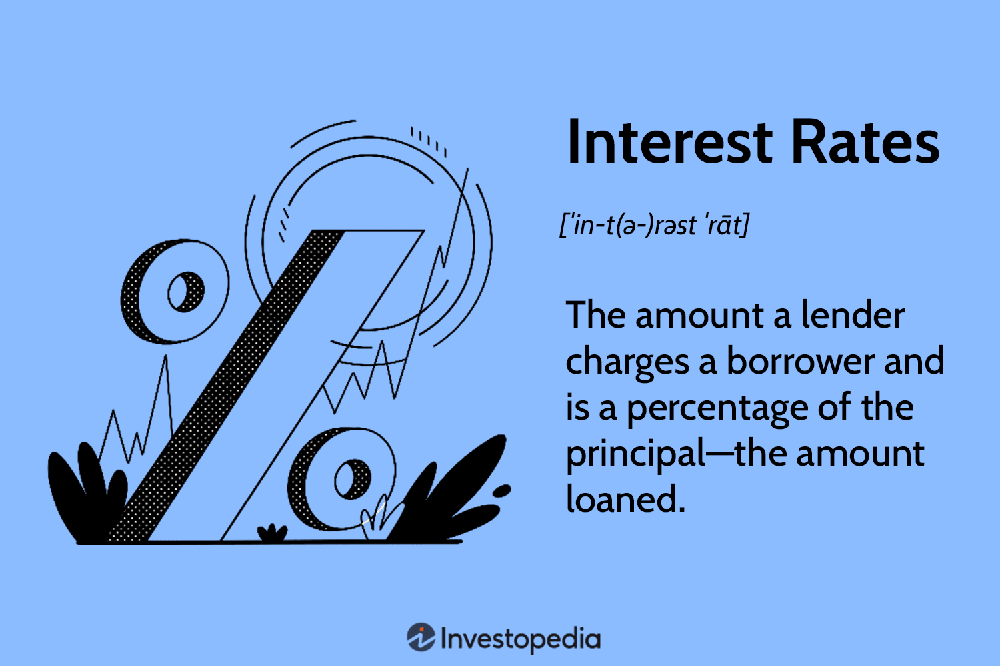

## Table of Contents

## What are interest rates?

Interest rates are the cost of borrowing money or the reward for saving it. When you borrow money from a bank or a lender, you have to pay back the amount you borrowed plus an extra amount, which is the interest. This extra amount is usually a percentage of the borrowed money and is calculated over a specific period of time. For example, if you borrow $100 at an interest rate of 5% per year, you will have to pay back $105 at the end of the year.

Interest rates are important because they affect the economy and people's financial decisions. When interest rates are low, borrowing money becomes cheaper, so more people and businesses might take loans to buy things like houses or invest in new projects. This can help the economy grow. On the other hand, when interest rates are high, borrowing becomes more expensive, which might slow down the economy because fewer people and businesses will want to borrow money. Interest rates also affect savings; higher rates mean you earn more on the money you save in the bank.

## How do interest rates affect the economy?

Interest rates have a big impact on the economy. When interest rates are low, it's cheaper for people and businesses to borrow money. This means more people might take out loans to buy houses or cars, and businesses might borrow to start new projects or expand. All this borrowing and spending can help the economy grow because it creates more jobs and increases demand for goods and services. On the other hand, when interest rates are high, borrowing money becomes more expensive. This can slow down the economy because fewer people and businesses will want to borrow and spend money, leading to less economic activity.

Interest rates also affect how much people save. When interest rates are high, people earn more money on their savings, so they might be more likely to save rather than spend. This can slow down the economy because less money is being spent on goods and services. Conversely, when interest rates are low, the reward for saving is smaller, so people might choose to spend more of their money instead of saving it. This can help boost the economy by increasing consumer spending. Overall, interest rates are a powerful tool that central banks use to manage economic growth and control inflation.

## What is the difference between nominal and real interest rates?

Nominal interest rates are the rates you see advertised by banks or on loan agreements. They are the basic percentage you pay on a loan or earn on savings, without considering inflation. For example, if a bank says they offer a 5% interest rate on a savings account, that's the nominal rate. It's the number you use to calculate how much interest you'll pay or earn before taking into account any changes in the value of money over time.

Real interest rates, on the other hand, take inflation into account. Inflation is the rate at which the prices of goods and services go up over time, which means the value of money goes down. The real interest rate gives you a better idea of the true cost of borrowing or the true gain from saving. To find the real interest rate, you subtract the inflation rate from the nominal interest rate. If the nominal interest rate is 5% and inflation is 2%, the real interest rate is 3%. This means that even though you're [earning](/wiki/earning-announcement) 5% on your savings, the actual increase in your purchasing power is only 3% because prices are going up too.

## How are interest rates determined by central banks?

Central banks, like the Federal Reserve in the U.S., set interest rates to help control the economy. They look at a lot of information, like how fast the economy is growing, how many people have jobs, and how quickly prices are going up. If the economy is growing too fast and prices are going up a lot, the central bank might raise interest rates. This makes borrowing money more expensive, so people and businesses might spend less, which can slow down the economy and help keep prices from going up too fast.

On the other hand, if the economy is not growing enough or if too many people are out of work, the central bank might lower interest rates. Lower interest rates make borrowing cheaper, so more people and businesses might take loans to buy things or start new projects. This can help the economy grow faster. The central bank tries to find the right balance so the economy grows steadily without prices going up too fast.

## What is the impact of interest rates on savings and loans?

Interest rates have a big effect on savings. When interest rates are high, banks pay more money to people who save their money in the bank. So, if you have money in a savings account, you will earn more interest when rates are high. This makes saving more attractive because you get a bigger reward for keeping your money in the bank. On the other hand, when interest rates are low, you earn less money on your savings. This might make you want to spend your money instead of saving it because you won't earn much by leaving it in the bank.

Interest rates also affect loans. When interest rates are high, it costs more to borrow money. This means that if you want to take out a loan to buy a house or a car, you will have to pay back more money over time. High interest rates can make people think twice about borrowing because it will be more expensive. When interest rates are low, borrowing money is cheaper. So, more people might decide to take out loans to buy things they need or want. This can help the economy grow because more people are spending money.

## How do interest rates influence inflation?

Interest rates and inflation are closely connected. When interest rates are low, it's cheaper for people and businesses to borrow money. This means they might spend more on things like houses, cars, or starting new projects. More spending can make the economy grow faster, but it can also push prices up because there's more demand for goods and services. This is how low interest rates can lead to higher inflation.

On the other hand, when interest rates are high, borrowing money becomes more expensive. This can make people and businesses spend less because they don't want to pay a lot of interest. Less spending can slow down the economy and help keep prices from going up too fast. So, high interest rates can help control inflation by making it more expensive to borrow and spend money. Central banks often change interest rates to try to keep inflation at a level that's good for the economy.

## What are the different types of interest rates (e.g., fixed, variable)?

There are different types of interest rates, and the two most common are fixed and variable rates. A fixed interest rate stays the same for the whole time you have the loan or savings account. This means you know exactly how much interest you will pay or earn, and it won't change even if the economy changes. Fixed rates are good if you want to plan your finances because you know what to expect.

A variable interest rate, also called a floating or adjustable rate, can change over time. It usually goes up or down based on something called a benchmark rate, which is set by the economy or central bank. If the benchmark rate goes up, your interest rate will go up too, and you will pay more on your loan or earn more on your savings. If the benchmark rate goes down, your interest rate will go down, and you will pay less or earn less. Variable rates can be good if you think rates will go down, but they can also be risky if rates go up.

There's also something called a hybrid interest rate, which mixes fixed and variable rates. With a hybrid rate, you might have a fixed rate for a certain period, like the first few years of a loan, and then it switches to a variable rate. This can give you the stability of a fixed rate at first and then the chance to benefit from lower rates later. Hybrid rates are common in mortgages and can be a good choice if you want a bit of both worlds.

## How do global interest rates affect currency values?

Global interest rates can change the value of different countries' money. When a country has higher interest rates than others, more people from around the world might want to save their money there. They do this because they can earn more interest. When more people want to save money in a country, they need to buy that country's money first. This makes the country's money more valuable because more people want it.

On the other hand, if a country has lower interest rates, people might not want to save their money there as much. They might take their money out and put it in a country with higher interest rates. When people do this, they sell the country's money, which can make it less valuable. So, interest rates can make a country's money go up or down in value compared to other countries' money.

## What role do interest rates play in monetary policy?

Interest rates are a big part of how central banks control the economy. They do this through something called monetary policy. When a central bank wants the economy to grow faster, it might lower interest rates. This makes borrowing money cheaper, so more people and businesses might take out loans to buy things or start new projects. More spending and investing can help the economy grow. But if the economy is growing too fast and prices are going up a lot, the central bank might raise interest rates. This makes borrowing more expensive, so people and businesses might spend less. This can help slow down the economy and keep prices from going up too fast.

Central banks also use interest rates to control inflation. Inflation is when prices go up over time. If inflation is too high, the central bank might raise interest rates to make borrowing more expensive. This can help lower inflation by making people spend less. If inflation is too low, the central bank might lower interest rates to make borrowing cheaper. This can help raise inflation by encouraging more spending. By changing interest rates, central banks try to keep inflation at a level that's good for the economy, usually around 2%.

## How can changes in interest rates affect stock markets?

When interest rates change, it can affect the stock market a lot. If interest rates go up, it costs more for companies to borrow money. This might make them spend less on new projects or expanding their business. When companies do less, their profits might go down, and this can make their stock prices go down too. Also, when interest rates are high, people might choose to save their money in the bank instead of investing it in stocks because they can earn more interest. This means less money goes into the stock market, which can make stock prices go down.

On the other hand, if interest rates go down, it's cheaper for companies to borrow money. They might spend more on new projects or growing their business, which can make their profits go up. When profits go up, stock prices usually go up too. Also, when interest rates are low, people might not want to save their money in the bank because they earn less interest. Instead, they might put more money into the stock market, hoping to earn more. This can push stock prices up. So, interest rates can make the stock market go up or down depending on whether they are going up or down.

## What are negative interest rates and where have they been implemented?

Negative interest rates happen when banks have to pay money to keep their money in the central bank instead of earning interest. It's like the opposite of what usually happens. The idea is to make it cheaper for people and businesses to borrow money, so they will spend more and help the economy grow. It's a way for central banks to try to fix the economy when things are not going well.

Some countries have tried negative interest rates. For example, Japan and some countries in Europe like Denmark, Sweden, and Switzerland have used them. They did this because their economies were not growing fast enough, and they wanted to encourage more spending and investing. But negative interest rates can be tricky because they might make people save more instead of spending, which is the opposite of what the central banks want.

## How do interest rate swaps and other derivatives work in financial markets?

Interest rate swaps and other derivatives are financial tools that help businesses and investors manage the risks that come with changing interest rates. An interest rate swap is when two parties agree to exchange, or swap, interest payments. One party might have a loan with a variable interest rate and wants to switch to a fixed rate to have more predictable payments. The other party might want to switch from a fixed rate to a variable rate, hoping to benefit from lower interest rates. By doing the swap, both parties can get the kind of interest rate they want without changing their original loans.

Other derivatives, like interest rate futures and options, also help manage interest rate risk. Futures are agreements to buy or sell something at a set price on a future date. If you think interest rates will go up, you might buy an interest rate future to lock in the current rate. Options give you the right, but not the obligation, to buy or sell at a set price. If you're worried about rates going up, you might buy an interest rate option to protect yourself. These tools let businesses and investors plan for different interest rate scenarios and protect themselves from big changes in rates.

## How do interest rates impact trading?

Interest rates are a fundamental economic lever used by central banks to influence economic stability and control inflation. These rates can have far-reaching effects on financial markets, influencing both investor behavior and market dynamics.

Several types of interest rates are recognized in the financial domain, with simple and compound interest being the most fundamental. Simple interest is calculated on the principal amount only, using the formula:

$$
\text{Simple Interest} = P \times r \times t
$$

where $P$ is the principal amount, $r$ is the annual interest rate, and $t$ is the time period in years. Compound interest, on the other hand, takes into account the interest on accumulated interest, calculated as:

$$
A = P \left(1 + \frac{r}{n}\right)^{nt}
$$

where $A$ is the amount of money accumulated after n years, including interest, $P$ is the principal amount, $r$ is the annual interest rate, $n$ is the number of times that interest is compounded per year, and $t$ is the time in years.

Interest rates set by central banks, such as the Federal Reserve in the United States or the European Central Bank in the Eurozone, influence various economic activities by altering the cost of borrowing and the return on savings. When central banks adjust interest rates, either by increasing them to curb inflation or decreasing them to stimulate economic growth, financial markets react accordingly. Lower interest rates tend to encourage borrowing and investing, as they reduce the cost of financing. Conversely, higher rates can lead to decreased spending and investment, as borrowing costs rise.

Market participants, particularly traders, closely monitor [interest rate](/wiki/interest-rate-trading-strategies) announcements because these changes often lead to significant shifts in market behavior. For example, if a central bank unexpectedly raises interest rates, the cost of borrowing increases, typically leading to a strengthening of the currency and a possible decline in stock prices. On the contrary, a decrease in interest rates might weaken the currency and boost equity markets.

Traders incorporate interest rate projections into their strategies to optimize their portfolios and mitigate risk. The anticipation or reaction to an interest rate adjustment can lead traders to rebalance their portfolios, opting for assets that might benefit from the new rate environment. For instance, traders might increase their holdings in financial stocks if interest rates rise, as banks can earn more from the interest on loans. Alternatively, they might favor consumer discretionary stocks when interest rates are low, expecting increased consumer spending due to cheaper credit.

The complexity and impact of interest rates on financial markets underscore their importance to traders, who must remain vigilant and adaptable to shifts in monetary policy to maintain a competitive edge in the evolving financial landscape.

## References & Further Reading

[1]: ["Interest Rate Policies: An Introduction"](https://www.wallstreetmojo.com/interest-rate-policy/) by Mark Wynne

[2]: ["Algorithmic Trading and DMA: An Introduction to Direct Access Trading Strategies"](https://www.amazon.com/Algorithmic-Trading-DMA-introduction-strategies/dp/0956399207) by Barry Johnson

[3]: ["Algorithmic and High-Frequency Trading"](https://assets.cambridge.org/97811070/91146/frontmatter/9781107091146_frontmatter.pdf) by Álvaro Cartea, Sebastian Jaimungal, and José Penalva

[4]: Taylor, J., & Williams, J. (2010). ["Simple and Robust Rules for Monetary Policy."](https://www.nber.org/system/files/working_papers/w15908/w15908.pdf) Journal of Economic Perspectives, 23(4), 147-166.

[5]: ["Interest Rate Models - Theory and Practice: With Smile, Inflation and Credit"](https://link.springer.com/book/10.1007/978-3-540-34604-3) by Damiano Brigo and Fabio Mercurio