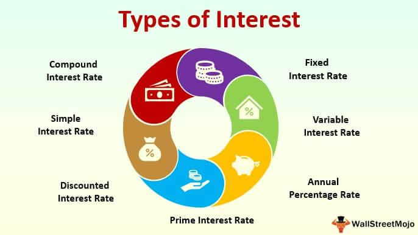

In today's fast-paced financial markets, understanding the intricate components of economics, finance, interest rates, and algorithmic trading is crucial for investors and traders. These elements, each a cornerstone of financial markets, interconnect and influence one another, jointly shaping the landscape of modern trading. Economics and finance provide the foundational framework for market operations, influencing investment decisions through various indicators, policies, and strategies. Interest rates, as tools used by central banks, exert significant influence over economic stability and inflation, prompting traders to adjust their strategies in response to rate fluctuations.

Algorithmic trading capitalizes on technology to enhance trading precision and efficiency, executing trades at speeds and frequencies unattainable by human traders. By employing sophisticated algorithms, traders can exploit market trends, arbitrage opportunities, and index fund rebalancing with remarkable accuracy. The symbiotic relationship between economic theories, interest rate dynamics, and technological advancements in trading strategies underscores the necessity for a comprehensive understanding of these components.



This article aims to provide a thorough exploration of these concepts, offering insights into how they directly affect trading strategies. Additionally, the role of technology in revolutionizing market operations is examined, highlighting its transformative impact on the future of trading. By the end of this article, readers will have a clearer understanding of how these aspects form the backbone of contemporary financial trading systems, equipping them with the knowledge to navigate the complexities of today’s markets.

## Table of Contents

## Economics and Finance: The Core Concepts

Economics and finance are foundational disciplines for comprehending market dynamics and developing investment strategies. They are interlinked components that guide market participants in making informed decisions. In economics, key indicators such as Gross Domestic Product (GDP), unemployment rates, inflation, and consumer confidence serve as metrics for assessing the health of an economy. These indicators can influence investor sentiment and, consequently, market performance.

Fiscal and monetary policies are pivotal tools that governments and central banks use to influence economic conditions. Fiscal policy involves government spending and taxation decisions, while monetary policy pertains to the regulation of the money supply and interest rates. An expansionary fiscal policy, characterized by increased government spending and lower taxes, can stimulate economic growth. Conversely, contractionary fiscal policies aim to curb inflation by reducing spending or increasing taxes.

Monetary policy is conducted by central banks and typically involves manipulating interest rates and engaging in open market operations. Lowering interest rates is often used to encourage borrowing and investment, boosting economic activity. Conversely, raising interest rates can help control inflation but may also slow down economic growth. The impact of these policies on financial markets is significant, as they can affect asset prices, exchange rates, and the overall financial environment.

Understanding the interactions between economic health, market conditions, and financial performance is crucial for developing robust trading strategies. For instance, a trader anticipating a rise in GDP and lower unemployment might conclude that consumer spending will increase, creating a favorable environment for consumer goods stocks. Conversely, high inflation rates might prompt a shift toward inflation-protected instruments like Treasury Inflation-Protected Securities (TIPS).

Financial markets are also influenced by supply and demand dynamics, which are directly affected by economic indicators and fiscal and monetary policies. Accurate interpretation of these economic signals allows traders and investors to better anticipate market trends and adjust their strategies accordingly. The synergy between economic analysis and financial market performance is essential for strategic decision-making, providing the analytical tools necessary to navigate the complex financial landscapes.

As financial markets become increasingly complex and globalized, the integration of robust economic and financial frameworks is indispensable. Leveraging economic indicators and policies, coupled with an understanding of their broader implications, can empower market participants to craft informed, adaptable strategies and maintain a competitive edge in an ever-evolving trading environment.

## Interest Rates and Their Impact on Trading

Interest rates are a fundamental economic lever used by central banks to influence economic stability and control inflation. These rates can have far-reaching effects on financial markets, influencing both investor behavior and market dynamics.

Several types of interest rates are recognized in the financial domain, with simple and compound interest being the most fundamental. Simple interest is calculated on the principal amount only, using the formula:

$$
\text{Simple Interest} = P \times r \times t
$$

where $P$ is the principal amount, $r$ is the annual interest rate, and $t$ is the time period in years. Compound interest, on the other hand, takes into account the interest on accumulated interest, calculated as:

$$
A = P \left(1 + \frac{r}{n}\right)^{nt}
$$

where $A$ is the amount of money accumulated after n years, including interest, $P$ is the principal amount, $r$ is the annual interest rate, $n$ is the number of times that interest is compounded per year, and $t$ is the time in years.

Interest rates set by central banks, such as the Federal Reserve in the United States or the European Central Bank in the Eurozone, influence various economic activities by altering the cost of borrowing and the return on savings. When central banks adjust interest rates, either by increasing them to curb inflation or decreasing them to stimulate economic growth, financial markets react accordingly. Lower interest rates tend to encourage borrowing and investing, as they reduce the cost of financing. Conversely, higher rates can lead to decreased spending and investment, as borrowing costs rise.

Market participants, particularly traders, closely monitor [interest rate](/wiki/interest-rate-trading-strategies) announcements because these changes often lead to significant shifts in market behavior. For example, if a central bank unexpectedly raises interest rates, the cost of borrowing increases, typically leading to a strengthening of the currency and a possible decline in stock prices. On the contrary, a decrease in interest rates might weaken the currency and boost equity markets.

Traders incorporate interest rate projections into their strategies to optimize their portfolios and mitigate risk. The anticipation or reaction to an interest rate adjustment can lead traders to rebalance their portfolios, opting for assets that might benefit from the new rate environment. For instance, traders might increase their holdings in financial stocks if interest rates rise, as banks can earn more from the interest on loans. Alternatively, they might favor consumer discretionary stocks when interest rates are low, expecting increased consumer spending due to cheaper credit.

The complexity and impact of interest rates on financial markets underscore their importance to traders, who must remain vigilant and adaptable to shifts in monetary policy to maintain a competitive edge in the evolving financial landscape.

## Algorithmic Trading: The Technological Edge

Algorithmic trading, or algo-trading, leverages sophisticated computer algorithms to execute trades at speeds and frequencies far beyond the capability of human traders. These algorithms are designed to follow specific instructions, including timing, price, and [volume](/wiki/volume-trading-strategy), enabling the automated trading of large quantities of stocks, commodities, or other financial instruments. One major strategy in [algorithmic trading](/wiki/algorithmic-trading) is trend-following, which involves buying and selling in response to market trends, identified through technical analysis. This strategy exploits short-term price signals to predict market movement, allowing traders to capitalize on emerging patterns.

Another prevalent strategy is [arbitrage](/wiki/arbitrage), which aims to profit from price discrepancies between different markets or instruments. For example, if a stock is priced differently on two exchanges, an algorithm can be programmed to buy the stock at the lower price and sell it at the higher price, capturing the difference as a risk-free gain. This type of arbitrage is highly dependent on execution speed, requiring the algorithm to act within milliseconds to secure profits before the market corrects the discrepancy.

Index fund rebalancing offers another strategic application. These algorithms help maintain the balance within a portfolio to reflect the composition of an index accurately. As market conditions change so do the weights of components in an index; algorithms automatically adjust the portfolio to reflect these changes, streamlining the process and minimizing tracking error.

The advantages of algorithmic trading are significant. Precision is enhanced as algorithms can make decisions based on predefined criteria, eliminating human error. Transaction costs are often reduced because algorithms usually execute high-volume trades at optimal times to achieve the best available prices. However, these benefits come with potential disadvantages. The heavy reliance on technology means that any malfunction or programming error can lead to substantial financial losses. Regulatory scrutiny is another concern, as the rapid and complex nature of algorithmic trading can create challenges for regulatory bodies tasked with ensuring fair market practices.

Despite these challenges, algorithmic trading has fundamentally transformed the landscape of financial markets, providing deeper insights into the future of trading. The reliance on algorithms to interpret vast amounts of market data in real-time has paved the way for more dynamic and adaptive trading strategies. As technology continues to advance, algorithmic trading will likely play an even more significant role in shaping market dynamics and trading behaviors.

## Integrating Economics, Interest Rates, and Algorithmic Trading

Integrating economic principles and interest rate data into algorithmic trading involves leveraging quantitative techniques to optimize trading strategies. Big data and [machine learning](/wiki/machine-learning) have become pivotal in this process, providing unprecedented insights into market dynamics.

### Big Data and Machine Learning in Algorithmic Trading

Big data encompasses vast amounts of economic and financial information, enabling traders to identify patterns and trends that were previously inaccessible. This includes data on GDP growth, unemployment rates, inflation, and other macroeconomic indicators that impact market movements. By feeding these data points into machine learning models, traders can develop predictive algorithms that anticipate market changes.

For instance, a machine learning algorithm can be trained using historical data on interest rate changes and their subsequent impact on stock prices. This involves the application of supervised learning techniques, where the algorithm learns from historical input-output pairs to predict future outcomes. Python, with its powerful libraries such as pandas for data manipulation and scikit-learn for machine learning, facilitates the development of such models. 

Here is a simple illustration of using Python for predictive modeling:

```python
import pandas as pd
from sklearn.model_selection import train_test_split
from sklearn.linear_model import LinearRegression

# Load historical data
data = pd.read_csv('interest_rate_data.csv')

# Features and target variable
X = data[['GDP_growth', 'inflation_rate', 'unemployment']]
y = data['stock_price_change']

# Split the data into training and testing sets
X_train, X_test, y_train, y_test = train_test_split(X, y, test_size=0.2, random_state=42)

# Train the model
model = LinearRegression()
model.fit(X_train, y_train)

# Predict future stock price changes
predictions = model.predict(X_test)
```

### Practical Examples and Success Stories

One notable example of integrating economics and algorithmic trading is the use of Automated Valuation Models (AVMs) by hedge funds. AVMs utilize economic indicators to predict market valuation changes, enabling funds to optimize their portfolios.

High-frequency trading firms also use real-time interest rate data to adjust their strategies instantly. These firms leverage algorithms that can react to economic announcements, such as central bank interest rate changes, within milliseconds, capitalizing on the immediate movements in currency and bond markets.

### Synergy Between Economics and Trading Technologies

The synergy between economic knowledge and trading technology is crucial for enhancing trading performance. Economic principles offer insights into market behaviors, while algorithmic strategies provide the tools to exploit these insights efficiently.

For instance, understanding interest rate elasticity—a measure of how sensitive the quantity demanded of an asset is to a change in interest rates—enables traders to adjust their algorithmic strategies accordingly. Traders can create algorithms that respond to changes in interest rates by reallocating assets between equities and bonds, depending on their elasticities.

Overall, the integration of economic principles with algorithmic trading strategies not only enables traders to make data-driven decisions but also fosters a more efficient and responsive trading environment. This integration continues to evolve with technological advancements, promising further enhancements in trading accuracy and performance.

## The Future of Trading: Challenges and Opportunities

As technology continues to advance, the trading landscape is confronted with both significant challenges and promising opportunities. One of the most formidable challenges is the evolving regulatory environment. With the increasing complexity of financial instruments and trading strategies, regulatory bodies worldwide are striving to ensure market stability and protect investors. The introduction of regulations such as the Markets in Financial Instruments Directive II (MiFID II) in Europe and the Dodd-Frank Act in the United States exemplify efforts to increase transparency and reduce systemic risk. For traders and investors, staying compliant requires continuous adaptation and investment in compliance technologies.

Artificial Intelligence (AI) is playing an increasingly pivotal role in transforming trading practices. The development of machine learning algorithms capable of analyzing vast amounts of data to identify trends and predict market movements has revolutionized trading strategies. These advancements enable traders to make data-driven decisions with greater precision and speed. However, the reliance on AI introduces challenges, including algorithmic risks and the need for rigorous testing and validation protocols to prevent unintended consequences in automated trading systems.

Opportunities for innovation in trading strategies and tools are abundant. The integration of blockchain technology, for instance, promises to enhance the security and efficiency of trading operations. Smart contracts can automate the execution of trades based on predefined conditions, reducing the need for intermediaries and potentially lowering transaction costs. Furthermore, the rise of decentralized finance (DeFi) platforms offers alternative avenues for trading and investment, presenting both opportunities and regulatory considerations.

Preparing for future market shifts and technological advancements necessitates proactive strategies. Traders and investors must remain informed about emerging technologies and regulatory changes to capitalize on new opportunities. Continuous learning and skill development, particularly in quantitative analysis and technology, will be essential for navigating the rapidly evolving trading environment. By embracing innovation and maintaining adaptability, market participants can position themselves to thrive amid future challenges and opportunities in the financial markets.

In conclusion, while the future of trading presents numerous challenges, it also offers a wealth of opportunities for those willing to innovate and adapt. By understanding regulatory and technological trends, market participants can leverage the advancements in AI, blockchain, and other emerging technologies to enhance their trading strategies, ultimately driving market efficiency and success in the financial industry.

## Conclusion

Economics, finance, interest rates, and algorithmic trading are integral to the dynamics of modern trading. These elements function in tandem to influence market behaviors, make sense of fluctuations, and guide investor decisions in today's complex financial landscape. Understanding the interplay between these factors is essential for any trader or investor aiming to stay competitive and make informed decisions.

Throughout this article, we have provided a comprehensive overview of how each component operates and impacts trading. Economics provides the foundation through its principles and indicators, which shape fiscal and monetary policies that are crucial for understanding market trends. Finance translates these economic concepts into actionable strategies that investors can use to optimize their portfolios.

Interest rates, a pivotal economic tool, notably affect both market stability and inflation, thereby guiding the strategic moves of traders who closely monitor central bank announcements to adjust their positions accordingly.

Algorithmic trading has become a cornerstone in the evolution of trading strategies, leveraging computational power to execute trades with speed and precision beyond human capability. This integration of technology not only enhances the efficiency of trades but also introduces new challenges such as dependence on technological systems and the need to navigate regulatory frameworks.

As technology progresses and the market evolves, remaining informed and flexible becomes a crucial strategy for thriving in financial markets. Successful navigation of future market shifts depends on embracing innovations such as big data analytics and machine learning to refine trading strategies and anticipate market movements.

In conclusion, the interplay between economics, finance, interest rates, and algorithmic trading is fundamental to understanding and thriving in modern financial markets. Adapting to changes and remaining informed will be key strategies for success as trading continues to progress and evolve.

## References & Further Reading

[1]: ["Interest Rate Policies: An Introduction"](https://www.wallstreetmojo.com/interest-rate-policy/) by Mark Wynne

[2]: ["Algorithmic Trading and DMA: An Introduction to Direct Access Trading Strategies"](https://www.amazon.com/Algorithmic-Trading-DMA-introduction-strategies/dp/0956399207) by Barry Johnson

[3]: ["Algorithmic and High-Frequency Trading"](https://assets.cambridge.org/97811070/91146/frontmatter/9781107091146_frontmatter.pdf) by Álvaro Cartea, Sebastian Jaimungal, and José Penalva

[4]: Taylor, J., & Williams, J. (2010). ["Simple and Robust Rules for Monetary Policy."](https://www.nber.org/system/files/working_papers/w15908/w15908.pdf) Journal of Economic Perspectives, 23(4), 147-166.

[5]: ["Interest Rate Models - Theory and Practice: With Smile, Inflation and Credit"](https://link.springer.com/book/10.1007/978-3-540-34604-3) by Damiano Brigo and Fabio Mercurio