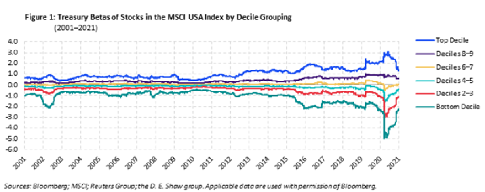

## Table of Contents

## What is an interest-sensitive stock?

An interest-sensitive stock is a type of stock that is affected a lot by changes in interest rates. When interest rates go up or down, the price of these stocks can change a lot. Companies that borrow a lot of money or have a lot of debt are often interest-sensitive. This is because when interest rates go up, it costs them more to pay back their loans, which can hurt their profits.

Some examples of interest-sensitive stocks are banks, real estate companies, and utility companies. Banks make money from the difference between the interest they pay on deposits and the interest they earn on loans. When interest rates change, this difference can get bigger or smaller, which affects their profits. Real estate companies often borrow money to buy properties, so higher interest rates can make their borrowing costs go up. Utility companies also often have a lot of debt, so they are sensitive to interest rate changes too.

## How do interest rates affect interest-sensitive stocks?

Interest rates can have a big impact on interest-sensitive stocks. These stocks belong to companies that are heavily affected by changes in interest rates. For example, when interest rates go up, it becomes more expensive for companies to borrow money. This can hurt their profits because they have to pay more to service their debt. Companies like banks, real estate firms, and utilities often fall into this category because they rely on borrowing to operate or grow their business.

On the flip side, when interest rates go down, it can be good for these companies. Lower interest rates mean cheaper borrowing costs, which can boost their profits. For banks, lower rates can narrow the gap between what they pay on deposits and what they earn on loans, but it can also encourage more borrowing and spending in the economy. Real estate companies can take advantage of lower rates to finance new projects more cheaply, and utility companies can manage their large debts more easily. So, interest-sensitive stocks can go up or down a lot depending on what interest rates are doing.

## Can you give examples of interest-sensitive stocks?

Interest-sensitive stocks are stocks that change a lot when interest rates go up or down. Banks are one type of interest-sensitive stock. When interest rates go up, banks can make more money from the difference between what they pay on deposits and what they earn on loans. But if rates go too high, it might stop people from borrowing, which can hurt the bank's profits. When rates go down, banks might make less money from that difference, but more people might want to borrow money, which can help their profits.

Real estate companies are another example. These companies often borrow money to buy properties. When interest rates go up, it costs them more to pay back their loans, which can hurt their profits. When rates go down, it's cheaper for them to borrow, and they can buy more properties or start new projects. This can make their stocks go up.

Utility companies are also interest-sensitive. They usually have a lot of debt because building things like power plants and pipelines is expensive. When interest rates go up, it costs them more to pay back their debt, which can hurt their profits. When rates go down, it's cheaper for them to borrow, which can help their profits and make their stocks go up.

## What sectors are most commonly associated with interest-sensitive stocks?

The sectors most commonly linked to interest-sensitive stocks are banking, real estate, and utilities. Banks are very sensitive to interest rates because they make money from the difference between what they pay on deposits and what they earn on loans. When interest rates go up, this difference can grow, but if rates get too high, fewer people might borrow money, which can hurt the bank's profits. When rates go down, the difference shrinks, but more people might want to borrow, which can help the bank's profits.

Real estate companies are also highly affected by interest rates. These companies often borrow money to buy properties. When interest rates rise, it costs them more to pay back their loans, which can reduce their profits. On the other hand, when rates fall, borrowing becomes cheaper, allowing real estate firms to finance new projects more easily and potentially increase their profits.

Utilities are another sector where interest rates play a big role. Utility companies usually have a lot of debt because building things like power plants and pipelines is expensive. Higher interest rates mean higher costs to service this debt, which can squeeze their profits. Conversely, when interest rates drop, it's cheaper for utilities to borrow, which can boost their profits and make their stocks more attractive to investors.

## How can an investor identify an interest-sensitive stock?

To find an interest-sensitive stock, an investor should look at companies that are affected a lot by changes in interest rates. These companies usually have a lot of debt or rely on borrowing money to grow their business. For example, banks make money from the difference between what they pay on deposits and what they earn on loans. So, if interest rates go up, banks might make more money, but if rates get too high, fewer people might want to borrow. Real estate companies often borrow money to buy properties, so if interest rates go up, it costs them more to pay back their loans. Utility companies also have a lot of debt because building things like power plants is expensive, so they are sensitive to [interest rate](/wiki/interest-rate-trading-strategies) changes too.

An investor can also look at a company's financial statements to see how much debt they have and how much they pay in interest. If a company has a lot of debt and the interest payments are a big part of their costs, their stock might be sensitive to interest rates. For example, if interest rates go up, the company's costs go up too, which can hurt their profits. On the other hand, if interest rates go down, it's cheaper for the company to borrow, which can help their profits. So, by looking at a company's debt and interest payments, an investor can figure out if the stock is interest-sensitive.

## What are the risks associated with investing in interest-sensitive stocks?

Investing in interest-sensitive stocks can be risky because these stocks go up and down a lot when interest rates change. If interest rates go up, companies with a lot of debt might have to pay more to borrow money, which can hurt their profits. This can make their stock prices go down. For example, banks might make less money if fewer people want to borrow because rates are too high. Real estate companies might have to pay more to finance their projects, and utility companies might struggle with higher costs to service their debt.

On the other hand, if interest rates go down, it can be good for these companies because borrowing becomes cheaper. This can help their profits and make their stock prices go up. But there's still risk because interest rates can be hard to predict. If an investor buys an interest-sensitive stock thinking rates will go down, but they go up instead, the stock might lose value. So, it's important for investors to keep an eye on what's happening with interest rates and understand how it might affect the companies they're investing in.

## How do interest-sensitive stocks perform during different economic cycles?

Interest-sensitive stocks go up and down a lot depending on what's happening in the economy. During a good economic time, when people are spending money and businesses are growing, interest rates might go up. This can be good for some interest-sensitive stocks like banks because they can make more money from the difference between what they pay on deposits and what they earn on loans. But it can be bad for companies like real estate and utilities because it costs them more to borrow money, which can hurt their profits.

During a bad economic time, when people are not spending much and businesses are struggling, interest rates might go down. This can be good for interest-sensitive stocks because it's cheaper for companies to borrow money. Banks might make less money from the difference between deposits and loans, but more people might want to borrow, which can help their profits. Real estate and utility companies can also benefit because lower rates mean they can manage their debt better and maybe start new projects. So, interest-sensitive stocks can do well or badly depending on the economic cycle and what's happening with interest rates.

## What strategies can be used to mitigate risks when investing in interest-sensitive stocks?

One way to lower the risks when investing in interest-sensitive stocks is to keep an eye on what's happening with interest rates. If you think interest rates are going to go up, you might want to be careful about buying stocks from companies that have a lot of debt, like real estate or utility companies. On the other hand, if you think rates are going to go down, these stocks might be a good choice because it will be cheaper for the companies to borrow money. You can also look at what the economy is doing. If the economy is doing well, interest rates might go up, which could be good for banks but bad for other interest-sensitive stocks.

Another strategy is to spread out your investments. Instead of putting all your money into one interest-sensitive stock, you can buy stocks from different companies in different sectors. This way, if one stock goes down because of interest rates, the others might not be affected as much. You can also mix interest-sensitive stocks with other types of investments, like stocks that don't change much when interest rates go up or down. This can help balance out the ups and downs of your investments and make them less risky overall.

## How do central bank policies impact interest-sensitive stocks?

Central bank policies can have a big effect on interest-sensitive stocks. When a central bank, like the Federal Reserve in the U.S., decides to change interest rates, it can make borrowing money more or less expensive for companies. If the central bank raises interest rates, it costs more for companies with a lot of debt, like banks, real estate firms, and utilities, to pay back their loans. This can hurt their profits and make their stock prices go down. On the other hand, if the central bank lowers interest rates, borrowing becomes cheaper, which can help these companies' profits and make their stock prices go up.

Investors need to keep an eye on what central banks are doing because their decisions can change the value of interest-sensitive stocks. For example, if a central bank says it will keep interest rates low for a long time, investors might buy more interest-sensitive stocks because they think the companies will do well with cheaper borrowing costs. But if the central bank starts talking about raising rates, investors might sell these stocks because they worry about the companies' profits going down. So, understanding central bank policies can help investors make better choices about when to buy or sell interest-sensitive stocks.

## What are the long-term trends affecting interest-sensitive stocks?

Long-term trends that affect interest-sensitive stocks include changes in interest rates, economic growth, and government policies. Over time, interest rates can go up and down based on what's happening in the economy. When the economy is doing well, interest rates might go up to keep inflation in check. This can be good for banks because they can make more money from the difference between what they pay on deposits and what they earn on loans. But it can be bad for real estate and utility companies because it costs them more to borrow money, which can hurt their profits. On the other hand, when the economy is not doing well, interest rates might go down to encourage people to spend and borrow more. This can help interest-sensitive stocks because it's cheaper for companies to borrow money.

Another long-term trend is how government policies, like those from central banks, affect interest rates. For example, if a central bank decides to keep interest rates low for a long time, it can be good for interest-sensitive stocks because companies can borrow money more cheaply. But if the central bank starts raising rates, it can be bad for these stocks because borrowing becomes more expensive. Investors need to keep an eye on these trends because they can change the value of interest-sensitive stocks over time. By understanding what's happening with interest rates and the economy, investors can make better choices about when to buy or sell these stocks.

## How can advanced financial models be used to predict the performance of interest-sensitive stocks?

Advanced financial models can help predict how interest-sensitive stocks will do by looking at different things that affect them, like interest rates, how the economy is doing, and what companies are saying about their future. These models use math and computer programs to figure out how changes in interest rates might change a company's profits and stock price. For example, if a model thinks interest rates will go up, it might predict that banks will do well because they can make more money from loans, but real estate and utility companies might struggle because it will cost them more to borrow money.

These models also look at past data to see how interest-sensitive stocks have reacted to changes in interest rates before. By studying this history, the models can make better guesses about what might happen in the future. But it's important to remember that these models are not perfect. They can't predict everything because the economy and interest rates can change in ways that are hard to guess. Still, using advanced financial models can give investors a better idea of what might happen to interest-sensitive stocks and help them make smarter choices about when to buy or sell.

## What are the global economic factors that influence interest-sensitive stocks?

Interest-sensitive stocks are affected by many things happening around the world. One big thing is what other countries' central banks are doing with their interest rates. If a big country like the United States raises its interest rates, it can make borrowing money more expensive everywhere. This can hurt companies in other countries that have a lot of debt, like banks, real estate, and utility companies, because they have to pay more to borrow money. On the other hand, if a country lowers its interest rates, it can make borrowing cheaper, which can help these companies' profits and make their stock prices go up.

Another global [factor](/wiki/factor-investing) is how well the world economy is doing. If many countries are growing and people are spending money, interest rates might go up to keep inflation in check. This can be good for banks because they can make more money from loans, but it can be bad for real estate and utility companies because it costs them more to borrow. If the world economy is not doing well, interest rates might go down to encourage spending and borrowing. This can help interest-sensitive stocks because it's cheaper for companies to borrow money. So, what's happening in the global economy can have a big impact on how interest-sensitive stocks do.

## What are Interest-Sensitive Stocks and How Can We Understand Them?

Interest-sensitive stocks are equities that are significantly influenced by changes in interest rates. These stocks often belong to companies within financial sectors, businesses with high levels of debt, and those known for paying substantial dividends. Understanding how interest rates affect these stocks is crucial for investors aiming to navigate market fluctuations effectively.

### Definition of Interest-Sensitive Stocks

Interest-sensitive stocks are typically found in industries where the financial performance is directly tied to interest rate movements. Key sectors include banking, insurance, real estate, and utilities. These stocks tend to react strongly to changes in monetary policy, as interest rates directly impact borrowing costs, the cost of capital, and ultimately, the profitability of these firms.

### Sensitivity of Different Business Sectors

1. **Financial Institutions:**
   Financial institutions, such as banks and insurance companies, are particularly sensitive to interest rates due to their business models. Banks earn a large portion of their income from the interest spread between deposits and loans. When interest rates rise, the cost of borrowing increases, potentially leading to wider interest margins and higher profits. Conversely, falling interest rates can compress margins and reduce earnings. Similarly, insurance companies rely on interest income from their investment portfolios to meet future liabilities; thus, rate changes can significantly alter their return on investments.

2. **Highly Leveraged Businesses:**
   Companies with substantial levels of debt, known as highly leveraged businesses, are sensitive to interest rates because they must manage interest payments on their borrowings. Higher interest rates increase the cost of debt servicing, thereby reducing net income and potentially affecting cash flows available for operations and investment. This can lead to diminished valuations and heightened financial risk.

3. **High Dividend-Paying Companies:**
   Companies that distribute a large portion of earnings as dividends often attract income-focused investors. These entities, commonly found in the utilities or telecommunications sectors, are interest-sensitive because rising rates can make their dividend yields less attractive compared to the returns on safer, interest-bearing securities like bonds. This shift in attractiveness can lead to lower demand for these stocks, impacting their price and valuation.

### Influence of Interest Rates on Stock Valuations

Interest rates have a profound effect on stock valuations and intrinsic value through the discount rate applied to future cash flows. According to the Dividend Discount Model (DDM), the value of a stock is the present value of its expected future dividends, calculated as:

$$
P = \frac{D_1}{r - g}
$$

Where:
- $P$ is the stock price,
- $D_1$ is the expected dividend in the next period,
- $r$ is the required rate of return (discount rate),
- $g$ is the growth rate of dividends.

An increase in interest rates typically raises the discount rate $r$, thereby reducing the present value $P$ of the stock's future cash flows, assuming $g$ remains constant. This causes the intrinsic value of interest-sensitive stocks to decline. Conversely, when interest rates fall, the lower discount rate can increase present value estimates, boosting stock valuations.

In summary, changes in interest rates influence interest-sensitive stocks by altering borrowing costs, investment income, and the comparative attractiveness of dividend yields. For investors, understanding these dynamics is critical in assessing risk and making informed investment decisions.

## References & Further Reading

[1]: Bergstra, J., Bardenet, R., Bengio, Y., & Kégl, B. (2011). ["Algorithms for Hyper-Parameter Optimization."](https://dl.acm.org/doi/10.5555/2986459.2986743) Advances in Neural Information Processing Systems 24.

[2]: ["Advances in Financial Machine Learning"](https://www.amazon.com/Advances-Financial-Machine-Learning-Marcos/dp/1119482089) by Marcos Lopez de Prado

[3]: ["Evidence-Based Technical Analysis: Applying the Scientific Method and Statistical Inference to Trading Signals"](https://www.amazon.com/Evidence-Based-Technical-Analysis-Scientific-Statistical/dp/0470008741) by David Aronson

[4]: ["Machine Learning for Algorithmic Trading"](https://github.com/stefan-jansen/machine-learning-for-trading) by Stefan Jansen

[5]: ["Quantitative Trading: How to Build Your Own Algorithmic Trading Business"](https://www.amazon.com/Quantitative-Trading-Build-Algorithmic-Business/dp/1119800064) by Ernest P. Chan