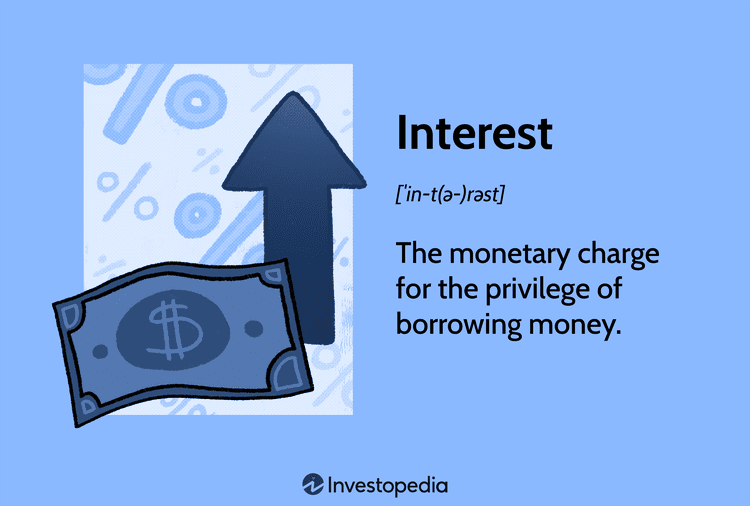

## Table of Contents

## What is interest in the context of borrowing?

Interest is the extra money you have to pay when you borrow money from someone or a bank. It's like a fee for using the money that belongs to someone else. When you take a loan, the lender will charge you interest because they want to be paid for letting you use their money. The interest is usually a percentage of the total amount you borrowed, and it gets added to your payments over time.

The amount of interest you pay can change based on different things. For example, how long you take to pay back the loan can affect the total interest. If you pay back the loan quickly, you might pay less interest. Also, the interest rate, which is the percentage charged on the loan, can be different depending on the lender and the type of loan. Sometimes, the interest rate can change over time, making your payments go up or down.

## How is interest calculated on loans?

Interest on loans is calculated using the interest rate, the amount of money borrowed, and the time it takes to pay back the loan. The interest rate is a percentage that tells you how much extra you have to pay for borrowing the money. If you borrow $100 with an interest rate of 10%, you will have to pay an extra $10 in interest. The amount of money you borrow is called the principal. The longer it takes to pay back the loan, the more interest you will have to pay.

There are two main ways to calculate interest: simple interest and compound interest. Simple interest is easy to understand. It's just the [interest rate](/wiki/interest-rate-trading-strategies) times the principal times the number of years you borrow the money. For example, if you borrow $1,000 for 2 years at a 5% interest rate, the simple interest would be $1,000 x 0.05 x 2 = $100. Compound interest is a bit more complicated. It's when the interest gets added to the principal, and then you pay interest on the new, bigger amount. This can make the amount of interest you pay grow faster over time.

## What are the different types of interest rates?

There are two main types of interest rates: fixed and variable. A fixed interest rate stays the same for the whole time you have the loan. This means your payments will always be the same, which can make it easier to plan your budget. For example, if you get a loan with a fixed interest rate of 5%, you will pay 5% interest every year until you pay off the loan. A variable interest rate can change over time. It might go up or down based on things like the economy or the decisions made by the bank. This means your payments could change, making it harder to plan your budget. For example, if you get a loan with a variable interest rate that starts at 4%, it might go up to 5% or even 6% later on.

Another type of interest rate is the annual percentage rate (APR). The APR is a way to show the total cost of borrowing money, including the interest rate and any other fees. It's usually shown as a yearly rate, which makes it easier to compare different loans. For example, if you see two loans with the same interest rate but one has a higher APR, it means the second loan has more fees, so it will cost you more in the end. Understanding the different types of interest rates can help you choose the best loan for your needs.

## What are borrowing fees and why are they charged?

Borrowing fees are extra charges that you have to pay when you take out a loan. They are different from the interest you pay on the loan. Borrowing fees can include things like loan origination fees, application fees, and processing fees. These fees are charged by the lender to cover the costs of giving you the loan. For example, they might need to pay for checking your credit history or for the time it takes to process your loan application.

Lenders charge borrowing fees because it costs them money to lend you money. They need to make sure they can cover these costs and still make a profit. The fees also help them manage the risk of lending money. If someone doesn't pay back their loan, the lender might lose money. By charging fees, lenders can make up for some of the money they might lose if people don't pay back their loans. This is why it's important to understand all the fees before you take out a loan, so you know exactly how much you will have to pay back.

## Can you explain the difference between fixed and variable interest rates?

A fixed interest rate stays the same for the entire time you have the loan. This means your monthly payments will always be the same, which can make it easier to plan your budget. For example, if you take out a loan with a fixed interest rate of 5%, you will pay 5% interest every year until you pay off the loan. Fixed rates are good if you want to know exactly how much you will have to pay each month.

A variable interest rate can change over time. It might go up or down based on things like the economy or decisions made by the bank. This means your monthly payments could change, making it harder to plan your budget. For example, if you take out a loan with a variable interest rate that starts at 4%, it might go up to 5% or even 6% later on. Variable rates can be good if you think interest rates might go down, but they can also be risky if rates go up.

## What is an origination fee and how does it affect a loan?

An origination fee is a charge that a lender might add to your loan. It's like a one-time fee for setting up the loan. When you take out a loan, the lender has to do things like check your credit and process your application. The origination fee helps the lender pay for these costs.

This fee can affect your loan because it gets added to the total amount you have to pay back. For example, if you borrow $10,000 and the origination fee is 1%, you will have to pay back $10,100 plus interest. The fee makes the loan more expensive, so it's important to know about it before you take out a loan.

## How do late payment fees work and how can they be avoided?

Late payment fees are extra charges you have to pay if you don't make your loan payment on time. When you take out a loan, you agree to pay it back in regular amounts by certain dates. If you miss a payment or pay it late, the lender might charge you a late fee. This fee is usually a set amount of money or a percentage of the payment you missed. Late fees help the lender cover the extra work they have to do to remind you to pay and to manage the risk of you not paying back the loan.

To avoid late payment fees, you need to make sure you pay your loan on time every month. One good way to do this is to set up automatic payments from your bank account. This way, the money gets sent to the lender without you having to remember to do it. Another way is to keep track of your due dates and set reminders on your phone or calendar. If you think you might miss a payment, talk to your lender as soon as possible. They might be able to work with you to change your payment plan or give you a little more time to pay.

## What are prepayment penalties and in what situations might they apply?

A prepayment penalty is a fee that some lenders charge if you pay off your loan early. When you take out a loan, you agree to pay it back over a certain amount of time. If you pay it off before that time is up, the lender might charge you a prepayment penalty. This fee is meant to make up for the interest the lender would have earned if you had kept paying the loan over the full term.

Prepayment penalties can apply in different situations, depending on the terms of your loan. For example, some loans might have a prepayment penalty if you pay off the entire loan within the first few years. Other loans might charge a penalty if you pay more than a certain amount of the loan early. It's important to read the loan agreement carefully to know if there's a prepayment penalty and how it might affect you if you decide to pay off your loan early.

## How do annual percentage rates (APR) differ from simple interest rates?

The annual percentage rate (APR) and the simple interest rate are two ways to show how much a loan will cost you. The simple interest rate is just the percentage of the money you borrow that you have to pay as interest each year. For example, if you borrow $1,000 at a 5% simple interest rate, you will pay $50 in interest every year. The APR, on the other hand, includes the simple interest rate plus any other fees you have to pay for the loan, like origination fees or processing fees. This means the APR gives you a better idea of the total cost of borrowing the money.

The APR is usually shown as a yearly rate, which makes it easier to compare different loans. If you see two loans with the same simple interest rate but one has a higher APR, it means the second loan has more fees, so it will cost you more in the end. Knowing the difference between the simple interest rate and the APR can help you understand the real cost of a loan and choose the best one for your needs.

## What role do compound interest and compounding frequency play in borrowing?

Compound interest is a way of calculating interest where the interest you owe gets added to the money you borrowed. This new, bigger amount is called the principal. Now, you have to pay interest on this bigger principal. This can make the interest you owe grow faster over time. For example, if you borrow $1,000 at a 5% interest rate that compounds yearly, after the first year, you will owe $1,050. The next year, you will pay 5% interest on $1,050, not just the original $1,000.

Compounding frequency is how often the interest gets added to the principal. It can happen yearly, monthly, daily, or even more often. The more often the interest compounds, the faster your debt can grow. For example, if the interest on your $1,000 loan compounds monthly instead of yearly, you will owe more interest at the end of the year. Understanding compound interest and how often it compounds can help you see how much a loan might really cost you and plan your payments better.

## How can understanding amortization schedules help in managing loan repayments?

An amortization schedule is a table that shows you how much of each loan payment goes toward paying off the interest and how much goes toward paying off the principal. It also shows you how much you still owe on the loan after each payment. By looking at the amortization schedule, you can see that at the beginning of the loan, most of your payment goes toward interest. As you keep making payments, more of your money goes toward the principal. This helps you understand how your loan balance goes down over time.

Understanding the amortization schedule can help you manage your loan repayments better. If you want to pay off your loan faster, you can see how making extra payments will reduce the total interest you pay and shorten the loan term. You can also use the schedule to plan your budget and make sure you can afford the payments. Knowing how much of your payment goes toward the principal and interest can help you feel more in control of your loan and make smarter financial decisions.

## What advanced strategies can be used to minimize the total cost of borrowing?

One advanced strategy to minimize the total cost of borrowing is to make extra payments on your loan. When you pay more than the minimum amount due each month, you can reduce the principal faster. This means less interest will be charged on the remaining balance, which can save you a lot of money over time. For example, if you have a loan with a long term, like a mortgage, making one extra payment a year can cut down the total interest you pay and shorten the loan term significantly. It's important to check with your lender to make sure there are no prepayment penalties before you start making extra payments.

Another strategy is to refinance your loan if interest rates drop. Refinancing means you take out a new loan with a lower interest rate to pay off your old loan. This can lower your monthly payments and the total interest you pay over the life of the loan. For example, if you have a loan with a high interest rate and you find a new loan with a lower rate, refinancing could save you money. However, you need to consider the costs of refinancing, like application fees or closing costs, to make sure it's worth it. By keeping an eye on interest rates and being ready to act when they go down, you can take advantage of better loan terms and save money.

## What are Interest Borrowing Fees and Financial Charges?

Interest borrowing fees, commonly known as interest, are the cost imposed on borrowers for using borrowed money. Typically expressed as a percentage of the principal amount, interest is a fundamental component influencing lending and borrowing activities within the financial markets. The calculation of simple interest can be expressed using the formula:

$$

\text{Simple Interest} = P \times r \times t 
$$

where $P$ is the principal amount, $r$ is the annual interest rate, and $t$ is the time in years.

Financial charges extend beyond interest fees, encompassing various costs such as service charges, transaction fees, late payment penalties, and loan origination fees. These charges are critical considerations in both consumer finance and corporate finance, impacting the overall cost of borrowing and capital allocation decisions.

Understanding the composition and implications of these costs is crucial for optimizing financial outcomes. For borrowers, recognizing the full spectrum of potential charges can aid in selecting the most cost-effective borrowing option, while lenders can use this understanding to design competitive products that align with market demands. The profound role of interest and related financial charges in the financial market is evident in their ability to affect loan decisions, influence consumer purchasing power, and even impact broader economic trends.

Interest rates significantly influence consumer behavior and business investment, acting as a lever for economic policy. Higher interest rates typically reduce consumer and business spending, while lower rates might stimulate borrowing and investment. By managing these financial charges effectively, organizations and individuals can achieve substantial long-term financial benefits. Strategies to mitigate these costs include negotiating better terms with lenders, opting for fixed rates to guard against rate hikes, and consolidating debts to reduce multiple fees.

Efficient financial management involves a comprehensive approach, acknowledging both explicit and implicit costs. By understanding the nuances of interest borrowing fees and encompassing financial charges, stakeholders in the financial markets can improve their financial standing, enhance investment returns, and maintain competitive advantages.

## References & Further Reading

[1]: Bergstra, J., Bardenet, R., Bengio, Y., & Kégl, B. (2011). ["Algorithms for Hyper-Parameter Optimization."](https://papers.nips.cc/paper/4443-algorithms-for-hyper-parameter-optimization) Advances in Neural Information Processing Systems 24.

[2]: ["Advances in Financial Machine Learning"](https://www.amazon.com/Advances-Financial-Machine-Learning-Marcos/dp/1119482089) by Marcos Lopez de Prado

[3]: ["Evidence-Based Technical Analysis: Applying the Scientific Method and Statistical Inference to Trading Signals"](https://www.amazon.com/Evidence-Based-Technical-Analysis-Scientific-Statistical/dp/0470008741) by David Aronson

[4]: ["Machine Learning for Algorithmic Trading"](https://github.com/stefan-jansen/machine-learning-for-trading) by Stefan Jansen

[5]: ["Quantitative Trading: How to Build Your Own Algorithmic Trading Business"](https://books.google.com/books/about/Quantitative_Trading.html?id=j70yEAAAQBAJ) by Ernest P. Chan