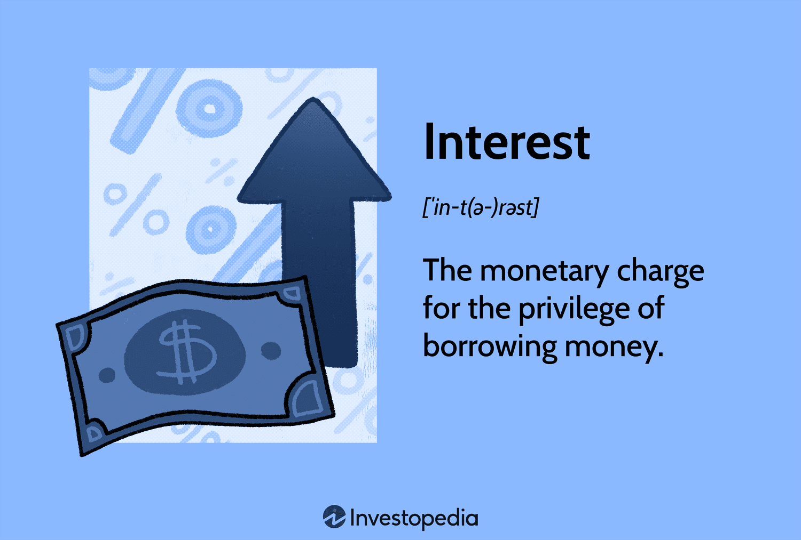

## Table of Contents

## What is interest in the context of finance?

Interest is the money you pay for borrowing money or the money you earn when you save or invest money. It's like a fee for using someone else's money or a reward for letting someone else use yours. When you take out a loan, like for a car or a house, you have to pay interest to the bank. On the other hand, if you put money in a savings account, the bank pays you interest for keeping your money with them.

The amount of interest can change based on different things, like how long you borrow the money for, how much you borrow, and the interest rate. The interest rate is a percentage that tells you how much interest you will pay or earn. For example, if you borrow $100 at a 5% interest rate for one year, you will pay $5 in interest. If you save $100 in an account with a 5% interest rate for one year, you will earn $5. Interest can be simple, which means it's calculated only on the original amount, or compound, which means it's calculated on the original amount plus any interest that has already been added.

## How does interest work on a basic savings account?

When you put money into a basic savings account, the bank pays you interest. This is like a small reward for letting the bank use your money. The interest is usually a small percentage of the money you have in the account. For example, if you have $100 in your account and the interest rate is 1%, you will earn $1 in interest over a year.

The bank adds this interest to your account regularly, often every month or every three months. This means your savings grow a little bit over time without you having to do anything. The more money you keep in your account, the more interest you will earn. It's a simple way to make your money work for you, even if it's just a little bit.

## What is the difference between simple interest and compound interest?

Simple interest is easy to understand. It's the interest you earn or pay on the original amount of money you put in or borrowed. For example, if you put $100 in a savings account with a 5% simple [interest rate](/wiki/interest-rate-trading-strategies) for one year, you will earn $5 at the end of the year. The interest stays the same every year because it's only calculated on the original $100. If you keep the money in the account for another year, you will earn another $5, and so on.

Compound interest is a bit different and can help your money grow faster. With compound interest, you earn interest not just on the original amount, but also on the interest that has been added to your account. Using the same example, if you put $100 in an account with a 5% compound interest rate, after the first year, you will have $105. In the second year, you will earn 5% interest on $105, which is $5.25, so your total will be $110.25. This means your money grows a bit more each year because the interest is calculated on a bigger amount each time.

## How is interest calculated on loans?

When you take out a loan, like for a car or a house, you have to pay interest on the money you borrowed. The interest is usually a percentage of the loan amount. For example, if you borrow $10,000 at a 5% interest rate for one year, you will pay $500 in interest for that year. The bank or lender adds this interest to your loan payments, so you pay back the original amount plus the interest. The interest rate can be fixed, which means it stays the same for the whole loan, or variable, which means it can change over time.

The way interest is calculated on loans can be simple or compound. With simple interest, you only pay interest on the original amount you borrowed. If you have a $10,000 loan at 5% simple interest, you pay $500 in interest each year. With compound interest, you pay interest on the original amount plus any interest that has already been added to your loan. This means the amount of interest you pay can grow over time. Most loans use compound interest, which is why it's important to pay off loans quickly if you can.

## What are the common types of interest rates?

There are two main types of interest rates you will come across: fixed and variable. A fixed interest rate stays the same for the whole time you have the loan or savings account. This means you know exactly how much interest you will pay or earn. It's good if you like things to be predictable and don't want surprises. For example, if you take out a loan with a 5% fixed interest rate, you will pay 5% interest every year until you pay off the loan.

A variable interest rate can change over time. It goes up or down based on things like the economy or what the bank decides. This means the interest you pay or earn can be different from one month to the next. It can be good if rates go down, because you pay less interest. But it can be bad if rates go up, because you pay more. For example, if you have a savings account with a variable interest rate, the interest you earn might be 2% one year and 3% the next.

There's also something called an introductory or teaser rate, which is a special rate that's lower than usual for a short time. Banks use this to attract new customers. For example, a credit card might offer 0% interest for the first year. After that, the rate goes up to the normal rate. It's important to know when the introductory rate ends so you're not surprised by a higher rate later.

## How do interest rates affect the economy?

Interest rates have a big impact on the economy. When the interest rates are low, it's cheaper for people and businesses to borrow money. This can make people feel more confident about spending and investing, which can help the economy grow. For example, if you can get a low interest rate on a car loan, you might decide to buy a new car. Or if a business can borrow money cheaply, they might decide to expand and hire more people. All of this spending and investing can help create jobs and make the economy stronger.

On the other hand, when interest rates are high, it's more expensive to borrow money. This can make people and businesses more cautious about spending and investing. They might decide to save their money instead of borrowing, which can slow down the economy. For example, if interest rates on mortgages are high, fewer people might buy houses. And if businesses have to pay more to borrow money, they might not want to take the risk of expanding. This can lead to less spending, fewer jobs, and a weaker economy. So, the central bank often changes interest rates to try to keep the economy balanced and growing at a healthy pace.

## What is the role of central banks in setting interest rates?

Central banks, like the Federal Reserve in the United States, are in charge of setting the basic interest rates for the whole country. They do this to help control the economy. When the economy is growing too fast and might cause inflation, the central bank might raise interest rates to make borrowing more expensive. This can slow down spending and help keep prices stable. On the other hand, if the economy is not doing well and needs a boost, the central bank might lower interest rates to make borrowing cheaper. This can encourage people and businesses to spend and invest more, which can help the economy grow.

The interest rate set by the central bank is called the benchmark or base rate. Other banks and financial institutions use this rate to decide their own interest rates for loans and savings accounts. So, when the central bank changes its rate, it affects all the other rates in the economy. For example, if the central bank lowers its rate, banks might lower their rates on loans and savings accounts too. This makes it cheaper for people to borrow money and can help the economy. But it's a delicate balance, and central banks have to be careful to make the right decisions to keep the economy healthy.

## How can understanding interest help in personal financial planning?

Understanding interest can really help you with your money planning. When you know how interest works, you can make smarter choices about saving and borrowing. For example, if you want to save money, you can look for savings accounts with good interest rates. This means your money will grow faster over time. If you need to borrow money, like for a car or a house, understanding interest helps you pick the best loan. You can choose a loan with a lower interest rate so you don't have to pay back as much money.

Also, knowing about simple and compound interest can make a big difference. With simple interest, you earn or pay interest only on the money you started with. But with compound interest, you earn or pay interest on the original amount plus any interest that's been added. This means your savings can grow faster, or your loan can get more expensive over time. By understanding these things, you can plan better for the future, save more money, and avoid paying too much in interest on loans.

## What are the strategies for managing interest on debt?

One way to manage interest on debt is to pay off your loans as fast as you can. When you pay more than the minimum amount each month, you lower the total interest you have to pay. For example, if you have a credit card with a high interest rate, try to pay it off quickly. This way, you won't have to pay as much interest over time. Another good idea is to look for loans with lower interest rates. If you can find a better rate, you might be able to save money by refinancing your debt.

Another strategy is to focus on the debts with the highest interest rates first. This is called the avalanche method. By paying off the most expensive debt first, you can save more money in the long run. For example, if you have a student loan at 5% and a credit card at 20%, you should try to pay off the credit card first. This way, you stop the high interest from adding up quickly. Also, it's a good idea to avoid taking on new debt while you're trying to pay off what you already owe. This helps you keep your interest costs down and get out of debt faster.

## How do interest rate swaps work in financial markets?

Interest rate swaps are like a deal between two people or companies where they agree to swap, or exchange, interest payments. Imagine you have a loan with a variable interest rate, but you want it to be fixed because it's easier to plan your payments. You can do an interest rate swap with someone who has a fixed-rate loan but wants a variable rate. In this swap, you agree to pay each other's interest. So, you end up paying the fixed rate to them, and they pay the variable rate to you. This way, you both get the kind of interest rate you want without changing your original loans.

These swaps are used a lot in big financial markets because they help companies manage their money better. For example, a company might use an interest rate swap to protect itself from changes in interest rates that could make their loan payments go up. By swapping to a fixed rate, they know exactly how much they will pay each month, which helps them plan their budget. Interest rate swaps can be complicated, but they're a useful tool for companies to manage the risks that come with borrowing money.

## What is the impact of interest rate changes on bond prices?

When interest rates go up, bond prices usually go down. This happens because new bonds that are issued will have higher interest rates, making them more attractive to investors. If you have an old bond with a lower interest rate, it becomes less valuable because people would rather buy the new bonds that pay more. So, to sell your old bond, you might have to lower its price. On the other hand, when interest rates go down, bond prices usually go up. This is because your old bond with a higher interest rate becomes more valuable since new bonds will have lower rates. People will be willing to pay more for your bond because it pays more interest than the new ones.

This relationship between interest rates and bond prices is important for investors to understand. If you think interest rates will go up, you might want to sell your bonds before their prices drop. If you think rates will go down, you might want to hold onto your bonds or buy more because their prices could go up. This is why people who invest in bonds pay close attention to what central banks are doing with interest rates. It helps them decide when to buy or sell bonds to make the most money.

## How do global interest rate differentials influence currency values?

When interest rates are different in different countries, it can change how much their currencies are worth. If a country has higher interest rates than another country, people might want to invest their money there to get a better return. This demand for the country's currency can make it stronger. For example, if the U.S. has higher interest rates than Japan, investors might move their money to the U.S. to earn more interest, which can make the U.S. dollar stronger compared to the Japanese yen.

But if a country's interest rates are lower than others, its currency might become weaker. When interest rates are low, people might take their money out of that country to invest it somewhere with higher rates. This can make the currency less valuable. For example, if Europe has lower interest rates than the U.S., people might move their money from Europe to the U.S., making the euro weaker compared to the dollar. So, the difference in interest rates between countries can cause their currencies to go up or down in value.

## What are the core principles of finance?

Finance is grounded in several fundamental principles that serve as a cornerstone for decision-making across business, personal, and governmental financial activities. At the heart of these principles are risk management, capital allocation, and return on investment.

### Risk Management
Risk management involves identifying, assessing, and prioritizing risks to minimize, monitor, and control the probability or impact of unforeseen events. Effective risk management is crucial for safeguarding assets and ensuring the sustainability of investments. It requires a balanced approach that weighs potential losses against expected gains. Various strategies are employed, including hedging, diversification, and insurance, each tailored to mitigate specific types of financial risk, such as market risk, credit risk, and operational risk. 

### Capital Allocation
Capital allocation entails the strategic deployment of financial resources to optimize returns. It is a pivotal decision-making process that influences a firm’s overall growth and profitability. Businesses must decide how to allocate their capital among various investment opportunities, typically guided by expected returns and the strategic alignment of options. By prioritizing investments with higher potential returns relative to risk, entities can advance their competitive position and financial health. 

### Return on Investment (ROI)
Return on investment (ROI) is a measure of the profitability of an investment, calculated by the formula:

$$
\text{ROI} = \left( \frac{\text{Net Profit}}{\text{Cost of Investment}} \right) \times 100
$$

ROI is a critical metric used to evaluate the efficiency of an investment or compare the efficiencies of several different investments. A higher ROI indicates a more profitable investment. Businesses, investors, and analysts rely on ROI calculations to make informed financial decisions and to assess the financial health of a project or asset.

### Time Value of Money (TVM)
The time value of money is an essential concept that posits money available today is worth more than the same amount in the future due to its [earning](/wiki/earning-announcement) potential. This principle is pivotal in financial decision-making processes, influencing everything from capital budgeting to loan amortization. Key formulas in TVM include the calculation of present and future values, often used for investment assessment and loan schedules:

$$
\text{PV} = \frac{\text{FV}}{(1 + r)^n}
$$

$$
\text{FV} = \text{PV} \times (1 + r)^n
$$

where $PV$ denotes present value, $FV$ is future value, $r$ stands for the interest rate, and $n$ represents the number of periods.

### The Balance of Risk and Reward
Balancing risk and reward is a core financial principle that involves choosing investments with an acceptable level of risk for the anticipated return. This balance is intricately tied to an individual or institution’s risk tolerance, guiding portfolio construction and investment selection. Understanding the risk-reward trade-off helps investors align their financial goals with appropriate risk levels, contributing to more strategic and informed decision-making.

### Diversification
Diversification is the strategy of spreading investments across a variety of assets to reduce exposure to any single asset or risk. By diversifying a portfolio, investors can mitigate risks associated with individual securities or markets. This principle leverages the notion that a properly diversified portfolio will, over time, yield more stable and predictable returns.

Understanding these core principles provides a robust foundation for applying financial models and strategies, particularly in [algorithmic trading](/wiki/algorithmic-trading) systems. As financial markets grow increasingly complex, mastery of these concepts becomes indispensable for effectively navigating and leveraging diverse market conditions.

## References & Further Reading

[1]: ["Monetary Policy: What Are Its Goals? How Does It Work?"](https://www.federalreserve.gov/monetarypolicy/monetary-policy-what-are-its-goals-how-does-it-work.htm) by the Federal Reserve Board

[2]: Hull, J. C. (2018). ["Options, Futures, and Other Derivatives"](https://www.semanticscholar.org/paper/Options%2C-Futures%2C-and-Other-Derivatives-Hull/89bdee500c8623864fc9eb7a471546aa713acc44) (10th Edition). Pearson.

[3]: Hasbrouck, J. (2007). ["Empirical Market Microstructure: The Institutions, Economics, and Mathematics of Markets"](https://link.springer.com/content/pdf/10.1007/s11408-007-0058-2.pdf) by Oxford University Press.

[4]: ["The Economics of Money, Banking, and Financial Markets"](https://www.pearsonhighered.com/assets/preface/0/1/3/4/0134855388.pdf) by Frederic S. Mishkin

[5]: Fama, E. F. (1970). ["Efficient Capital Markets: A Review of Theory and Empirical Work,"](https://www.jstor.org/stable/2325486?read-now=1&googleloggedin=true) Journal of Finance, 25(2), 383-417.

[6]: ["Algorithmic Trading and DMA: An Introduction to Direct Access Trading Strategies"](https://www.amazon.com/Algorithmic-Trading-DMA-introduction-strategies/dp/0956399207) by Barry Johnson