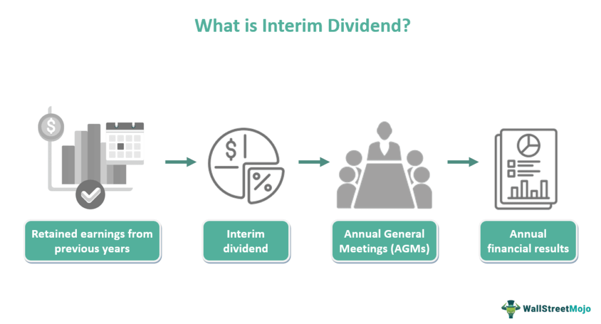

Dividends are a critical aspect of investing, forming a bridge between a company’s profitability and the tangible returns received by its shareholders. Essentially, dividends are a portion of a company's earnings distributed to shareholders, typically in the form of cash or additional stock. They serve as an income stream for investors, reflecting a company's financial health and its commitment to sharing profits with its owners. 

Dividends can be categorized into interim and final dividends. Interim dividends are paid before a company’s Annual General Meeting (AGM) and the annual financial statements are finalized. They serve as a preliminary distribution of profits partway through the fiscal year. Final dividends, on the other hand, are declared after the AGM and are based on the company’s full-year performance. This structure allows investors to benefit periodically as companies continue to generate profit throughout the year, making dividends a vital consideration for income-focused investors.



In recent years, algorithmic trading has gained prominence in modern investing. This type of trading leverages complex algorithms and computer programs to execute trading strategies at high speed, allowing for quick responses to market conditions. Algorithmic trading is particularly relevant as it can optimize investment strategies by analyzing vast amounts of financial data to identify profitable opportunities, including those related to dividend payouts. 

The aim of this article is to explore the interplay between dividends, particularly interim dividends, and algorithmic trading within the financial landscape. By examining how these elements interact, we can gain insights into effective investment strategies and portfolio optimization. The subsequent sections will detail the intricacies of dividends, the mechanics of algorithmic trading, and how investors can strategically integrate these components to enhance their investment performance and returns.

## Table of Contents

## Understanding Dividends

Dividends are a fundamental aspect of equity investment, serving as a distribution of a company's earnings to its shareholders. These payments are typically made in cash or additional stock and are usually declared by a company's Board of Directors. Dividends are particularly important for income-focused investors who rely on them as a steady source of income, often using the reference of the dividend yield as a key metric. The dividend yield is calculated using the formula:

$$
\text{Dividend Yield} = \frac{\text{Annual Dividends Per Share}}{\text{Price Per Share}}
$$

These yields provide insight into the return an investor can expect relative to the stock price, playing a crucial role in assessing a firm's financial health and performance.

Dividends can be categorized into interim and final dividends. Interim dividends are disbursed before a company's Annual General Meeting (AGM) and its final financial reporting. They are usually based on the company's profitable quarters during the fiscal year. Final dividends, on the other hand, are declared at the end of the fiscal year after all financial statements have been reviewed and approved.

The distinction between interim and final dividends is not only in their timing but also in how they reflect the company’s financial confidence. Interim dividends can indicate stable interim earnings and effective cash flow management, providing early financial benefits to shareholders. Final dividends, usually larger, signal the company’s overall annual performance and the Board's confidence in long-term profitability.

The process of dividend declaration is governed by the company’s Board of Directors, who evaluate the financial statements to determine the appropriate portion of earnings to be distributed among shareholders. The Board must act in accordance with the company's dividend policy and ensure that payouts do not undermine financial stability or future investment. Shareholder approval is often required at AGMs for the final dividends, ensuring transparency and adherence to corporate governance norms. The role of the Board is to balance the interests of shareholders who prefer dividends with those favoring capital retention for growth and expansion.

## Interim Dividends: Definition and Characteristics

Interim dividends are payments made by a company to its shareholders, declared and distributed prior to the annual general meeting (AGM) and the determination of the company’s final financial results for the year. Typically, interim dividends are issued on a quarterly or semi-annual basis depending on a company's financial performance and policies. The decision to pay an interim dividend is generally based on the financial performance of a company during the first half of a fiscal year. It serves as an indication of a company’s profitability and confidence in its ongoing fiscal health.

Different countries have varied practices regarding interim dividends. For instance, in the United Kingdom, it is common for companies to pay interim dividends mid-year and final dividends after the annual results. In Australia, interim dividends are often paid at the half-year mark. The frequency and consistency vary significantly in the United States, where some companies opt for regular quarterly interim payments, reflecting a consistent earnings pattern.

Interim dividends and final dividends differ primarily in timing and the basis for allocation. Interim dividends are declared before final financial statements are audited and may be based on unaudited financial results. In contrast, final dividends are declared post-fiscal year-end operations and rely on audited annual accounts. Furthermore, final dividends usually require shareholder approval at the AGM, enhancing their stability and reliability.

The companies that pay interim dividends often include large, established corporations with stable cash flows and predictable earnings. Examples include companies in sectors like utilities, pharmaceuticals, and consumer goods. For instance, British American Tobacco, a notable player in the consumer goods sector, consistently pays interim dividends, highlighting its steady cash flow and profitability to investors. The significance of interim dividends for investors lies in the regular income stream provided, which is especially appealing to income-focused investors. Additionally, interim dividends can signal financial health and positive performance expectations, influencing investment decisions and stock valuations.

## Dividend Eligibility and Calculation

Dividend eligibility is a key concept in income-focused investing. A shareholder becomes eligible to receive a dividend if they own the stocks by the so-called "record date." The record date is a crucial deadline set by the company, determining which shareholders are entitled to the declared dividend. To secure eligibility, investors must purchase shares before the ex-dividend date, which typically falls one business day before the record date due to the settlement period of trades.

The calculation of dividends depends on the net profits and dividend policy of the issuing company. For interim dividends, calculations are typically based on interim financial statements, which reflect the company's performance over a segment of the fiscal year. Generally, interim dividends are smaller as they are distributed based on partial-year results and therefore come with inherent uncertainties compared to final dividends, which are declared post the annual financial review.

A basic formula to calculate dividends is:

$$
\text{Dividend Per Share} = \frac{\text{Total Dividends Declared}}{\text{Number of Outstanding Shares}}
$$

where "Total Dividends Declared" is the total dividend amount the company intends to pay and "Number of Outstanding Shares" is the total shares held by shareholders.

Several factors influence dividend payout amounts and frequency:

1. **Profitability:** Companies with stable and substantial profits are likely to pay consistent dividends.
2. **Cash Flow:** Adequate cash flow is critical for regular dividend payouts without straining financial resources.
3. **Reinvestment Opportunities:** Firms with plentiful reinvestment potential may opt for lower dividend payouts to conserve capital.
4. **Debt Levels:** High leverage might restrict a company’s ability to distribute dividends frequently or in substantial amounts.

Let's consider an illustrative example. Assume Company XYZ declares a total interim dividend of $2 million. If XYZ has 1 million shares outstanding, the interim dividend per share would be:

$$
\text{Dividend Per Share} = \frac{2,000,000}{1,000,000} = 2 \text{ USD}
$$

This means each eligible shareholder receives $2 per share as an interim dividend.

These calculations and considerations are vital for investors aiming to effectively utilize dividends as part of their investment strategy, as they provide insights into a company's financial health and dividend-paying capability.

## Algorithmic Trading and Dividend Investments

Algorithmic trading involves using computer algorithms to automate the process of buying and selling securities based on pre-defined criteria. It is a pivotal innovation in financial markets, allowing traders to execute orders at speeds and frequencies that would be impossible for a human trader. By leveraging statistical models and mathematical computations, [algorithmic trading](/wiki/algorithmic-trading) aims to optimize trading performance and reduce transaction costs.

One significant application of algorithmic trading is in forecasting dividend payouts and optimizing returns for dividend-focused investments. Dividends, consistent cash flows from equity investments, are integral to income-focused portfolios. Algorithms can be trained to predict future dividend payouts based on historical data and a variety of financial metrics. These predictions allow investors to make informed decisions about which stocks are expected to deliver attractive dividends.

For instance, an algorithm might utilize financial ratios such as the dividend payout ratio, historical dividend growth rates, and earnings per share (EPS) into its model to predict future dividend announcements. This approach enables investors to position themselves strategically before dividend declaration dates, potentially capturing both price appreciations and dividend payments.

Python, a widely-used language in data analysis and [machine learning](/wiki/machine-learning), offers tools to create such predictive models. A simple dividend forecasting algorithm might utilize linear regression. Consider the following Python snippet as an illustration:

```python
import numpy as np
from sklearn.linear_model import LinearRegression

# Example historical data
years = np.array([1, 2, 3, 4, 5]).reshape(-1, 1)
dividends = np.array([1.2, 1.3, 1.4, 1.5, 1.6])

# Creating a linear regression model
model = LinearRegression()
model.fit(years, dividends)

# Predicting the dividend for year 6
predicted_dividend = model.predict(np.array([[6]]))
print(f"Predicted Dividend for Year 6: {predicted_dividend[0]}")
```

Case studies highlight sophisticated algorithmic trading strategies designed for dividends. For example, Renaissance Technologies, a [hedge fund](/wiki/hedge-fund-trading-strategies) well-known for its pioneering use of algorithmic trading, has implemented strategies that not only consider dividend yield but also integrate factors like market sentiment and macroeconomic indicators to maximize returns.

Algorithmic trading presents several advantages for dividend-focused investors:

1. **Speed and Efficiency**: Automated trading reduces the time between identifying an opportunity and executing a transaction, minimizing slippage and capturing favorable market conditions.

2. **Data-Driven Insights**: Algorithms can analyze vast datasets to uncover patterns and correlations that might be missed by human analysis, improving the accuracy of dividend forecasts.

3. **Risk Management**: By continuously monitoring market conditions and adjusting trades accordingly, algorithms help manage risks associated with dividend investments, especially during volatile periods.

4. **Strategy Diversification**: Algorithms can employ various trading strategies simultaneously, such as combining expected dividend payments with other market factors to enhance investment diversification.

Overall, the integration of algorithmic trading in dividend investing enhances decision-making processes and can significantly optimize portfolio returns.

## Benefits and Drawbacks of Interim Dividends

Interim dividends are payments made to shareholders by a company, typically distributed before the annual general meeting and declaration of final dividends. These dividends can offer several advantages to both companies and investors. For companies, interim dividends are a tool for managing cash flow, offering a method to distribute excess cash which might otherwise remain idle. This ability to strategically deploy cash can be beneficial in presenting a strong financial outlook, enhancing investor confidence, and potentially driving up the stock price.

For investors, especially those who are income-focused, interim dividends represent the opportunity for more frequent income streams. This can be particularly advantageous in terms of cash flow management for personal finances, allowing investors to plan and allocate their fiscal resources efficiently. Moreover, frequent payouts can serve as a tangible sign of a company’s ongoing profitability and financial health, providing reassurance to stakeholders regarding their investment.

However, interim dividends are not without risks. For companies, the habitual issuance of interim dividends can lead to financial strain, particularly if unexpected downturns in revenue occur. Repeated high payouts without corresponding earnings growth might deplete company reserves, limiting the firm’s ability to invest in productive projects or weather financial challenges. This situation can also pressure a company’s long-term strategic plans, potentially impacting sustainability and growth.

In contrast to final dividends, interim dividends may be perceived as less stable and predictable. Final dividends are generally decided after the fiscal year-end, taking a comprehensive assessment of the company’s performance. Consequently, they often represent a more holistic view of a company’s ability to remunerate its shareholders. Interim dividends, decided based on partial-year results, may reflect short-term profits and not the overall annual performance, leading to potential variability in payouts.

Comparatively, the predictability of final dividends can serve as a measure of assurance for investors, particularly those with longer investment horizons. They are typically based on the full-year results, thus providing a clearer indication of a company’s financial health and performance. Investors can regard these dividends as a more stable income stream, relying on annual results for a sweeping view of how their investments are faring.

In summary, while interim dividends offer beneficial cash flow advantages for both companies and investors, it is imperative to balance these benefits against the financial strain they might exert and the unpredictability they introduce compared to final dividends. Both forms of dividends play distinct roles and must be carefully considered within a company’s broader financial strategy and an investor’s income expectations.

## Tax Implications and Strategies for Dividend Income

Dividend income often attracts specific tax obligations, which can significantly impact an investor's net returns. In many countries, dividends are subject to taxation, and understanding these tax implications is essential for efficient financial planning.

### Overview of Tax Obligations on Dividends

Dividends, including interim dividends, are typically classified as ordinary income and taxed accordingly. However, the exact tax rate applied can vary based on several factors, including the investor's overall income, the type of dividend received, and the geographic location.

#### Differences in Tax Treatment Based on Geography and Dividend Type

The tax treatment of dividends can differ significantly between countries and even within different regions of the same country. For example:

- **United States**: Dividends are classified into two types—qualified and ordinary. Qualified dividends are taxed at the capital gains tax rate, which is generally lower than the rate for ordinary income. To be classified as qualified, dividends must be paid by a U.S. corporation or a qualified foreign corporation and meet specific holding period requirements.

- **United Kingdom**: Dividends benefit from a tax-free allowance, after which they are taxed in bands depending on the investor's income. The rates differ from those applied to standard income tax bands.

- **Australia**: Dividends often come with imputation credits, or franking credits, which represent the tax already paid by the company. Shareholders can use these credits to offset their tax liabilities.

- **Canada**: Eligible dividends receive preferential tax treatment through a gross-up and credit system, which aims to account for the taxation already paid at the corporate level.

#### Strategies for Tax Optimization

1. **Hold Dividends in Tax-Advantaged Accounts**: Utilizing tax-advantaged accounts like IRAs in the U.S. or ISAs in the U.K. can defer or eliminate tax on dividend income, depending on specific account rules and contribution limits.

2. **Leverage Dividend Reinvestment Plans (DRIPs)**: These plans allow dividends to be automatically reinvested in additional shares of the company. While dividends reinvested are still subject to taxation, they provide compounding benefits and can enhance investment growth over time.

3. **Consider Tax-Loss Harvesting**: During periods of market volatility, investors can offset taxable dividend income by selling securities at a loss, a strategy known as tax-loss harvesting.

4. **Holding Period Planning**: To qualify for lower tax rates on dividends (as with qualified dividends in the U.S.), investors should be mindful of holding period requirements, which generally necessitate holding the stock for more than 60 days around the ex-dividend date.

5. **Utilize International Tax Treaties**: For investors holding foreign stocks, tax treaties between countries can sometimes reduce the level of withholding tax on foreign dividends. Familiarity with these treaties and the necessary steps to benefit from them is crucial.

These strategies, when implemented effectively, can help investors minimize the tax burden on dividend income and maximize their overall financial returns. By considering geographic tax variations and employing tax-efficient strategies, investors can enhance their dividend investment outcomes.

## Maximizing Dividend Returns

Maximizing returns from dividend investments involves a strategic approach grounded in selecting the right stocks, leveraging investment tools, and diversifying one's portfolio. Here's how investors can achieve this:

### Best Practices for Selecting Dividend-Paying Stocks

Selecting the right dividend-paying stocks requires careful analysis of financial metrics and company fundamentals. Investors should consider the following factors:

1. **Dividend Yield**: This ratio indicates how much a company pays out in dividends relative to its stock price. It is calculated as:
$$
   \text{Dividend Yield} = \left( \frac{\text{Annual Dividends per Share}}{\text{Price per Share}} \right) \times 100

$$

   A higher dividend yield might indicate a lucrative investment, but it is essential to ensure the company can sustain these payments.

2. **Dividend Payout Ratio**: This ratio shows the proportion of earnings paid to shareholders in the form of dividends. It is calculated as:
$$
   \text{Dividend Payout Ratio} = \left( \frac{\text{Dividends per Share}}{\text{Earnings per Share}} \right) \times 100

$$

   A lower payout ratio suggests that the company retains more earnings for growth, but it should still be high enough to reward shareholders adequately.

3. **Company Growth and Stability**: Analyzing the company's financial health, historical dividend track record, and prospects for growth can indicate its ability to continue or increase dividend payments. Companies with strong cash flows and a history of stable or increasing dividends are generally reliable.

4. **Industry and Economic Considerations**: Sectoral stability is crucial, as industries like utilities often offer stable dividends irrespective of economic conditions. Economic trends can impact dividend sustainability.

### Role of Dividend Reinvestment Plans (DRIPs) in Enhancing Returns

Dividend Reinament Plans (DRIPs) allow investors to reinvest dividends received into additional shares of the company's stock, often without brokerage fees. This reinvestment can compound over time, increasing the potential for growth. DRIPs benefit investors by providing:

- **Compounding Growth**: By automatically reinvesting dividends, investors can leverage the power of compounding, as reinvested dividends generate their own dividends over time.

- **Cost Efficiency**: Many DRIPs are commission-free, making them a cost-effective way to accumulate more shares over time.

- **Ownership Increase**: Regular reinvestment increases the ownership stake over time, potentially leading to higher dividend receipts as the number of shares owned increases.

### Maintaining a Balanced Portfolio with a Mix of Growth and Income Investments

A balanced portfolio mitigates risks while optimizing returns. Investors should aim for diversification between dividend-paying and [growth stocks](/wiki/growth-stocks) to achieve stability and growth potential. Considerations for achieving this balance include:

- **Risk Tolerance Assessment**: Understanding one's risk appetite is crucial in determining the appropriate mix of stocks, combining stable, high-dividend payers with stocks that promise growth and capital appreciation.

- **Sector and Geographic Diversification**: Spreading investments across sectors and regions can reduce exposure to industry-specific and country-specific risks.

- **Review and Adjust Regularly**: Periodic portfolio reviews ensure alignment with financial goals and market conditions, allowing investors to make informed adjustments over time.

These strategies contribute to maximizing dividend returns, aligning with long-term financial goals, and ensuring resilience in varied market conditions. By meticulously selecting dividend-paying stocks, leveraging DRIPs, and maintaining a balanced investment portfolio, investors can significantly enhance their returns and financial stability.

## Conclusion

Dividends play an integral role in investment strategies, providing a steady income stream for investors and signaling the financial health of a company. Interim dividends, offered before the annual general meeting, allow companies to distribute profits more frequently, providing cash flow benefits to both the company and its investors. However, these dividends must be strategically managed to avoid impacting long-term business goals adversely.

Algorithmic trading has revolutionized how investors engage with the stock market, optimizing dividend-related investment decisions by employing complex mathematical models and statistical analysis. The ability of algorithms to process vast datasets quickly aids in forecasting dividend payouts and offers investors potential strategies to maximize returns. By integrating algorithmic trading with dividend investments, investors can enhance portfolio performance through improved timing and selection of dividend-paying stocks.

Combining dividend strategies with algorithmic insights offers a balanced approach to investment, providing both growth potential and income stability. Investors are encouraged to adopt a strategic framework that leverages these tools, focusing on informed decision-making and the potential advantages of technologies like algorithmic trading. By doing so, they can effectively blend growth objectives with income needs, achieving a diversified and resilient portfolio adapted to their financial goals.

## References & Further Reading

[1]: Rosenberg, B., & Guy, J. (1976). ["Prediction of Beta from Investment Fundamentals"](https://www.semanticscholar.org/paper/Prediction-of-Beta-from-Investment-Fundamentals%3A-Rosenberg.-Guy./bd682df7e1191924fc3655394be2223258f34e07). Financial Analysts Journal, 32(5), 60-61.

[2]: Marcos Lopez de Prado. (2018). ["Advances in Financial Machine Learning"](https://www.amazon.com/Advances-Financial-Machine-Learning-Marcos/dp/1119482089). Wiley.

[3]: Jansen, S. (2020). ["Machine Learning for Algorithmic Trading"](https://github.com/stefan-jansen/machine-learning-for-trading). Packt Publishing.

[4]: Chan, E. P. (2009). ["Quantitative Trading: How to Build Your Own Algorithmic Trading Business"](https://github.com/ftvision/quant_trading_echan_book). Wiley.

[5]: Chincarini, L. B., & Kim, D. (2006). ["Quantitative Equity Portfolio Management: An Active Approach to Portfolio Construction and Management"](https://archive.org/details/quantitativeequi0000chin_c9d6). McGraw-Hill.

[6]: Baker, H. K., & Powell, G. E. (2005). ["Understanding Financial Management: A Practical Guide"](https://books.google.com/books/about/Understanding_Financial_Management.html?id=qonVYvTyPPwC). Wiley.

[7]: Hull, J. C. (2018). ["Options, Futures, and Other Derivatives"](https://www.semanticscholar.org/paper/Options%2C-Futures%2C-and-Other-Derivatives-Hull/89bdee500c8623864fc9eb7a471546aa713acc44). Pearson.