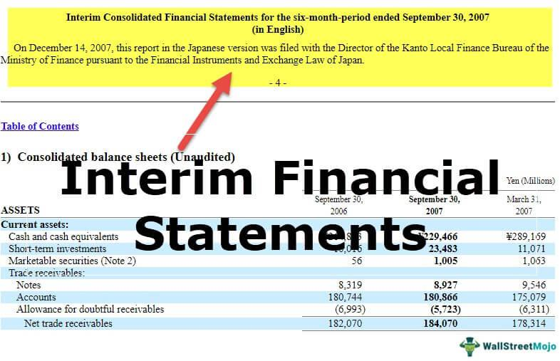

## Table of Contents

## What is an interim financial statement?

An interim financial statement is a report that shows a company's financial performance and position for a period shorter than a full year, like a quarter or a month. It helps people like investors, managers, and creditors understand how the company is doing financially between the annual reports. These statements include important parts like an income statement, a balance sheet, and a cash flow statement, but they are not as detailed as the yearly ones.

Interim financial statements are useful because they give a more current view of the company's financial health. This can help in making quick decisions or adjustments in business strategies. However, because they cover shorter periods, they might not show the full picture of the company's performance over a whole year. Also, some costs and revenues might be estimated or spread out differently in these reports, which can make them a bit less accurate than annual statements.

## Why are interim financial statements important?

Interim financial statements are important because they give a fresh look at how a company is doing financially before the year ends. They help people like investors, managers, and those who lend money to the company see if things are going well or if there are problems that need fixing. By looking at these reports, people can make smart choices about buying or selling stocks, or changing how the business works to do better.

These statements also help keep everyone informed and honest. They make sure that the company is sharing important financial news regularly, not just once a year. This can stop big surprises and help everyone trust the company more. Even though they might not be as detailed as the yearly reports, interim statements are still very useful for getting a quick check on the company's health and making decisions based on the latest information.

## How often are interim financial statements prepared?

Interim financial statements are usually prepared every three months, which means they cover a quarter of the year. This is common for many big companies because it gives a good balance between having up-to-date information and not having to do the reports too often. Some companies might choose to do them every month, especially if they need to keep a close eye on their finances or if they are in industries where things change quickly.

However, not all companies do interim financial statements the same way. Some might do them every six months instead of every three months. It depends on what the company needs and what the rules are where they operate. The main thing is that these statements help everyone see how the company is doing more often than just once a year.

## What are the key components of an interim financial statement?

An interim financial statement has three main parts: the income statement, the balance sheet, and the cash flow statement. The income statement shows how much money the company made and spent over the last few months. It tells you if the company made a profit or had a loss. The balance sheet is like a snapshot of what the company owns and owes at a specific time. It helps you see if the company has enough money and resources to cover its debts. The cash flow statement tracks the money coming in and going out, showing how well the company manages its cash.

These parts together give a good picture of the company's financial health during the time period covered by the interim statement. They help people understand if the company is doing well or if there are problems that need to be fixed. Even though these statements are not as detailed as the yearly ones, they are important because they give a more current view of the company's situation. This helps investors, managers, and others make decisions based on the latest information.

## How do interim financial statements differ from annual financial statements?

Interim financial statements and annual financial statements both show how a company is doing financially, but they cover different time periods. Interim statements are usually done every three months or so, while annual statements are done once a year. Because interim statements cover shorter times, they give a more up-to-date look at the company's health. This helps people like investors and managers make quick decisions. On the other hand, annual statements give a complete picture of the whole year, which can show trends and overall performance better.

Another difference is that interim statements are not as detailed as annual ones. Annual statements have to follow strict rules and include a lot of information, like notes and explanations about the numbers. Interim statements might use estimates or spread out some costs and revenues differently, so they might not be as accurate. But they are still very useful because they keep everyone informed more often. This can help catch problems early and keep trust in the company high.

## What are the common formats used for presenting interim financial statements?

Interim financial statements can be presented in different ways, but they usually follow a format that makes it easy for people to understand the company's financial health. One common format is the condensed format, where the statements are shorter and less detailed than the annual ones. This includes a condensed income statement, balance sheet, and cash flow statement. The idea is to give a quick look at the key numbers without all the extra details that are in the annual report.

Another format used is the full disclosure format, which is more detailed and closer to the annual statements. This might be used by companies that want to give a lot of information even in their interim reports. It includes more notes and explanations about the numbers, which can help people understand the financial situation better. Both formats aim to keep people informed, but they differ in how much detail they provide.

## What are the regulatory requirements for interim financial statements?

The rules for interim financial statements can be different depending on where the company is and what kind of business it does. In the United States, the Securities and Exchange Commission (SEC) says that public companies need to share their interim financial statements every three months. These statements have to follow the rules set by the Financial Accounting Standards Board (FASB), which means they need to be accurate and follow certain accounting standards. Other countries might have their own rules, like the International Financial Reporting Standards (IFRS) used in many places around the world.

Even though interim statements don't have to be as detailed as the yearly ones, they still need to give a true picture of the company's financial health. This means they should include important information like the income statement, balance sheet, and cash flow statement. Companies also need to explain any big changes or events that happened during the period. By following these rules, companies make sure that everyone who looks at their financial statements can trust the information and make good decisions based on it.

## How can interim financial statements be used for decision-making?

Interim financial statements give people like investors, managers, and lenders a quick look at how a company is doing before the year ends. They help these people make smart choices about the company. For example, if the interim statements show that the company is making more money than expected, investors might want to buy more of the company's stock because they think it will keep doing well. On the other hand, if the statements show the company is losing money, investors might sell their stock to avoid losing more money. Managers can also use these statements to see if they need to change their plans or fix problems quickly, like cutting costs or finding new ways to make money.

Lenders, like banks, use interim financial statements to decide if they should lend more money to the company or if they should ask for their money back. If the statements show the company is doing well and can pay back loans, lenders might be happy to give more money. But if the company is struggling, lenders might worry about getting their money back and might not want to lend more. Overall, interim financial statements are important because they give everyone a fresh and regular update on the company's financial health, helping them make decisions based on the latest information.

## What are the challenges in preparing interim financial statements?

Making interim financial statements can be hard for companies. One big challenge is that these statements have to be done more often than the yearly ones. This means the people who work on them have less time to get everything right. They have to work quickly to make sure the numbers are correct and follow all the rules. Sometimes, they might have to guess some numbers or use shortcuts because they don't have all the information yet. This can make the statements less accurate than the yearly ones.

Another challenge is that interim statements need to show the company's financial health in a way that makes sense even though they only cover part of the year. Some costs and earnings might happen at different times during the year, so the company has to figure out how to spread these out in a fair way. This can be tricky and might not always show the full picture of how the company is doing. Also, because these statements are shared more often, any mistakes or changes can be seen by everyone sooner, which can make people worry if they don't understand why the numbers changed.

## How do companies ensure the accuracy of interim financial statements?

Companies work hard to make sure their interim financial statements are correct. They do this by using good accounting practices and following the rules set by groups like the Financial Accounting Standards Board (FASB) or the International Financial Reporting Standards (IFRS). They also use special computer systems and software that help them keep track of their money and make fewer mistakes. Sometimes, they hire outside experts to check their work and make sure everything is right. This helps catch any errors before the statements are shared with everyone.

Another way companies make sure their interim statements are accurate is by training their employees well. They teach them how to handle money and follow the rules carefully. Companies also set up good ways to check their work, like having different people look at the numbers before they are final. This helps make sure that the statements give a true picture of how the company is doing, even though they are done more often than the yearly ones. By doing all these things, companies can keep their interim financial statements as accurate as possible.

## What role do auditors play in the review of interim financial statements?

Auditors help make sure that a company's interim financial statements are correct and follow the rules. They do this by checking the numbers and making sure everything is done the right way. Even though auditors might not do a full audit like they do for the yearly statements, they still look at the interim statements to see if there are any big problems or mistakes. This helps keep the statements honest and gives people like investors and lenders more trust in the company's financial reports.

Sometimes, auditors do a special kind of check called a review. This is less detailed than a full audit but still helps catch any big issues. During a review, auditors look at the company's records and talk to the people who made the statements. They might ask questions and look for anything that doesn't seem right. By doing this, auditors help make sure that the interim financial statements are as accurate as possible, even though they are done more often and with less time than the yearly ones.

## How can advanced analytics improve the insights gained from interim financial statements?

Advanced analytics can help make interim financial statements more useful by finding patterns and trends that might be hard to see just by looking at the numbers. These tools can look at a lot of data quickly and show what is really going on with the company's money. For example, they can spot if certain parts of the business are doing better or worse than others, or if there are any strange things happening that need to be checked out. By using advanced analytics, companies can understand their financial health better and make smarter decisions faster.

Also, advanced analytics can help predict what might happen next based on the data from interim statements. This can be really helpful for planning ahead. For instance, if the analytics show that the company might run out of cash soon, managers can take action to fix it before it becomes a big problem. By using these tools, everyone who looks at the interim statements, like investors and managers, can get a clearer picture of the company's situation and make better choices about what to do next.

## What is the understanding of Financial Reporting and Financial Statements?

Financial reporting is the structured process of disclosing a company’s financial information to stakeholders, offering a detailed overview of economic activities and firm-specific financial data. It primarily involves the creation and dissemination of financial statements, which include the balance sheet, income statement, cash flow statement, and statement of shareholders' equity. These documents work collectively to portray a company's financial health and performance.

1. **Balance Sheet**: The balance sheet presents a snapshot of a company's financial condition at a specific point in time. It details the organization’s assets, liabilities, and shareholders’ equity, following the fundamental accounting equation: 
$$
   \text{Assets} = \text{Liabilities} + \text{Shareholders' Equity}

$$
   This statement aids stakeholders in understanding what the company owns and owes, providing a clear picture of the organization's net worth.

2. **Income Statement**: Also known as the profit and loss statement, this document records the company's revenues, expenses, and profits or losses over a defined period. By illustrating operational efficiency and profitability, it helps stakeholders evaluate financial performance and assess future growth potential.

3. **Cash Flow Statement**: This statement highlights how changes in the balance sheet and income statement affect cash and cash equivalents, emphasizing the company’s liquidity and financial flexibility. It divides cash flow activities into operating, investing, and financing activities, providing insights into the cash the company generates and utilizes.

4. **Statement of Shareholders' Equity**: This statement details changes in the equity portion of the balance sheet over time, including new share issuance, dividend payments, and retained earnings. Understanding these changes is critical for stakeholders interested in the company’s shareholder value dynamics and capital structure.

Adhering to established accounting standards, such as the Generally Accepted Accounting Principles (GAAP) or the International Financial Reporting Standards (IFRS), is crucial in financial reporting. These frameworks ensure that the information presented is reliable, comparable, and transparent, allowing stakeholders, including investors, analysts, and regulators, to make informed decisions.

Accounting standards and regulatory requirements mandate accuracy and consistency in financial reporting. Compliance minimizes the risk of fraudulent activities and enhances credibility with stakeholders, fostering trust and facilitating investment decisions and company evaluations. Consequently, financial reporting becomes an indispensable tool for transparency and accountability in the business world, aligning stakeholder interests with the company’s financial disclosure practices.

## References & Further Reading

[1]: ["Financial Accounting: A Comprehensive Guide"](https://ijrah.com/index.php/ijrah/article/view/601) by Steven M. Bragg

[2]: ["International Financial Reporting Standards (IFRS)"](https://en.wikipedia.org/wiki/International_Financial_Reporting_Standards)

[3]: ["Generally Accepted Accounting Principles (GAAP)"](https://www.accounting.com/resources/gaap/)

[4]: Lopez de Prado, M. (2018). ["Advances in Financial Machine Learning"](https://www.amazon.com/Advances-Financial-Machine-Learning-Marcos/dp/1119482089). Wiley.

[5]: Chan, E. P. (2009). ["Quantitative Trading: How to Build Your Own Algorithmic Trading Business"](https://github.com/ftvision/quant_trading_echan_book). Wiley.

[6]: Jansen, S. (2020). ["Machine Learning for Algorithmic Trading"](https://github.com/stefan-jansen/machine-learning-for-trading). Packt Publishing.

[7]: ["Evidence-Based Technical Analysis: Applying the Scientific Method and Statistical Inference to Trading Signals"](https://www.amazon.com/Evidence-Based-Technical-Analysis-Scientific-Statistical/dp/0470008741) by David Aronson