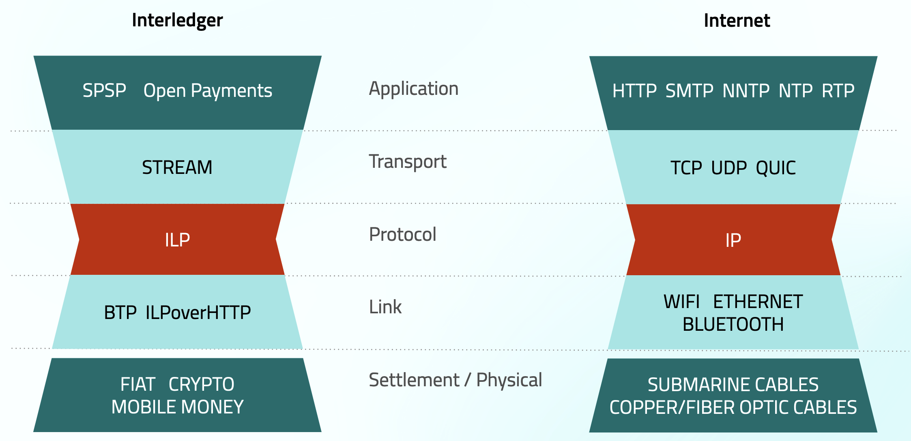

## Table of Contents

## What is the Interledger Protocol (ILP)?

The Interledger Protocol (ILP) is a way to send money across different payment systems and banks easily. It's like a universal translator for money transfers, helping different networks talk to each other. This means you can send money from one country to another, even if they use different banking systems, without needing to go through lots of steps.

ILP works by breaking down large payments into tiny pieces called packets. These packets travel through different networks until they reach their destination. If one path doesn't work, the packets can find another way, making the transfer more reliable. This method is similar to how data travels on the internet, making it faster and more efficient to move money around the world.

## How does the Interledger Protocol facilitate payments across different ledgers?

The Interledger Protocol (ILP) helps make payments across different ledgers by acting like a bridge between them. Imagine you want to send money from your bank in one country to a friend's bank in another country, but they use different systems. ILP steps in to connect these systems. It does this by breaking down your payment into tiny pieces called packets. These packets can travel through different networks, finding the best path to reach your friend's bank.

Once the packets arrive at the destination, they are put back together to complete the payment. If one path doesn't work, the packets can find another way, making the transfer more reliable. This is similar to how data travels on the internet. By using this method, ILP makes it easier and faster to send money across the world, even if the banks or payment systems don't normally talk to each other.

## What are the main components of the Interledger Protocol?

The Interledger Protocol has several key parts that work together to make payments across different ledgers possible. The first part is the Interledger Packet, which is like a small piece of the payment that can travel through different networks. These packets help the payment find the best path to its destination. Another important part is the Interledger Address, which is like a unique ID for each account, making sure the money goes to the right place.

Another component is the Connector, which acts like a middleman between different ledgers. Connectors help the packets move from one network to another, ensuring the payment can travel across different systems smoothly. Lastly, the Simple Payment Setup Protocol (SPSP) is used to set up the payment quickly and easily. It's like a simple agreement between the sender and the receiver on how the payment should happen, making the process straightforward and efficient.

## Can you explain the concept of connectors in ILP?

Connectors in the Interledger Protocol are like helpful middlemen that make sure money can move from one payment system to another. Imagine you want to send money from your bank to a friend's bank, but they use different systems. Connectors help by taking the small pieces of your payment, called packets, and passing them along to the next network until they reach your friend's bank. This way, even if the banks don't normally talk to each other, the connectors help them communicate.

Connectors are important because they help find the best path for the payment to travel. If one path doesn't work, the connectors can find another way, making sure the payment gets through. They work together to make the whole process smooth and reliable, kind of like how routers help data travel on the internet. This makes sending money across different ledgers easier and faster.

## How does ILP ensure security and trust in transactions?

ILP makes sure transactions are safe and trusted by using something called cryptographic signatures. This means that every piece of the payment, called a packet, has a special code that proves it's from the right person. If someone tries to change or steal the packet, the code won't match, and the payment won't go through. This way, everyone knows the money is coming from the right place and going to the right place.

Another way ILP keeps transactions secure is by using a system called escrow. When you send money, it's held in a special account until the whole payment is done. This means the money can't be taken until everyone agrees it's okay. Plus, ILP uses a thing called notaries, which are like trusted helpers that make sure everything is fair. They check that the payment is happening the way it should, adding another layer of trust to the whole process.

## What are the different types of ledgers that ILP can connect?

The Interledger Protocol can connect many different types of ledgers, making it easier to send money between them. It can work with traditional bank accounts, where you have money in a bank that you can move around. It also connects with digital wallets, which are like online accounts where you can keep and send money using your phone or computer. Plus, ILP can link up with cryptocurrencies, which are special kinds of money that exist only on the internet and use blockchain technology.

Another type of ledger that ILP can connect is called a central bank digital currency (CBDC). These are digital versions of a country's money, managed by the central bank. ILP can also work with private ledgers, which are used by companies or organizations to keep track of their own money or assets. By being able to connect all these different kinds of ledgers, ILP helps make sending money around the world easier and faster, no matter what system you're using.

## How does the Interledger Protocol handle currency conversion?

The Interledger Protocol handles currency conversion by using connectors that act like helpful middlemen. When you send money from one country to another, the connectors find the best way to change the money into the right currency. They do this by talking to different banks and money-changing services to get the best deal for you. This way, your payment can move smoothly from one currency to another without you having to do anything extra.

For example, if you want to send dollars to someone who needs euros, the connectors will break your payment into small pieces and send each piece through different paths. Some of these paths might involve changing the dollars into euros right away, while others might go through a few different currencies before reaching euros. The connectors keep track of all these changes and make sure the right amount of euros gets to your friend. This makes sending money across different countries and currencies easier and faster.

## What role do packets and streams play in ILP?

In the Interledger Protocol, packets are like small pieces of your payment that help it travel across different networks. When you want to send money, ILP breaks it into these tiny packets. Each packet can find its own way to the destination, kind of like how cars can take different routes to get to the same place. If one path doesn't work, the packets can find another way, making the payment more reliable. This is similar to how data travels on the internet, ensuring that your money gets where it needs to go, even if some parts of the journey are tricky.

Streams are another important part of ILP, and they work with packets to make payments smoother. A stream is like a continuous flow of packets, making sure the payment keeps moving without stopping. It's like sending a long message broken into smaller parts, where each part arrives in order to complete the whole message. Streams help keep the payment process steady and predictable, so you know your money is on its way and will arrive safely. Together, packets and streams make ILP a reliable way to send money across different ledgers and currencies.

## How does ILP manage to minimize transaction costs?

The Interledger Protocol helps keep transaction costs low by breaking payments into small pieces called packets. These packets can travel through different paths to find the cheapest way to move money from one place to another. If one path is too expensive, the packets can find a cheaper one. This means you don't have to pay high fees just because one bank or service charges a lot. By using many different networks and finding the best deals, ILP makes sending money cheaper for everyone.

Another way ILP keeps costs down is by using connectors, which are like helpful middlemen that help the packets move smoothly. Connectors can work together to find the best rates for changing money from one currency to another. This means you don't lose a lot of money when you send it across borders. Plus, ILP uses a system where payments are held in escrow until everything is done, which helps avoid extra fees if something goes wrong. By making the payment process efficient and finding the best paths and rates, ILP helps keep your costs as low as possible.

## What are some real-world applications of the Interledger Protocol?

The Interledger Protocol (ILP) is used in real life to help people send money across the world easily. Imagine you want to send money to a friend in another country. With ILP, you can do this quickly and cheaply, even if your friend uses a different bank or payment system. This is super helpful for people who work in different countries and need to send money home to their families. It's also great for businesses that buy and sell things all over the world, as it makes paying for things across borders easier and less expensive.

Another way ILP is used is in making online payments smoother. If you're buying something online and the website uses a different payment system than your bank, ILP can help make sure the payment goes through without any hiccups. This means you can shop online from anywhere in the world without worrying about whether your payment will work. Plus, ILP can be used to create new kinds of financial services, like micro-payments for small things like reading an article or watching a video, making it easier for creators to get paid for their work.

## How does ILP compare to other cross-border payment solutions?

The Interledger Protocol (ILP) is different from other cross-border payment solutions because it can connect many different types of payment systems, like banks, digital wallets, and cryptocurrencies. This makes it easier for people to send money across the world without worrying about which system the other person uses. Other solutions often only work within their own network, so if you want to send money to someone using a different system, you might have to pay extra fees or wait longer. ILP breaks payments into small pieces that can find the cheapest and fastest way to reach their destination, which helps keep costs low and speeds up the process.

Another way ILP stands out is by handling currency conversion smoothly. When you send money to another country, ILP uses connectors to find the best rates for changing your money into the right currency. This means you don't lose a lot of money in the conversion process. Other cross-border payment solutions might charge high fees for currency conversion, making it more expensive for you. By finding the best paths and rates, ILP makes sending money across borders easier, faster, and cheaper for everyone.

## What are the future prospects and potential developments for the Interledger Protocol?

The future looks bright for the Interledger Protocol (ILP). As more people and businesses start using it, ILP could become a big part of how we send money around the world. It's already helping people send money across different payment systems, and as more banks and services join in, it could make sending money even easier and cheaper. Imagine being able to pay for things in different countries without worrying about high fees or long wait times. ILP could make that a reality for everyone.

There are also exciting new ideas for what ILP could do in the future. For example, it could help with micro-payments, where you pay tiny amounts for things like reading an article or watching a video. This could be a new way for creators to get paid for their work. Plus, as more countries start using digital currencies, ILP could help connect these new systems with traditional banks, making it easier for everyone to use money in different forms. The possibilities are endless, and ILP could play a big role in making the world of money more connected and fair.

## References & Further Reading

[1]: Thomas, S., & Schwartz, E. (2016). ["A Protocol for Interledger Payments."](https://www.semanticscholar.org/paper/A-Protocol-for-Interledger-Payments-Thomas-Schwartz/ab98c62a7efdc5362c7f36589680597a93f3111f) IEEE Communications Magazine.

[2]: Antonopoulos, A. M., & Wood, G. (2019). [*Mastering Ethereum: Building Smart Contracts and DApps.*](https://books.google.com/books/about/Mastering_Ethereum.html?id=nJJ5DwAAQBAJ) O'Reilly Media.

[3]: Werbach, K. & Cornell, N. (2017). ["Contracts Ex Machina."](https://papers.ssrn.com/sol3/papers.cfm?abstract_id=2936294) Duke Law Journal.

[4]: Narayanan, A., Bonneau, J., Felten, E., Miller, A., & Goldfeder, S. (2016). [*Bitcoin and Cryptocurrency Technologies.*](https://press.princeton.edu/books/hardcover/9780691171692/bitcoin-and-cryptocurrency-technologies) Princeton University Press.

[5]: Buterin, V., et al. (2013). ["Ethereum White Paper."](https://ethereum.org/content/whitepaper/whitepaper-pdf/Ethereum_Whitepaper_-_Buterin_2014.pdf) Ethereum Foundation.

[6]: Mougayar, W. (2016). [*The Business Blockchain: Promise, Practice, and Application of the Next Internet Technology.*](https://books.google.com/books/about/The_Business_Blockchain.html?id=CEsPDAAAQBAJ) Wiley.

[7]: Narula, N., Vasquez, S., & Warner, S. (2018). ["ZK Ledger: Privacy-Preserving Auditing for Distributed Ledgers."](https://www.usenix.org/system/files/conference/nsdi18/nsdi18-narula.pdf) 25th Annual Network and Distributed System Security Symposium (NDSS).