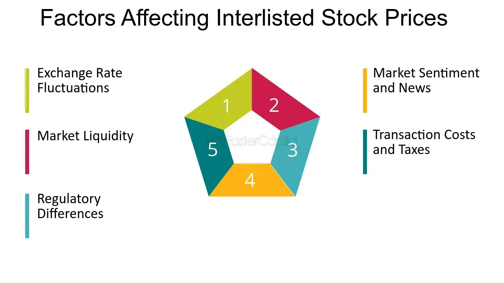

## Table of Contents

## What is an interlisted stock?

An interlisted stock is a stock that is listed on more than one stock exchange. This means that investors can buy and sell the stock on different exchanges around the world. For example, a company might have its stock listed on both the New York Stock Exchange and the Toronto Stock Exchange. This can make it easier for investors from different countries to trade the stock.

Interlisting can benefit companies by increasing their visibility and attracting more investors. It can also help them raise more capital because they can reach a larger pool of potential shareholders. However, it can also be more complex and costly for the company to manage listings on multiple exchanges. For investors, interlisted stocks offer more flexibility and opportunities to trade, but they need to be aware of differences in trading rules and costs between exchanges.

## How does interlisting benefit a company?

Interlisting benefits a company by making it more visible to investors around the world. When a company's stock is listed on multiple stock exchanges, more people can see and buy the stock. This can attract more investors from different countries, which can help the company raise more money. Having a larger pool of potential shareholders means the company can grow and expand more easily.

However, interlisting also has some challenges. It can be more complicated and expensive for a company to manage listings on different exchanges. The company needs to follow the rules and regulations of each exchange, which can take more time and money. Despite these challenges, many companies find that the benefits of interlisting, like reaching more investors and raising more capital, make it worthwhile.

## What are the common exchanges where stocks are interlisted?

Stocks are often interlisted on major stock exchanges around the world. Some common exchanges where you can find interlisted stocks include the New York Stock Exchange (NYSE) and the NASDAQ in the United States, the Toronto Stock Exchange (TSX) in Canada, and the London Stock Exchange (LSE) in the United Kingdom. These exchanges are popular because they are well-known and have many investors.

In addition to these, stocks might also be interlisted on the Australian Securities Exchange (ASX), the Hong Kong Stock Exchange (HKEX), and the Frankfurt Stock Exchange in Germany. Companies choose these exchanges to reach investors in different parts of the world. By listing on multiple exchanges, a company can attract more investors and raise more money to grow their business.

## What are the requirements for a stock to be interlisted?

To get a stock interlisted, a company needs to meet the rules of each exchange where they want to list their stock. These rules can be different for each exchange. For example, the New York Stock Exchange might have different rules than the Toronto Stock Exchange. A company usually needs to have a certain amount of money and a certain number of shareholders. They also need to follow the laws and regulations of the countries where the exchanges are located.

It can be a lot of work to get a stock interlisted. The company needs to prepare a lot of documents and go through a process that can take months. They might need to hire people who know the rules of each exchange to help them. Once the stock is interlisted, the company needs to keep following the rules of all the exchanges where their stock is listed. This can be hard, but it can also help the company reach more investors and grow their business.

## How does interlisting affect stock liquidity?

Interlisting can make a stock more liquid. When a stock is listed on more than one exchange, more people can buy and sell it. This means there are more buyers and sellers, which can make it easier to trade the stock. If more people want to trade the stock, it can be easier to find someone to buy or sell it quickly. This is good for investors because they can get in and out of their investments faster.

However, interlisting can also make things more complicated. Different exchanges might have different rules and trading hours. This can sometimes make it harder for investors to trade the stock smoothly across all exchanges. But overall, having a stock listed on multiple exchanges usually helps increase its liquidity because it reaches more investors around the world.

## What are the risks associated with investing in interlisted stocks?

Investing in interlisted stocks can be a bit risky. One big risk is the difference in rules and costs between exchanges. When a stock is listed on more than one exchange, each exchange might have its own rules about how you can buy and sell the stock. This can make things confusing and might cost you more money. Also, the price of the stock might be different on different exchanges, which can be tricky if you're trying to buy or sell at the best price.

Another risk is the time difference between countries. If you're trading a stock that's listed in another country, the market might be closed when you want to trade. This can make it harder to buy or sell the stock when you need to. Plus, there's always the chance that something big happens in one country that affects the stock price, but you might not find out until the other market opens. So, while interlisted stocks can give you more chances to invest, they also come with some extra risks you need to think about.

## How do interlisted stocks impact a company's visibility and investor base?

Interlisted stocks make a company more visible because they are listed on more than one stock exchange. When a company's stock is on different exchanges, more people around the world can see it. This means more people might want to buy the stock. It's like putting up more signs for your business in different places. The more places you put signs, the more people can see them and come to your business.

Having interlisted stocks also helps a company reach a bigger investor base. When a company lists its stock on exchanges in different countries, it can attract investors from those places. This means the company can get money from people all over the world. It's like having customers from many different countries instead of just one. This can help the company grow faster because they have more people interested in buying their stock.

## What are the differences in trading hours for interlisted stocks across different exchanges?

When a stock is listed on more than one exchange, it can be traded at different times in different countries. Each exchange has its own trading hours, which are based on the time zone of the country where the exchange is located. For example, the New York Stock Exchange (NYSE) is open from 9:30 AM to 4:00 PM Eastern Time. If the same stock is also listed on the Toronto Stock Exchange (TSX), which is open from 9:30 AM to 4:00 PM Eastern Time, you can trade the stock on both exchanges during those hours. But if the stock is also listed on the Tokyo Stock Exchange, which is open from 9:00 AM to 3:00 PM Japan Standard Time, the trading hours will be different because of the time difference.

These different trading hours can make things a bit tricky for investors. If you want to buy or sell a stock that is listed on exchanges in different time zones, you might find that one exchange is closed when you want to trade. For example, if you're in New York and want to trade a stock that's also listed in Tokyo, you might have to wait until the Tokyo market opens, which could be the middle of the night for you. This can make it harder to trade the stock quickly, but it also means you have more chances to trade the stock at different times of the day.

## How do currency fluctuations impact the valuation of interlisted stocks?

When a stock is listed on exchanges in different countries, it can be bought and sold in different currencies. This means that the price of the stock can change because of currency fluctuations. For example, if you are in the United States and you want to buy a stock that is listed in Canada, you need to convert your U.S. dollars into Canadian dollars. If the Canadian dollar gets stronger compared to the U.S. dollar, it will cost you more U.S. dollars to buy the same amount of stock. This can make the stock seem more expensive to you, even if the stock's price in Canadian dollars hasn't changed.

On the other hand, if the Canadian dollar gets weaker compared to the U.S. dollar, it will cost you fewer U.S. dollars to buy the same amount of stock. This can make the stock seem cheaper to you, even if the stock's price in Canadian dollars stays the same. These changes in currency values can affect how investors see the value of the stock. It's important for investors to keep an eye on currency exchange rates when they are trading interlisted stocks because these rates can impact their investments.

## What regulatory considerations must be taken into account for interlisted stocks?

When a company wants to list its stock on more than one exchange, it has to follow the rules of each exchange. Each country has its own laws and regulations that companies must follow. For example, the rules in the United States might be different from the rules in Canada or the United Kingdom. The company needs to make sure it follows all these rules to keep its stock listed on all the exchanges. This can be hard because the rules might be different for things like how much information the company has to share with investors, how it reports its money, and how it treats its shareholders.

Also, the company needs to keep up with changes in these rules. Sometimes, the rules can change, and the company has to make sure it still follows them. This can take a lot of time and money. The company might need to hire people who know the rules of each exchange to help them. But if the company can follow all the rules, it can reach more investors and raise more money. This can help the company grow and do well in the long run.

## How do arbitrage opportunities arise with interlisted stocks?

Arbitrage opportunities with interlisted stocks happen because the same stock can be listed on different exchanges around the world. Sometimes, the price of the stock can be a little different on each exchange. If you see that the stock is cheaper on one exchange and more expensive on another, you can buy it where it's cheap and sell it where it's expensive. This way, you can make a small profit from the difference in prices.

But, you need to be quick because these price differences usually don't last long. Other people are also looking for these chances to make money, so they will buy and sell the stock too. This can make the prices on the different exchanges go back to being the same. Also, you need to think about the costs of buying and selling the stock, like fees and the time it takes to move money between different currencies. If these costs are too high, you might not make any money from the arbitrage opportunity.

## What advanced trading strategies can be employed with interlisted stocks?

One advanced trading strategy with interlisted stocks is called pairs trading. This is when you find two stocks that are similar and usually move together in price. If one stock is listed on different exchanges and its price on one exchange goes up more than the other, you can buy the cheaper one and sell the more expensive one. You're betting that the prices will come back together, and you can make money from the difference. This strategy can be good because it doesn't matter if the market goes up or down, as long as the two stocks move back to being similar in price.

Another strategy is called statistical arbitrage. This is a bit more complicated and uses math to find small differences in the prices of interlisted stocks. Traders use computers to look at a lot of data and find these small differences quickly. They buy and sell the stocks very fast to make small profits from these differences. This strategy needs a lot of technology and quick thinking, but it can be a way to make money from the tiny changes in stock prices that happen all the time.

A third strategy is to use interlisted stocks for hedging. If you own a stock that's listed on one exchange, you can buy or sell the same stock on another exchange to protect yourself from big changes in price. For example, if you think the price might go down on one exchange, you can sell the stock on another exchange where the price might be different. This can help you balance out any losses you might have. Hedging can be a good way to manage risk when you're investing in interlisted stocks.

## What is the Role of Algorithmic Trading?

Algorithmic trading utilizes computer algorithms to automate trading strategies, impacting the dynamics of dual and interlisted stocks significantly. It leverages the speed and efficiency of computers to execute trades at a macro-scale, often taking advantage of minute price discrepancies between different exchanges. Such discrepancies can occur due to the time lag in information processing or differences in regional economic data releases, which can be further exploited by these advanced algorithms.

A primary advantage of [algorithmic trading](/wiki/algorithmic-trading) is its ability to engage in [arbitrage](/wiki/arbitrage), a strategy where price differences for the same asset on various exchanges are exploited for profit. For instance, consider a stock listed on both the New York Stock Exchange (NYSE) and the London Stock Exchange (LSE). If there is a slight price variation between these two markets, an algorithm can automatically purchase shares on the less expensive exchange and sell them on the more costly one, capitalizing on the discrepancy.

The core mathematical model for such a scenario can be represented as:

$$
\text{Profit} = (P_{\text{sell}} - P_{\text{buy}}) \times Q - C_{\text{transaction}}
$$

Where:
- $P_{\text{sell}}$ is the selling price of the stock.
- $P_{\text{buy}}$ is the buying price of the stock.
- $Q$ is the quantity of shares traded.
- $C_{\text{transaction}}$ is the total transaction cost incurred.

This model underscores the importance of maintaining minimal transaction costs to ensure profitability, especially when dealing with large quantities.

Algorithmic trading also supports liquidity—a critical aspect of dual and interlisted stocks. By executing numerous buy and sell orders within seconds, these algorithms significantly contribute to market liquidity, ensuring that buyers and sellers can find matches swiftly. This is particularly beneficial in multi-listed environments where companies are listed on several exchanges, facilitating more stable pricing as the constant flow of trades aids in price discovery.

Moreover, algorithmic trading aids in reducing the bid-ask spread, the difference between the prices buyers are willing to pay and what sellers are asking. A narrower bid-ask spread is typically associated with a more liquid market, leading to more favorable trading conditions for investors.

Python, a prominent programming language in this field, offers libraries like Pandas, NumPy, and scikit-learn that are frequently used in developing and testing these algorithms. Here's a simple Python snippet illustrating how one might set up a basic arbitrage checker between two exchanges:

```python
def check_arbitrage(px_nyse, px_lse, transaction_cost):
    if px_nyse < px_lse:
        profit = (px_lse - px_nyse) - transaction_cost
        if profit > 0:
            return "Buy on NYSE, sell on LSE"
    elif px_lse < px_nyse:
        profit = (px_nyse - px_lse) - transaction_cost
        if profit > 0:
            return "Buy on LSE, sell on NYSE"
    return "No arbitrage opportunity"

nyse_price = 100  # Hypothetical price on NYSE
lse_price = 102   # Hypothetical price on LSE
transaction_fee = 1  # Hypothetical transaction cost

result = check_arbitrage(nyse_price, lse_price, transaction_fee)
print(result)
```

While algorithmic trading enhances market efficiency, it may also pose risks such as market manipulation and increased volatility, which necessitates stringent regulatory oversight. However, when effectively managed, algorithmic trading remains an indispensable tool in navigating the complex landscape of multi-listed stocks, offering improved liquidity and more resilient pricing frameworks.

## References & Further Reading

[1]: Tirole, J. (2006). ["The Theory of Corporate Finance."](https://press.princeton.edu/books/hardcover/9780691125565/the-theory-of-corporate-finance) Princeton University Press.

[2]: Gagnon, L., & Karolyi, G. A. (2004). ["Multi-Market Trading and Liquidity: Theory and Evidence."](https://www.jstor.org/stable/4622332) Journal of Finance, 59(5), 2219-2254.

[3]: Karolyi, G. A. (2006). ["The World of Cross-Listings and Cross-Listings of the World: Challenging Conventional Wisdom."](https://papers.ssrn.com/sol3/papers.cfm?abstract_id=577021) Review of Finance, 10(1), 99-152.

[4]: Hasbrouck, J. (2003). ["Intraday Price Formation in U.S. Equity Index Markets."](https://onlinelibrary.wiley.com/doi/10.1046/j.1540-6261.2003.00609.x) Review of Financial Studies, 16(3), 1041-1073.

[5]: Lopez de Prado, M. (2018). ["Advances in Financial Machine Learning."](https://www.amazon.com/Advances-Financial-Machine-Learning-Marcos/dp/1119482089) Wiley.