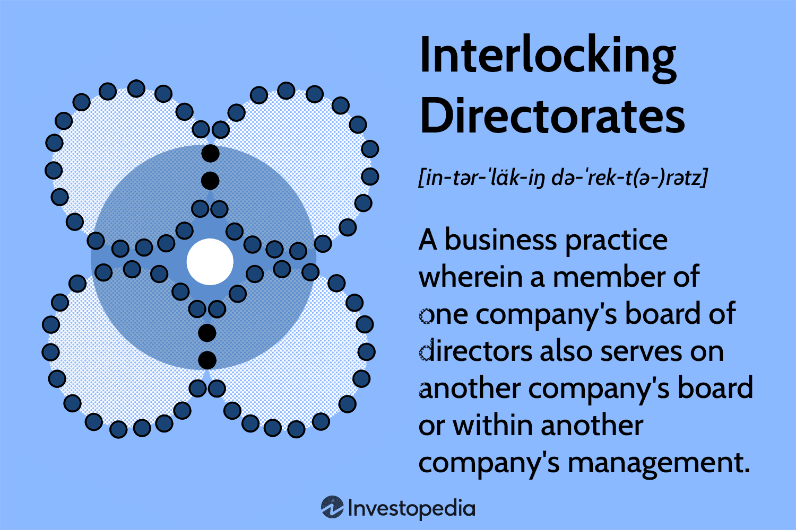

## Table of Contents

## What is an interlocking directorate?

An interlocking directorate happens when a person is a director on the board of two or more companies. This can create a link between the companies, which might affect how they make decisions and work together.

Sometimes, interlocking directorates can be good because they help companies share information and work more closely. But they can also be bad if they lead to less competition or if one company has too much control over another. Governments often have rules to stop interlocking directorates from causing problems in the market.

## How does an interlocking directorate function within a corporation?

An interlocking directorate happens when someone is a board member for more than one company. This person helps make big decisions for both companies. Because they are on both boards, they can share ideas and information between the companies. This can help the companies work together better and make smarter choices.

But, there can be problems too. If the same person is on the boards of companies that compete with each other, it might not be fair. They might share secret information or make decisions that help one company more than the other. To stop this from happening, governments have rules. These rules make sure that interlocking directorates don't hurt competition or let one company control another too much.

## What are the different types of interlocking directorates?

There are two main types of interlocking directorates: direct interlocks and indirect interlocks. A direct interlock happens when the same person sits on the boards of two different companies. For example, if John is a board member at Company A and also at Company B, that's a direct interlock. This can help the companies share information and work together more closely.

An indirect interlock happens when two companies are connected through a third company. For example, if John is on the board of Company A, and Mary is on the board of Company A and Company B, then Company A and Company B are indirectly linked through Company A. This type of interlock can still allow for the sharing of information and coordination between companies, but it's a bit more complicated.

Both types of interlocks can be useful for companies to work together, but they also need to be careful. If not managed properly, interlocks can lead to less competition or even unfair advantages, which is why there are rules to keep things fair.

## What are the potential benefits of interlocking directorates for companies?

Interlocking directorates can help companies share information and ideas easily. When a person is on the boards of two companies, they can bring knowledge from one company to the other. This can make both companies smarter and help them make better decisions. For example, if one company has a new way to save money, the person on both boards can tell the other company about it. This sharing can help both companies grow and do better.

Another benefit is that interlocking directorates can help companies work together more closely. When the same person is on the boards of two companies, it can make it easier for them to work on projects together or make deals. This teamwork can lead to new business opportunities and stronger partnerships. It can also help companies understand each other's needs and goals better, making their cooperation smoother and more effective.

## What are the potential risks and drawbacks of interlocking directorates?

One big risk of interlocking directorates is that they can reduce competition. When the same person is on the boards of two companies that compete with each other, they might share secret information or make decisions that help one company more than the other. This can make it harder for other companies to compete fairly. Governments have rules to stop this from happening, but it can still be a problem if not watched carefully.

Another drawback is the risk of one company having too much control over another. If a person on the board of one company is also on the board of another, they might make decisions that favor the first company. This can lead to unfair advantages and can hurt the other company. It can also make it hard for the company with less control to make decisions that are best for itself.

A third issue is that interlocking directorates can sometimes lead to conflicts of interest. When someone is on the boards of multiple companies, they might have a hard time deciding what is best for each company. They might be tempted to make choices that help them personally or help one company more than another. This can create problems and make it hard for the companies to trust each other.

## How do interlocking directorates impact corporate governance?

Interlocking directorates can affect how companies are run. When someone is on the board of more than one company, they can bring ideas from one company to the other. This can help both companies make better decisions and work together more easily. But it can also be tricky because the person might have to choose between what's best for one company and what's best for another. This can make it hard for the companies to trust each other and can lead to conflicts of interest.

Another way interlocking directorates impact corporate governance is by possibly reducing competition. If the same person is on the boards of two companies that compete with each other, they might share secret information or make decisions that help one company more than the other. This can make it hard for other companies to compete fairly. Governments have rules to stop this from happening, but it's still something that companies need to watch out for. Interlocking directorates can help companies work together, but they also need to be careful to make sure they don't hurt competition or let one company control another too much.

## What are the legal and regulatory considerations regarding interlocking directorates?

Governments have rules to make sure interlocking directorates don't cause problems. In the United States, the Clayton Act stops the same person from being on the boards of two companies that compete with each other if it might hurt competition. This law helps keep the market fair and makes sure one company doesn't have too much control over another. The Federal Trade Commission and the Department of Justice watch out for these kinds of problems and can take action if they find them.

In other countries, there are similar rules to stop interlocking directorates from being bad for competition. For example, in the European Union, the European Commission looks at interlocking directorates to make sure they don't break competition laws. Companies need to follow these rules or they might get in trouble. It's important for companies to know these laws so they can have interlocking directorates without causing problems.

## How can interlocking directorates influence market competition?

Interlocking directorates can make the market less competitive. When someone is on the boards of two companies that compete with each other, they might share secret information or make decisions that help one company more than the other. This can make it hard for other companies to compete fairly because they don't have the same information or advantages. Governments have rules to stop this from happening, but it can still be a problem if not watched carefully.

On the other hand, interlocking directorates can also help companies work together better. When companies share information and ideas through a common board member, they can make smarter decisions and find new ways to work together. This can lead to new business opportunities and stronger partnerships. But it's important for companies to be careful and follow the rules so that their cooperation doesn't hurt competition in the market.

## What are some historical examples of interlocking directorates?

One famous example of interlocking directorates happened in the early 1900s with big companies like Standard Oil and U.S. Steel. John D. Rockefeller, who started Standard Oil, had people on the boards of many other big companies too. This helped Standard Oil work closely with these other companies and share information. But it also made it hard for smaller companies to compete because they didn't have the same advantages. The government didn't like this and made new rules to stop it from happening.

Another example is from the 1920s and 1930s, when big banks and businesses had interlocking directorates. For example, J.P. Morgan & Co. had people on the boards of many big companies like General Electric and AT&T. This helped the bank and the companies work together and share ideas. But it also caused problems during the Great Depression because the close ties between banks and businesses made the economy unstable. After the Depression, the government made more rules to stop these kinds of interlocking directorates from causing trouble.

## How do interlocking directorates affect shareholder value?

Interlocking directorates can help increase shareholder value by making companies work together better. When a person is on the boards of two companies, they can share ideas and information between them. This can help both companies make smarter decisions and find new ways to grow. For example, if one company has a new way to save money, the person on both boards can tell the other company about it. This sharing can lead to more profits and higher stock prices, which is good for shareholders.

But interlocking directorates can also hurt shareholder value if they reduce competition. If the same person is on the boards of two companies that compete with each other, they might share secret information or make decisions that help one company more than the other. This can make it hard for other companies to compete fairly, which can lead to lower profits and stock prices. Governments have rules to stop this from happening, but it can still be a problem if not watched carefully.

## What methods are used to detect and analyze interlocking directorates?

People use special computer programs to find and study interlocking directorates. These programs look at lists of who is on the boards of different companies. They can find when the same person is on more than one board and show how companies are connected. This helps people see how information and decisions might move between companies. It's like making a map of who is connected to who.

Researchers also use these programs to look at big groups of companies and see how interlocking directorates might affect the whole market. They can see if some companies are more connected than others and if this makes the market less competitive. By studying these connections, they can help make rules that keep the market fair and stop one company from having too much control over another.

## What are the current trends and future implications of interlocking directorates in global business?

In today's global business world, interlocking directorates are still common, but they are changing. Companies are becoming more international, and so are their boards. People from different countries are now often on the boards of big companies. This can help companies understand different markets better and work together across borders. But it also makes things more complicated because different countries have different rules about interlocking directorates. Companies need to be careful to follow all these rules to avoid problems.

In the future, interlocking directorates might become even more important as businesses keep growing around the world. They can help companies share ideas and work together in new ways. But they also need to be watched closely to make sure they don't hurt competition or let one company control another too much. Governments might make new rules to keep things fair as the business world changes. Companies that use interlocking directorates well can grow and do better, but they need to be careful and follow the rules.

## References & Further Reading

[1]: Mizruchi, M. S. (1996). ["What Do Interlocks Do? An Analysis, Critique, and Assessment of Research on Interlocking Directorates."](https://www.jstor.org/stable/pdf/2083432.pdf) Annual Review of Sociology, 22, 271-298.

[2]: Fama, E. F., & Jensen, M. C. (1983). ["Separation of Ownership and Control."](https://www.journals.uchicago.edu/doi/10.1086/467037) Journal of Law and Economics, 26(2), 301-325.

[3]: Holmstrom, B., & Kaplan, S. N. (2003). ["The State of U.S. Corporate Governance: What's Right and What's Wrong?"](https://onlinelibrary.wiley.com/doi/abs/10.1111/j.1745-6622.2003.tb00457.x) Journal of Applied Corporate Finance, 15(3), 8-20.

[4]: Kim, E. H., & Lu, Y. (2011). ["CEO Ownership, External Governance, and Risk-Taking."](https://www.sciencedirect.com/science/article/pii/S0304405X11001632) Journal of Financial Economics, 102(2), 272-292.

[5]: O'Brien, D. P., & Salop, S. C. (2000). ["Competitive Effects of Partial Ownership: Financial Interest and Corporate Control."](https://scholarship.law.georgetown.edu/facpub/209/) Journal of Law, Economics, & Organization, 19(3), 565-586.