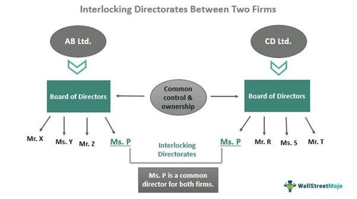

In a rapidly evolving corporate landscape, the dynamics of board governance and interlocking directorates play a crucial role in shaping corporate governance and market behavior. As businesses expand and markets globalize, the intricate networks formed by individuals serving on multiple boards become increasingly influential. This web of relationships, known as interlocking directorates, affects how companies strategize and respond to regulatory and competitive pressures.

This article explores the nexus between board of directors, interlocking directorates, corporate governance, and algorithmic trading, focusing on their impact on corporate practices and market regulations. The board of directors is tasked with complex responsibilities, including steering corporate strategy and ensuring compliance with regulatory standards. The presence of interlocking directorates can amplify these responsibilities, potentially facilitating knowledge sharing and strategic collaboration across companies. However, it also presents risks such as collusion and conflicts of interest, which can undermine market integrity and stakeholder trust.



The interdependencies among these elements highlight the complexity and significance of corporate networks. Algorithmic trading, with its capability for executing high-frequency trades, adds another layer of complexity to corporate governance. Its integration within governance structures demands comprehensive regulatory oversight to mitigate the risks of unethical practices, such as insider trading. Therefore, understanding how these components interact is crucial to addressing the challenges and opportunities they present to market competition and ethical decision-making.

Our exploration aims to provide insights into how these components affect corporate governance, market competition, and ethical considerations. As we examine these interconnections, we consider the implications for corporate transparency, accountability, and regulatory compliance. In doing so, we aim to contribute to the broader discourse on how these evolving dynamics will shape the future of corporate governance in an increasingly automated and interconnected world.

## Table of Contents

## Understanding Board of Directors and Interlocking Directorates

The board of directors is a crucial entity in the corporate governance framework, acting as the primary decision-making body responsible for overseeing a company's operations and ensuring adherence to legal and ethical standards. Its core functions include setting corporate policy, approving strategic plans, overseeing financial performance, and appointing executive management. By ensuring that the company's goals align with stakeholder interests, the board of directors plays a vital role in enhancing corporate accountability and mitigating risks.

Interlocking directorates refer to the phenomenon where an individual simultaneously holds board positions in multiple companies. This interconnected network can have significant implications on corporate strategies and market practices. On the positive side, interlocking directorates facilitate the exchange of expertise and foster strategic collaborations. Directors with extensive networks can leverage their diverse insights and experiences to drive innovation and growth within the companies they serve. By sharing knowledge, they can introduce new ideas and practices that may lead to enhanced operational efficiencies and competitive advantages.

However, interlocking directorates also pose considerable risks. One of the primary concerns is the potential for collusion and anti-competitive practices. When directors hold positions across competing firms, there is an increased risk of non-competitive alliances which could lead to price-fixing or reduced competition. Such collusion can negatively impact market dynamics and disadvantage consumers.

Moreover, interlocking directorates may give rise to conflicts of interest. Directors might prioritize the interests of one company over another or exploit proprietary information for personal or affiliated company gain. This dual loyalty raises ethical concerns and could compromise the decision-making process, potentially leading to suboptimal outcomes that do not align with the best interests of all stakeholders involved.

In summary, while interlocking directorates can provide beneficial opportunities for synergy and collaboration across companies, they necessitate careful regulation and oversight to prevent adverse effects on market competition and to maintain ethical standards in corporate governance. Ensuring transparent and fair governance structures is essential to balance these advantages against the inherent risks.

## Corporate Governance and Its Impact

Corporate governance is a comprehensive framework encompassing the systems, principles, and processes by which companies are directed and controlled. It is essential in balancing and aligning the interests of various stakeholders, including shareholders, management, customers, suppliers, financiers, government, and the community. Effective corporate governance ensures that companies adhere to legal and ethical standards, thereby mitigating risks and enhancing accountability.

A key element of corporate governance is the establishment and maintenance of robust internal controls and procedures. These controls are vital in safeguarding company assets, preventing fraud, and ensuring the accuracy and reliability of financial reporting. By fostering transparency and accountability, companies can build trust with stakeholders and improve their overall performance.

Interlocking directorates, where individuals serve on the boards of multiple companies, can significantly influence corporate governance. These interconnections may facilitate strategic alliances, joint ventures, and the exchange of industry insights and best practices. For instance, directors with extensive cross-board experiences might bring diverse perspectives and expertise that can enhance decision-making processes and strategic planning.

However, interlocking directorates also present certain risks, particularly concerning competition and market fairness. They may lead to oligopolistic behavior where a small number of individuals exert substantial control over vast sections of the economy, potentially stifling competition. Such networks can give rise to scenarios where companies might engage in anti-competitive practices, such as price-fixing or creating barriers to entry for new competitors.

The challenge lies in meticulously regulating these interlocking boards to prevent conflicts of interest and ensure that they do not enable collusive behaviors. Effective oversight mechanisms and regulatory compliance are crucial to maintaining the delicate balance between leveraging synergies and preventing anti-competitive practices. Regulatory bodies and policymakers must ensure that these networks do not compromise the competitive landscape of the market.

Essential to this task is the implementation of regulatory frameworks and adherence to best practices in corporate governance. These measures include enforcing antitrust laws, establishing clear guidelines for board memberships, and promoting transparency. Recognizing the dual nature of interlocking directorates as both beneficial for strategic collaboration and potentially hazardous for market competition is fundamental to crafting policies that protect the interests of all stakeholders.

## Algorithmic Trading and Its Interplay with Governance

Algorithmic trading employs sophisticated mathematical models and algorithms to execute a large number of orders at speeds far surpassing human capability. This high-frequency trading mechanism significantly impacts market dynamics and [liquidity](/wiki/liquidity-risk-premium) by facilitating rapid price discovery and enhancing market efficiency. However, it also introduces new challenges to corporate governance structures, requiring vigilant oversight to safeguard against unethical practices such as insider trading.

The integration of [algorithmic trading](/wiki/algorithmic-trading) within corporate governance frameworks necessitates the establishment of robust checks and balances. These measures are crucial in ensuring that the vast amounts of data processed do not lead to unfair market advantages or exploitative practices, especially when interlocking directorates provide access to privileged information. Through algorithmic strategies, traders can potentially use non-public information for gains, which underscores the importance of transparency and ethical compliance in the utilization of these technologies.

Given the complexity introduced by automated systems, regulatory frameworks must continuously evolve. Adapting to the rapid advancements in trading technologies is essential for maintaining market integrity. Regulation ought to focus on implementing real-time monitoring systems capable of detecting anomalies that may indicate manipulative or unethical trading practices. For example, tools incorporating [machine learning](/wiki/machine-learning) algorithms can be developed to analyze trading patterns and detect suspicious activities indicative of insider trading or market manipulation, thereby offering regulators actionable insights.

Python, for instance, offers libraries such as NumPy and pandas for data manipulation, scikit-learn for machine learning, and PyAlgoTrade for [backtesting](/wiki/backtesting) trading strategies. These tools can be leveraged to design automated systems capable of assessing compliance with regulatory standards. Here is an example of a simple Python script using random data to model trade signals and execute trades based on specific criteria:

```python
import numpy as np
import pandas as pd

# Simulate trade data
np.random.seed(0)
data = np.random.randn(100, 1)
df = pd.DataFrame(data, columns=['price'])

# Simple moving average as a trading signal
df['sma'] = df['price'].rolling(window=5).mean()
df['signal'] = np.where(df['price'] > df['sma'], 1, -1)  # Buy if price > SMA, else sell

# Calculate returns
df['returns'] = df['signal'].shift() * df['price'].pct_change()

# Display the head of the DataFrame
print(df.head())
```

As highlighted in this simple illustration, algorithmic trading systems must operate under rigorous governance to ensure they do not misuse information or engage in harmful speculative behaviors. Effective governance will increasingly rely on integrating technology-driven solutions and adaptive regulatory approaches to address the challenges of modern trading systems. Thus, the dynamic interplay between algorithmic trading, corporate governance, and regulatory frameworks is crucial for sustaining a fair and transparent trading environment.

## Regulatory Considerations and Ethical Challenges

Regulation plays a critical role in managing the complexities and potential risks associated with interlocking directorates, a situation where individuals serve on multiple corporate boards, possibly fostering anti-competitive practices. Regulatory frameworks are essential for ensuring market fairness by promoting transparency, accountability, and ethical behavior among corporations. The effectiveness of these regulations hinges on their ability to adapt to evolving corporate structures and practices, ensuring robust oversight without stifling beneficial collaboration.

One of the primary ethical concerns linked to interlocking directorates is the prevention of insider trading. Insider trading involves individuals using non-public information for financial gain, a breach of market integrity and stakeholder trust. Interlocking directorates may inadvertently facilitate the flow of privileged information between companies, thus necessitating stringent measures to curb such practices. Regulatory bodies, including the Securities and Exchange Commission (SEC) in the United States, enforce rules that mandate disclosure of board memberships and relationships, helping to identify and mitigate potential conflicts of interest.

Transparency is another cornerstone of ethical corporate conduct. By disclosing board compositions and interlock relationships, companies can maintain investor confidence and market credibility. Compliance with disclosure requirements not only prevents unethical conduct but also enhances corporate governance by aligning the interests of diverse stakeholders.

Several notable cases underscore the importance of vigilant oversight and the repercussions of regulatory lapses. The Enron scandal in the early 2000s, for example, highlighted massive failures in ethical governance and transparency, leading to significant reforms such as the Sarbanes-Oxley Act, which strengthened public company accounting oversight. Similar cases demonstrate the potential consequences of inadequate regulatory frameworks, underlining the need for continuous improvement in governance and compliance structures.

In conclusion, regulatory considerations and ethical challenges surrounding interlocking directorates are intrinsic to safeguarding market integrity. It is imperative for regulatory bodies to remain proactive in addressing these issues to foster an environment of trust and fairness within financial markets.

## Future Perspectives and Conclusion

As corporate environments and technological landscapes evolve, the frameworks that govern interlocking directorates, corporate governance, and algorithmic trading must adapt to keep pace. The interconnected nature of these elements makes it imperative to develop and implement strategies that enhance oversight and ensure ethical practices while fostering innovation and growth.

Future trends indicate a significant shift towards the integration of enhanced regulatory technologies and sophisticated compliance tools. Such advancements are crucial in monitoring corporate interactions more effectively, identifying potential conflicts of interest, and preventing anti-competitive behaviors that may arise from interlocking directorates. The adoption of [artificial intelligence](/wiki/ai-artificial-intelligence) and machine learning technologies can offer real-time analytics and predictive insights, thereby improving the capability to detect anomalies and ensure compliance with regulatory standards.

Algorithmic trading, characterized by its speed and complexity, introduces unique challenges that necessitate a reevaluation of existing governance models. As these trading systems become more prevalent, robust oversight mechanisms are required to mitigate risks such as market manipulation and unethical trading practices. Developing algorithms with built-in compliance features and ethical considerations could form part of an adaptive governance framework.

The adaptation of governance models is not merely reactive but anticipative, seeking to address the burgeoning complexities of modern finance. This involves recalibrating legal and institutional frameworks to accommodate the rapid technological advancements influencing financial markets. The integration of blockchain technology, for example, could enhance transparency and traceability in corporate decision-making processes, thereby reinforcing stakeholder trust.

Securing market integrity in this dynamic environment relies on a continual reassessment of the regulatory landscape. Policymakers and corporate leaders must collaborate to forge a path that balances innovation with ethical accountability, ensuring that emerging technologies enhance rather than undermine the principles of sound corporate governance.

In conclusion, the future of corporate governance lies in its ability to adapt to evolving market conditions and technological advancements. By leveraging advanced regulatory technologies and embracing innovative compliance tools, corporations can maintain the delicate balance between profitability and ethical responsibility. This ongoing evolution is vital for sustaining stakeholder confidence and securing the stability and integrity of global markets.

## References & Further Reading

[1]: Mizruchi, M. S. (1996). ["What Do Interlocks Do? An Analysis, Critique, and Assessment of Research on Interlocking Directorates."](https://www.jstor.org/stable/pdf/2083432.pdf) Annual Review of Sociology, 22, 271-298.

[2]: Fama, E. F., & Jensen, M. C. (1983). ["Separation of Ownership and Control."](https://www.journals.uchicago.edu/doi/10.1086/467037) Journal of Law and Economics, 26(2), 301-325.

[3]: Holmstrom, B., & Kaplan, S. N. (2003). ["The State of U.S. Corporate Governance: What's Right and What's Wrong?"](https://onlinelibrary.wiley.com/doi/abs/10.1111/j.1745-6622.2003.tb00457.x) Journal of Applied Corporate Finance, 15(3), 8-20.

[4]: Kim, E. H., & Lu, Y. (2011). ["CEO Ownership, External Governance, and Risk-Taking."](https://www.sciencedirect.com/science/article/pii/S0304405X11001632) Journal of Financial Economics, 102(2), 272-292.

[5]: O'Brien, D. P., & Salop, S. C. (2000). ["Competitive Effects of Partial Ownership: Financial Interest and Corporate Control."](https://scholarship.law.georgetown.edu/facpub/209/) Journal of Law, Economics, & Organization, 19(3), 565-586.