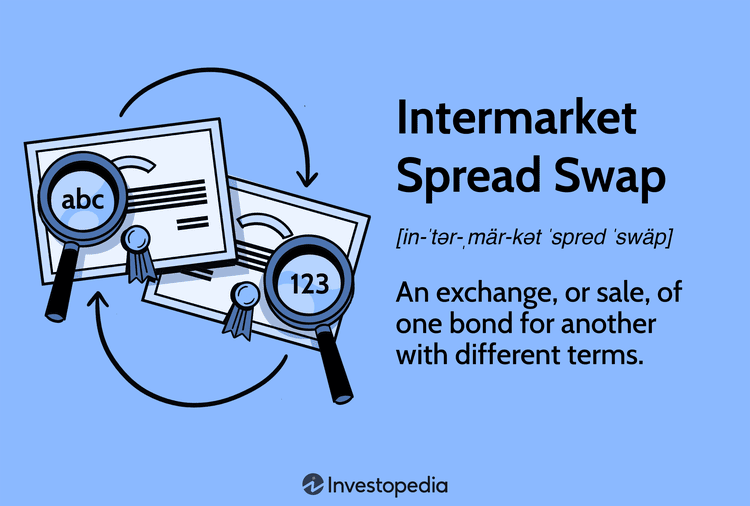

In the fast-paced world of financial trading, strategies such as intermarket spread trading have gained traction among seasoned traders looking to exploit market inefficiencies. Intermarket spread trading involves taking simultaneous long and short positions in different but related markets, thereby offering the opportunity to profit from relative price movements rather than absolute market directions. One of the core advantages of this approach is its ability to reduce risk compared to more straightforward directional trading by offsetting market exposure and thereby adding a layer of diversification.

By capitalizing on price discrepancies between correlated assets, traders can enhance their potential gains. This strategy focuses on the relative value, which can lead to a more stable return profile as opposed to depending entirely on market movement predictions. Consider, for example, the relationship between crude oil and gasoline prices. A trader might go long on crude while shorting gasoline, betting on the differential rather than the outright market trend.



Algo trading, or algorithmic trading, plays a crucial role in the execution of these complex strategies. Sophisticated algorithms automate trades, allowing traders to swiftly act on fleeting price discrepancies that would be difficult to exploit manually. These algorithms can process large volumes of market data in real-time, identify potential opportunities, and execute trades with high precision and speed, significantly reducing human error and the influence of emotional decision-making.

This article covers the essentials of intermarket spread financial trading, discusses effective spread strategies, and examines how algo trading technologies are integrated into these strategies to form a powerful toolset for contemporary traders. As financial markets become increasingly intricate, the ability to effectively apply intermarket spread and algo trading strategies represents a significant edge in navigating the complexities of modern trading environments.

## Table of Contents

## Understanding Intermarket Spread Trading

Intermarket spread trading focuses on exploiting price discrepancies between different but related markets, such as commodities, bonds, and currency markets. Traders deploy this strategy by entering into offsetting positions in these correlated markets, thereby aiming to benefit from the narrowing or widening of price spreads.

A critical aspect of intermarket spread trading is conducting an in-depth analysis of market correlations and economic indicators that might influence relative price movements. Traders must thoroughly understand how these markets are interrelated. Factors such as supply and demand dynamics, geopolitical developments, interest rates, and economic data releases play significant roles in affecting these relationships. For example, changes in interest rates might simultaneously impact currency values and bond yields, presenting opportunities for spread trading.

Successful execution of intermarket spread strategies hinges on the trader’s ability to predict shifts in market dynamics swiftly. This requires staying abreast of the macroeconomic environment and understanding how events could lead to changes in correlation patterns. Algorithms can be particularly useful in this context, processing large volumes of financial data to identify potential shifts in spreads.

Taking advantage of the intricacies and factors driving intermarket relationships forms the foundation for effective spread trading strategies. It involves identifying historical and emerging patterns that suggest potential value dislocations between related markets. To exemplify, consider a trader analyzing the relationship between [crude oil](/wiki/crude-oil) and natural gas. They might develop a spread strategy based on historical data that traditionally sees crude oil prices rise when natural gas prices decrease due to seasonal demand changes.

Thus, intermarket spread trading requires not just an understanding of individual markets, but also a keen insight into the dynamics that govern interrelationships among various financial instruments. Mastery in this area allows traders to optimize their portfolio performance by mitigating risks associated with unilateral market moves while capitalizing on relative value opportunities across markets.

## Key Strategies for Intermarket Spread Trading

Common strategies for intermarket spread trading include calendar spreads, crack spreads, and inter-commodity spreads. These approaches leverage differences in prices or market conditions between related commodities or contract periods to generate profits.

Calendar spreads involve taking positions in different contract months of the same commodity. Traders profit from changes in supply and demand dynamics over time. For example, a trader might buy a futures contract for July delivery and sell a futures contract for November delivery of the same commodity. The goal is to capitalize on price fluctuations between the two contract periods, potentially driven by seasonal factors or anticipated changes in market conditions. Here, the spread value can be calculated as:

$$
\text{Spread Value} = P_{\text{future month}} - P_{\text{near month}}
$$

where $P_{\text{future month}}$ and $P_{\text{near month}}$ are prices for the respective contract months.

Crack spreads are predominantly used in energy markets to trade the price difference between crude oil and its refined products, such as gasoline and heating oil. This strategy reflects the profit margin from refining crude oil into its products. A typical example is the 3-2-1 crack spread, where three barrels of crude oil are refined into two barrels of gasoline and one barrel of heating oil. The spread calculation can be expressed as:

$$
\text{Crack Spread} = 2 \times P_{\text{gasoline}} + P_{\text{heating oil}} - 3 \times P_{\text{crude oil}}
$$

Inter-commodity spreads involve trading different but related commodities to benefit from price divergence driven by external factors. For instance, a trader might buy corn futures and sell wheat futures, anticipating that the price of corn will rise relative to wheat due to factors such as weather conditions or policy changes. The profitability of this strategy hinges on the correlation and relative price movements between the two commodities being traded.

Selecting the right strategy based on current market conditions and comprehensive analysis is crucial for maximizing returns in intermarket spread trading. Factors such as historical price patterns, market [volatility](/wiki/volatility-trading-strategies), and economic indicators should be considered when choosing the appropriate spread strategy. The ability to assess and respond to these variables effectively can significantly influence the success of trading operations.

## The Role of Algo Trading in Spread Strategies

Algo trading, or [algorithmic trading](/wiki/algorithmic-trading), has become a cornerstone in executing intermarket spread strategies due to its ability to handle complex calculations and voluminous data efficiently. By employing sophisticated algorithms, algo trading systems can quickly analyze vast datasets to identify potential spread opportunities. This process involves identifying correlations and discrepancies between market instruments such as commodities, currencies, or indices. For example, an algorithm can swiftly calculate the Pearson correlation coefficient to assess the strength of a relationship between two assets, aiming to pinpoint exploitable spread deviations.

The automation aspect of algo trading significantly reduces the likelihood of human error and emotional bias, which are common pitfalls in manual trading. Algorithms operate under pre-defined criteria and parameters, ensuring consistent application of strategies even in volatile market conditions. Python is often used to implement these algorithms due to its robust libraries such as NumPy for numerical analysis and pandas for data manipulation.

```python
import numpy as np
import pandas as pd

# Example: Calculate moving averages to determine spread entry points
def calculate_moving_averages(prices, short_window, long_window):
    signals = pd.DataFrame(index=prices.index)
    signals['signal'] = 0.0

    # Short-term moving average
    signals['short_mavg'] = prices['Close'].rolling(window=short_window, min_periods=1, center=False).mean()

    # Long-term moving average
    signals['long_mavg'] = prices['Close'].rolling(window=long_window, min_periods=1, center=False).mean()

    # Generate signals
    signals['signal'][short_window:] = np.where(signals['short_mavg'][short_window:] > signals['long_mavg'][short_window:], 1.0, 0.0)   

    # Generate trading orders
    signals['positions'] = signals['signal'].diff()

    return signals
```

Customization is another vital feature of algo trading, allowing traders to define algorithms based on specific predictive indicators such as volatility thresholds or correlation measures. This adaptability ensures that the trading strategies are aligned with the trader's risk tolerance and market expectations.

Integrating algo trading into spread strategies allows for immediate responses to market fluctuations, an essential attribute in capturing short-lived price inconsistencies. These systems continuously monitor market conditions and are capable of executing trades within milliseconds upon detecting favorable conditions. This promptness not only optimizes the trade execution process but also increases the probability of capturing profitable spreads before they diminish in value.

Ultimately, the role of algo trading in intermarket spread strategies is to refine and streamline the trading process, offering precision and agility that manual methods cannot match. This technological integration helps traders optimize their strategy execution, maintain consistency, and potentially enhance returns from their spread trading endeavors.

## Benefits and Challenges of Intermarket Spread Trading

Intermarket spread trading provides a trading mechanism that can potentially lower risks while increasing returns. The primary advantage is the diversification it offers. By holding positions in correlated markets, traders protect against significant losses that might occur if relying solely on directional trades. This diversification brings about a steadier performance curve, rooted in relative market price movements rather than absolute predictions. Consequently, traders might experience fewer fluctuations in portfolio value and a more predictable risk profile.

Despite these benefits, intermarket spread trading is fraught with challenges. One of the primary difficulties lies in accurately analyzing the myriad correlations and market influences. The complexity of the task demands a deep understanding of how different markets interrelate and how various economic indicators might impact these relationships. For example, a change in commodity prices often affects foreign exchange rates, which can, in turn, influence bond markets.

Sophisticated technological infrastructure becomes imperative for success. Effective spread trading necessitates accessing robust market data sources that can deliver real-time information with high accuracy and speed. Traders must employ advanced analytics to process this data, requiring significant computational capabilities to analyze multiple markets simultaneously. Often, this involves using cutting-edge software tools that incorporate [machine learning](/wiki/machine-learning) algorithms to identify patterns and correlations.

To demonstrate the handling of such complex data, consider the following Python snippet as an example of how traders might use libraries like pandas and numpy to manage and analyze market data:

```python
import pandas as pd
import numpy as np

# Assume df is a DataFrame containing historical price data for two correlated markets
# The index is the date, and the columns are 'MarketA' and 'MarketB'

# Calculate the spread
df['Spread'] = df['MarketA'] - df['MarketB']

# Calculate the rolling correlation
rolling_corr = df['MarketA'].rolling(window=30).corr(df['MarketB'])

# Display where the spread deviates significantly from the mean
spread_mean = df['Spread'].mean()
spread_std = df['Spread'].std()

# Identifying significant deviations
significant_deviation = df[np.abs(df['Spread'] - spread_mean) > 2 * spread_std]

print(significant_deviation)
```

Understanding and addressing these challenges is crucial for traders. They need to develop strong analytical skills, continually update their knowledge of market dynamics, and invest in the required technology. Only by doing so can they exploit the opportunities intermarket spread trading offers. As markets evolve, staying informed and agile will be key to maintaining a competitive edge.

## Conclusion

Intermarket spread trading represents a dynamic and versatile approach within the broader spectrum of financial trading strategies. This method focuses on exploiting price movements between different but related markets, offering traders the potential to profit from relative price discrepancies while minimizing exposure to directional risk. The integration of algorithmic trading significantly enhances the execution and efficacy of spread strategies. By using sophisticated algorithms, traders can automate the execution of complex strategies, thereby improving the speed and precision of trades. For example, algorithms can swiftly analyze market data, identify favorable spread opportunities, and execute trades within milliseconds, reducing the impact of human error and emotion on trading outcomes.

Understanding the nuances of intermarket spread trading and leveraging cutting-edge technology allows traders to navigate complex market environments with greater agility. Sophisticated trading platforms and high-frequency trading systems are crucial for reacting promptly to market changes and executing strategies efficiently. Traders who can effectively incorporate these technologies into their trading practices are better positioned to capitalize on transient market opportunities and manage risk effectively.

While the strategy is not without its challenges, it offers unique opportunities for those willing to understand and employ it effectively. The complexity of analyzing multiple market correlations and economic factors requires traders to have a robust understanding of the markets and access to extensive data sources. Additionally, developing and maintaining sophisticated technological infrastructure is crucial for successful execution.

As financial markets continue to evolve, the combination of intermarket spread strategies and algo trading will remain an integral and innovative aspect of trading. The constant evolution of market dynamics and technological advancements underscores the need for adaptive strategies that can respond to new challenges and opportunities. For traders adept at integrating these elements, intermarket spread trading presents a promising avenue for achieving consistent and enhanced returns.

## References & Further Reading

[1]: Pardo, R. (2008). ["The Evaluation and Optimization of Trading Strategies"](https://onlinelibrary.wiley.com/doi/book/10.1002/9781119196969). Wiley.

[2]: Chan, E. P. (2008). ["Quantitative Trading: How to Build Your Own Algorithmic Trading Business"](https://github.com/ftvision/quant_trading_echan_book). Wiley.

[3]: Jansen, S. (2018). ["Machine Learning for Algorithmic Trading"](https://searchworks.stanford.edu/view/13246850). Packt Publishing.

[4]: Lopez de Prado, M. (2018). ["Advances in Financial Machine Learning"](https://www.amazon.com/Advances-Financial-Machine-Learning-Marcos/dp/1119482089). Wiley.

[5]: Aronson, D. R. (2006). ["Evidence-Based Technical Analysis: Applying the Scientific Method and Statistical Inference to Trading Signals"](https://www.amazon.com/Evidence-Based-Technical-Analysis-Scientific-Statistical/dp/0470008741). Wiley.

[6]: Gerig, A. (2015). ["High-Frequency Trading Synchronization"](https://papers.ssrn.com/sol3/papers.cfm?abstract_id=2173247). arXiv.