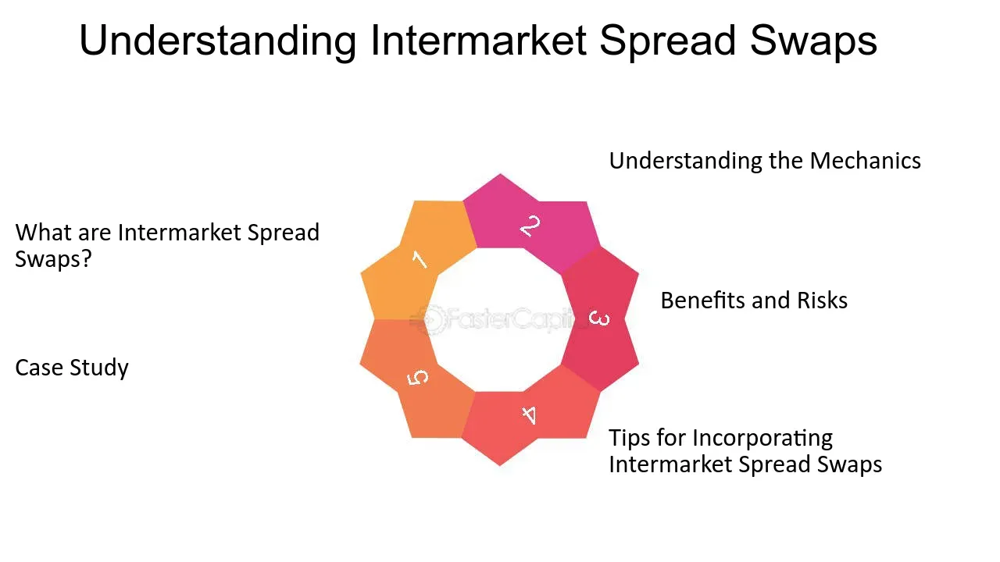

## Table of Contents

## What is an intermarket spread?

An intermarket spread is a trading strategy where you buy and sell similar products in different markets. For example, you might buy oil in one market and sell it in another market where the price is higher. The goal is to make a profit from the difference in prices between the two markets.

This strategy is often used in commodity markets, like oil or grains. Traders look for price differences between different locations or types of the same product. By buying low in one market and selling high in another, they can make money even if the overall market price doesn't change much. It's a way to take advantage of small price differences that can add up to big profits.

## How does an intermarket spread differ from an intramarket spread?

An intermarket spread involves buying and selling the same or similar products in different markets. For example, you might buy wheat in Chicago and sell it in Kansas City. The idea is to make money from the price difference between these two places. Traders use this strategy to take advantage of how prices can be different in various locations, even if it's the same product.

An intramarket spread, on the other hand, happens within the same market. Here, you buy and sell different delivery months of the same product in one market. For instance, you might buy wheat for delivery in March and sell wheat for delivery in June, all in the Chicago market. The goal is to profit from the price difference between these different delivery times. So, while intermarket spreads focus on different locations, intramarket spreads focus on different times within the same market.

## What are the basic components of an intermarket spread?

An intermarket spread involves two main parts: buying and selling. You buy a product in one market where the price is lower, and then you sell that same product in another market where the price is higher. For example, if wheat is cheaper in Chicago than in Kansas City, you would buy wheat in Chicago and sell it in Kansas City. The difference in price between these two places is what you hope to make as profit.

The other important part of an intermarket spread is understanding the markets you are working with. You need to know why prices might be different in different places. This could be because of things like transportation costs, local supply and demand, or even weather conditions that affect how much of a product is available. By understanding these factors, you can make better decisions about when and where to buy and sell to make the most profit.

## Can you explain the concept of convergence in intermarket spreads?

Convergence in intermarket spreads is when the price difference between two markets starts to get smaller and smaller until it's almost the same. Imagine you're buying wheat in Chicago where it's cheap and selling it in Kansas City where it's more expensive. Over time, as more people do this, the price in Kansas City might start to go down because there's more wheat there now. At the same time, the price in Chicago might go up a bit because there's less wheat there. Eventually, the prices in both places can become very close to each other.

This happens because markets try to balance out. When there's a big difference in prices, traders see a chance to make money by buying low and selling high. As they keep doing this, they move the product from the cheaper place to the more expensive place. This movement helps to even out the prices until they're almost the same. That's what convergence is all about in intermarket spreads - the prices coming together.

## What are the common markets involved in intermarket spreads?

Intermarket spreads often happen in markets where the same products are traded in different places. For example, you might see intermarket spreads in the commodity markets like grains, oil, and metals. If wheat is cheaper in one place like Chicago and more expensive in another like Kansas City, traders might buy wheat in Chicago and sell it in Kansas City to make a profit from the price difference.

Another common market for intermarket spreads is the energy market. Oil and natural gas are often traded in different locations around the world, and their prices can vary. For instance, oil might be cheaper in the Middle East than in Europe. Traders could buy oil in the Middle East and sell it in Europe, taking advantage of the price difference. This helps to balance out the prices over time as more traders do the same thing.

## How do traders identify potential intermarket spread opportunities?

Traders look for price differences between the same products in different markets to find intermarket spread opportunities. They use tools like market data and price charts to see where prices are lower and higher. For example, if wheat is cheaper in Chicago than in Kansas City, a trader might buy wheat in Chicago and sell it in Kansas City. They also pay attention to news and events that might affect prices, like changes in supply and demand or transportation costs. By keeping an eye on these things, traders can spot chances to make money from the price differences.

Once traders find a potential opportunity, they need to think about other factors too. They consider the costs of moving the product from one place to another, like shipping fees. They also think about how long it might take to move the product and if the price difference will still be there when they do. Sometimes, they use computer programs to help them find and analyze these opportunities quickly. By carefully studying all these details, traders can decide if an intermarket spread is worth doing and how to make the most profit from it.

## What are the risks associated with trading intermarket spreads?

Trading intermarket spreads can be risky because prices in different markets can change quickly. If you buy a product in one market hoping to sell it for more in another, but then the price in the selling market drops, you could lose money. This can happen because of many reasons, like changes in supply and demand, new laws, or even weather affecting how much of a product is available. Traders need to watch the markets closely and be ready to act fast if things start to go the wrong way.

Another risk is the cost of moving the product from one market to another. There are expenses like shipping fees and storage costs that can eat into your profits. If these costs are higher than you expected, or if something goes wrong during transport, like delays or damage, you might not make as much money as you planned. Traders have to carefully calculate all these costs and make sure the price difference between markets is big enough to cover them and still leave a profit.

## How can one calculate the profitability of an intermarket spread?

To calculate the profitability of an intermarket spread, you need to find out the price difference between the two markets. For example, if wheat is $5 per bushel in Chicago and $6 per bushel in Kansas City, the price difference is $1 per bushel. You then need to subtract any costs you have to pay to move the wheat from Chicago to Kansas City, like shipping and storage fees. If these costs are $0.20 per bushel, your profit would be $0.80 per bushel ($1 - $0.20).

However, you also need to think about other things that might affect your profit. For instance, if it takes a long time to move the wheat and the price in Kansas City drops before you can sell it, your profit could be less or you might even lose money. You also have to consider if the price in Chicago goes up after you buy, which would make your costs higher. By carefully looking at all these factors and doing the math, you can figure out if the intermarket spread will be profitable and how much money you might make.

## What role does correlation play in intermarket spread mechanics?

Correlation is how much two markets move together. In intermarket spreads, traders look at how prices in different places change compared to each other. If two markets are highly correlated, it means that when the price goes up in one place, it usually goes up in the other place too. This can make it harder to make money from an intermarket spread because the price difference might not last long. But if the markets are not very correlated, the prices might change in different ways, giving traders more chances to find a good spread.

Traders use correlation to help them decide if an intermarket spread is a good idea. If they see that the prices in the two markets they are looking at usually move together, they might be more careful. They know that the price difference they see today might not be there tomorrow. On the other hand, if the markets don't move together much, traders might feel more confident. They can use this information to guess how long the price difference might last and plan their trades better.

## How do macroeconomic factors influence intermarket spread strategies?

Macroeconomic factors can really change how intermarket spreads work. Things like interest rates, inflation, and big economic news can make prices in different markets go up or down. For example, if a country raises interest rates, it might make it more expensive to borrow money there. This could make prices in that market go up or down, depending on what people are buying and selling. Traders need to watch these big economic changes because they can affect the price differences between markets that they are trying to use to make money.

Also, big events like wars, natural disasters, or new laws can mess with supply and demand. If a hurricane hits a place where a lot of oil comes from, it might make oil prices go up in that market. Traders who are looking at intermarket spreads need to think about how these events could change the prices they are counting on. By understanding how these big economic things work, traders can make better guesses about when and where to buy and sell to make the most profit from intermarket spreads.

## What advanced techniques can be used to optimize intermarket spread trading?

To make intermarket spread trading better, traders can use fancy math and computer programs. They might use something called "[algorithmic trading](/wiki/algorithmic-trading)," where computers do the buying and selling for them based on rules they set up. These rules can look at lots of data really fast, like how prices are moving or what's happening in the news. This can help traders find the best times to buy and sell, so they can make more money. They can also use "statistical [arbitrage](/wiki/arbitrage)," which is a way to find small price differences that might not be easy to see but can still make a profit if you do it a lot.

Another way to improve intermarket spread trading is by using "hedging" to lower the risk. Hedging means buying something else that will go up in value if the spread doesn't work out. For example, if you're trading wheat between Chicago and Kansas City, you might also buy a contract for corn in case the wheat prices change in a way you didn't expect. By doing this, you can protect your money even if things don't go as planned. Plus, paying attention to "market sentiment," or how people feel about the market, can help you guess where prices might go next. If everyone thinks prices will go up, they might, and you can plan your trades around that.

## Can you discuss a case study where an intermarket spread was successfully executed?

In 2008, a trader named John saw a big chance to make money with an intermarket spread in the oil market. Oil was cheaper in the Middle East than in Europe. John decided to buy oil in the Middle East and sell it in Europe. He knew it would cost money to move the oil, but the price difference was big enough to cover those costs and still make a profit. John carefully watched the news and weather reports because they could affect oil prices. He also used a computer program to help him find the best times to buy and sell.

John's plan worked out well. He bought oil in the Middle East at $90 per barrel and sold it in Europe for $100 per barrel. After paying for shipping and other costs, which were about $5 per barrel, John made a profit of $5 per barrel. He did this trade many times, making a lot of money overall. John's success came from understanding the markets and using technology to his advantage. He also knew that prices could change quickly, so he was always ready to adjust his plan if needed.

## What are the key strategies for intermarket spread trading?

Common strategies for intermarket spread trading include calendar spreads, crack spreads, and inter-commodity spreads. These approaches leverage differences in prices or market conditions between related commodities or contract periods to generate profits.

Calendar spreads involve taking positions in different contract months of the same commodity. Traders profit from changes in supply and demand dynamics over time. For example, a trader might buy a futures contract for July delivery and sell a futures contract for November delivery of the same commodity. The goal is to capitalize on price fluctuations between the two contract periods, potentially driven by seasonal factors or anticipated changes in market conditions. Here, the spread value can be calculated as:

$$
\text{Spread Value} = P_{\text{future month}} - P_{\text{near month}}
$$

where $P_{\text{future month}}$ and $P_{\text{near month}}$ are prices for the respective contract months.

Crack spreads are predominantly used in energy markets to trade the price difference between [crude oil](/wiki/crude-oil) and its refined products, such as gasoline and heating oil. This strategy reflects the profit margin from refining crude oil into its products. A typical example is the 3-2-1 crack spread, where three barrels of crude oil are refined into two barrels of gasoline and one barrel of heating oil. The spread calculation can be expressed as:

$$
\text{Crack Spread} = 2 \times P_{\text{gasoline}} + P_{\text{heating oil}} - 3 \times P_{\text{crude oil}}
$$

Inter-commodity spreads involve trading different but related commodities to benefit from price divergence driven by external factors. For instance, a trader might buy corn futures and sell wheat futures, anticipating that the price of corn will rise relative to wheat due to factors such as weather conditions or policy changes. The profitability of this strategy hinges on the correlation and relative price movements between the two commodities being traded.

Selecting the right strategy based on current market conditions and comprehensive analysis is crucial for maximizing returns in intermarket spread trading. Factors such as historical price patterns, market [volatility](/wiki/volatility-trading-strategies), and economic indicators should be considered when choosing the appropriate spread strategy. The ability to assess and respond to these variables effectively can significantly influence the success of trading operations.

## References & Further Reading

[1]: Pardo, R. (2008). ["The Evaluation and Optimization of Trading Strategies"](https://onlinelibrary.wiley.com/doi/book/10.1002/9781119196969). Wiley.

[2]: Chan, E. P. (2008). ["Quantitative Trading: How to Build Your Own Algorithmic Trading Business"](https://github.com/ftvision/quant_trading_echan_book). Wiley.

[3]: Jansen, S. (2018). ["Machine Learning for Algorithmic Trading"](https://searchworks.stanford.edu/view/13246850). Packt Publishing.

[4]: Lopez de Prado, M. (2018). ["Advances in Financial Machine Learning"](https://www.amazon.com/Advances-Financial-Machine-Learning-Marcos/dp/1119482089). Wiley.

[5]: Aronson, D. R. (2006). ["Evidence-Based Technical Analysis: Applying the Scientific Method and Statistical Inference to Trading Signals"](https://www.amazon.com/Evidence-Based-Technical-Analysis-Scientific-Statistical/dp/0470008741). Wiley.

[6]: Gerig, A. (2015). ["High-Frequency Trading Synchronization"](https://papers.ssrn.com/sol3/papers.cfm?abstract_id=2173247). arXiv.