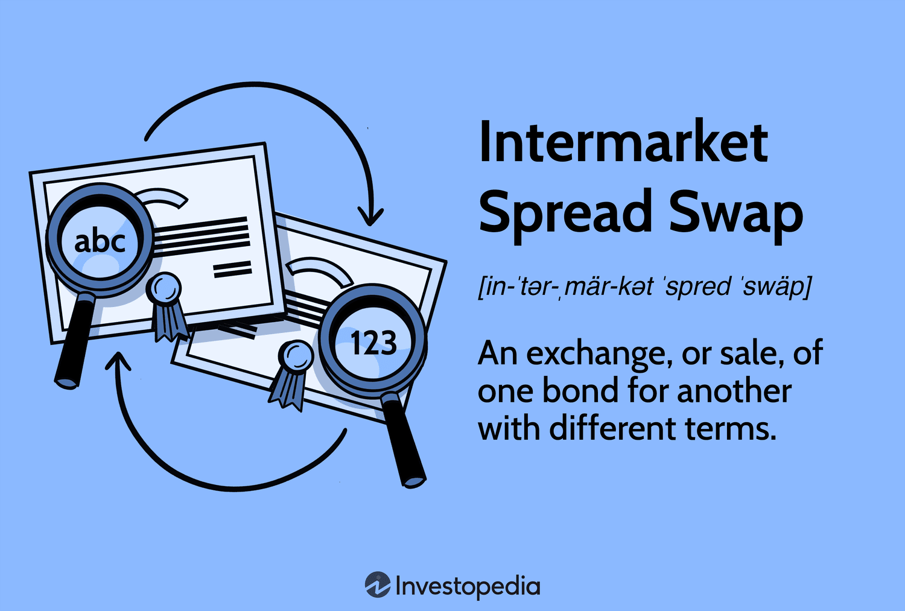

## Table of Contents

## What is an Intermarket Spread Swap?

An Intermarket Spread Swap is a type of financial strategy where an investor trades the difference in prices between two related markets. This is done to take advantage of price differences between similar products or assets that are traded in different markets. For example, an investor might buy oil futures in one market and sell oil futures in another market if they believe the price difference between the two will change in their favor.

This strategy can be used in various markets, like commodities, currencies, or interest rates. The goal is to profit from the spread, or difference, between the two markets. It's important for investors to carefully analyze the markets and understand the risks involved, as the prices in different markets can be affected by many factors, and the strategy might not always work as planned.

## How does an Intermarket Spread Swap differ from a regular swap?

An Intermarket Spread Swap is different from a regular swap because it focuses on the price difference between two related markets, not just swapping one asset for another. In a regular swap, you might exchange one type of asset, like a fixed interest rate for a floating interest rate, to manage risk or meet specific financial needs. The goal is to benefit from the swap itself, without necessarily looking at how different markets interact.

In contrast, an Intermarket Spread Swap involves trading in two different markets to take advantage of their price differences. For example, you might buy wheat in one market and sell it in another if you think the price difference will change in your favor. This strategy is more about betting on the spread between markets rather than just swapping assets. It requires a good understanding of how different markets work and can be riskier because it depends on the behavior of two markets instead of just one.

## What are the primary markets involved in an Intermarket Spread Swap?

The primary markets involved in an Intermarket Spread Swap are often commodity markets, currency markets, and [interest rate](/wiki/interest-rate-trading-strategies) markets. Commodity markets include things like oil, wheat, and gold. Currency markets involve trading different currencies, like dollars and euros. Interest rate markets deal with bonds and other financial instruments that pay interest.

In commodity markets, an investor might buy oil futures in one market and sell them in another, hoping to profit from the price difference. In currency markets, someone might buy euros and sell dollars if they think the exchange rate will change in their favor. Interest rate markets could involve swapping bonds with different interest rates to take advantage of changes in rates between markets. These strategies depend on understanding how prices in different markets move relative to each other.

## What are the benefits of using an Intermarket Spread Swap?

One big benefit of using an Intermarket Spread Swap is the chance to make money from price differences between markets. If you see that the price of oil is lower in one market than another, you can buy it in the cheaper market and sell it in the more expensive one. If the price difference changes in your favor, you can make a profit without needing the overall price of oil to go up or down.

Another benefit is that it can help spread out risk. Instead of putting all your money into one market, you're working with two markets at the same time. This can protect you if one market doesn't do well, because you might still make money from the other market. It's like not putting all your eggs in one basket, which can make your investments safer.

## Can you explain the basic mechanics of executing an Intermarket Spread Swap?

To execute an Intermarket Spread Swap, you first need to find two related markets where you think the price difference will change in your favor. For example, if you think the price of wheat will go up more in one market than another, you would buy wheat in the market where it's cheaper and sell it in the market where it's more expensive. This is called taking a position in the spread between the two markets. You need to keep an eye on both markets and be ready to act when the price difference changes.

Once you've taken your position, you wait for the price difference to move in the direction you predicted. If it does, you close your positions by selling the wheat you bought in the cheaper market and buying back the wheat you sold in the more expensive market. If the price difference has moved in your favor, you'll make a profit from the spread. It's important to manage your positions carefully and be ready to adjust if the markets don't move as expected.

## What are the typical risks associated with Intermarket Spread Swaps?

One big risk with Intermarket Spread Swaps is that the price difference between the two markets might not change the way you expect. If you buy wheat in one market hoping to sell it at a higher price in another market, but the price difference doesn't change or gets worse, you could lose money. This can happen because many things can affect prices in different markets, like weather, politics, or economic news, and it's hard to predict everything.

Another risk is that the costs of trading in two markets can add up. When you buy and sell in different markets, you might have to pay fees, taxes, or other charges. These costs can eat into your profits, or even turn a small profit into a loss. It's important to think about these costs when planning an Intermarket Spread Swap, so you don't end up losing money because of them.

## How do regulatory environments affect Intermarket Spread Swaps?

Regulatory environments can have a big impact on Intermarket Spread Swaps. Different countries have different rules about trading, and these rules can affect how easy or hard it is to do an Intermarket Spread Swap. For example, some countries might have strict rules about trading commodities like wheat or oil, which can make it harder to buy and sell in those markets. If the rules are too strict, it might not be worth doing the swap because it becomes too complicated or expensive.

Also, regulations can change over time, and this can make Intermarket Spread Swaps riskier. If a country changes its rules about trading, it could affect the prices in the markets you're working with. This means you have to keep an eye on the news and be ready to adjust your strategy if the rules change. Keeping up with regulations in different countries can be a lot of work, but it's important if you want to use Intermarket Spread Swaps effectively.

## What strategies can be employed to optimize returns from Intermarket Spread Swaps?

To optimize returns from Intermarket Spread Swaps, it's important to do a lot of research and keep a close eye on the markets you're working with. You need to understand what affects the prices in these markets, like weather for commodities or economic news for currencies. The more you know, the better you can predict how the price difference between the two markets will change. It's also a good idea to use tools like charts and data analysis to help you make better decisions. By staying informed and using the right tools, you can spot good opportunities to make money from the spread.

Another strategy is to manage your risks carefully. Since Intermarket Spread Swaps involve two markets, you need to be ready for things to go wrong in either one. You can do this by setting limits on how much you're willing to lose, and by being ready to close your positions if the markets move against you. It's also smart to spread out your investments, so you're not putting all your money into one swap. By managing your risks well, you can protect your money and increase your chances of making a profit from the spread between the markets.

## How do macroeconomic factors influence Intermarket Spread Swaps?

Macroeconomic factors can have a big impact on Intermarket Spread Swaps because they affect the prices in the markets you're working with. Things like interest rates, inflation, and economic growth can change how much people are willing to pay for commodities, currencies, or bonds. For example, if a country raises its interest rates, its currency might get stronger, which could change the price difference between two currency markets. If you're doing an Intermarket Spread Swap between those markets, this change could affect your profit or loss.

It's important to keep an eye on these macroeconomic factors because they can be hard to predict and can move markets quickly. If there's a big economic event, like a recession or a sudden change in inflation, it can cause big swings in the prices between markets. This means you need to be ready to adjust your strategy if the economic situation changes. By understanding how these factors work and staying up to date with economic news, you can make better decisions about when to enter or [exit](/wiki/exit-strategy) an Intermarket Spread Swap.

## What are some real-world examples of successful Intermarket Spread Swaps?

One real-world example of a successful Intermarket Spread Swap happened in the oil markets. A trader noticed that the price of oil was lower in the New York market than in the London market. They bought oil futures in New York and sold the same amount of oil futures in London. Over time, the price difference between the two markets changed in their favor, and when they closed their positions, they made a profit from the spread.

Another example involved currency markets. A trader saw that the euro was expected to get stronger against the dollar due to economic news in Europe. They bought euros in the spot market and sold euros in the futures market. As the euro did indeed get stronger, the price difference between the spot and futures markets moved in their favor, allowing them to close their positions and make a profit from the spread between the two markets.

## How can advanced analytics be used to predict outcomes in Intermarket Spread Swaps?

Advanced analytics can help predict outcomes in Intermarket Spread Swaps by looking at a lot of data from different markets. These tools can find patterns and trends that might be hard to see just by looking at the markets yourself. For example, they can use [machine learning](/wiki/machine-learning) to analyze past price differences between markets and predict how those differences might change in the future. This can help traders decide when to enter or exit a swap to make the most money.

By using advanced analytics, traders can also understand how different factors, like economic news or weather, might affect the markets they're working with. These tools can run simulations to see how different scenarios might play out, helping traders plan their strategies better. While advanced analytics can't predict the future perfectly, they can give traders a better idea of what might happen, making it easier to make smart decisions about Intermarket Spread Swaps.

## What future trends might impact the use and effectiveness of Intermarket Spread Swaps?

Future trends like technology and global events could change how Intermarket Spread Swaps work. As technology gets better, tools like [artificial intelligence](/wiki/ai-artificial-intelligence) and big data might help traders predict price differences between markets more accurately. This could make Intermarket Spread Swaps more effective because traders can make better decisions. Also, more people might start using these tools, which could make the markets more competitive.

Global events, like changes in trade policies or big economic shifts, could also affect Intermarket Spread Swaps. If countries change their rules about trading, it might be harder or easier to do swaps between different markets. Big economic changes, like a recession or a boom, can also move prices in ways that are hard to predict. Traders will need to stay on top of these trends to keep using Intermarket Spread Swaps successfully.

## References & Further Reading

[1]: Bandy, J.B. (2018). ["Python for Algorithmic Trading: From Idea to Cloud Deployment."](https://home.tpq.io/books/py4at/) 

[2]: Chan, E.P. (2009). ["Quantitative Trading: How to Build Your Own Algorithmic Trading Business."](https://github.com/ftvision/quant_trading_echan_book) Wiley.

[3]: Jansen, S. (2020). ["Machine Learning for Algorithmic Trading."](https://github.com/stefan-jansen/machine-learning-for-trading) Packt Publishing.

[4]: Lopez de Prado, M. (2018). ["Advances in Financial Machine Learning."](https://www.amazon.com/Advances-Financial-Machine-Learning-Marcos/dp/1119482089) Wiley.

[5]: Tomasini, E., & Jaekle, U. (2011). ["Trading Systems: A New Approach to System Development and Portfolio Optimisation."](https://www.amazon.com/Trading-Systems-2nd-development-optimisation/dp/085719755X) Harriman House.