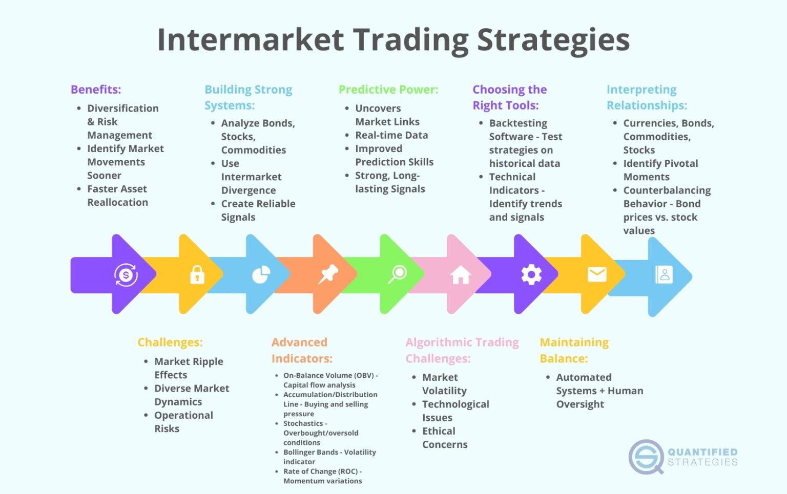

The Intermarket Trading System (ITS) was a revolutionary development in the landscape of financial trading, bridging the gap between various American stock exchanges and setting the stage for future advancements in trading technologies. Established at a time when traditional trading methods dominated the market, ITS represented a significant shift towards more integrated and efficient trading processes. By electronically linking exchanges like the New York Stock Exchange (NYSE) and the Nasdaq, ITS allowed brokers to access and execute trades at the best available prices without the need for intermediaries, thereby enhancing market efficiency.

ITS played a crucial role in the transition from traditional trading, which involved manual processes and lacked real-time data exchange, towards a more advanced, technologically-driven system. Before ITS, traders often had to rely on inefficient and time-consuming methods to gather information about prices across different exchanges. The introduction of ITS eliminated these inefficiencies by providing a single network through which the best prices could be accessed and trades could be executed quickly.

The importance of ITS cannot be overstated, as it was instrumental in promoting market efficiency. By offering seamless access to multiple exchanges, it encouraged price competition and transparency, benefiting both brokers and investors. The system was pivotal in ensuring that trades were executed at the most competitive prices, enhancing market liquidity and fostering an environment conducive to fair trading practices.

As trading technologies continued to evolve, the groundwork laid by ITS paved the way for further innovations, such as algorithmic trading. These advancements have transformed the trading arena by enabling the rapid execution of complex trading strategies, which rely on algorithms to make decisions based on market conditions and data analysis. This article will explore the significant impact of ITS on the trading world and its legacy in setting the stage for contemporary trading technologies such as algorithmic trading and electronic communication networks, highlighting both past achievements and future possibilities in trading systems.

## Table of Contents

## What is the Intermarket Trading System (ITS)?

The Intermarket Trading System (ITS) was an electronic network established to facilitate the connection and integration of several American stock exchanges. Implemented in 1978, it was designed to improve the efficiency and transparency of trading across various markets by enabling brokers to locate and execute securities trades at optimal prices directly, thus reducing the need for intermediaries. This network represented a significant advancement in trading technology by bridging major exchanges, such as the New York Stock Exchange (NYSE) and Nasdaq.

Before the ITS, stock trading was primarily conducted over-the-counter, with transactions typically facilitated by a network of brokers and dealers. This traditional method often resulted in inefficiencies, including higher transaction costs and delays in trade execution. The introduction of the ITS addressed these issues by providing a unified platform where orders could be directly routed and matched across participating exchanges.

An essential feature of the ITS was its ability to offer a consolidated view of quotes and prices from multiple exchanges. This transparency allowed market participants to see where the best prices were available, increasing competition among exchanges and improving price discovery. Furthermore, the system enabled brokers to execute trades at these favorable prices without the intervention of additional parties, enhancing the overall market efficiency.

ITS's innovation lay in its ability to integrate distinct trading venues into a cohesive network. This integration allowed for the seamless transfer of trade information and orders, contributing to the [liquidity](/wiki/liquidity-risk-premium) and depth of markets by linking major exchanges. The system's architecture was groundbreaking at the time, setting the stage for future advancements in electronic trading and paving the way for modern trading technologies we see today.

Overall, the ITS marked a transformative step in the evolution of financial markets by establishing a more interconnected and efficient trading environment. Its legacy persists in the form of contemporary trading systems that continue to leverage technological advancements to maximize market efficiency and provide investors with optimal trading conditions.

## The Evolution and Decline of ITS

The Intermarket Trading System (ITS) was established in 1978 as a pivotal innovation in the financial markets, designed to electronically connect several American stock exchanges. Its creation marked a significant shift from traditional trading practices, providing a mechanism for brokers to access and execute the best available prices across major exchanges like the New York Stock Exchange (NYSE) and Nasdaq. This system was revolutionary for its time, aimed at fostering market efficiency and offering greater transparency.

ITS was instrumental in its ability to link disparate exchanges, facilitating the seamless execution of trades without the necessity of intermediaries. This was accomplished through an electronic network that ensured brokers could match orders with optimal prices, thus enhancing the overall liquidity and competitiveness of the marketplace. In essence, ITS served as a fundamental bridge in a fragmented trading landscape, prioritizing the investor's access to the best possible outcomes.

Despite its initial success and importance, advancements in technology and the emergence of more sophisticated electronic trading systems eventually led to the decline and phase-out of ITS. During the late 1990s and early 2000s, technological innovations transformed trading floors, setting new standards for speed, efficiency, and functionality. Systems such as [algorithmic trading](/wiki/algorithmic-trading) and Electronic Communication Networks (ECNs) began offering superior capabilities to the aging ITS infrastructure.

The New York Stock Exchange (NYSE) and Nasdaq, among other exchanges, gradually discontinued ITS due to these technological advancements. New platforms were developed, providing high-frequency trading capabilities, improved order execution speeds, and unparalleled market access. These modern systems were more adept at handling complex financial instruments and strategies, catering to the demands of an increasingly global and digitized trading environment.

The decision to move away from ITS was influenced by the need for exchanges to remain competitive amidst a rapidly evolving technological landscape. This shift was essential to accommodate the growing [volume](/wiki/volume-trading-strategy) and complexity of trades and to leverage new innovations such as algorithmic trading, which offered traders the ability to execute strategies with unprecedented precision and speed. Consequently, the ITS became obsolete as the markets embraced a new era of digital trading that redefined the mechanisms of inter-exchange operations.

## The Role of Technology in Modern Trading Systems

Technological advancements have significantly transformed trading systems since the inception of the Intermarket Trading System (ITS). In the late 20th century, trading was predominantly manual, with brokers managing orders through telephone calls and physical exchanges. ITS marked a pivotal shift by introducing electronic connectivity between stock exchanges, laying the foundation for more seamless and efficient trading. However, it was the subsequent technological evolutions that truly revolutionized the trading environment.

One of the most transformative technologies in modern trading systems is algorithmic trading. This approach leverages complex mathematical models and algorithms to automate the execution of orders. Algorithms can analyze vast datasets, identify trading opportunities, and execute trades at speeds and efficiencies beyond human capabilities. By automating these processes, algorithmic trading reduces transaction costs, minimizes the impact of human error, and enables more consistent execution of trading strategies.

Alongside algorithmic trading, Electronic Communication Networks (ECNs) have also played a crucial role in advancing trading systems. ECNs facilitate direct trading between participants by providing an electronic venue for matching buy and sell orders. This innovation has greatly increased market liquidity and transparency, allowing for quicker execution of trades and enabling investors to access multiple markets simultaneously with reduced spreads. 

Modern trading systems have surpassed the capabilities of the ITS by achieving unprecedented levels of efficiency and speed. Compared to the ITS, which primarily served as a linkage between exchanges, contemporary systems integrate sophisticated data analytics, real-time market monitoring, and advanced trading strategies. These systems can handle a massive volume of transactions per second and adjust to market movements instantaneously.

Furthermore, the development of high-frequency trading ([HFT](/wiki/high-frequency-trading-strategies)) has pushed the boundaries of what is possible in trading innovation. HFT utilizes powerful computers to transact a large number of orders at extremely fast speeds. Traders aim to capture small price discrepancies that may only exist for microseconds, requiring a technological infrastructure that minimizes latency and maximizes the chances of execution.

In summary, from its roots in the ITS, modern trading systems have evolved into highly efficient, technology-driven environments. Through the incorporation of algorithmic trading, ECNs, and high-frequency strategies, today's systems offer superior performance, greater market access, and enhanced price discovery mechanisms. These advancements signify a substantial leap forward from the limitations of earlier systems, offering significant benefits to traders and investors worldwide.

## Advantages of Modern Intermarket Trading Systems

Modern intermarket trading systems have revolutionized the financial market landscape by offering several advantages over earlier systems like the Intermarket Trading System (ITS). One of the most significant benefits is increased liquidity. These systems link a vast number of exchanges and market participants worldwide, providing traders with access to a broader range of securities and counterparts. This connectivity enhances the availability of buy and sell orders, thus fostering higher trading volumes and tighter bid-ask spreads.

Market access has been greatly expanded through modern trading systems. Investors can now easily engage with global markets regardless of their geographical location, leading to a more diversified portfolio and an ability to respond to international market fluctuations swiftly. This expansion facilitates a more inclusive market where small and large investors alike can partake in a vast array of investment opportunities.

The speed and efficiency of executing trades have dramatically improved. Modern systems utilize electronic communication networks (ECNs) and advanced algorithms, allowing trades to be executed in milliseconds. This is a substantial improvement from the latency experienced during the ITS era, where trades were often delayed due to slower technology and manual intervention. The increased speed facilitates more effective [arbitrage](/wiki/arbitrage), ensuring that price discrepancies between different markets are quickly exploited and corrected, contributing to overall market efficiency.

Cost reduction is another notable advantage. The automation and integration of modern systems reduce the need for intermediaries and the associated costs. This cost-effectiveness is passed on to investors in the form of lower transaction fees. Additionally, the efficiency of electronic systems reduces operational costs for brokerage firms and exchanges, who can operate with fewer human resources and overheads.

Modern intermarket trading systems have also improved price discovery. With more market data available in real-time, traders can better evaluate market conditions and make more informed decisions. The transparency and availability of data from various exchanges allow for more accurate pricing of securities, benefiting investors through fair market valuations.

Overall, the advancements in modern intermarket trading systems provide a more efficient, accessible, and cost-effective trading environment, aligning with the increasingly globalized nature of financial markets.

## Challenges and Risks in Intermarket Trading

Intermarket trading, while offering numerous benefits, presents several challenges and risks that traders and financial institutions must navigate. A primary concern in intermarket trading is increased [volatility](/wiki/volatility-trading-strategies). This volatility stems from the rapid movement of prices across different markets and exchanges, often exacerbated by real-time information dissemination and speculative trading activities. The interconnected nature of markets means that a significant event in one market can have ripple effects on others, leading to synchronized price movements and increased volatility.

High-frequency trading (HFT) introduces additional complexities in intermarket trading. These algorithm-driven trades occur at speeds beyond human capabilities, leveraging minute price discrepancies across markets for profit. While HFT can enhance market liquidity and efficiency, it also contributes to sudden market fluctuations and can exacerbate volatility during periods of market stress. Furthermore, the deployment of sophisticated trading algorithms can lead to unintended consequences resulting from coding errors or unforeseen interactions among different trading strategies.

Regulatory compliance remains another significant challenge. The global nature of intermarket trading means that traders must adhere to a complex web of regulations across different jurisdictions, each with its rules regarding transparency, reporting, and trading practices. Regulatory frameworks must continuously evolve to address the challenges posed by technological advancements in trading. Compliance with these regulations can be resource-intensive and requires firms to invest in robust systems for monitoring and reporting trades across multiple markets.

To mitigate these risks, several strategies can be employed. Implementing risk management protocols, such as setting stop-loss orders and position limits, can help curtail potential losses during volatile market conditions. Diversifying trading strategies and portfolios reduces exposure to isolated market events. Additionally, stress testing trading algorithms against historical market data can identify potential vulnerabilities before deployment.

Advancements in technology, particularly in [machine learning](/wiki/machine-learning) and [artificial intelligence](/wiki/ai-artificial-intelligence) (AI), offer tools that can enhance risk management in intermarket trading. AI models can analyze vast datasets to predict market movements and manage risk more effectively. These models can detect anomalies and alert traders to potential systemic risks, enabling proactive measures.

Furthermore, fostering greater communication and cooperation between global regulatory bodies can streamline compliance processes, reducing the burden on traders and promoting a more harmonized approach to intermarket trading regulation. By addressing these challenges through strategic planning and technological integration, the risks associated with intermarket trading can be substantially mitigated, enhancing the stability and integrity of the global trading environment.

## Intermarket Trading Strategies and Techniques

Intermarket trading strategies utilize the interconnectedness of different markets to capitalize on price inefficiencies and improve trade execution. These strategies are pivotal in achieving optimum trading results, and their effectiveness is often enhanced through analytical techniques like correlation analysis, spread trading, and cross-asset trading.

Correlation analysis is a fundamental technique used to identify the relationship between different market assets. By calculating the correlation coefficient, traders can determine how the price movement of one security might affect another. The correlation coefficient, $r$, is calculated as follows:

$$
r = \frac{\sum{(X_i - \bar{X})(Y_i - \bar{Y})}}{\sqrt{\sum{(X_i - \bar{X})^2} \sum{(Y_i - \bar{Y})^2}}}
$$

where $X$ and $Y$ are the price vectors of two securities. A correlation coefficient close to +1 indicates a strong positive correlation, while a value close to -1 indicates a strong negative correlation. Traders leverage this information to predict potential price movements and adjust their trading positions accordingly.

Spread trading involves taking long and short positions simultaneously in related securities. This technique aims to profit from the price differential between the two. By going long on an undervalued security and short on an overvalued one, traders can benefit when the spread converges. This strategy requires a robust understanding of market fundamentals as well as historical price behaviors to predict alignment of spread values over time.

Cross-asset trading extends these concepts further by engaging in trades across different asset classes, such as equities, commodities, or currencies. This strategy can diversify risk and exploit market inefficiencies evident in particular asset classes. Cross-asset correlations are crucial for traders to understand potential diversification benefits and risk exposures.

Effective intermarket trading strategies rely heavily on both technical and [fundamental analysis](/wiki/fundamental-analysis). Technical analysis involves the study of past market data, primarily price and volume, to predict future price movements. Tools such as moving averages, relative strength index (RSI), and Fibonacci retracements are often employed to identify potential trading opportunities.

In parallel, fundamental analysis assesses an asset's intrinsic value by evaluating related economic, financial, and other qualitative and quantitative factors. This includes reviewing company earnings reports, market conditions, and macroeconomic indicators. Fundamental analysis helps validate or refute signals derived from technical analysis, providing a balanced approach to strategy development.

Collectively, the ability to combine these techniques and analyses empowers traders to effectively leverage intermarket linkages. By understanding and applying these strategies, traders can enhance their decision-making process and potentially increase their return on investment in complex trading environments.

## Global Intermarket Trading Initiatives and Developments

The global expansion of intermarket trading has been driven by initiatives aimed at enhancing market connectivity and access. These efforts seek to unify diverse markets into a cohesive trading network, enabling investors to execute trades across multiple platforms seamlessly. Such initiatives have leveraged advances in technology, fostering improved communication and reducing transaction costs on a global scale.

International collaborations have played a crucial role in facilitating these global trading networks. Exchanges from different countries have formed alliances and partnerships to offer cross-border trading opportunities. These collaborations enable exchanges to share technology, infrastructure, and liquidity, reducing barriers to entry for international investors. For example, the Euronext group, created through the merger of various European exchanges, provides a unified platform for trading a wide range of financial instruments across multiple countries.

Technological advancements have been central to the development of global intermarket trading systems. Technologies such as electronic communication networks (ECNs) and advanced order routing systems allow traders to access multiple markets simultaneously, ensuring the best available pricing. Furthermore, the integration of AI and machine learning in trading algorithms has enhanced the ability of traders to analyze vast amounts of data quickly, optimizing decision-making processes.

Key developments in global intermarket trading systems include the rise of algorithmic trading, which allows for the execution of pre-programmed trading instructions at speeds and frequencies beyond human capabilities. This development has led to increased market liquidity and efficiency. Additionally, blockchain technology is being explored as a means to enhance transparency and security in trading processes, potentially revolutionizing settlement systems and record-keeping.

Looking ahead, future trends in intermarket trading are likely to focus on further enhancements in connectivity and technology. The ongoing digitalization of financial markets is expected to increase accessibility and reduce costs, enabling a more diverse range of participants to engage in trading activities. Furthermore, the integration of emerging technologies such as quantum computing could provide unprecedented processing power, further transforming trading strategies and efficiencies.

In conclusion, global intermarket trading initiatives are focused on creating a more interconnected and efficient market landscape. Through international collaborations and technological innovations, these efforts aim to enhance market accessibility and streamline trading processes, paving the way for future advancements in the global financial ecosystem.

## The Future of Intermarket Trading Systems

Advancements in technology, such as artificial intelligence (AI) and blockchain, are poised to significantly influence the evolution of intermarket trading systems. These innovations promise to enhance the capabilities of current trading systems, providing increased efficiency, improved transparency, and fostering a more globalized market environment.

Artificial intelligence is at the forefront of transforming intermarket trading systems. AI algorithms can analyze vast amounts of data far more quickly and accurately than a human can. This capability allows for the identification of market trends and patterns that can be leveraged for more effective trading strategies. Furthermore, AI-driven predictive analytics enable traders to better anticipate market movements, thereby improving decision-making processes. Machine learning, a subset of AI, is instrumental in developing adaptive algorithms that can evolve with market conditions, reducing the latency and increasing the accuracy of trade executions.

Blockchain technology, known for its decentralized and immutable characteristics, offers a solution to many challenges facing traditional trading systems. By providing a transparent and tamper-proof ledger of transactions, blockchain can significantly enhance the transparency and security of trading processes. This technology could allow for faster and more secure settlement processes, reducing the risk of fraud or errors. Furthermore, smart contracts—self-executing contracts with the terms of the agreement directly written into code—could automate and enforce transactional rules, streamlining operations and reducing the need for intermediaries.

Emerging trends within the intermarket trading ecosystem include the integration of these technologies into existing systems. For instance, hybrid trading platforms that combine AI for predictive analytics with blockchain for transparent record-keeping are expected to revolutionize trading operations by offering unmatched efficiency and reliability. The use of decentralized finance (DeFi) platforms, which enable trading without traditional financial intermediaries, is increasingly gaining traction and could further globalize market access, allowing traders from various geographical locations to participate seamlessly.

The potential for intermarket trading systems to improve in efficiency, transparency, and globalization is considerable. With AI-driven automation, trade executions can occur with minimal delay, enhancing market liquidity and reducing costs. Blockchain's ledger capabilities ensure that all actions within the trading process are documented and verifiable, thereby discouraging market manipulation and increasing investor confidence.

Looking toward the future, the ongoing integration of AI and blockchain into trading systems suggests a paradigm shift in how intermarket trading functions. These technologies offer the potential for a more inclusive global market structure, where barriers to entry are lowered, transactions occur more swiftly, and both investors and regulators can operate with greater trust and efficiency. As these innovations continue to mature, the intermarket trading landscape will likely become progressively more integrated, transparent, and responsive to the needs of a rapidly evolving global marketplace.

## Conclusion

The transition from the Intermarket Trading System (ITS) to modern trading systems epitomizes the profound impact of technological advancements on financial markets. ITS, introduced in 1978, was a groundbreaking development in linking various American stock exchanges, offering brokers the ability to access the best prices across these platforms. This system laid the groundwork for increasing market efficiency, fostering an environment that encouraged seamless transactions and liquidity.

As technology advanced, so did trading mechanisms. The decline of ITS was a natural progression towards more sophisticated and efficient electronic trading systems. Modern innovations, such as algorithmic trading and electronic communication networks (ECNs), have dramatically surpassed the capabilities of ITS. They provide unparalleled speed and efficiency, reduce transaction costs, and optimize price discovery processes for investors. These advancements have fundamentally reorganized how trades are executed, shifting from manual processes to highly automated environments underpinned by complex algorithms and data analytics.

The role of technology in shaping the future of trading cannot be overstated. With continuous advancements like artificial intelligence and blockchain, the ongoing evolution of intermarket trading systems promises further enhancements in efficiency, transparency, and global market access. Developments in AI, for instance, are expected to enhance decision-making processes, offering predictive analytics and automated trading strategies that adapt to real-time market conditions. Blockchain technology, on the other hand, could revolutionize trading by ensuring heightened security and transparency, aspects crucial for building trust in global trading networks.

The future of intermarket trading systems is poised for transformative changes. Innovations are expected to continue streamlining processes, reducing latency, and expanding connectivity among global markets. The integration of new technologies will likely lead to more robust and versatile trading environments, capable of accommodating the growing complexity and speed of financial transactions. As trading systems evolve, they will undoubtedly contribute to a more integrated and globally cohesive financial market structure, positioning them at the forefront of technological and financial innovation.

## References & Further Reading

[1]: Schwartz, R. A., & Weber, B. W. (2006). ["The Equity Trader Course"](https://onlinelibrary.wiley.com/doi/book/10.1002/9781119201823). John Wiley & Sons.

[2]: Launis, S. (2003). ["Intermarket Trading System: An Analysis"]. Journal of Behavioral Finance, 4(1), 31-42. 

[3]: Hasbrouck, J. (1995). ["One Security, Many Markets: Determining the Contributions to Price Discovery"](https://www.bauer.uh.edu/rsusmel/phd/hasbrouck95.pdf). The Journal of Finance, 50(4), 1175-1199.

[4]: Harris, L. (2002). ["Trading and Exchanges: Market Microstructure for Practitioners"](https://www.amazon.com/Trading-Exchanges-Market-Microstructure-Practitioners/dp/0195144708). Oxford University Press.

[5]: O'Hara, M. (1995). ["Market Microstructure Theory"](https://openlibrary.org/books/OL1103097M/Market_microstructure_theory). Wiley-Blackwell.