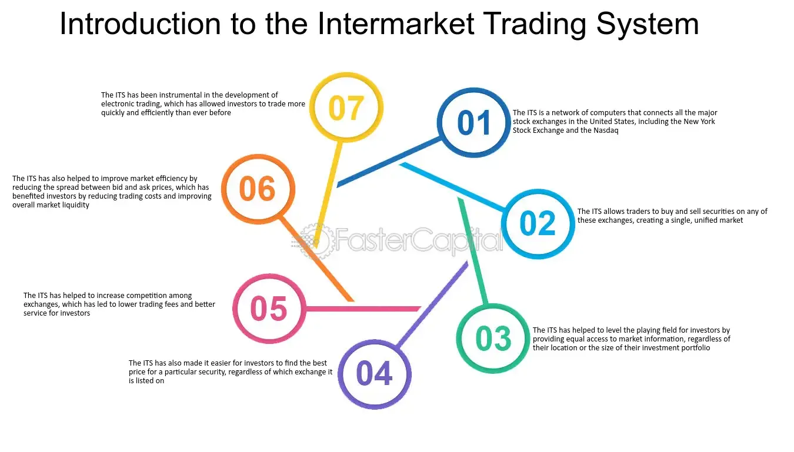

## Table of Contents

## What is the Intermarket Trading System (ITS)?

The Intermarket Trading System (ITS) is a computer-based network that connects different stock exchanges in the United States. It helps traders buy and sell stocks more easily by allowing them to see prices and make trades across multiple exchanges. This system was created to improve the efficiency of the stock market and make sure that investors get the best possible prices for their trades.

Before the ITS, if a stock was listed on one exchange, like the New York Stock Exchange, and a trader wanted to buy or sell it on another exchange, like the American Stock Exchange, it was difficult. The ITS made this process simpler by linking these exchanges together. This way, if a better price was available on another exchange, the trade could happen there instead, helping to keep the market fair and efficient for everyone.

## How does the ITS facilitate trading between different markets?

The Intermarket Trading System (ITS) makes trading between different stock markets easier by connecting them through a computer network. When a trader wants to buy or sell a stock, the ITS lets them see the prices on different exchanges. If the stock is listed on the New York Stock Exchange but has a better price on the American Stock Exchange, the ITS helps the trader make the trade on the exchange with the better price.

This system helps keep the market fair because it makes sure that traders can always find the best price available. Before the ITS, it was hard to know what prices were available on other exchanges, and traders might miss out on better deals. By linking the exchanges together, the ITS makes the whole process smoother and more efficient, helping everyone get the best possible prices for their trades.

## What are the main components of the ITS?

The Intermarket Trading System (ITS) has a few main parts that help it work well. One important part is the computer network that connects all the different stock exchanges. This network lets traders see prices from different places and helps them make trades where the prices are best. Another part is the communication system that sends information quickly between the exchanges. This makes sure that when a trader wants to buy or sell a stock, the trade can happen fast and smoothly.

Another key part of the ITS is the software that manages the trades. This software keeps track of all the orders and makes sure they go to the right exchange. It also helps make sure that the trades are fair and that everyone gets the best price. Together, these parts make the ITS a helpful tool for traders, making it easier for them to buy and sell stocks across different markets.

## Who can use the ITS and what are the eligibility criteria?

The Intermarket Trading System (ITS) is mainly for people who work in the stock market, like brokers and traders. These are the people who buy and sell stocks for themselves or for their clients. To use the ITS, they need to be part of a stock exchange that is connected to the ITS. This means they have to work for a firm that is a member of one of these exchanges.

There are no special rules or tests that someone has to pass to use the ITS, but they do need to follow the rules of the exchange they are part of. These rules make sure that trading is fair and that everyone plays by the same rules. So, as long as a broker or trader is working for a member firm of a connected exchange and follows the rules, they can use the ITS to help them buy and sell stocks more easily.

## What types of securities can be traded through the ITS?

The Intermarket Trading System (ITS) mainly helps with trading stocks that are listed on different stock exchanges in the United States. These stocks can be from big companies like Apple or smaller ones that are not as well-known. The ITS makes it easier for traders to buy and sell these stocks by connecting the exchanges where they are listed.

Besides stocks, the ITS can also handle trading of other types of securities, like exchange-traded funds (ETFs). ETFs are like baskets of stocks that you can buy and sell like a single stock. By using the ITS, traders can find the best prices for these securities across different exchanges, making the trading process smoother and more efficient.

## How does the ITS handle order routing and execution?

The Intermarket Trading System (ITS) makes trading easier by helping with order routing and execution. When a trader wants to buy or sell a stock, they send an order through their exchange. The ITS then looks at prices on other connected exchanges to see if there's a better deal. If there is, the ITS sends the order to that exchange where the price is better. This way, the trader gets the best price possible.

Once the ITS finds the best price, it helps with the execution of the order. This means it makes sure the trade happens quickly and correctly. The ITS uses special software to manage all these orders and make sure they go to the right place. This helps keep trading fair and efficient for everyone involved.

## What are the benefits of using the ITS for traders and investors?

Using the Intermarket Trading System (ITS) helps traders and investors a lot. It connects different stock exchanges, so traders can see prices from many places. This means they can find the best price for a stock, no matter which exchange it's on. For example, if a stock is cheaper on the American Stock Exchange than on the New York Stock Exchange, traders can buy it at the lower price. This helps them save money and get better deals.

The ITS also makes trading faster and easier. When a trader wants to buy or sell a stock, the ITS quickly sends their order to the exchange with the best price. This makes sure the trade happens fast and smoothly. Because the ITS handles everything, traders don't have to worry about missing out on good prices or dealing with slow trading. This makes the whole process more efficient and helps investors get the best value for their trades.

## What are the potential risks or limitations associated with the ITS?

Using the Intermarket Trading System (ITS) can have some risks and limitations. One big problem is that it depends a lot on technology. If there's a problem with the computer network or the software, it can slow down trading or stop it completely. This can be frustrating for traders and might make them miss out on good prices. Also, because the ITS links many exchanges together, if something goes wrong in one place, it could affect trading everywhere.

Another limitation is that the ITS might not be perfect at finding the best prices all the time. Sometimes, there can be delays in getting the latest price information from all the connected exchanges. This means traders might not always get the very best deal. Also, the ITS is mainly for stocks and some other securities like ETFs. If traders want to trade other types of investments, like bonds or commodities, they might need to use different systems.

## How has the ITS evolved since its inception?

Since it started, the Intermarket Trading System (ITS) has changed a lot to keep up with new technology and the needs of traders. At first, the ITS was all about making it easier to trade stocks between different stock exchanges in the United States. It did this by connecting these exchanges through a computer network. Over time, the system got better and faster as technology improved. This meant traders could see prices from different exchanges more quickly and make trades faster.

As the stock market grew and more types of investments became popular, the ITS had to change too. It started to include trading of other securities like exchange-traded funds (ETFs). The system also had to deal with more trading happening electronically. This led to the ITS becoming part of bigger, more advanced trading systems. Even though the ITS is not used as much today because of newer technology, it played a big role in making the stock market more connected and efficient.

## Can you explain the technological infrastructure supporting the ITS?

The Intermarket Trading System (ITS) relies on a strong computer network to connect different stock exchanges across the United States. This network helps traders see prices from different places quickly. It's like a big highway for information, making sure that prices and orders can move fast between exchanges. The ITS uses special software to keep track of all these orders and make sure they go to the right exchange. This software helps manage the trades and makes sure everything happens smoothly.

Over time, the technology behind the ITS has gotten better. At first, it was all about connecting exchanges so traders could see prices and make trades more easily. As computers got faster and more powerful, the ITS could handle more information and make trades happen even quicker. This meant traders could get the best prices without waiting too long. Even though newer systems have taken over some of its roles, the ITS helped lay the groundwork for the advanced trading networks we use today.

## How does the ITS integrate with other trading systems and platforms?

The Intermarket Trading System (ITS) works together with other trading systems and platforms to make trading easier. It connects different stock exchanges so traders can see prices from all of them. If a trader wants to buy or sell a stock, the ITS can send their order to the exchange with the best price. This helps traders get the best deals. The ITS also shares information with other systems, like electronic trading platforms, so everyone can see the latest prices and make trades quickly.

Over time, the ITS has become part of bigger and more advanced trading networks. These new systems can do more things and handle more types of investments. But the ITS still plays a role by helping these new systems work together. It makes sure that orders can move smoothly between different exchanges and platforms. This way, even though the ITS might not be the main system anymore, it helps keep the whole trading world connected and efficient.

## What future developments are expected for the ITS and how might they impact trading?

The Intermarket Trading System (ITS) is likely to keep changing as technology gets better. It might become even more connected with new trading systems and platforms. This could mean faster trading and more types of investments that can be traded through the ITS. As more people start using electronic trading, the ITS might need to work even better with these new systems to keep up with everyone's needs.

These changes could make trading easier and quicker for everyone. Traders might be able to find the best prices even faster, and new types of investments could be added to the system. This would help keep the stock market fair and efficient. But, it's also important to make sure these new systems are safe and work well, so traders don't run into problems when they're trying to buy or sell stocks.

## What are Intermarket Trading Strategies and Techniques?

Intermarket trading strategies utilize the interconnectedness of different markets to capitalize on price inefficiencies and improve trade execution. These strategies are pivotal in achieving optimum trading results, and their effectiveness is often enhanced through analytical techniques like correlation analysis, spread trading, and cross-asset trading.

Correlation analysis is a fundamental technique used to identify the relationship between different market assets. By calculating the correlation coefficient, traders can determine how the price movement of one security might affect another. The correlation coefficient, $r$, is calculated as follows:

$$
r = \frac{\sum{(X_i - \bar{X})(Y_i - \bar{Y})}}{\sqrt{\sum{(X_i - \bar{X})^2} \sum{(Y_i - \bar{Y})^2}}}
$$

where $X$ and $Y$ are the price vectors of two securities. A correlation coefficient close to +1 indicates a strong positive correlation, while a value close to -1 indicates a strong negative correlation. Traders leverage this information to predict potential price movements and adjust their trading positions accordingly.

Spread trading involves taking long and short positions simultaneously in related securities. This technique aims to profit from the price differential between the two. By going long on an undervalued security and short on an overvalued one, traders can benefit when the spread converges. This strategy requires a robust understanding of market fundamentals as well as historical price behaviors to predict alignment of spread values over time.

Cross-asset trading extends these concepts further by engaging in trades across different asset classes, such as equities, commodities, or currencies. This strategy can diversify risk and exploit market inefficiencies evident in particular asset classes. Cross-asset correlations are crucial for traders to understand potential diversification benefits and risk exposures.

Effective intermarket trading strategies rely heavily on both technical and [fundamental analysis](/wiki/fundamental-analysis). Technical analysis involves the study of past market data, primarily price and [volume](/wiki/volume-trading-strategy), to predict future price movements. Tools such as moving averages, relative strength index (RSI), and Fibonacci retracements are often employed to identify potential trading opportunities.

In parallel, fundamental analysis assesses an asset's intrinsic value by evaluating related economic, financial, and other qualitative and quantitative factors. This includes reviewing company earnings reports, market conditions, and macroeconomic indicators. Fundamental analysis helps validate or refute signals derived from technical analysis, providing a balanced approach to strategy development.

Collectively, the ability to combine these techniques and analyses empowers traders to effectively leverage intermarket linkages. By understanding and applying these strategies, traders can enhance their decision-making process and potentially increase their return on investment in complex trading environments.

## References & Further Reading

[1]: Schwartz, R. A., & Weber, B. W. (2006). ["The Equity Trader Course"](https://onlinelibrary.wiley.com/doi/book/10.1002/9781119201823). John Wiley & Sons.

[2]: Launis, S. (2003). ["Intermarket Trading System: An Analysis"]. Journal of Behavioral Finance, 4(1), 31-42. 

[3]: Hasbrouck, J. (1995). ["One Security, Many Markets: Determining the Contributions to Price Discovery"](https://www.bauer.uh.edu/rsusmel/phd/hasbrouck95.pdf). The Journal of Finance, 50(4), 1175-1199.

[4]: Harris, L. (2002). ["Trading and Exchanges: Market Microstructure for Practitioners"](https://www.amazon.com/Trading-Exchanges-Market-Microstructure-Practitioners/dp/0195144708). Oxford University Press.

[5]: O'Hara, M. (1995). ["Market Microstructure Theory"](https://openlibrary.org/books/OL1103097M/Market_microstructure_theory). Wiley-Blackwell.