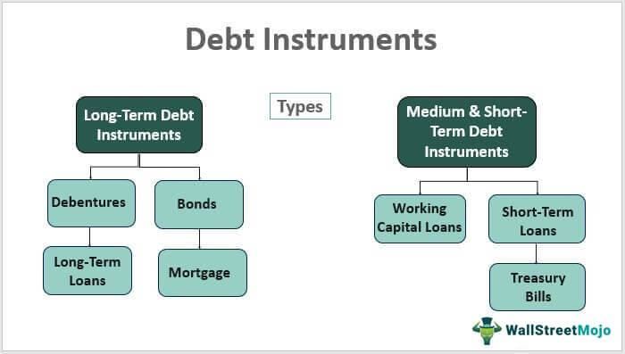

In the intricate world of finance, debt management is a crucial aspect that influences both personal and corporate financial stability. Medium-term debt, characterized by maturities ranging from two to ten years, distinguishes itself from short-term and long-term debts by offering a middle ground in terms of interest rates and risk exposure. Understanding and managing these debts effectively is vital for ensuring financial health and sustainability.

Medium-term debt encompasses various financial instruments such as treasury notes and corporate bonds. These instruments are pivotal not only for investors seeking balanced risk-reward profiles but also for issuers aiming to finance operations without committing to excessively long repayment periods. The dynamics of medium-term debt are increasingly important in today's financial landscape, where there is a noticeable decline in long-term debt issuance. This shift underscores the necessity for strategizing around medium-term debt to meet both short and long-term financial objectives.



As financial systems continue to evolve, modern technologies like algorithmic trading present new opportunities for enhancing debt management strategies. Algorithmic trading, with its ability to process large datasets and execute trades at optimal times, offers significant potential in managing medium-term debt. By automating investment strategies, traders can optimize yields and minimize risks, efficiently navigating the complexities of debt portfolios.

This article will explore the nature and significance of medium-term debt, contrasting it with its short and long-term counterparts. Furthermore, we will examine the role of algorithmic trading in debt management, showcasing how technology contributes to more effective financial strategies.

## Table of Contents

## Understanding Medium-Term Debt

Medium-term debt ranges from two to ten years and offers a middle ground in financial commitments, balancing risk and return between short-term and long-term options. Key examples of medium-term debt instruments are treasury notes and corporate bonds. These instruments play a vital role within investment portfolios by helping to manage risk and return profiles effectively.

Treasury notes are government-issued securities that typically mature in two to ten years. They provide a dependable source of income for investors while maintaining moderate exposure to interest rate changes. Similarly, corporate bonds issued by companies offer investors an opportunity to earn higher yields compared to government securities, reflecting their inherent credit risk.

The yield from medium-term debt is positioned between that of short-term and long-term instruments. Short-term debts generally yield less due to their lower risk and shorter time frames, while long-term debts offer higher yields to compensate for the increased risk over time. Medium-term debt yields thus provide a moderate [interest rate](/wiki/interest-rate-trading-strategies) risk, making them attractive to a certain class of investors.

Recent trends highlight a decline in long-term debt issuance, resulting in medium-term debt assuming a more significant role. Factors driving this shift include changing economic conditions and issuer preferences for optimizing their capital structure. In an environment where long-term debt becomes less prevalent, medium-term debt securities gain importance for both issuers seeking to manage their liabilities and investors seeking balanced returns.

The analysis of medium-term debt dynamics underscores their pivotal role in investment strategies and borrowing decisions. By understanding how these instruments operate within the financial landscape, investors can better align their portfolios to meet their financial goals while managing risk exposure effectively.

## Key Characteristics of Medium-Term Debt

Medium-term debt, which spans a maturity period of two to ten years, exhibits distinct characteristics that make it a pivotal financial instrument for managing mid-range financial obligations. These debts are allocated based on their maturity and yield factors, providing a structured approach to managing economic pressures.

One primary attribute of medium-term debt is its ability to balance risk and reward through navigation of various economic cycles. This balance is crucial for investors who seek a moderate level of exposure to interest rate fluctuations, which can significantly impact debt securities. Unlike short-term debt that typically exhibits lower yields due to minimal interest rate risk, medium-term debt offers higher yields. However, it also incurs more interest rate risk than its short-term counterparts while remaining less risky compared to long-term debt.

The relationship between interest rates and bond prices underlines the behavior of medium-term debt in response to market conditions. Interest rate changes inversely affect bond prices, a principle encapsulated by the duration, which measures the sensitivity of a bond's price to a change in interest rates. Medium-term debt typically has a duration that signifies moderate sensitivity. Therefore, an investor’s ability to anticipate and react to interest rate changes is critical for managing these instruments effectively.

Inflation is another [factor](/wiki/factor-investing) significantly impacting medium-term debt. An increase in inflation generally leads to higher interest rates as investors demand greater returns to compensate for the reduced purchasing power of future cash flows. Consequently, managing medium-term debt requires an understanding of inflationary trends and policies, as these elements significantly influence return outcomes.

In conclusion, medium-term debt serves as an essential tool for managing financial strategies over a mid-range period, offering a balanced approach to risk and reward. Investors must consider interest rate fluctuations and inflation to optimize their portfolio strategies in response to shifting economic conditions.

## Debt Management Strategies

Effective debt management involves a set of strategies aimed at minimizing costs and mitigating risks. These strategies are essential for handling medium-term debt, which typically spans from two to ten years. An important aspect of managing medium-term debt is optimizing interest payouts. This can be achieved through refinancing, where an existing debt is replaced with a new one under more favorable terms, such as a lower interest rate. Refinancing can significantly reduce the interest burden, thereby improving cash flow.

Rate lock-ins are another vital strategy in medium-term debt management. These involve securing a fixed interest rate for the duration of the debt term to protect against future rate increases. By locking in rates, debt holders can predict and plan their financial obligations more accurately, avoiding the [volatility](/wiki/volatility-trading-strategies) associated with fluctuating interest rates. Additionally, rate lock-ins provide a stable financial outlook, crucial for both individual and corporate financial planning.

Diversified investments serve as a buffer against market volatility and economic downturns. By spreading investments across various asset classes and geographical regions, investors can reduce the impact of adverse conditions in any single market. This diversification of portfolios ensures that risk is mitigated while opportunities for returns are maximized.

Proactive planning and financial advisement are integral components of maintaining a robust financial portfolio. Engaging with financial advisors empowers debt holders to craft tailored strategies that accommodate market conditions and individual risk appetites. Advisors utilize tools such as interest rate forecasts and market analytics to guide decisions, ensuring that debt management strategies align with broader financial goals.

Preparing for maturity adjustments is crucial within the medium-term framework. As debt instruments near their maturation, evaluation of refinancing options or reallocation of capital is recommended. This ensures continued optimization of financial resources and adaptation to evolving economic conditions.

In conclusion, effective management of medium-term debt requires a balanced approach that incorporates refinancing, rate lock-ins, diversified investments, and proactive planning. By implementing these strategies, debt holders can maintain financial stability and achieve their long-term investment objectives.

## Algorithmic Trading and Debt Management

Algorithmic trading, an innovation entrenched in modern financial markets, utilizes computer programs and pre-defined algorithms to execute trades rapidly and efficiently. This technology significantly enhances the management of medium-term debts by integrating debt-related data points into algorithmic models, thereby automating investment strategies and optimizing yields while minimizing associated risks.

Incorporating [algorithmic trading](/wiki/algorithmic-trading) for debt management employs advanced computational techniques, such as yield curve analysis and credit spread trading. Yield curve analysis involves examining the relationship between interest rates and different debt maturities, providing insights into future interest rates and economic activity expectations. By analyzing shifts in the yield curve, algorithmic systems can predict potential changes in medium-term debt pricing and adjust portfolios accordingly to maintain optimal yield levels.

Credit spread trading, another key tool, involves trading instruments based on the spread difference between varying credit risks. Algorithms can swiftly evaluate credit risks associated with different debt instruments and make informed trading decisions to maximize returns while mitigating risks. By leveraging these tools, algorithmic trading provides a competitive advantage over traditional debt management methodologies, especially in dynamically changing financial environments.

Algorithmic trading systems can also implement data-driven decision-making processes by continuously evaluating macroeconomic indicators and interest rate trends. These systems are typically programmed to adhere to predefined rules and thresholds, ensuring disciplined and unemotional trading decisions. For instance, by setting up automated responses to specific market conditions, traders can effectively manage the timing of debt issuance or refinancing activities, thus capturing favorable interest rate environments.

Furthermore, algorithmic trading utilizes [machine learning](/wiki/machine-learning) techniques to enhance predictive accuracy in debt management strategies. Machine learning models can process vast datasets to identify patterns and correlations that might not be apparent through conventional analysis. This capability allows traders to refine strategies dynamically, improving the precision of their investment decisions over time.

To illustrate the effectiveness of algorithmic trading within debt management, consider the following simple Python code snippet that models a basic algorithmic strategy for yield optimization:

```python
import numpy as np

def simple_yield_optimization(debt_values, interest_rates):
    # Calculate the potential yield for each debt instrument
    yields = [value * rate for value, rate in zip(debt_values, interest_rates)]

    # Determine the portfolio with the maximum yield
    max_yield_index = np.argmax(yields)

    return max_yield_index, yields[max_yield_index]

debt_instruments = [100000, 150000, 200000]  # Example debt values
interest_rates = [0.03, 0.04, 0.035]  # Corresponding interest rates

optimal_index, optimal_yield = simple_yield_optimization(debt_instruments, interest_rates)
print(f"Optimal Debt Instrument Index: {optimal_index} with Yield: {optimal_yield}")
```

This code models a straightforward algorithm to optimize a portfolio's yield based on input values and interest rates. While simplistic, it highlights the computational potential of algorithmic trading in monitoring and managing debt portfolios effectively.

Adopting algorithmic trading techniques for medium-term debt management allows market participants to engage with fast-paced financial landscapes more effectively, ensuring yields are maximized while risks are prudently controlled. The synergy between technology and finance continues to transform debt management into a field marked by efficiency and strategic sophistication.

## Risks and Challenges

Medium-term debt presents several risks and challenges that necessitate careful management to ensure successful financial outcomes. One of the primary risks associated with medium-term debt is interest rate risk. This risk arises because changes in prevailing interest rates can affect the value of debt instruments. When interest rates rise, the market value of existing debt with lower rates may decrease, leading to potential capital losses for investors. For instance, the price of a bond can be inversely related to the change in interest rates, expressed mathematically as:

$$

\Delta P \approx -D \times \Delta y 
$$

where $\Delta P$ is the change in bond price, $D$ is the bond's duration, and $\Delta y$ is the change in yield.

Credit risk is another significant concern, referring to the possibility that the debt issuer may default on its obligations. Creditworthiness can fluctuate based on economic conditions or issuer-specific events, influencing the yield spreads demanded by investors as compensation for added risk.

Inflation risk affects the real value of returns generated from debt instruments. If inflation rises, the purchasing power of the returns declines, eroding real income. Thus, medium-term debt, typically offering fixed returns, may fail to keep pace with inflation surges unless inflation-adjusted securities are employed.

Liquidity risk is also pertinent to medium-term debt. It involves the challenge of selling the debt instruments in the secondary market without incurring substantial price disruptions. The [liquidity](/wiki/liquidity-risk-premium) of a debt instrument can depend on numerous factors, including market conditions, the size of the investment vehicle, and investor demand.

Mitigating these risks is crucial for sound debt management and involves various strategies:

1. **Interest Rate Risk Management**: Investors might use hedging strategies, like interest rate swaps or options, to manage exposure to interest rate fluctuations effectively.

2. **Credit Risk Management**: Periodic assessments of issuer credit quality and diversification across issuers and sectors can ameliorate potential credit risks.

3. **Inflation Risk Management**: Utilizing instruments like Treasury Inflation-Protected Securities (TIPS) can hedge against inflation by adjusting principal based on changes in the Consumer Price Index (CPI).

4. **Liquidity Risk Management**: Utilizing liquid securities and maintaining a diversified portfolio helps in minimizing liquidity concerns.

Understanding and strategically mitigating these risks enable investors to optimize their financial strategies and make informed investment decisions in medium-term debt instruments.

## Conclusion

Medium-term debt is a pivotal component of financial planning and investment strategies. By striking a balance between the often volatile short-term debts and the enduring commitments of long-term debts, medium-term debts provide a unique opportunity for investors to achieve steady growth while managing risk effectively. 

Prudent debt management approaches are essential in optimizing the benefits associated with medium-term debt. Incorporating strategies such as refinancing and diversified investments allows investors to optimize interest payouts and ensure their portfolios remain robust over time. The integration of algorithmic trading serves as a powerful enhancement to these strategies, enabling more efficient and informed decision-making. Algorithmic trading, with its ability to process vast amounts of data and execute trades at high speeds, aids in optimizing yields and mitigating risks associated with medium-term debt. For instance, utilizing tools like yield curve analysis can provide insights into expected changes in interest rates, allowing traders to adapt their strategies swiftly and effectively.

In the dynamic and complex environment of today's financial markets, staying informed and adaptable is paramount. Continuous monitoring of market conditions and economic indicators allows investors to react promptly to changes, ensuring that their debt management strategies remain effective. Moreover, understanding the risks associated with medium-term debt, such as interest rate fluctuations and credit risks, is crucial for maintaining financial stability and maximizing returns.

In conclusion, medium-term debt serves as a strategic bridge in financial planning, offering growth opportunities while managing risk. By implementing smart debt management practices and embracing technological advancements like algorithmic trading, investors can significantly enhance their financial outcomes. Staying vigilant and flexible in response to market developments remains key to navigating the evolving landscape of debt management.

## References & Further Reading

[1]: ["Understanding Treasury Bond Yields and Interest Rate Risk"](https://www.investopedia.com/articles/03/122203.asp) - Investopedia

[2]: ["Algorithmic Trading: Winning Strategies and Their Rationale"](https://www.wiley.com/en-us/Algorithmic+Trading%3A+Winning+Strategies+and+Their+Rationale-p-9781118746912) by Ernest P. Chan.

[3]: ["Advances in Financial Machine Learning"](https://www.amazon.com/Advances-Financial-Machine-Learning-Marcos/dp/1119482089) by Marcos Lopez de Prado.

[4]: ["Treasury Bonds and Notes"](https://www.investopedia.com/ask/answers/033115/what-are-differences-between-treasury-bond-and-treasury-note-and-treasury-bill-tbill.asp) - U.S. Department of the Treasury

[5]: ["Machine Learning for Asset Managers"](https://github.com/emoen/Machine-Learning-for-Asset-Managers) by Marcos Lopez de Prado

[6]: ["Quantitative Finance For Dummies"](https://www.amazon.com/Quantitative-Finance-Dummies-Steve-DPhil/dp/1118769465) by Steve Bell