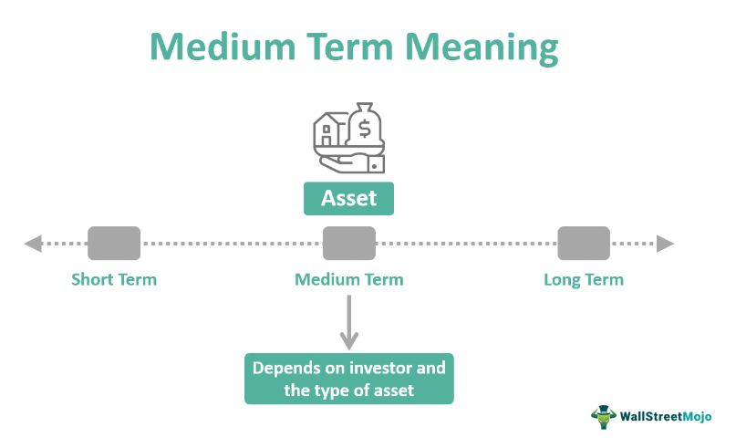

## Table of Contents

## What is intermediate and medium-term debt?

Intermediate and medium-term debt refers to loans or credit that need to be paid back over a period that is longer than short-term debt but shorter than long-term debt. Typically, this kind of debt has a repayment period ranging from one to ten years. It is often used by businesses and individuals to finance things like equipment, vehicles, or home improvements that they need but can't pay for all at once.

This type of debt can be a useful tool for managing cash flow and making larger purchases more manageable. For businesses, it can help them expand operations or upgrade technology without having to use all their cash reserves. For individuals, it might mean being able to buy a car or make home renovations that would otherwise be out of reach. However, it's important to manage this debt carefully, as the interest rates can be higher than those of long-term loans, and the payments need to be made regularly over the term of the loan.

## How does intermediate debt differ from short-term and long-term debt?

Intermediate debt, also known as medium-term debt, is money that you borrow and have to pay back over a time that's not too short and not too long. It usually lasts from one to ten years. This is different from short-term debt, which you have to pay back in less than a year, like a credit card bill or a small business loan. Short-term debt is good for quick needs but can have high interest if you don't pay it off fast.

On the other hand, long-term debt is for a much longer time, often more than ten years, like a mortgage for a house. Long-term debt usually has lower interest rates because you're paying it back over a long time, but it means you'll be in debt for many years. Intermediate debt sits right in the middle, giving you more time to pay than short-term debt but less time than long-term debt. It's useful for things like buying a car or making home improvements that you can't pay for all at once but don't need decades to pay off.

## What are common examples of medium-term debt instruments?

Medium-term debt instruments are loans or credit that you pay back over a few years, usually from one to ten years. Some common examples include car loans, which people use to buy vehicles without paying all the money at once. Another example is equipment loans for businesses, which help them buy machines or tools they need to work better but can't afford to buy outright. Home equity loans are also medium-term debt instruments, where people borrow against the value of their home to do things like renovations or pay for big expenses.

Another type of medium-term debt is a personal loan, which people might use for things like consolidating other debts, paying for a wedding, or covering medical bills. These loans usually have fixed interest rates and monthly payments that make it easier to plan your budget. For businesses, a term loan can be a medium-term debt instrument, used for expanding the business or buying inventory. These loans help businesses grow without using all their cash at once, but they need to be managed carefully to keep the business healthy.

## Who typically issues intermediate and medium-term debt?

Intermediate and medium-term debt is often issued by banks and credit unions. These financial institutions offer loans like car loans, personal loans, and home equity loans that people pay back over a few years. Banks and credit unions make money from the interest on these loans, and they help people and businesses buy things they need without paying all at once.

Sometimes, companies also issue medium-term debt in the form of bonds or notes. These are called corporate bonds, and they can be bought by investors who want to earn interest over time. The company uses the money from these bonds to grow their business or pay for big projects. This kind of debt helps companies without using all their cash, but they have to pay back the investors with interest.

## What are the advantages of using intermediate debt for a company?

Using intermediate debt can help a company in many ways. It gives the company money to buy things like new machines or vehicles without using all their cash at once. This means they can keep their cash for other important things like paying employees or buying supplies. Intermediate debt also helps a company grow faster because they can start using the new equipment or expanding their business right away, instead of waiting to save up enough money.

Another advantage is that intermediate debt usually has a lower [interest rate](/wiki/interest-rate-trading-strategies) than short-term debt. This means the company pays less money over time to borrow the money. Also, because intermediate debt is paid back over a few years, the company can plan their budget better. They know how much they need to pay each month, so they can make sure they have enough money coming in to cover the payments. This helps the company stay stable and grow without too much risk.

## How do interest rates affect intermediate and medium-term debt?

Interest rates are really important when it comes to intermediate and medium-term debt. When the interest rate is low, it's cheaper for a company or a person to borrow money. They pay less over time to use the money they borrowed. This can make it easier for them to buy things like new equipment or make home improvements because the cost of borrowing is not too high. On the other hand, if interest rates are high, borrowing money costs more. This means that the company or person has to pay more over time to use the money they borrowed, which can make it harder to afford the loan.

Interest rates also affect how much companies and people want to borrow. When rates are low, more people and companies might decide to take out intermediate and medium-term loans because it's cheaper. They can use the money to grow their business or make big purchases. But when rates are high, fewer people might want to borrow because it's more expensive. This can slow down how fast companies grow or how many big purchases people make. So, interest rates play a big role in deciding if intermediate and medium-term debt is a good choice.

## What are the risks associated with holding medium-term debt?

Holding medium-term debt can be risky because it means you have to make regular payments over several years. If something unexpected happens, like losing your job or your business not doing well, you might find it hard to keep up with the payments. If you miss payments, your credit score can go down, and you might have to pay extra fees or even lose what you bought with the loan, like a car or equipment.

Another risk is that interest rates might go up while you're paying back the loan. If you have a loan with a variable interest rate, your payments could get bigger, making it harder to pay back the debt. Even if you have a fixed interest rate, if rates go up, you might not be able to borrow more money at a good rate if you need it. So, it's important to think carefully about these risks before taking on medium-term debt.

## How can investors assess the creditworthiness of intermediate debt issuers?

Investors can assess the creditworthiness of intermediate debt issuers by looking at their financial health. This means checking things like the company's income, how much money they owe, and how well they are paying back their debts. A company's credit rating from agencies like Moody's or Standard & Poor's can also help. These ratings give a quick idea of how likely the company is to pay back what they owe. If a company has a high credit rating, it's a good sign they can handle their debt well.

Another way to assess creditworthiness is by looking at the company's history. Investors should see if the company has always paid back their loans on time in the past. They can also look at the company's business plan and see if it makes sense and if the company seems likely to keep making money. Talking to people who know about the company or reading news about them can also give clues about how well they might handle their debt. By putting all this information together, investors can get a good idea of whether the company is a safe bet for lending money.

## What role does intermediate debt play in a diversified investment portfolio?

Intermediate debt can be a good part of a diversified investment portfolio. It gives investors a way to earn money over a few years, usually between one and ten years. This kind of debt often has a steady interest rate, which means investors know how much money they will get back each year. This can help balance out riskier investments like stocks, which can go up and down a lot. By having some intermediate debt in their portfolio, investors can make their overall investment safer and more stable.

Intermediate debt also helps investors spread out their money across different types of investments. Instead of putting all their money into one thing, like stocks or real estate, they can also invest in bonds or loans that companies pay back over time. This spreading out, or diversification, can protect investors if one part of their portfolio does not do well. For example, if the stock market goes down, the money they get from intermediate debt can help make up for the losses. This way, intermediate debt can be an important tool for keeping an investment portfolio strong and balanced.

## How do market conditions influence the pricing of medium-term debt?

Market conditions can really change how much medium-term debt costs. When the economy is doing well and people feel confident, interest rates might go up. This makes medium-term debt more expensive because companies and people have to pay more interest over time. But if the economy is not doing so well, interest rates might go down to encourage more borrowing. This makes medium-term debt cheaper because the interest payments are lower.

Another thing that affects the price of medium-term debt is how much people want to lend money. If lots of people and banks want to lend, there's more competition, and interest rates might go down. This makes it cheaper for companies and people to borrow. But if fewer people want to lend, interest rates can go up because there's less money to borrow. So, the price of medium-term debt can go up and down based on what's happening in the economy and how much money people are willing to lend.

## What are the tax implications of investing in intermediate and medium-term debt?

When you invest in intermediate and medium-term debt, like bonds or loans, you need to think about taxes. The interest you earn from these investments is usually taxed as regular income. This means you have to pay taxes on the interest every year, even if you don't get all your money back until the debt is paid off. The tax rate you pay depends on how much money you make overall. If you're in a higher tax bracket, you'll pay more in taxes on the interest you earn.

There are some ways to make the tax part easier. For example, if you invest in municipal bonds, which are a type of medium-term debt, the interest you earn might not be taxed at all by the federal government. Sometimes, it's not taxed by your state either. This can make these bonds a good choice if you want to keep more of your money. But, you should always talk to a tax advisor to understand how these investments will affect your taxes based on your own situation.

## How do advanced financial models predict the performance of medium-term debt?

Advanced financial models use a lot of information to guess how medium-term debt will do. They look at things like interest rates, how the economy is doing, and how the company or person borrowing the money is doing financially. These models can use math to see how changes in the economy might affect the debt. For example, if interest rates go up, the models can predict that the cost of the debt will go up too. They also look at the past to see how similar debts have done and use that to make guesses about the future.

These models help investors and companies make smart choices about medium-term debt. By using all this information, the models can say if the debt is a good investment or if it's too risky. They can also help figure out the best time to buy or sell the debt. But, even with all this fancy math, it's important to remember that these are just guesses. Things can change in ways the models don't expect, so it's always good to keep an eye on how things are going and be ready to change plans if needed.

## What are the risks and challenges?

Medium-term debt presents several risks and challenges that necessitate careful management to ensure successful financial outcomes. One of the primary risks associated with medium-term debt is interest rate risk. This risk arises because changes in prevailing interest rates can affect the value of debt instruments. When interest rates rise, the market value of existing debt with lower rates may decrease, leading to potential capital losses for investors. For instance, the price of a bond can be inversely related to the change in interest rates, expressed mathematically as:

$$

\Delta P \approx -D \times \Delta y 
$$

where $\Delta P$ is the change in bond price, $D$ is the bond's duration, and $\Delta y$ is the change in yield.

Credit risk is another significant concern, referring to the possibility that the debt issuer may default on its obligations. Creditworthiness can fluctuate based on economic conditions or issuer-specific events, influencing the yield spreads demanded by investors as compensation for added risk.

Inflation risk affects the real value of returns generated from debt instruments. If inflation rises, the purchasing power of the returns declines, eroding real income. Thus, medium-term debt, typically offering fixed returns, may fail to keep pace with inflation surges unless inflation-adjusted securities are employed.

Liquidity risk is also pertinent to medium-term debt. It involves the challenge of selling the debt instruments in the secondary market without incurring substantial price disruptions. The [liquidity](/wiki/liquidity-risk-premium) of a debt instrument can depend on numerous factors, including market conditions, the size of the investment vehicle, and investor demand.

Mitigating these risks is crucial for sound debt management and involves various strategies:

1. **Interest Rate Risk Management**: Investors might use hedging strategies, like interest rate swaps or options, to manage exposure to interest rate fluctuations effectively.

2. **Credit Risk Management**: Periodic assessments of issuer credit quality and diversification across issuers and sectors can ameliorate potential credit risks.

3. **Inflation Risk Management**: Utilizing instruments like Treasury Inflation-Protected Securities (TIPS) can hedge against inflation by adjusting principal based on changes in the Consumer Price Index (CPI).

4. **Liquidity Risk Management**: Utilizing liquid securities and maintaining a diversified portfolio helps in minimizing liquidity concerns.

Understanding and strategically mitigating these risks enable investors to optimize their financial strategies and make informed investment decisions in medium-term debt instruments.

## References & Further Reading

[1]: ["Understanding Treasury Bond Yields and Interest Rate Risk"](https://www.investopedia.com/articles/03/122203.asp) - Investopedia

[2]: ["Algorithmic Trading: Winning Strategies and Their Rationale"](https://www.wiley.com/en-us/Algorithmic+Trading%3A+Winning+Strategies+and+Their+Rationale-p-9781118746912) by Ernest P. Chan.

[3]: ["Advances in Financial Machine Learning"](https://www.amazon.com/Advances-Financial-Machine-Learning-Marcos/dp/1119482089) by Marcos Lopez de Prado.

[4]: ["Treasury Bonds and Notes"](https://www.investopedia.com/ask/answers/033115/what-are-differences-between-treasury-bond-and-treasury-note-and-treasury-bill-tbill.asp) - U.S. Department of the Treasury

[5]: ["Machine Learning for Asset Managers"](https://github.com/emoen/Machine-Learning-for-Asset-Managers) by Marcos Lopez de Prado

[6]: ["Quantitative Finance For Dummies"](https://www.amazon.com/Quantitative-Finance-Dummies-Steve-DPhil/dp/1118769465) by Steve Bell