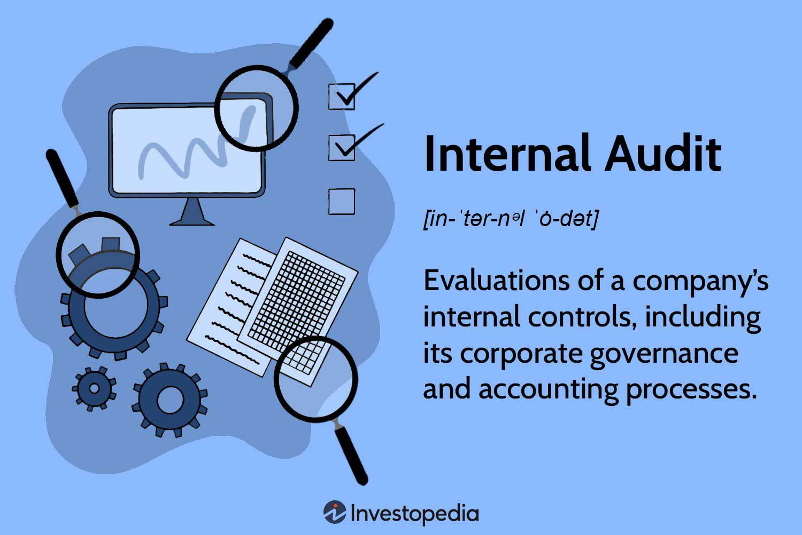

In today's rapidly evolving business landscape, achieving operational efficiency and financial success is crucial for organizational sustainability and growth. Central to this endeavor are internal audits and algorithmic trading, both of which play pivotal roles.

Internal audits are comprehensive evaluations of an organization's internal controls, governance, and accounting processes. They ensure that businesses comply with pertinent laws, regulations, and internal policies, all while pinpointing areas ripe for improvement. With legislative frameworks such as the Sarbanes-Oxley Act further highlighting the significance of accurate financial reporting, internal audits have become indispensable in today's corporate environment. This article will explain the various types of internal audits businesses might undertake and introduce the Five Cs, a guiding framework for crafting internal audit reports that are clear and actionable.



In parallel, finance has been significantly transformed by algorithmic trading, which employs computer programs to execute trades based on predetermined criteria. This approach not only enhances market efficiency and liquidity but also permits rapid execution speeds and precise order management. By integrating cutting-edge technology into trading strategies, organizations can capitalize on fleeting market opportunities, thereby enhancing their financial performance.

Understanding these concepts—internal audits and algo trading—is paramount for businesses aiming to remain compliant, manage risks, and elevate their financial success. This article targets business professionals, financial analysts, and anyone keenly interested in the interplay between stringent internal controls and innovative trading strategies.

## Table of Contents

## Understanding Internal Audits

Internal audits are essential components of effective corporate governance and risk management systems. They involve systematic evaluations of internal controls, governance structures, and accounting processes within a company. These assessments are intended to ensure that an organization complies with relevant laws, regulations, and internal policies, while simultaneously pinpointing areas where operational efficiencies can be enhanced.

The scope of internal audits typically covers a wide range of activities within an organization. This includes assessing the reliability and integrity of financial and operational information, evaluating the effectiveness and efficiency of operations, and ensuring that the company is in compliance with applicable laws and contracts. By doing so, internal audits provide critical insights that can help improve internal control systems and contribute to the overall strategic objectives of the organization.

The importance of internal audits has been particularly underscored following the enactment of significant regulatory frameworks, such as the Sarbanes-Oxley Act of 2002 in the United States. This legislation established stringent standards for financial practices and corporate governance, partly in response to major financial scandals that had undermined public confidence in financial reporting. Consequently, internal audits have assumed a central role in ensuring that companies maintain transparency and accuracy in financial reporting, thereby protecting shareholders and maintaining market integrity.

In conducting internal audits, auditors employ various methodologies to evaluate the effectiveness of existing controls. These methods can range from detailed transaction testing to more sophisticated analytical procedures that use statistical sampling techniques. Auditors may also incorporate modern technological tools, such as data analytics software, to detect irregularities or anomalies within financial data. These tools help in prioritizing audit efforts and identifying risk areas that warrant closer examination.

In summary, internal audits are a vital mechanism for promoting accountability and continuous improvement within organizations. By ensuring adherence to established policies and controls, they help in safeguarding assets, preventing fraud, and fostering a culture of ethical conduct. As businesses navigate an increasingly complex regulatory and operational landscape, the role of internal audits in supporting sustainable financial and operational success remains indispensable.

## Types of Internal Audits

Internal audits are crucial for assessing and enhancing various aspects of an organization. They are designed to address the specific needs and objectives of a company, offering a range of audit types that focus on different facets of organizational performance and compliance.

1. **Financial Audits**: These audits are centered on ensuring the accuracy and reliability of a company’s financial statements. They systematically review financial records and processes to verify that all financial transactions are accurately recorded and reported. Financial audits are essential for maintaining investor confidence and are often mandated by financial regulations to prevent fraudulent financial reporting.

2. **Compliance Audits**: These audits evaluate whether an organization is adhering to applicable laws, regulations, and internal policies. Compliance audits are crucial for organizations to avoid legal penalties and ensure they are operating within the boundaries of the law. They help in identifying non-compliance issues that could lead to significant fines or reputational damage.

3. **Operational Audits**: The main goal of operational audits is to assess the efficiency and effectiveness of organizational operations. They examine internal processes and workflows to identify areas of wastage or inefficiency. By optimizing operational processes, organizations can reduce costs and enhance productivity.

4. **IT Audits**: These audits focus on the information technology systems and controls within an organization. An IT audit evaluates the security of IT infrastructures, including data protection, cybersecurity measures, and the integrity of IT systems. This type of audit is critical as businesses increasingly rely on technology and need to safeguard against cyber threats and data breaches.

5. **Environmental Audits**: Environmental audits ensure that an organization is complying with environmental laws and sustainability practices. They assess the impact of organizational activities on the environment and evaluate whether the company is following proper environmental management systems. Given the growing emphasis on corporate sustainability and environmental responsibility, these audits are becoming more prevalent.

Each type of audit not only helps organizations conform to various requirements and standards but also supports their strategic objectives by identifying areas for improvement and innovation. Effective internal audits can lead to better risk management, operational enhancements, and overall organizational resilience.

## The 5 Cs of Internal Audit Reports

Internal audit reports play a crucial role in offering clear, comprehensive, and actionable recommendations for organizations. One structured approach to achieve this clarity is through the use of the 5 Cs: Criteria, Condition, Cause, Consequence, and Corrective Action. Each component serves as a building block in creating a detailed audit report that assists organizations in improving their operations and addressing identified issues effectively.

1. **Criteria**: This component sets the foundation by establishing the standards or benchmarks against which an organization’s performance is measured. These benchmarks could be derived from regulations, industry standards, or internally set goals. Establishing clear criteria is essential as it provides a basis for assessing the current performance and identifying gaps.

2. **Condition**: The condition describes the current state of an organization's processes or systems. It involves a factual representation of the observed circumstances during the audit. This component provides a snapshot of reality, highlighting how things currently stand within the organization against the established criteria.

3. **Cause**: Understanding the underlying reasons for any noted deviations from the expected performance is vital. The cause identifies these reasons, whether they stem from procedural errors, lack of training, resource constraints, or systemic issues. By pinpointing the root causes, organizations can target their efforts more effectively to rectify the issues.

4. **Consequence**: This aspect elucidates the effects of observed deviations on the organization. Consequences may manifest in various forms, such as financial loss, operational inefficiencies, or compliance breaches. Articulating the impact helps stakeholders understand the severity and urgency of addressing the identified issues.

5. **Corrective Action**: Finally, this component involves proposing recommendations to rectify the issues and prevent recurrence. Corrective actions are actionable steps that focus on modifying processes, enhancing controls, or revising policies to align organizational performance with set criteria.

Implementing the 5 Cs framework in internal audit reports not only aids in identifying and rectifying deficiencies but also enhances an organization's operational efficiency and helps maintain compliance with regulatory requirements. By systematically addressing each component, these reports ensure that feedback is actionable and aligned with the organization's strategic objectives, fostering a culture of continuous improvement and accountability.

 to Algo Trading

Algorithmic trading, often referred to as algo trading, represents a paradigm shift in how financial trades are executed in today's fast-paced markets. Utilizing advanced computer programs that follow a set of pre-established criteria, [algorithmic trading](/wiki/algorithmic-trading) automates the process of buying and selling financial instruments, significantly enhancing the efficiency of order execution.

At the core of algorithmic trading is the ability to process complex mathematical models and large datasets in real-time. This enables traders to exploit market inefficiencies and react to price movements within milliseconds, a speed unmatched by manual trading. Algorithms can be designed to monitor market conditions, identify trading opportunities, and execute trades automatically, ensuring that investment strategies are applied consistently and without the influence of human emotion.

One of the primary advantages of algo trading is its contribution to market efficiency and [liquidity](/wiki/liquidity-risk-premium). By executing trades rapidly and consistently, algorithmic systems help narrow spreads, increasing the amount of tradeable assets available to market participants. This, in turn, leads to a more liquid and stable market environment. Moreover, algorithms can deploy sophisticated strategies such as [arbitrage](/wiki/arbitrage), [trend following](/wiki/trend-following), and market-making, each contributing to enhancing liquidity and reducing [volatility](/wiki/volatility-trading-strategies).

An example of a typical algorithm might involve scanning multiple exchanges to identify price discrepancies for arbitrage opportunities. In Python, such a basic trading strategy could look like this:

```python
def arbitrage_opportunity(asset, prices):
    buy_exchange = min(prices, key=prices.get)
    sell_exchange = max(prices, key=prices.get)
    if prices[sell_exchange] > prices[buy_exchange]:
        return f"Buy {asset} on {buy_exchange} and sell on {sell_exchange}"

prices = {"ExchangeA": 100, "ExchangeB": 102, "ExchangeC": 101}
asset = "CryptocurrencyX"
trade_opportunity = arbitrage_opportunity(asset, prices)
print(trade_opportunity)
```
This code snippet identifies an arbitrage opportunity for a given asset by comparing its prices across different exchanges, demonstrating how algo trading aids in seizing profitable market discrepancies quickly.

Furthermore, algorithmic trading supports various order types and strategies, such as limit orders, stop-loss orders, and high-frequency trading ([HFT](/wiki/high-frequency-trading-strategies)), all designed to optimize trading outcomes while minimizing risks. Crucial to these processes are [backtesting](/wiki/backtesting) and simulations, which ensure that strategies are optimized for performance based on historical data before being deployed in live markets.

As technology continues to advance, algorithms are becoming more sophisticated and capable of utilizing [artificial intelligence](/wiki/ai-artificial-intelligence) and [machine learning](/wiki/machine-learning). These technologies empower algorithms to learn and adjust from historical data, continuously improving their trading performance and adaptability to changing market conditions.

Algorithmic trading's role in modern finance is indispensable, offering unprecedented speed, precision, and efficiency, ultimately reshaping the landscape of financial trading and investment.

## The Intersection of Internal Audits and Algo Trading

Internal audits and algorithmic trading play crucial roles in achieving compliance, transparency, and risk management within financial operations. The integration of internal audits into algorithmic trading systems is imperative for maintaining the integrity and security of financial transactions conducted through these automated platforms.

Audits of algorithmic trading systems are primarily focused on ensuring the accuracy and reliability of the trading algorithms and associated processes. This involves verifying that the computer programs are executing trades as per the predefined criteria without deviations that could lead to erroneous or unintended trading actions. The assessment of algorithmic trading systems typically includes a thorough evaluation of algorithm design, testing methodologies, and performance benchmarks to ensure they align with both market expectations and regulatory standards.

Preventing unauthorized access to algorithmic trading systems is another vital area of focus in audits. With the increasing digitization of financial markets, these systems become potential targets for cyberattacks, which can disrupt operations and lead to substantial financial losses. Internal audits seek to ensure that robust cybersecurity measures are in place, including access controls, encryption, and monitoring of trading activities to detect and respond to suspicious behaviors promptly.

Regulatory compliance is a fundamental aspect monitored through audits of algorithmic trading systems. Trading algorithms must adhere to a plethora of regulations that govern financial markets, such as the Securities and Exchange Commission (SEC) regulations in the United States or the Markets in Financial Instruments Directive II (MiFID II) in the European Union. Auditors evaluate firms' compliance frameworks to ensure that trading activities do not breach market abuse regulations or other legal requirements, thus safeguarding against potential penalties or legal challenges.

By combining robust auditing processes with sophisticated trading technologies, organizations can protect themselves against various risks. Financial risk is minimized by ensuring that trading algorithms operate correctly and within defined risk parameters. Operational risk is mitigated through continuous monitoring and enhancement of the algorithms and the infrastructure that supports them. Lastly, reputational risk is addressed by assuring stakeholders and regulatory bodies that the firm is committed to maintaining high standards of operational integrity and compliance.

In summary, the intersection of internal audits and algorithmic trading is crucial for maintaining a secure and compliant trading environment. The synergy between these two elements ensures that organizations can leverage the efficiency and precision of algorithmic trading while maintaining rigorous oversight and control to address potential risks effectively.

## The Future of Internal Audits and Algo Trading

Technological advancements are leading a transformative shift in both internal audits and algorithmic trading, reshaping traditional processes and enhancing operational efficiencies. In the field of internal audits, the integration of emerging technologies such as artificial intelligence (AI) and machine learning is notably increasing the efficiency, accuracy, and scope of audit processes. AI technologies can automate repetitive tasks, thereby reducing human error and freeing up auditors to focus on more strategic activities. For instance, machine learning algorithms can analyze vast volumes of financial data to identify anomalies, trends, and patterns that might signal areas needing further investigation. Predictive analytics, driven by AI, also allows auditors to anticipate risks and issues before they become detrimental, thus enabling proactive management.

In algorithmic trading, the evolution towards more sophisticated algorithms is making significant impacts on market operations. These advanced algorithms can process vast datasets and adapt to market conditions in real-time, thereby increasing market efficiency and liquidity. The use of AI and machine learning in trading allows for the development of algorithms capable of undertaking complex trading strategies, such as high-frequency trading, where decisions are made in microseconds. These algorithms utilize vast amounts of historical and real-time data to make informed trading decisions, often outperforming traditional trading methods. Python, with its rich libraries such as NumPy and pandas, is frequently employed in developing these trading models due to its versatility and powerful data manipulation capabilities.

Blockchain technology is also anticipated to play a crucial role in the future of internal audits and algo trading. In auditing, blockchain's immutable nature provides a reliable framework for validating transactions and ensuring the integrity of financial records. In trading, blockchain can enhance transparency and security, offering a more robust mechanism for executing and verifying trades which can dramatically reduce the risk of fraud and errors.

The trajectory of technological advancements suggests a future where internal audits and algo trading are increasingly automated, agile, and adaptive. This evolution not only augments the capabilities of financial and operational processes but also introduces new paradigms for managing financial risks and optimizing performance. As these technologies continue to mature, businesses must adapt to these changes to maintain their competitive edge and ensure sustainable growth.

## Conclusion

The synergy between robust internal audits and innovative algorithmic trading strategies is integral to achieving business resilience and competitiveness. As contemporary businesses face increasingly complex regulatory environments and rapid technological changes, internal audits and algorithmic trading serve as essential frameworks for effective risk management and financial optimization.

Internal audits ensure that organizations adhere to compliance standards, maintain operational efficiency, and identify potential areas of financial leakage or mismanagement. This vigilance is fundamental in safeguarding assets and maintaining the integrity of financial reporting. By systematically evaluating internal controls and governance processes, internal audits help organizations preempt risks, thus promoting a stable and compliant operational framework.

Meanwhile, algorithmic trading leverages advanced computer programs to execute trades based on predefined criteria, offering unprecedented execution speed and efficiency. This technological advancement not only enhances market liquidity and depth but also provides precise control over trading strategies, enabling companies to capitalize on market opportunities swiftly and efficiently.

When integrated, these two elements create a robust architecture for overseeing and optimizing business operations. Algorithmic trading systems can be subjected to rigorous internal audits to ensure compliance with financial regulations and to mitigate risks such as unauthorized access or system failures. This auditing process verifies the accuracy and reliability of these systems, thus bolstering overall financial security.

Ultimately, staying informed and agile in internal audits and algo trading allows organizations to adapt to evolving market dynamics and regulatory demands. This adaptability is key to safeguarding assets and ensuring sustainable growth. Businesses that effectively integrate auditing practices with innovative trading techniques are better positioned to thrive in a rapidly changing financial landscape, ensuring continued resilience and competitiveness.

## References & Further Reading

[1]: ["Internal Auditing: Assurance & Advisory Services"](https://www.amazon.com/Internal-Auditing-Assurance-Advisory-Services/dp/1634541367) by The Institute of Internal Auditors

[2]: Petersen, K. (2015). ["The Sarbanes-Oxley Act of 2002: An Overview"](https://www.csoonline.com/article/570121/the-sarbanes-oxley-act-explained-definition-purpose-and-provisions.html)

[3]: [Madura, J. (2018). "Financial Markets and Institutions"](https://www.academia.edu/68510441/Financial_Institutions_and_Markets)

[4]: ["Algorithmic Trading & DMA: An Introduction to Direct Access Trading Strategies"](https://www.amazon.com/Algorithmic-Trading-DMA-introduction-strategies/dp/0956399207) by Barry Johnson

[5]: Hendershott, T., Jones, C. M., & Menkveld, A. J. (2011). ["Does Algorithmic Trading Improve Liquidity?"](https://onlinelibrary.wiley.com/doi/full/10.1111/j.1540-6261.2010.01624.x) Review of Financial Studies, 24(3), 717-763.

[6]: ["Internal Control and Audit"](https://keydifferences.com/difference-between-internal-control-and-internal-audit.html) by Donald A. Dickie

[7]: Pardo, R. (2011). ["The Evaluation and Optimization of Trading Strategies"](https://onlinelibrary.wiley.com/doi/book/10.1002/9781119196969)