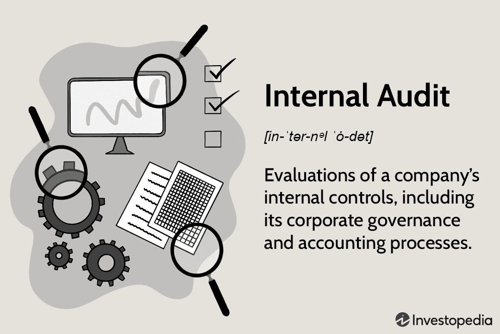

In today's financial landscape, internal auditors play a crucial role in maintaining the integrity of business operations. As organizations expand and adopt complex systems, the need for effective internal audit procedures becomes increasingly important, ensuring compliance, risk management, and operational efficiency. One area where internal auditing has become particularly significant is within automated trading environments, commonly referred to as algorithmic trading (algo trading).

Algorithmic trading revolutionizes the financial market by using programmed rules and algorithms to execute trades at speeds and frequencies that surpass human capabilities. While this technological advancement offers numerous benefits, such as increased efficiency and lower transactional costs, it also introduces new challenges and risks. These can arise from factors like erroneous trade execution, data security breaches, and system failures. Thus, the expertise of internal auditors is essential to navigate this sophisticated market landscape.



Internal auditors are uniquely positioned to analyze and understand the technological infrastructure of algorithmic trading systems. They assess the functionality and compliance of algorithms, providing oversight and guidance to ensure the robustness and reliability of trading operations. This oversight helps prevent potential financial mishaps and aligns trading practices with industry regulations.

Furthermore, as algorithmic trading continuously evolves with new technologies and regulatory changes, internal auditors face the challenge of adapting their audit methodologies and enhancing their skill set. The complexity of ensuring data integrity, system robustness, and regulatory adherence demands a high level of expertise and a thorough understanding of both financial markets and technological innovations.

In this article, we explore the internal audit process and its critical role within the automated trading environments, illustrating the unique challenges and complexities faced by auditors in managing these sophisticated systems. Through practical examples, we uncover the intricacies of algorithmic trading audits and highlight the invaluable contribution of internal auditors in safeguarding financial markets.

## Table of Contents

## Understanding the Role of an Internal Auditor

Internal auditors are pivotal to organizations, offering objective evaluations of business operations with an emphasis on compliance and efficiency. Their role is multifaceted, involving a meticulous examination of an organization’s internal controls, risk management processes, and governance structures. These professionals are employed with the specific aim of ensuring that organizational processes run smoothly and efficiently, adhering to internal policies and external regulatory requirements.

A primary responsibility of internal auditors is to identify and rectify internal issues before they become significant problems or are uncovered by external audits. This involves a proactive approach to examining and evaluating how various business units operate. Internal auditors must be adept at recognizing inefficiencies, deviations from established protocols, and areas vulnerable to fraud or operational risk. They achieve this through rigorous testing and evaluation methodologies, often employing data analytics to identify patterns or anomalies that might indicate underlying problems.

The insights and recommendations internal auditors provide play a crucial role in the decision-making processes of senior management. By offering detailed reports that highlight potential risks and areas for improvement, auditors enable management to make informed decisions that enhance operational efficiency and financial integrity. These reports typically include actionable recommendations designed to mitigate identified risks, improve internal control systems, and enhance overall compliance with relevant laws and regulations.

In addition to evaluating current practices, internal auditors are often tasked with advising on future policies and strategic initiatives. Their unique perspective allows them to advise management on best practices that align with the organization's strategic goals while maintaining regulatory compliance. This forward-looking aspect of their role is essential in a dynamic business environment where regulations and industry standards are continuously evolving.

Internal auditors must possess a thorough understanding of both the industry they are auditing and the specific regulatory frameworks applicable to the organization. This requires ongoing education and professional development to remain effective in guiding organizations toward sustainable and compliant business practices.

## The Internal Auditing Process

The internal auditing process is a systematic approach aimed at evaluating the adequacy and effectiveness of an organization’s internal controls, risk management, and governance processes. This process begins with a comprehensive review of financial statements, which involves analyzing balance sheets, income statements, and cash flow statements to ensure accuracy and compliance with accounting standards. Internal auditors meticulously examine records for discrepancies or anomalies that might indicate financial mismanagement or fraud.

Operational procedures are another focal point, with auditors assessing the efficiency and effectiveness of business processes across various departments. This involves conducting detailed interviews with key personnel to gain insights into operational workflows and identify potential areas for improvement or risk. Additionally, auditors verify physical assets by performing site visits and inspections. These activities help confirm that the assets listed on the financial statements actually exist and are properly maintained.

Risk assessments form a critical component of the auditing process. Auditors evaluate the organization’s risk management strategies, scrutinizing how potential risks are identified, assessed, and mitigated. This involves reviewing documentation such as risk registers and mitigation plans, as well as testing the controls in place to manage these risks.

Upon completing the audit, internal auditors compile comprehensive reports that detail their findings. These reports provide not only a summary of identified discrepancies but also suggest actionable measures designed to enhance the organization's internal controls and operational efficiency. Recommendations may include adjusting financial practices, strengthening compliance protocols, or implementing new technologies to improve overall performance. By following these detailed steps, internal auditors help organizations maintain compliance and achieve their strategic objectives effectively.

## Algorithmic Trading: A Unique Challenge for Auditors

Algorithmic trading is a sophisticated area within financial markets where complex algorithms automate trading decisions at high speeds and volumes. This automation presents a unique set of challenges for internal auditors, necessitating a tailored auditing approach. 

These auditors need a robust understanding of the technology stack, which includes the software and hardware systems that drive [algorithmic trading](/wiki/algorithmic-trading) platforms. The technology stack encompasses trading engines, data feeds, and execution systems, all of which must be scrutinized for performance and reliability. The evaluation of data security measures is equally crucial, as algorithmic trading platforms handle large volumes of sensitive financial data. This necessitates a review of encryption methodologies, access controls, and data integrity protocols.

Proprietary algorithms are at the heart of algorithmic trading and pose significant challenges for auditors aiming to assess compliance and risk management. Auditors must inspect the design and operation of these algorithms, ensuring they adhere to regulatory standards and internal policies. Understanding the decision-making criteria embedded within these algorithms is essential. This includes examining the algorithms' logic, data inputs, and outputs to ascertain compliance with expected financial and ethical norms.

The dynamic and fast-paced nature of algorithmic trading requires continuous monitoring. Markets can shift dramatically in milliseconds, thus necessitating the use of sophisticated auditing tools to track and analyze trading activities in real-time. These tools allow auditors to identify anomalies and potential risks promptly. Continuous monitoring frameworks and advanced analytics play a pivotal role in maintaining the integrity of the trading processes.

Implementing a suitable auditing framework involves several innovative practices, such as the use of [machine learning](/wiki/machine-learning) to detect unusual trading patterns or discrepancies that may indicate compliance issues or operational risks. Likewise, utilizing distributed ledger technology can enhance the transparency and traceability of transactions, offering auditors a clear view of trade flows and settlements.

Effective auditing in algorithmic trading is thus a multi-faceted endeavor that combines traditional auditing principles with advanced technological capabilities, ensuring that trading operations are both compliant and optimized for performance.

## Example Audit Process in Algo Trading

An example audit process in algorithmic trading begins with a comprehensive assessment of the trading algorithms in operation. The primary objective is to ensure these algorithms comply with applicable regulatory standards. This involves a systematic review of the algorithms' functionality, including how they handle data inputs and their decision-making criteria. An internal auditor must determine whether the algorithms maintain transparency and fairness in trading activities.

To achieve this, the auditor scrutinizes the key components of the algorithm, such as the logic driving trading decisions and the sources and accuracy of input data. This may include examining code to verify that algorithms do not perform unauthorized or manipulative trading activities. For instance, examining Python scripts that outline the algorithms can help auditors identify potential issues in logic or data handling. 

```python
# Sample structure of a trading algorithm in Python
class TradingAlgorithm:
    def __init__(self, data_feed):
        self.data_feed = data_feed  # Input data

    def decide(self):
        # Decision-making logic based on data inputs
        if self.data_feed.current_price > self.data_feed.moving_average():
            return "BUY"
        elif self.data_feed.current_price < self.data_feed.moving_average():
            return "SELL"
        else:
            return "HOLD"

# Example usage
data_feed = DataFeed(current_price=105, moving_average=100)  # Mock data feed
algorithm = TradingAlgorithm(data_feed)
trade_action = algorithm.decide()
```

A crucial component of the audit process is validating the back-testing and real-time monitoring systems utilized by the trading algorithms. Back-testing involves using historical data to assess how the algorithm would have performed under different market conditions. Auditors evaluate whether the back-testing framework is robust, ensuring that results are not biased or overly optimistic.

The audit process also includes examining the real-time monitoring systems to ensure they align with current market conditions. This involves assessing how well the system detects and responds to market anomalies and whether it appropriately logs and manages trade execution data. Validation of these systems is essential to verify that any adjustments made to algorithms under dynamic market conditions do not violate compliance standards. By meticulously examining these facets, internal auditors ensure that trading algorithms adhere to regulatory standards while functioning effectively within the desired parameters.

## Key Takeaways and Recommendations

Internal auditors play a critical role in safeguarding businesses, particularly within the sophisticated and fast-evolving field of algorithmic trading. In this high-stakes environment, they are integral to ensuring operations adhere to stringent regulations while simultaneously optimizing performance and mitigating potential financial risks. The auditors achieve this by meticulously evaluating trading algorithms, scrutinizing compliance with regulatory frameworks, and assessing risk management strategies.

To maintain effectiveness, auditors should incorporate cutting-edge auditing technologies. These technologies enable detailed analysis of large datasets that are typical in algo trading. Advanced data analytics tools and machine learning models can uncover patterns and anomalies in trading activities that may indicate deviations from expected behavior or regulatory breaches.

Additionally, auditors must commit to continuous education and training on the latest advancements in trading technologies. Given the rapid pace of technological change, including developments in [artificial intelligence](/wiki/ai-artificial-intelligence) and blockchain, staying informed is vital for auditors to understand new risks and tools that can be employed in the auditing process. This ongoing education can include pursuing relevant certifications, attending industry conferences, and engaging in peer-learning opportunities.

By integrating advanced technology and maintaining up-to-date knowledge, internal auditors can not only protect their organizations from compliance failures and financial irregularities but also contribute to its strategic objectives by providing insights that enhance overall operational efficiency and decision-making.

## Conclusion

The role of internal auditors is rapidly transforming with the continuous advancements in trading technologies, requiring them to adopt precise methodologies and remain adaptable. As technology progresses, these professionals are confronted with novel regulatory challenges and increased technological intricacies. A key aspect of an auditor's function is to ensure compliance with evolving regulations while addressing the technical demands posed by algorithmic trading environments.

To safeguard their organizations, internal auditors must remain informed and proactive. This involves a continuous commitment to learning and adapting to new technologies that influence trading operations. By leveraging advanced auditing tools and methodologies, auditors can enhance their ability to detect anomalies, assess risk, and ensure the integrity of trading algorithms. Employing technologies like machine learning and artificial intelligence, for example, can greatly aid auditors in handling vast datasets and identifying patterns that may not be immediately evident through traditional auditing techniques.

Moreover, fostering a strong understanding of regulatory frameworks enables auditors to anticipate and react to changes that affect the trading industry. Collaborative efforts with regulatory bodies and participation in industry forums can provide insights into upcoming trends and compliance requirements. By staying ahead in this fast-paced environment, internal auditors can effectively manage risk, optimize performance, and contribute to their organization's success in algorithmic trading.

## References & Further Reading

[1]: Bergstra, J., Bardenet, R., Bengio, Y., & Kégl, B. (2011). ["Algorithms for Hyper-Parameter Optimization."](https://dl.acm.org/doi/10.5555/2986459.2986743) Advances in Neural Information Processing Systems 24.

[2]: ["Advances in Financial Machine Learning"](https://www.amazon.com/Advances-Financial-Machine-Learning-Marcos/dp/1119482089) by Marcos Lopez de Prado

[3]: ["Evidence-Based Technical Analysis: Applying the Scientific Method and Statistical Inference to Trading Signals"](https://www.amazon.com/Evidence-Based-Technical-Analysis-Scientific-Statistical/dp/0470008741) by David Aronson

[4]: ["Machine Learning for Algorithmic Trading"](https://github.com/stefan-jansen/machine-learning-for-trading) by Stefan Jansen

[5]: ["Quantitative Trading: How to Build Your Own Algorithmic Trading Business"](https://www.amazon.com/Quantitative-Trading-Build-Algorithmic-Business/dp/1119800064) by Ernest P. Chan