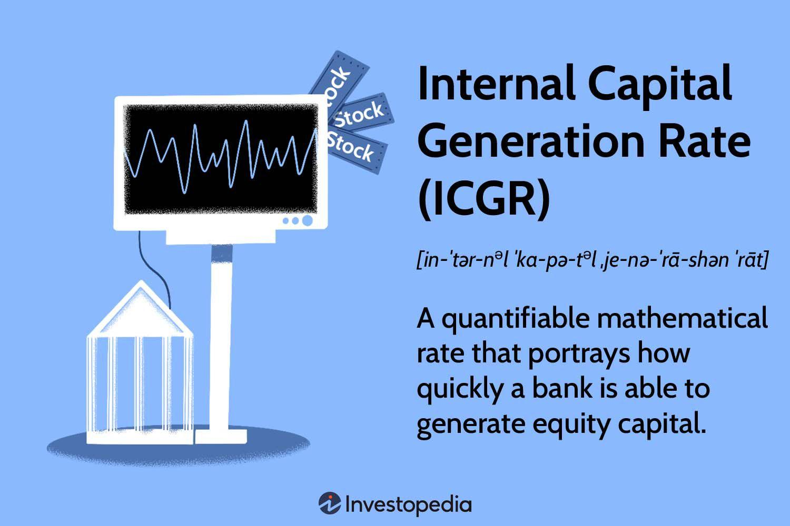

In the competitive world of finance, understanding the metrics that drive growth and profitability is crucial. One such metric, the Internal Capital Generation Rate (ICGR), plays a key role in evaluating a bank's ability to foster capital growth. The ICGR is a measure of a bank's capacity to generate capital internally, reflecting its ability to support operations and growth without relying on external funding sources. This makes it an essential tool for financial analysts who aim to assess the financial health and sustainability of banking institutions.

Algorithmic trading, a method of executing trades using automated pre-programmed instructions, has gained significant traction in modern financial markets. The integration of financial metrics like the ICGR into these trading algorithms can significantly enhance investment strategies by providing data-driven insights into a bank's growth potential. By incorporating ICGR, traders can refine their decision-making processes and adapt to market dynamics more effectively.



This article focuses on the ICGR, exploring its implications for capital growth and its intersection with algorithmic trading. It aims to equip readers with the knowledge to leverage ICGR for optimized trading strategies. By understanding the importance of internal capital generation, investors and traders can gain a competitive edge in an ever-evolving financial landscape.

## Table of Contents

## Understanding Internal Capital Generation Rate (ICGR)

The Internal Capital Generation Rate (ICGR) is a critical financial metric for evaluating a bank's efficiency in generating capital without relying on external sources. At its core, ICGR assesses how effectively a bank can reinvest its earnings to foster sustainable growth. The formula for calculating ICGR is straightforward:

$$
\text{ICGR} = \frac{\text{Retained Earnings}}{\text{Average Shareholder Equity}}
$$

This formula indicates that ICGR measures the proportion of earnings retained by the bank relative to the shareholders' equity, offering an insight into capital retention capabilities. As a profitability indicator, a higher ICGR suggests that a bank is retaining more of its income, which signifies solid growth potential and financial health.

Analysts frequently exploit ICGR to evaluate a bank's capacity to promote internal growth and sustain operations without resorting to additional funding sources such as equity issuance or debt accumulation. This self-sufficiency is particularly vital during periods when accessing external capital might be challenging or costly.

Moreover, understanding ICGR yields valuable insights into a bank's operational efficiency. It reflects how well management can balance reinvestment and dividends to optimize capital use. This metric often influences strategic decisions regarding dividend policies and reinvestment strategies, making it an integral part of financial analysis. By offering a clear picture of internal capital dynamics, ICGR becomes a pivotal parameter for stakeholders to assess a bank’s long-term financial stability and growth prospects.

## Factors Influencing ICGR

Factors influencing the Internal Capital Generation Rate (ICGR) are crucial for understanding the dynamics of financial health and growth within a bank. The ICGR represents the ability of a financial institution to generate capital internally, which is paramount for sustaining operations and fostering growth without external financing. Several key factors impact the ICGR, including net income, dividend policies, overall profitability, stock price, plowback ratio, and return on equity (ROE).

### Key Factors Affecting ICGR

1. **Net Income and Overall Profitability:**
   Net income is a primary driver of ICGR. Higher profitability allows a bank to retain more earnings after dividends, thus directly boosting the ICGR. The relationship is straightforward: as net income increases, there are more funds available for reinvestment, leading to a higher ICGR.

2. **Dividend Policies:**
   Dividend policies significantly influence the ICGR as they determine the portion of earnings distributed to shareholders versus what is retained within the bank. A policy that favors lower dividend payouts will enhance retained earnings, thereby increasing the ICGR. Conversely, high dividend payouts reduce retained earnings, negatively affecting ICGR.

3. **The Relationship between Stock Price and ICGR:**
   The stock price reflects market perceptions of a bank's value, impacting shareholder equity. A rising stock price increases the market value of equity, potentially diluting the ICGR if net income does not keep pace with equity growth. However, an enhanced stock price can also signal improved market confidence, correlating with better financial performance and potentially higher net incomes.

4. **Plowback Ratio:**
   The plowback ratio, or retention ratio, measures the proportion of earnings reinvested in the bank rather than paid out as dividends. It is defined as:
$$
   \text{Plowback Ratio} = 1 - \text{Dividend Payout Ratio}

$$

   A high plowback ratio indicates a significant portion of earnings is retained, which enhances the ICGR. This [factor](/wiki/factor-investing) is crucial for banks aiming to finance growth internally without raising external funds.

5. **Return on Equity (ROE):**
   ROE is a critical indicator of how efficiently a bank utilizes its equity to generate profits. It is expressed as:
$$
   \text{ROE} = \frac{\text{Net Income}}{\text{Average Shareholder Equity}}

$$

   A higher ROE signifies efficient management and profitable operations, contributing positively to ICGR by elevating the net income available for retention.

### Impact of Retained Earnings and Dividends

Changes in retained earnings and dividend policies directly influence the ICGR. For example, if a bank decides to reduce its dividend payouts, more earnings can be retained, resulting in a higher ICGR. Conversely, increasing dividend payouts will decrease retained earnings, lowering the ICGR. This dynamic illustrates the critical balance banks must maintain to optimize their capital generation capabilities while meeting shareholder expectations.

### Importance for Forecasting Growth Potential

By understanding the factors that influence ICGR, analysts and investors can better forecast a bank’s future growth potential. A stable or increasing ICGR suggests robust internal capital generation, indicating long-term sustainability and growth capabilities.

In summary, accurate assessment and strategic management of net income, dividend policies, stock prices, plowback ratios, and ROE are vital for optimizing the ICGR. These elements collectively help in making informed predictions about a bank's financial health and growth trajectory.

## ICGR in the Context of Capital Growth

Capital growth in banks is a crucial factor that ensures financial resilience and the ability to take on new opportunities, and the Internal Capital Generation Rate (ICGR) is integral to this process. ICGR measures the portion of net income that a bank retains after distributing dividends to shareholders, representing the bank’s capacity to generate capital internally. This section examines how ICGR influences sustainable capital growth in financial institutions, without growing dependent on external capital sourcing methods.

ICGR's chief benefit lies in its ability to support sustainable growth by utilizing retained earnings rather than external funding sources, such as issuing new stock or incurring debt. Banks with a high ICGR can leverage these retained earnings to reinvest in profit-generating activities like extending more loans or expanding operations, thereby fostering organic growth. This growth model not only strengthens a bank's balance sheet but also reduces the cost and risk associated with external borrowing.

Historically, banks with consistently high ICGR have exhibited superior capital growth. For example, leading banks that managed to navigate through financial crises often demonstrated strong ICGR prior to and during the period of upheaval. These banks successfully used their internally generated capital to counteract adverse market conditions and take strategic actions that fortified their capital base.

Case studies further illustrate how banks with high ICGR achieve substantial capital growth. Consider Bank A, which maintained a high ICGR by implementing a conservative dividend policy and reinvesting profits into high-yielding assets. Over time, Bank A's focus on internal capital generation allowed it to outperform its peers in both growth and financial stability.

To improve their ICGR, banks can adopt several strategies. Profit maximization can be achieved through efficient cost management and strategic initiatives aimed at increasing net income. Additionally, adopting an efficient dividend strategy, such as optimizing the payout ratio, can ensure sufficient profits are retained to bolster the bank's capital base. Balancing between rewarding shareholders and securing funds for growth is crucial.

Furthermore, structured reinvestment in technology and innovation can enhance operational efficiency and profitability, thereby boosting ICGR. As markets evolve, embracing digital transformation can provide banks with an edge, as technological advancements typically reduce operational costs and increase customer engagement, leading to higher revenues and retained earnings.

In summary, ICGR is fundamental to capital growth within banks. It underscores an institution's ability to grow organically by reinvesting profits rather than depending on external capital sources. Historical trends and case studies of banks with high ICGR reveal the advantages of this approach, while strategic improvements in profit maximization and dividend distribution enable better capital retention, leading to a robust growth trajectory.

## Algorithmic Trading and ICGR

Algorithmic trading has become an integral part of modern financial markets, employing complex algorithms to execute trades at unprecedented speeds and frequencies. These algorithms leverage historical data, market conditions, and various financial metrics to optimize trading decisions. One such metric, the Internal Capital Generation Rate (ICGR), can play a valuable role in enhancing the effectiveness of these algorithms.

Incorporating ICGR into trading algorithms can sharpen their decision-making processes. By quantifying a bank's capacity to generate capital internally, ICGR serves as an indicator of financial strength and stability. Algorithms can use ICGR to assess the growth potential of banks, making it a useful parameter for evaluating investment opportunities. For instance, an algorithm might prioritize stocks of banks with high ICGR, assuming these institutions are more likely to sustain capital growth without external financing pressures.

The integration of ICGR into algorithmic models presents numerous benefits. Analysts can develop algorithms that identify and exploit market dynamics linked to ICGR trends, thus pinpointing lucrative investment opportunities. For example, if a bank consistently maintains a high ICGR, an algorithm might predict positive stock movements, making these stocks prime candidates for portfolio inclusion. By doing so, traders can potentially improve their risk-adjusted returns.

An example of Python code that could be used to integrate ICGR in a simple trading algorithm for stock selection is as follows:

```python
import pandas as pd

# Assume we have a DataFrame 'bank_data' with columns 'Bank', 'ICGR', 'Stock_Price', and 'Net_Income'

# Define a threshold for ICGR
icgr_threshold = 0.15

# Filter banks with ICGR above the threshold
selected_banks = bank_data[bank_data['ICGR'] > icgr_threshold]

# Prioritize banks with the highest ICGR
ranked_banks = selected_banks.sort_values(by='ICGR', ascending=False)

# Select top 10 banks for investment
investment_selection = ranked_banks.head(10)

print(investment_selection)
```

The future of [algorithmic trading](/wiki/algorithmic-trading) with ICGR as an integrated analytical parameter looks promising. As technology advances, the incorporation of diverse financial metrics such as ICGR could provide a more nuanced understanding of potential investments. This could lead to more sophisticated algorithms capable of delivering more strategic and profitable trading outcomes.

However, it is essential to note that while ICGR is a powerful tool, it should not be used in isolation. An integrated approach that combines ICGR with other financial indicators can provide a more comprehensive analysis, allowing for more informed and strategic trading decisions in the fast-evolving world of finance.

## Challenges and Considerations

Calculating and interpreting the Internal Capital Generation Rate (ICGR) presents several challenges. A primary issue is ensuring the accuracy of financial data. The calculation of ICGR involves retained earnings and average shareholder equity, both of which depend on precise and current financial reporting. Errors in financial statements can lead to incorrect ICGR values, misleading analysts and investors about a bank’s financial health.

In volatile market conditions, the ICGR can be particularly unstable. Economic downturns or unexpected market shifts can negatively affect retained earnings due to reduced profitability, hence, impacting the ICGR. High [volatility](/wiki/volatility-trading-strategies) makes it difficult to rely on this metric as it might reflect short-term issues rather than long-term financial stability.

Investors also need to be cautious when using ICGR as a standalone indicator. While it provides insight into a bank's ability to generate capital internally, it doesn’t account for external factors such as market conditions or economic policy changes. Relying solely on ICGR might provide an incomplete picture of a bank's financial situation. Therefore, it’s important to integrate ICGR with other performance indicators like Return on Equity (ROE) or the plowback ratio to derive a comprehensive analysis.

The evolving regulatory environment poses additional challenges. Regulations can influence the calculation of ICGR by affecting retained earnings or shareholder equity requirements. For example, changes in dividend policies mandated by regulators can alter retained earnings, consequently affecting ICGR. Thus, staying informed about regulatory changes is crucial when evaluating ICGR over time.

In summary, while ICGR is a valuable tool for assessing a bank's capital generation capabilities, it must be used in conjunction with other financial metrics to provide a holistic understanding of an institution’s financial health. Combining ICGR with other indicators can enhance the robustness of financial analyses and investment decisions.

## Conclusion

The Internal Capital Generation Rate (ICGR) is an essential metric for evaluating a bank’s ability to grow capital from within, reflecting its financial health and operational efficiency. By focusing on retained earnings relative to shareholder equity, ICGR provides insights into a bank's capacity to sustain and enhance its capital base without external dependencies.

Incorporating ICGR into algorithmic trading frameworks underscores its strategic relevance. Algorithmic strategies that integrate ICGR can potentially yield more informed investment decisions by assessing a bank's inherent growth capabilities. This integration can enhance the ability to predict market movements and optimize portfolio selections, offering a refined approach to trading strategies.

However, while ICGR offers valuable insights, it is crucial to combine this metric with other financial indicators to gain a comprehensive understanding of a bank's performance. Metrics such as return on equity (ROE), net income, and dividend policies should complement ICGR in analysis, aiding investors and analysts to forecast growth more precisely.

As the financial markets continue to evolve, the role of ICGR in trading algorithms is likely to expand further, potentially transforming capital growth strategies. The strategic application of ICGR in these models could offer a competitive edge by indicating banks with robust internal capital generation.

Ultimately, a deep understanding and strategic application of ICGR can provide significant advantages amidst the complexities of modern finance, reinforcing the importance of this metric in both conventional financial assessments and cutting-edge trading methodologies.

## References & Further Reading

[1]: Evans, J. L. & Brunner, J. A. (2010). ["Internal Capital Generation and Development in Banks."](https://www.researchgate.net/publication/226261174_Jerome_Bruner%27s_Theory_of_Education_From_Early_Bruner_to_Later_Bruner) Journal of Financial Intermediation.

[2]: ["Algorithmic Trading: Winning Strategies and Their Rationale"](https://www.amazon.com/Algorithmic-Trading-Winning-Strategies-Rationale-ebook/dp/B00CY5HC0U) by Ernie Chan

[3]: ["The Banker's Handbook on Financial Analysis"](https://archive.org/details/bankershandbook0000will) by Leonard M. Matz 

[4]: De Loecker, J., Eeckhout, J., & Unger, G. (2020). ["The Rise of Market Power and the Macroeconomic Implications."](https://academic.oup.com/qje/article/135/2/561/5714769) The Quarterly Journal of Economics.

[5]: ["Financial Markets and Institutions"](https://www.sciencedirect.com/journal/journal-of-international-financial-markets-institutions-and-money) by Anthony Saunders and Marcia Millon Cornett