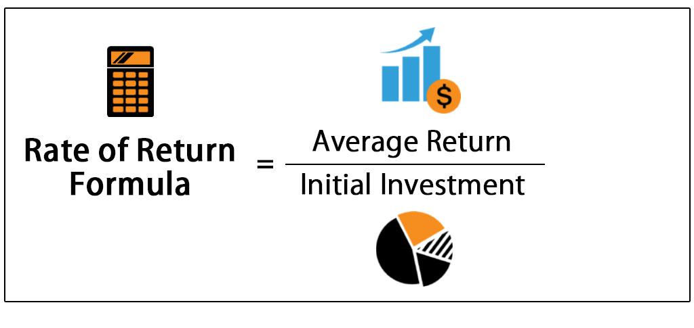

In the fast-paced world of finance, evaluating the profitability of investments is critical for making informed decisions. Among the many tools available to investors, the Internal Rate of Return (IRR) stands out as a key metric utilized to assess the expected rate of growth for investments. Essentially, IRR is the discount rate that equates the net present value (NPV) of all cash flows from a particular investment to zero, providing investors with an insight into the efficiency and potential profitability of the investment. This measure simplifies complex evaluations into a comprehensible percentage, offering a common ground for comparing diverse investment opportunities.

In algorithmic trading, where decisions are made rapidly and based on intricate data sets, understanding IRR can significantly optimize investment strategies. It allows traders to evaluate the potential returns of their strategies and compare them against the cost of capital or alternative investments. By doing so, IRR aids in refining strategies to better meet profitability goals while also managing risk.



This article explores the significance, calculation, and application of IRR in financial decision-making, with a particular focus on its use in automated trading environments. The subsequent sections will examine the fundamental concepts of IRR, its practical importance in investment decisions, different methods for calculating IRR, its role in algorithmic trading, and its limitations. By integrating IRR with other financial metrics like Net Present Value (NPV) and Return on Investment (ROI), investors can achieve a more well-rounded assessment of investment opportunities, leading to more strategic and informed decision-making.

## Table of Contents

## Understanding Internal Rate of Return (IRR)

The Internal Rate of Return (IRR) is a crucial financial metric employed to evaluate the profitability of potential investments. It is mathematically defined as the discount rate that results in a net present value (NPV) of zero for all cash flows associated with an investment. This means that at the IRR, the present value of the expected future cash inflows exactly equals the initial investment outlay, implying no net gain or loss in value from the investment when discounted at this rate.

To quantify this, consider the equation for NPV, which is given by:

$$

NPV = \sum_{t=1}^{n} \frac{C_t}{(1 + r)^t} - C_0 
$$

where:
- $C_t$ is the cash inflow at time $t$,
- $r$ is the discount rate,
- $n$ is the total number of periods,
- $C_0$ is the initial investment.

The IRR is the specific value of $r$ that sets this equation to zero:

$$

0 = \sum_{t=1}^{n} \frac{C_t}{(1 + \text{IRR})^t} - C_0 
$$

Understanding IRR offers considerable insight into the efficiency of an investment. It essentially measures the expected annual growth rate of an investment, making it particularly useful for comparing projects or investments of similar nature. If the IRR exceeds a project’s cost of capital or hurdle rate, the project is typically deemed financially viable. Furthermore, in comparative analyses, investments with higher IRRs are usually more attractive options, assuming the risks are similar.

Financial analysts and investors leverage IRR to simplify complex investment evaluations, presenting the potential profitability as a single percentage figure. This simplified approach facilitates more straightforward comparisons between disparate projects, enabling better strategic decisions in capital allocation. However, it's crucial to recognize that IRR should not be the sole metric for decision-making—it should be used in conjunction with other financial measures to ensure a comprehensive assessment of an investment’s potential.

## Importance of IRR in Investment Decisions

The Internal Rate of Return (IRR) streamlines the assessment of investments by condensing complex cash flow analyses into a single percentage figure that indicates the potential profitability. The IRR enables investors and financial analysts to evaluate the efficiency of investment opportunities quickly and make comparisons across a diverse range of projects. A primary consideration is that if an investment's IRR exceeds its cost of capital—the minimum acceptable return on investment—it is generally deemed financially favorable. This is because it implies that the project is expected to generate returns greater than the expense incurred to finance it.

The role of IRR becomes particularly prominent in capital budgeting, where it assists in determining the attractiveness of various prospective projects. Capital budgeting is a critical process that involves selecting and prioritizing long-term investments, such as new ventures, expansions, or equipment purchases. By translating the expected financial performance of each project into a comparable rate of return, IRR aids in making informed decisions about which projects to undertake. The advantage of using IRR lies in its ability to [factor](/wiki/factor-investing) in the timing and magnitude of cash flows, distinguishing it from simpler measures of profitability that may overlook these dimensions. 

However, it is important to remember that while a higher IRR signifies a potentially attractive investment, decision-makers should consider other financial metrics and qualitative factors to ensure a comprehensive evaluation. Assessing IRR within the broader context of an investment strategy can help manage risks and maximize returns over the investment's life cycle.

## How to Calculate IRR

The Internal Rate of Return (IRR) is a critical metric in investment analysis, reflecting the discount rate at which the net present value (NPV) of future cash flows equals zero. This implies an iterative approach to calculation, as it often requires approximating the solution through multiple iterations until the NPV reaches a negligible value. Here, we explore three common methods for calculating IRR: manual calculation, Excel, and Python.

### Manual Calculation
Calculating IRR manually involves solving the NPV equation iteratively. The NPV equation is:

$$

NPV = \sum_{t=0}^{n} \frac{C_t}{(1 + r)^t} 
$$

where $C_t$ represents the cash flow at time $t$, $r$ is the discount rate (IRR), and $n$ is the total number of periods. The goal is to adjust $r$ until the NPV is approximately zero. Generally, this method is impractical for complex or extensive cash flows due to its labor-intensive process.

### Excel Method
Excel simplifies IRR calculations using its built-in `IRR` function. The syntax for this function is `IRR(values, [guess])`, where `values` are the range of cash flows (including the initial investment as a negative value), and `[guess]` is an optional parameter to estimate the IRR's initial value. For instance:

```plaintext
=IRR(A1:A10)
```

In this example, the function calculates the IRR for cash flows in cells A1 through A10. Excel's capability to automate iterations makes it advantageous for handling IRR calculations quickly and accurately.

### Python Method
For programmatically driven environments, Python provides flexible tools for calculating IRR, with libraries like NumPy offering efficient solutions. Using NumPy's `irr` function, traders and analysts can calculate IRR as follows:

```python
import numpy as np

cash_flows = [-1000, 200, 300, 400, 500]
irr = np.irr(cash_flows)
print(f"The IRR is: {irr:.2%}")
```

This code snippet declares a series of cash flows and applies NumPy's `irr()` method to compute the IRR. Python's computational power is particularly beneficial for processing large datasets and integrating IRR calculations into broader investment strategies or simulations.

Each method offers distinct advantages, with manual calculation providing foundational understanding, Excel offering user-friendly interfaces, and Python enabling high-speed processing for complex investment scenarios. Understanding and employing these tools is key to leveraging IRR for precise financial decision-making.

## Algorithmic Trading and IRR

Algorithmic trading leverages computer algorithms to execute trades at optimal prices and speeds, often surpassing human capabilities. Within this context, the Internal Rate of Return (IRR) serves as a valuable metric for evaluating trading strategies by quantifying anticipated profitability in terms of percentage return. Automating IRR calculations in [algorithmic trading](/wiki/algorithmic-trading) enables traders to enhance their decision-making processes, resulting in increased efficiency and accuracy.

One of the primary advantages of automation is the capability to process large datasets and complex calculations in real-time. Python, renowned for its computational prowess, significantly aids in simplifying these calculations. For instance, the `numpy` library offers the `irr()` function, which allows for swift determination of the IRR from arrays of cash flows. This can be particularly useful when evaluating the performance of various trading strategies or portfolio allocations, as it quickly highlights which investments might yield the highest returns relative to their cost.

Here is an example of how Python can be used to calculate IRR in an algorithmic trading context:

```python
import numpy as np

# Example cash flows from an investment
cash_flows = [-1000, 100, 200, 300, 400, 500]

# Calculate IRR using numpy
irr_value = np.irr(cash_flows)

print(f"The IRR of the investment is {irr_value:.2f}")
```

This tailored approach allows traders to integrate IRR calculations into their automated systems, conducting continuous evaluations of performances across multiple strategies without manual intervention. Such computational agility is essential for rapidly adapting to market changes and maintaining a competitive edge. Furthermore, Python's flexibility permits seamless integration with data visualization tools, facilitating the analysis and presentation of IRR results in an intuitive manner.

While IRR provides a critical measure of potential investment success, it is crucial to consider its limitations, particularly the assumption that interim cash flows are reinvested at the rate calculated by the IRR. Automation in algorithmic trading can mitigate this by allowing for simultaneous assessment alongside other financial metrics, producing a comprehensive view of an investment's viability.

Overall, utilizing the strengths of Python and computational technologies, traders can extensively apply IRR within algorithmic frameworks, achieving optimized investment strategies and informed financial decision-making.

## Limitations of IRR

The Internal Rate of Return (IRR) is a widely used metric in investment analysis, but it is not without its limitations. One significant assumption in the IRR calculation is the reinvestment of cash inflows at the IRR itself. This assumption is often unrealistic, as it presumes that the investment's interim cash flows can be reinvested at the same rate as the project's projected rate of return. In many scenarios, the market conditions do not allow for such reinvestment opportunities, leading to potential overestimation of an investment's attractiveness.

Another limitation is that IRR can yield multiple values for projects with unconventional cash flow patterns, such as those characterized by alternating periods of positive and negative cash flows. This phenomenon arises from the mathematical nature of the IRR equation, which is essentially solving for the roots of the polynomial NPV equation. In such cases, it is challenging to determine which IRR is the most appropriate one to use for decision-making purposes.

Furthermore, the IRR does not consider the scale of the investment, which can lead to misleading conclusions. An investment with a smaller absolute return but a higher IRR may appear more attractive than a larger project with a slightly lower IRR but significantly higher total profits. This limitation could steer investors away from more beneficial opportunities simply because they are evaluating projects based on percentage returns instead of absolute value added.

These limitations highlight the importance of using IRR in conjunction with other financial metrics, such as Net Present Value (NPV) and Modified Internal Rate of Return (MIRR), to achieve a more comprehensive analysis of investment opportunities. By considering the broader financial context and leveraging supplementary metrics, investors can make more informed and balanced decisions.

## Comparing IRR with Other Financial Metrics

When evaluating financial metrics, the Internal Rate of Return (IRR) is often compared to other key measurements such as Return on Investment (ROI) and Net Present Value (NPV). Each metric offers distinct perspectives that can help in making well-rounded investment decisions.

### IRR vs ROI

Return on Investment (ROI) is a straightforward metric that measures the profitability of an investment. It is calculated as the net profit divided by the initial investment cost, typically expressed as a percentage:

$$
\text{ROI} = \left( \frac{\text{Net Profit}}{\text{Initial Investment}} \right) \times 100
$$

ROI gives a high-level view of an investment's performance but does not consider the time value of money. This means it does not account for the fact that a dollar today is worth more than a dollar in the future due to potential [earning](/wiki/earning-announcement) capacity. IRR, on the other hand, calculates the percentage rate earned on each dollar invested for each period it is invested, taking into account the time value of money. This makes IRR a more comprehensive metric when evaluating the time-related profitability of investments.

### IRR vs NPV

Net Present Value (NPV) is another vital financial metric that complements the IRR. NPV calculates the difference between the present value of cash inflows and outflows over a period. Its formula is given by:

$$
\text{NPV} = \sum \left( \frac{C_t}{(1 + r)^t} \right) - C_0
$$

where $C_t$ represents cash inflow during the period $t$, $r$ is the discount rate, and $C_0$ is the initial investment. 

While IRR provides a percentage rate of return, indicating the efficiency of an investment, NPV offers a monetary value that represents the total profitability. NPV indicates whether the projected earnings (discounted to present value) surpass the initial investment outlay, thus providing a clearer picture of the absolute value an investment adds. 

In conclusion, IRR, ROI, and NPV each have their unique strengths and serve different purposes in investment analysis. IRR's inclusion of the time value of money makes it particularly useful for comparing the viability of long-term projects. However, understanding and using these metrics in tandem with each other provides a more complete analysis of an investment's potential and profitability.

## Case Studies of IRR in Action

The Internal Rate of Return (IRR) has proven to be an instrumental metric across various industries, providing insight into investment performances over time. This section assesses how IRR has been utilized effectively in infrastructure projects, corporate budgeting, and real estate, highlighting both the practical benefits and challenges encountered.

### Infrastructure

In the infrastructure sector, where projects often involve substantial capital outlays and extended timeframes, IRR serves as a crucial metric for evaluating potential returns. For instance, in the development of large-scale transportation projects like highways or railways, investors assess the IRR to determine the feasibility of such ventures. A project with an IRR exceeding the hurdle rate, often related to the cost of capital or required return on investment, is considered viable. This approach not only helps in decision-making but also aids in securing funding. However, one significant challenge is the unpredictability of long-term cash flows due to economic and regulatory changes, which can lead to multiple IRR scenarios, complicating the evaluation process.

### Corporate Budgeting

Within corporate budgeting, IRR is employed to prioritize investment projects. Companies utilize IRR to compare the profitability of diverse initiatives, such as launching new products, expanding current operations, or replacing aging equipment. This metric simplifies complex evaluations by converting them into a single percentage, streamlining decision processes. For example, if a corporation has a minimum acceptable rate of return of 10%, projects with an IRR above this threshold are typically favored. However, the assumption that reinvestments can occur at the IRR computed often presents a limitation, as reinvestment rates might differ in the real world.

### Real Estate

In real estate, IRR is a prominent metric for assessing the attractiveness of property investments. When investors evaluate residential or commercial properties, they frequently project cash flows based on rental income, maintenance costs, property taxes, and potential sale proceeds to calculate the IRR. A higher IRR indicates a more profitable investment, assuming the projections hold true. Real estate investments encounter challenges concerning cash flow predictions, as market conditions, tenant reliability, and maintenance costs are variable and can result in discrepancies in expected returns. Additionally, properties with non-standard cash flows, such as those with irregular rental incomes due to seasonal factors, may lead to multiple IRR values, complicating straightforward analysis. 

Overall, while IRR provides a standardized benchmark for assessing investment viability across various sectors, practical challenges such as cash flow variability and reinvestment assumptions must be meticulously managed to ensure accurate assessments.

## Conclusion

The Internal Rate of Return (IRR) remains a significant financial tool for investment analysis, offering investors a means to assess the potential profitability of a project. However, it is imperative to recognize that IRR should not function in isolation. Its inherent limitations, such as assuming reinvestment at the same rate and its inability to effectively handle unconventional cash flows, necessitate the integration of other financial metrics in investment decision-making.

A comprehensive approach that combines IRR with metrics like Return on Investment (ROI), Net Present Value (NPV), and Modified Internal Rate of Return (MIRR) can provide a more robust framework for evaluating potential investments. While IRR illustrates a project's expected growth rate, NPV specifies the added value in monetary terms, making it often more informative, especially when comparing large projects. In addition, ROI offers a straightforward profitability measure, while MIRR adjusts for reinvestment rate assumptions, offering an alternative perspective on project viability.

Integrating these metrics facilitates a well-rounded analysis by addressing different dimensions of investment performance. For instance, Python can be employed to compute these metrics efficiently. Below is a simple example using Python’s NumPy library to calculate IRR and NPV:

```python
import numpy as np

# Example cash flows
cash_flows = [-1000, 200, 300, 400, 500]

# Calculate IRR using NumPy
irr = np.irr(cash_flows)

# Calculate NPV assuming a discount rate of 10%
discount_rate = 0.10
npv = np.npv(discount_rate, cash_flows)

print(f"IRR: {irr:.2%}")
print(f"NPV: ${npv:.2f}")
```

In conclusion, while IRR is a valuable indicator for assessing investment opportunities, its application should be supplemented by a more holistic suite of financial analyses. This ensures a balanced and informed evaluation of investment projects, empowering decision-makers to derive insights that account for multiple financial dimensions.

## References & Further Reading

For further insights on the Internal Rate of Return (IRR), several authoritative texts provide comprehensive coverage. "Principles of Corporate Finance" is a widely recognized text that discusses IRR in the broader context of corporate finance decision-making. It explores both theoretical foundations and practical applications, making it a valuable resource for understanding how IRR fits into various financial analyses.

Another essential resource is "Investment Valuation" by Aswath Damodaran, a leading authority on investment appraisal. Damodaran's work investigates into valuation techniques, including IRR, offering nuanced perspectives on its application in different investment settings. His approach combines practical examples with theoretical insights, making complex concepts readily accessible.

For those seeking to expand their understanding through online resources, Investopedia offers a variety of articles and tutorials on IRR. This platform provides clear explanations and examples, catering to both beginners and seasoned professionals. It covers the calculation of IRR using Excel and Python, explaining iterative methods such as those involving the use of Python's NumPy library, specifically the `np.irr()` function:

```python
import numpy as np

# Example cash flow series for IRR calculation
cash_flows = [-1500, 300, 400, 500, 600]

# Calculate IRR using NumPy's irr function
irr_value = np.irr(cash_flows)

print(f"The IRR for the given cash flows is: {irr_value:.2%}")
```

By consulting these resources, individuals can gain a deeper understanding of IRR, its strengths, and its limitations, facilitating more informed and sophisticated financial decision-making.

