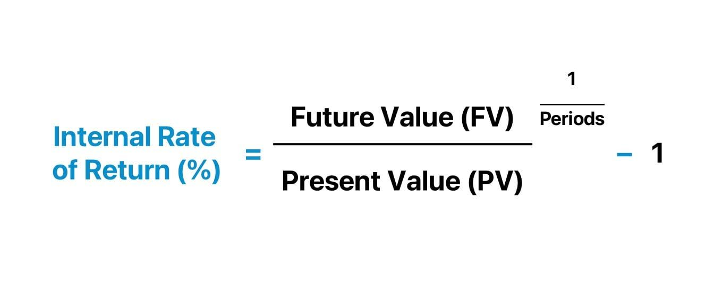

## Table of Contents

## What is the Internal Rate of Return (IRR)?

The Internal Rate of Return (IRR) is a way to measure how well an investment is doing. It's like a special percentage that tells you the average yearly profit you can expect from your investment. If the IRR is higher than the rate you could get from a safer investment, like a bank savings account, then your investment might be a good choice.

Calculating the IRR can be a bit tricky because it involves some math that finds the rate where the money you put in equals the money you get back over time. Think of it like finding the break-even point but in terms of percentage growth. Many people use computers or special calculators to figure it out because it's not something you can easily do with a simple calculator.

## Why is IRR important in financial analysis?

IRR is important in financial analysis because it helps people decide if an investment is worth making. It tells you the expected growth rate of your money over time. If the IRR is higher than other options, like keeping your money in a bank, then the investment might be a good choice. This way, you can compare different investments easily and pick the one that will likely give you the best return.

Another reason IRR is useful is that it considers the time value of money. This means it understands that a dollar today is worth more than a dollar in the future. By using IRR, you can see how the timing of cash flows affects the overall return of your investment. This helps in making smarter choices about when to put money into or take money out of an investment.

## How does IRR differ from other investment appraisal techniques like NPV?

IRR and NPV are both tools to help you decide if an investment is good, but they work a bit differently. IRR tells you the rate at which an investment breaks even, meaning the rate at which the money you put in equals the money you get back over time. It's like finding the average yearly profit you can expect. If the IRR is higher than what you could get from a safer investment, like a bank account, then the investment might be worth it. 

On the other hand, NPV, or Net Present Value, looks at the total value of an investment in today's dollars. It takes all the money you expect to get from an investment and brings it back to what it's worth right now, considering the time value of money. If the NPV is positive, it means the investment is expected to make more money than it costs. While IRR gives you a percentage rate, NPV gives you a dollar amount, which can be easier to understand if you're thinking about how much actual money you'll gain or lose.

## What is the basic formula for calculating IRR?

The basic formula for calculating IRR is a bit tricky because it involves solving for a rate that makes the net present value (NPV) of all cash flows from an investment equal to zero. In simple terms, if you have an investment where you put in some money and get money back over time, the IRR is the rate that makes the total value of money you put in equal to the total value of money you get back, considering the time value of money.

To find the IRR, you typically use a formula that looks like this: 0 = CF0 + CF1/(1+IRR) + CF2/(1+IRR)^2 + ... + CFn/(1+IRR)^n. Here, CF0 is the initial cash flow (usually a negative number because you're spending money), and CF1, CF2, up to CFn are the cash flows you get back in future periods. You need to solve for IRR, which is the rate that makes the left side of the equation equal to zero. This usually requires using a calculator or a computer because it's not easy to solve by hand.

## Can you explain the concept of IRR using a simple example?

Imagine you have $100 and you're thinking about investing it in a new lemonade stand. You figure that if you spend that $100 now, you'll make $50 back at the end of the first year and another $60 at the end of the second year. The Internal Rate of Return (IRR) is the special percentage that tells you how well your lemonade stand is doing. It's the rate that makes the money you put in equal to the money you get back over time.

Let's say you find out that the IRR for your lemonade stand is 10%. This means if you could find another place to put your $100 where you'd get at least 10% a year, you might want to do that instead. But if the best you can do elsewhere is only 5% a year, then your lemonade stand looks like a good deal because it's expected to grow your money faster. So, the IRR helps you decide if your lemonade stand is a better choice than other places you could put your money.

## What are the steps to calculate IRR manually?

To calculate IRR manually, you first need to understand the basic formula, which is 0 = CF0 + CF1/(1+IRR) + CF2/(1+IRR)^2 + ... + CFn/(1+IRR)^n. Here, CF0 is the initial cash flow (usually a negative number because you're spending money), and CF1, CF2, up to CFn are the cash flows you get back in future periods. You need to find the IRR that makes the left side of the equation equal to zero. This involves trial and error because it's not easy to solve directly.

Start by guessing a rate, like 10%, and plug it into the formula. If the result is positive, try a higher rate. If it's negative, try a lower rate. Keep adjusting your guess until you find a rate that makes the equation equal to zero. For example, if you invested $100 and expect to get $50 back at the end of the first year and $60 at the end of the second year, you might start with 10%. If that doesn't work, try 15%, then 12%, and keep going until you find the rate that balances the equation. This process can be time-consuming and is often done with a calculator or computer, but it's possible to do it by hand with patience and some math skills.

## How can IRR be calculated using financial calculators or software?

Using a financial calculator or software to find the Internal Rate of Return (IRR) is much easier than doing it by hand. Most financial calculators have a button labeled "IRR" or something similar. You just need to enter the cash flows into the calculator, starting with the initial investment (usually a negative number) followed by the returns you expect to get back over time. Once you've entered all the cash flows, you press the IRR button, and the calculator quickly figures out the rate that makes the total value of the money you put in equal to the total value of the money you get back.

Software like Microsoft Excel or Google Sheets can also calculate IRR easily. In Excel, you use the IRR function, which looks like =IRR(values). You list all your cash flows in a column or row, and the function calculates the IRR for you. For example, if you invested $100 and expect to get $50 back at the end of the first year and $60 at the end of the second year, you'd enter -100, 50, and 60 in three cells, and then use the IRR function to find the rate. This way, you don't have to guess and adjust like you would if you were doing it manually.

## What are the common challenges and limitations of using IRR?

Using IRR can be tricky because it sometimes gives you answers that don't make sense in real life. For example, if you have an investment where you get money back in a weird pattern, like getting a lot of money back at the start and then nothing later, you might end up with more than one IRR. This can make it hard to know which one to use. Also, IRR assumes you can take the money you get back and put it right back into another investment with the same rate, which isn't always possible. This can make the IRR seem better than it really is.

Another challenge is that IRR doesn't tell you how big the investment is. A small project with a high IRR might not be as good as a big project with a lower IRR because the big project could make more money overall. Also, IRR doesn't consider the risk of the investment. Two projects might have the same IRR, but one might be much riskier. So, you need to use other tools, like NPV, along with IRR to get a full picture of whether an investment is a good idea.

## How does the timing of cash flows affect the IRR?

The timing of when you get money back from an investment can really change the IRR. If you get a lot of money back early on, that can make the IRR look higher because you're getting your money back faster. On the other hand, if you have to wait a long time to get your money back, the IRR might be lower because you're not getting your money back as quickly. IRR takes into account that money now is worth more than money later, so the sooner you get money back, the better the IRR usually is.

But, the timing can also make things tricky. If you get money back in a strange pattern, like a big amount early and then nothing for a while, you might end up with more than one IRR. This can make it hard to know which IRR to use when deciding if the investment is good. So, it's important to look at when you're getting money back, not just how much you're getting, because the timing can really change how good the investment looks based on the IRR.

## What is the Modified Internal Rate of Return (MIRR) and how does it improve upon traditional IRR?

The Modified Internal Rate of Return (MIRR) is a way to measure how well an investment is doing, just like the regular Internal Rate of Return (IRR). But MIRR fixes some problems that IRR has. With MIRR, you don't just look at when you get money back from your investment; you also think about what you could do with that money if you got it back early. You can choose to put that money into another investment or save it in a bank. This makes MIRR a bit more realistic because it considers what you might do with the money you get back.

MIRR improves on traditional IRR by solving the issue of multiple IRRs. Sometimes, with IRR, you might get more than one answer, which can be confusing. MIRR only gives you one answer, so it's easier to use. Also, MIRR takes into account the cost of money, which means it considers how much it costs you to borrow money for your investment. This makes MIRR a better tool for comparing different investments because it gives you a clearer picture of how well your money is working for you.

## Can you provide an advanced example of IRR calculation involving multiple cash flows?

Imagine you're thinking about starting a small business. You need to spend $50,000 to get it going, but you expect to make money back over the next few years. In the first year, you think you'll make $10,000, in the second year $15,000, in the third year $20,000, and in the fourth year $25,000. To find the IRR, you need to figure out the rate that makes the money you put in equal to the money you get back over time. You start by guessing a rate, like 10%, and plug it into the formula: 0 = -50,000 + 10,000/(1+IRR) + 15,000/(1+IRR)^2 + 20,000/(1+IRR)^3 + 25,000/(1+IRR)^4. If the result is positive, you try a higher rate. If it's negative, you try a lower rate. You keep adjusting until you find the rate that makes the equation equal to zero.

After some trial and error, you find that the IRR for your small business is about 12%. This means if you could find another place to put your $50,000 where you'd get at least 12% a year, you might want to do that instead. But if the best you can do elsewhere is only 8% a year, then your small business looks like a good deal because it's expected to grow your money faster. So, the IRR helps you decide if your small business is a better choice than other places you could put your money.

## How can IRR be used in comparing different investment opportunities?

IRR is a great tool for comparing different investment opportunities because it tells you the expected growth rate of your money over time. If you're looking at two different investments, you can calculate the IRR for each one and then compare them. The investment with the higher IRR is usually the better choice because it means your money will grow faster. For example, if one investment has an IRR of 10% and another has an IRR of 15%, the second one is likely a better option because it's expected to give you a higher return on your money.

But, it's important to remember that IRR isn't perfect. It doesn't tell you how big the investment is or how risky it might be. So, you should use IRR along with other tools, like Net Present Value (NPV), to get a full picture. NPV can show you the total value of an investment in today's dollars, which can help you see if the investment will actually make you more money than it costs. By using both IRR and NPV, you can make smarter choices about where to put your money.

## What is the Understanding of Internal Rate of Return (IRR)?

Internal Rate of Return (IRR) is an essential financial metric utilized to assess the profitability and potential efficiency of investments. It serves as a critical gauge in the decision-making process for investors seeking to evaluate various investment opportunities. IRR is defined as the discount rate that equates the net present value (NPV) of an investment's cash flows to zero. Mathematically, this is expressed as:

$$
NPV = \sum_{t=0}^{n} \frac{C_t}{(1+IRR)^t} = 0
$$

Where:
- $n$ is the number of time periods,
- $C_t$ is the cash flow at time $t$,
- $IRR$ is the internal rate of return.

A higher IRR is generally considered more favorable as it suggests that the investment will yield a greater return relative to its cost. This makes IRR a valuable tool when comparing multiple investment projects, providing a standardized method to evaluate potential profitability.

The calculation of IRR is inherently iterative and can be complex without computational tools, as it requires trial-and-error or algorithms to find the rate at which the NPV equals zero. Nevertheless, modern computational software and programming languages like Python facilitate this process. Below is a basic example of using Python to compute the IRR of a series of cash flows:

```python
import numpy as np

# Example cash flows: [-initial_investment, cash inflows...]
cash_flows = [-1000, 200, 300, 400, 500]

# Calculate IRR using numpy's financial function
irr = np.irr(cash_flows)

print(f"The IRR of the investment is: {irr:.2%}")
```

In this example, the `np.irr` function from the NumPy library quickly computes the IRR, highlighting the efficiency of such tools in financial analysis.

IRR is particularly useful for evaluating the efficiency of a project, particularly in capital budgeting and investment planning. By understanding the IRR, investors can determine whether a project's return meets or exceeds the required threshold, often set by the cost of capital.

Overall, IRR provides a valuable perspective on the potential success of an investment by translating complex cash flow scenarios into a single, interpretable figure. However, it's crucial to understand both the capabilities and limitations of IRR to ensure comprehensive investment analysis and decision-making.

## How do you calculate IRR?

The Internal Rate of Return (IRR) is a critical financial metric used to ascertain the discount rate that equates the net present value (NPV) of an investment's cash inflows and outflows to zero. Calculating IRR requires iterative techniques, as it often involves solving complex equations where analytical solutions are not feasible. Below are methodologies for computing IRR manually, as well as using Excel and Python.

### Manual Calculation of IRR

To manually calculate the IRR, one must find the discount rate ($r$) that satisfies the equation:

$$

NPV = \sum_{t=0}^{n} \frac{C_t}{(1 + r)^t} = 0 
$$

Here, $C_t$ represents the cash flow at time $t$, and $n$ is the total number of periods. Typically, a trial-and-error approach is used, adjusting the discount rate until the sum of discounted cash flows equals zero. Begin with an estimated rate and adjust until the NPV approaches zero.

### Calculating IRR Using Excel

Excel uses the `IRR` function to compute IRR efficiently, leveraging its capabilities to handle iterative calculations. Follow these steps:

1. Arrange the cash flow data in a single column within a spreadsheet. Ensure the initial investment is a negative value and subsequent cash flows are positive.

2. Utilize the formula `=IRR(range, [guess])`, replacing "range" with the cell references of your cash flows. The optional "guess" argument is your initial estimate of the IRR. If omitted, Excel defaults to 0.1 (or 10%).

For example, if your cash flows are in cells A1 through A6, the formula would be `=IRR(A1:A6)`.

### Calculating IRR Using Python

Python, with libraries like NumPy, offers a straightforward approach to calculate IRR. The following example demonstrates how to use Python to compute IRR given a series of cash flows:

```python
import numpy as np

# Define the cash flows: initial investment as a negative value followed by annual returns
cash_flows = [-1000, 300, 420, 680]

# Use NumPy's IRR function to calculate the IRR
irr_value = np.irr(cash_flows)

# Convert the IRR value to a percentage
irr_percentage = irr_value * 100

print(f"The IRR is {irr_percentage:.2f}%")
```

### Examples

#### Example 1: Manual Estimation
For an investment with an initial outflow of $1,000 and expected inflows of $300, $420, and $680 over three years, trial different rates starting from a reasonable guess until zero NPV is closely approached. 

#### Example 2: Excel
Using the same cash flow series, input the data into Excel and apply the formula `=IRR(A1:A4)` to obtain the IRR.

#### Example 3: Python
With the Python code provided, adjust the `cash_flows` array as needed, and run the script to derive the IRR.

These methods ensure flexibility and accuracy in determining IRR, providing essential insights into the potential profitability of investments. By leveraging computational tools, the process is significantly streamlined, allowing for more sophisticated financial analyses.

## What are the limitations of IRR?

The Internal Rate of Return (IRR) is widely regarded as a key metric for evaluating the profitability of investments. However, it is essential to recognize its limitations to ensure accurate financial decision-making. One of the primary assumptions inherent in the IRR calculation is the constant reinvestment rate assumption. This assumption presumes that all future cash inflows generated by an investment can be reinvested at the same rate as the IRR itself. In practice, this may not hold true, as market conditions and available reinvestment opportunities can fluctuate, impacting the realized returns.

Moreover, IRR does not account for the scale of investment projects. This limitation can be particularly problematic when comparing projects of significantly different sizes. For instance, a small-scale project may have a higher IRR than a larger-scale one, but in absolute terms, the latter may generate more substantial cash flows, making it a more attractive option. Thus, relying solely on IRR in such cases might lead to suboptimal investment decisions.

Another notable limitation of IRR arises when dealing with projects that have unconventional or non-standard cash flow patterns. In such scenarios, it is possible to encounter multiple IRRs, leading to ambiguity in the evaluation process. For example, if a project's cash flow stream involves alternating periods of positive and negative values, the polynomial equation used to compute IRR can have more than one real root, each representing a distinct IRR. This can complicate the assessment of a project's true value.

To address these limitations, it is advisable to use supplementary metrics, such as the Modified Internal Rate of Return (MIRR). The MIRR provides a more precise estimation by assuming that positive cash flows are reinvested at the project's cost of capital, rather than the IRR. The MIRR is calculated as:

$$
MIRR = \left( \frac{FV_{Positive}}{PV_{Negative}} \right)^{\frac{1}{n}} - 1
$$

where $FV_{Positive}$ is the future value of positive cash flows, $PV_{Negative}$ is the present value of negative cash flows, and $n$ is the project's duration in years. By adopting MIRR and other financial metrics like Net Present Value (NPV), investors can obtain a more comprehensive understanding of an investment's potential profitability and risks. These approaches enable careful consideration of reinvestment assumptions and project scale, leading to more informed and strategic investment decisions.

## How does IRR compare with other financial metrics?

The Internal Rate of Return (IRR) is compared with two other critical financial metrics: Return on Investment (ROI) and Net Present Value (NPV). Each metric provides a distinctive perspective on assessing investment opportunities, and understanding these differences is crucial for investors seeking comprehensive evaluations.

**Internal Rate of Return (IRR):**  
IRR is the discount rate at which the net present value of an investment's cash flows equals zero. It represents the break-even rate of return, where the present value of cash inflows meets cash outflows. The primary advantage of IRR lies in its ability to present potential returns as a percentage, allowing easy comparison across diverse types of projects and investments. However, it makes assumptions about the reinvestment of interim cash flows at the same rate, which might not always be realistic.

**Return on Investment (ROI):**  
ROI provides a straightforward metric, measuring the profitability of an investment relative to its cost. It is calculated using the formula:

$$
\text{ROI} = \left(\frac{\text{Net Profit}}{\text{Cost of Investment}}\right) \times 100
$$

ROI’s simplicity offers the advantage of quickly assessing the efficiency of an investment, useful for relative comparisons. However, it does not account for the time value of money, leading to less accuracy in scenarios involving lengthy investment horizons and varying cash flow patterns.

**Net Present Value (NPV):**  
NPV assesses the profitability of an investment by calculating the difference between the present value of cash inflows and outflows, using a specified discount rate. The formula is represented as:

$$
\text{NPV} = \sum \frac{C_t}{(1 + r)^t} - C_0
$$

where $C_t$ is the cash inflow at time $t$, $r$ is the discount rate, and $C_0$ is the initial investment. NPV gives a dollar value on the expected profitability, advantageous in providing a direct indication of value added. Unlike IRR, NPV accounts for the scale of the project and the time value of money, although it requires a predetermined discount rate which might be subjective.

**Integration of Metrics for Comprehensive Analysis:**  
While each metric has its strengths and limitations, combining IRR, ROI, and NPV can offer a holistic investment appraisal. IRR is beneficial for comparing the relative profitability of similar projects, ROI is instrumental for quick and broad comparisons, and NPV provides precise insights into an investment's absolute value addition.

**Selecting the Appropriate Metrics:**  
The choice of metrics should be tailored to the specific context and goals of the investment. For projects with uniform cash flows and short durations, ROI might suffice. In contrast, long-term investments with complex cash flows benefit from the combined use of IRR and NPV. When investments vary significantly in size or duration, NPV is often favored due to its consideration of the actual dollar contribution to overall wealth.

Utilizing these metrics in tandem equips investors with a more nuanced understanding of potential investment opportunities, facilitating more informed decision-making.

## References & Further Reading

#