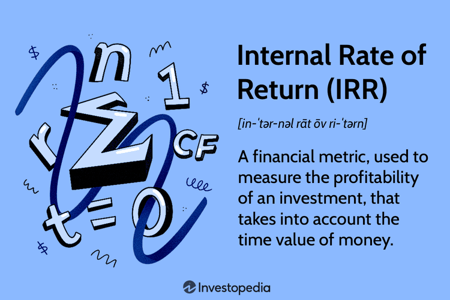

In the competitive world of investment, understanding financial metrics is crucial for success. Among the various financial metrics, the internal rate of return (IRR) stands out as a fundamental tool in investment analysis. IRR is often used to evaluate the profitability potential of investments by estimating the rate of growth a project is expected to generate. As it provides a singular metric to assess the desirability of investments, it becomes a pivotal aspect in deciding which ventures merit allocation of resources.

This article explores the IRR, focusing on its calculation process and its pivotal role in financial decision-making, especially in contexts such as algorithmic trading. Algorithmic trading, with its reliance on quantitative metrics and automated processes, can greatly benefit from an accurate understanding and application of IRR, allowing for optimization of investment strategies through rapid and data-driven decisions. 



Additionally, while IRR is a straightforward metric offering significant insights into investment efficiency, it also has inherent limitations. These limitations, including assumptions about constant reinvestment rates and possible multiple IRRs with non-standard cash flows, necessitate a careful and contextually informed application to avoid misinterpretations that could lead to suboptimal financial decisions. Therefore, the article will address how understanding these facets can enhance an investor's or trader's ability to make informed and strategic decisions, ensuring more effective evaluations of investment opportunities and judicious allocation of financial resources.

The objective is to provide foundational knowledge, equipping readers with the ability to assess investment opportunities more effectively. By harnessing a deeper understanding of IRR alongside its strengths and weaknesses, financial decision-makers can refine their investment analyses, contributing to more successful financial planning and investment portfolios.

## Table of Contents

## Understanding Internal Rate of Return (IRR)

Internal Rate of Return (IRR) is an essential financial metric utilized to assess the profitability and potential efficiency of investments. It serves as a critical gauge in the decision-making process for investors seeking to evaluate various investment opportunities. IRR is defined as the discount rate that equates the net present value (NPV) of an investment's cash flows to zero. Mathematically, this is expressed as:

$$
NPV = \sum_{t=0}^{n} \frac{C_t}{(1+IRR)^t} = 0
$$

Where:
- $n$ is the number of time periods,
- $C_t$ is the cash flow at time $t$,
- $IRR$ is the internal rate of return.

A higher IRR is generally considered more favorable as it suggests that the investment will yield a greater return relative to its cost. This makes IRR a valuable tool when comparing multiple investment projects, providing a standardized method to evaluate potential profitability.

The calculation of IRR is inherently iterative and can be complex without computational tools, as it requires trial-and-error or algorithms to find the rate at which the NPV equals zero. Nevertheless, modern computational software and programming languages like Python facilitate this process. Below is a basic example of using Python to compute the IRR of a series of cash flows:

```python
import numpy as np

# Example cash flows: [-initial_investment, cash inflows...]
cash_flows = [-1000, 200, 300, 400, 500]

# Calculate IRR using numpy's financial function
irr = np.irr(cash_flows)

print(f"The IRR of the investment is: {irr:.2%}")
```

In this example, the `np.irr` function from the NumPy library quickly computes the IRR, highlighting the efficiency of such tools in financial analysis.

IRR is particularly useful for evaluating the efficiency of a project, particularly in capital budgeting and investment planning. By understanding the IRR, investors can determine whether a project's return meets or exceeds the required threshold, often set by the cost of capital.

Overall, IRR provides a valuable perspective on the potential success of an investment by translating complex cash flow scenarios into a single, interpretable figure. However, it's crucial to understand both the capabilities and limitations of IRR to ensure comprehensive investment analysis and decision-making.

## Importance of IRR in Investment Decisions

The Internal Rate of Return (IRR) is pivotal in investment decisions as it condenses the complexities of an investment's potential into a single percentage, reflecting its profitability. This measure not only simplifies the comparison between different investment opportunities, but it also serves as a critical benchmark against the cost of capital. When an investment's IRR surpasses its cost of capital, it suggests that the project is likely to yield a positive net return, making it an attractive option for investors.

From a strategic perspective, IRR is crucial in capital budgeting, where firms must decide which projects to pursue given limited resources. By using IRR, investors can prioritize projects that promise a higher rate of return, ensuring that the capital is allocated to opportunities with the optimal growth potential. This perspective is particularly valuable when dealing with diverse projects, each having distinct cash flow profiles and risk factors.

Additionally, IRR enables a unified framework for comparing projects with varying scales, durations, and cash flow structures. For example, when presented with multiple investment opportunities, of which one might have a smaller initial investment but a higher IRR, an investor can effectively assess the risk-return tradeoff. This measurability ensures that resources are directed towards investments that align with the strategic goals of maximizing shareholder value.

In summary, IRR is a powerful metric that underpins strategic financial planning and effective capital allocation. It provides a comprehensive view of potential profitability, aids in comparing diverse investment options, and ultimately supports decision-making processes that align with broader organizational objectives.

## How to Calculate IRR

The Internal Rate of Return (IRR) is a critical financial metric used to ascertain the discount rate that equates the net present value (NPV) of an investment's cash inflows and outflows to zero. Calculating IRR requires iterative techniques, as it often involves solving complex equations where analytical solutions are not feasible. Below are methodologies for computing IRR manually, as well as using Excel and Python.

### Manual Calculation of IRR

To manually calculate the IRR, one must find the discount rate ($r$) that satisfies the equation:

$$

NPV = \sum_{t=0}^{n} \frac{C_t}{(1 + r)^t} = 0 
$$

Here, $C_t$ represents the cash flow at time $t$, and $n$ is the total number of periods. Typically, a trial-and-error approach is used, adjusting the discount rate until the sum of discounted cash flows equals zero. Begin with an estimated rate and adjust until the NPV approaches zero.

### Calculating IRR Using Excel

Excel uses the `IRR` function to compute IRR efficiently, leveraging its capabilities to handle iterative calculations. Follow these steps:

1. Arrange the cash flow data in a single column within a spreadsheet. Ensure the initial investment is a negative value and subsequent cash flows are positive.

2. Utilize the formula `=IRR(range, [guess])`, replacing "range" with the cell references of your cash flows. The optional "guess" argument is your initial estimate of the IRR. If omitted, Excel defaults to 0.1 (or 10%).

For example, if your cash flows are in cells A1 through A6, the formula would be `=IRR(A1:A6)`.

### Calculating IRR Using Python

Python, with libraries like NumPy, offers a straightforward approach to calculate IRR. The following example demonstrates how to use Python to compute IRR given a series of cash flows:

```python
import numpy as np

# Define the cash flows: initial investment as a negative value followed by annual returns
cash_flows = [-1000, 300, 420, 680]

# Use NumPy's IRR function to calculate the IRR
irr_value = np.irr(cash_flows)

# Convert the IRR value to a percentage
irr_percentage = irr_value * 100

print(f"The IRR is {irr_percentage:.2f}%")
```

### Examples

#### Example 1: Manual Estimation
For an investment with an initial outflow of $1,000 and expected inflows of $300, $420, and $680 over three years, trial different rates starting from a reasonable guess until zero NPV is closely approached. 

#### Example 2: Excel
Using the same cash flow series, input the data into Excel and apply the formula `=IRR(A1:A4)` to obtain the IRR.

#### Example 3: Python
With the Python code provided, adjust the `cash_flows` array as needed, and run the script to derive the IRR.

These methods ensure flexibility and accuracy in determining IRR, providing essential insights into the potential profitability of investments. By leveraging computational tools, the process is significantly streamlined, allowing for more sophisticated financial analyses.

## Algorithmic Trading and IRR

Algorithmic trading incorporates the internal rate of return (IRR) as a key metric for evaluating potential trading strategies and optimizing investment decisions. Automating the computation of IRR using programming languages like Python significantly enhances both the speed and accuracy of these evaluations, crucial aspects in the fast-paced world of trading.

Python's rich ecosystem of libraries, such as NumPy and SciPy, provides robust tools for financial computations. NumPy, for example, can handle large datasets efficiently, facilitating the quick calculation of IRR even for extensive historical trading data. The `numpy.irr()` function is particularly useful for calculating the internal rate of return for an array of cash flows, offering traders a streamlined approach to integrating IRR calculations into their algorithms.

```python
import numpy as np

# Example of cash flows: [-investment, cash flow 1, cash flow 2, ...]
cash_flows = [-1000, 200, 300, 400, 500]

# Calculating IRR
irr = np.irr(cash_flows)
print(f"The internal rate of return is: {irr:.2%}")
```

Investors leverage [algorithmic trading](/wiki/algorithmic-trading) to apply IRR in real-time decision-making processes, automating the selection of trades that meet specific IRR requirements. This strategic application allows for continuous monitoring and adjustment of portfolios, aligning investment actions with predefined financial goals and risk tolerance levels.

Incorporating IRR into algorithmic trading strategies provides numerous benefits. It offers traders the ability to standardize the evaluation of disparate trading opportunities through a consistent metric. IRR calculations facilitate quick comparisons of expected profitability across different trades, enabling traders to allocate capital efficiently and maximize potential returns.

However, there are constraints to the application of IRR within algorithmic trading. A fundamental limitation is IRR's inability to account for the fluctuating nature of cash flows often observed in volatile markets, potentially yielding misleading results in scenarios with substantial cash flow variability. Additionally, IRR's assumption of constant reinvestment rates may not hold true in dynamically changing market conditions where interest rates fluctuate.

To address these limitations, traders can complement IRR with other financial metrics like Modified Internal Rate of Return (MIRR) or Net Present Value (NPV) to achieve a more balanced and comprehensive assessment of trading strategies. This multidimensional approach allows for improved risk management and decision-making acuity.

In conclusion, while IRR is a valuable metric for algorithmic trading, relying solely on it without considering its limitations can lead to suboptimal investment strategies. By integrating IRR with a broader set of financial metrics, traders can enhance the robustness of their decision-making frameworks and better navigate the complexities of financial markets.

## Limitations of IRR

The Internal Rate of Return (IRR) is widely regarded as a key metric for evaluating the profitability of investments. However, it is essential to recognize its limitations to ensure accurate financial decision-making. One of the primary assumptions inherent in the IRR calculation is the constant reinvestment rate assumption. This assumption presumes that all future cash inflows generated by an investment can be reinvested at the same rate as the IRR itself. In practice, this may not hold true, as market conditions and available reinvestment opportunities can fluctuate, impacting the realized returns.

Moreover, IRR does not account for the scale of investment projects. This limitation can be particularly problematic when comparing projects of significantly different sizes. For instance, a small-scale project may have a higher IRR than a larger-scale one, but in absolute terms, the latter may generate more substantial cash flows, making it a more attractive option. Thus, relying solely on IRR in such cases might lead to suboptimal investment decisions.

Another notable limitation of IRR arises when dealing with projects that have unconventional or non-standard cash flow patterns. In such scenarios, it is possible to encounter multiple IRRs, leading to ambiguity in the evaluation process. For example, if a project's cash flow stream involves alternating periods of positive and negative values, the polynomial equation used to compute IRR can have more than one real root, each representing a distinct IRR. This can complicate the assessment of a project's true value.

To address these limitations, it is advisable to use supplementary metrics, such as the Modified Internal Rate of Return (MIRR). The MIRR provides a more precise estimation by assuming that positive cash flows are reinvested at the project's cost of capital, rather than the IRR. The MIRR is calculated as:

$$
MIRR = \left( \frac{FV_{Positive}}{PV_{Negative}} \right)^{\frac{1}{n}} - 1
$$

where $FV_{Positive}$ is the future value of positive cash flows, $PV_{Negative}$ is the present value of negative cash flows, and $n$ is the project's duration in years. By adopting MIRR and other financial metrics like Net Present Value (NPV), investors can obtain a more comprehensive understanding of an investment's potential profitability and risks. These approaches enable careful consideration of reinvestment assumptions and project scale, leading to more informed and strategic investment decisions.

## Comparing IRR with Other Financial Metrics

The Internal Rate of Return (IRR) is compared with two other critical financial metrics: Return on Investment (ROI) and Net Present Value (NPV). Each metric provides a distinctive perspective on assessing investment opportunities, and understanding these differences is crucial for investors seeking comprehensive evaluations.

**Internal Rate of Return (IRR):**  
IRR is the discount rate at which the net present value of an investment's cash flows equals zero. It represents the break-even rate of return, where the present value of cash inflows meets cash outflows. The primary advantage of IRR lies in its ability to present potential returns as a percentage, allowing easy comparison across diverse types of projects and investments. However, it makes assumptions about the reinvestment of interim cash flows at the same rate, which might not always be realistic.

**Return on Investment (ROI):**  
ROI provides a straightforward metric, measuring the profitability of an investment relative to its cost. It is calculated using the formula:

$$
\text{ROI} = \left(\frac{\text{Net Profit}}{\text{Cost of Investment}}\right) \times 100
$$

ROI’s simplicity offers the advantage of quickly assessing the efficiency of an investment, useful for relative comparisons. However, it does not account for the time value of money, leading to less accuracy in scenarios involving lengthy investment horizons and varying cash flow patterns.

**Net Present Value (NPV):**  
NPV assesses the profitability of an investment by calculating the difference between the present value of cash inflows and outflows, using a specified discount rate. The formula is represented as:

$$
\text{NPV} = \sum \frac{C_t}{(1 + r)^t} - C_0
$$

where $C_t$ is the cash inflow at time $t$, $r$ is the discount rate, and $C_0$ is the initial investment. NPV gives a dollar value on the expected profitability, advantageous in providing a direct indication of value added. Unlike IRR, NPV accounts for the scale of the project and the time value of money, although it requires a predetermined discount rate which might be subjective.

**Integration of Metrics for Comprehensive Analysis:**  
While each metric has its strengths and limitations, combining IRR, ROI, and NPV can offer a holistic investment appraisal. IRR is beneficial for comparing the relative profitability of similar projects, ROI is instrumental for quick and broad comparisons, and NPV provides precise insights into an investment's absolute value addition.

**Selecting the Appropriate Metrics:**  
The choice of metrics should be tailored to the specific context and goals of the investment. For projects with uniform cash flows and short durations, ROI might suffice. In contrast, long-term investments with complex cash flows benefit from the combined use of IRR and NPV. When investments vary significantly in size or duration, NPV is often favored due to its consideration of the actual dollar contribution to overall wealth.

Utilizing these metrics in tandem equips investors with a more nuanced understanding of potential investment opportunities, facilitating more informed decision-making.

## Case Studies of IRR in Action

In examining the application of the Internal Rate of Return (IRR) across various sectors, real-world examples provide valuable insights into its practical utility and constraints. This exploration includes a focus on infrastructure projects, corporate capital budgeting, and real estate developments, each demonstrating the nuances of IRR in financial evaluations.

Infrastructure projects, often characterized by significant initial investments and extended time horizons, are prime candidates for IRR analysis. For instance, when a government decides to undertake a new highway project, IRR can help evaluate the feasibility and attractiveness of such an investment. The IRR calculation in this context evaluates expected cash inflows from toll revenues against the outflows required for construction and maintenance, assisting decision-makers in judging whether the project's financial returns justify the expenditure. However, the complexity and duration of infrastructure projects can introduce challenges such as variable cash flow projections and potential for multiple IRRs, complicating the decision-making process.

In corporate capital budgeting, companies frequently rely on IRR to determine the viability of various investments. A notable case is the technology sector, where firms must decide between competing projects such as research and development or launching new products. By calculating the IRR for each project, companies simplify the comparison process, identifying those with returns exceeding the cost of capital. Nevertheless, this method assumes a constant reinvestment rate equal to the IRR, which may not reflect reality, thus emphasizing the need for complementary metrics.

Real estate investment is another domain where IRR is actively employed to assess profitability. Consider a real estate firm evaluating several potential property acquisitions. The firm uses IRR to determine the prospective returns based on expected rental income and future property value appreciation. While IRR provides a quantitative basis for comparing properties, it may not fully account for qualitative factors like market [volatility](/wiki/volatility-trading-strategies) and property condition, which can significantly impact actual returns.

These case studies underscore both the utility and the limitations of IRR in guiding investment decisions. While IRR offers a convenient measure for comparing different projects, its accuracy depends on the reliability of cash flow forecasts and the assumption of reinvestment rates. To address these limitations, investors and financial analysts are encouraged to integrate additional evaluation tools, such as Modified Internal Rate of Return (MIRR) or Net Present Value (NPV), ensuring a comprehensive assessment of investment opportunities. By learning from these scenarios, practitioners can apply IRR more effectively, improving their strategic decision-making capabilities.

## Conclusion

The Internal Rate of Return (IRR) remains an indispensable metric for evaluating the potential profitability of investments. It simplifies the comparison of investment opportunities by providing a single, comprehensible rate of return, assisting investors in identifying projects that meet or exceed their minimum required return thresholds. However, solely relying on IRR for financial decision-making can lead to inaccurate assessments. Recognizing its limitations is paramount to preventing misjudged allocations of capital.

One of the primary limitations associated with IRR is its underlying assumption of constant reinvestment rates, which does not always reflect real-world scenarios. Furthermore, IRR may produce multiple values in cases involving unconventional cash flow patterns, complicating the evaluation process. These limitations necessitate the use of supplementary metrics, such as the Modified Internal Rate of Return (MIRR), Net Present Value (NPV), or Return on Investment (ROI), to gain a comprehensive understanding of an investment's potential.

Integrating IRR with other financial metrics enables a more holistic approach to investment analysis. NPV, for instance, provides insight into the absolute value created by an investment, while ROI offers a straightforward measure of efficiency. Together, these metrics allow investors and financial analysts to assess both the magnitude and efficiency of potential investments, ultimately leading to more informed and strategic financial decisions.

In conclusion, while IRR is a valuable tool in assessing the profitability and efficiency of investments, it should not be used in isolation. By acknowledging its limitations and integrating it with other financial metrics, investors are better equipped to conduct a balanced and thorough analysis, ensuring more accurate financial decision-making and optimal resource allocation.

## References & Further Reading

### References & Further Reading

For those interested in gaining a deeper understanding of the internal rate of return (IRR) and its applications, the following resources are recommended:

1. **"Principles of Corporate Finance" by Richard A. Brealey, Stewart C. Myers, and Franklin Allen** - This foundational text covers a broad range of topics in corporate finance, including detailed discussions on investment valuation and the role of IRR in decision-making processes.

2. **"Investment Valuation: Tools and Techniques for Determining the Value of Any Asset" by Aswath Damodaran** - Known for his expertise in valuation, Damodaran provides comprehensive insights into various financial metrics, including an in-depth analysis of IRR and its use in evaluating investment opportunities.

3. **"Financial Management: Theory & Practice" by Eugene F. Brigham and Michael C. Ehrhardt** - This book offers a thorough exploration of financial management principles, including sections on capital budgeting techniques such as IRR, accompanied by practical case studies and examples.

4. **"Valuation: Measuring and Managing the Value of Companies" by McKinsey & Company Inc. and Tim Koller** - This resource provides advanced strategies for corporate valuation with explanations of IRR relative to other financial metrics, highlighting its importance in strategic financial management.

5. **Online Resource: Investopedia (www.investopedia.com)** - A versatile online platform offering a plethora of articles, tutorials, and guides about various financial concepts, including IRR. It is particularly useful for quick references and explanations.

6. **Python Programming for Finance** - For those interested in applying IRR calculations programmatically, resources that teach Python for financial analysis can be exceptionally beneficial. Websites like towardsdatascience.com and Coursera offer courses on Python that include financial programming and computational techniques for calculating IRR.

By exploring these resources, individuals can enhance their understanding of IRR, leading to more informed investment strategies and financial decisions.