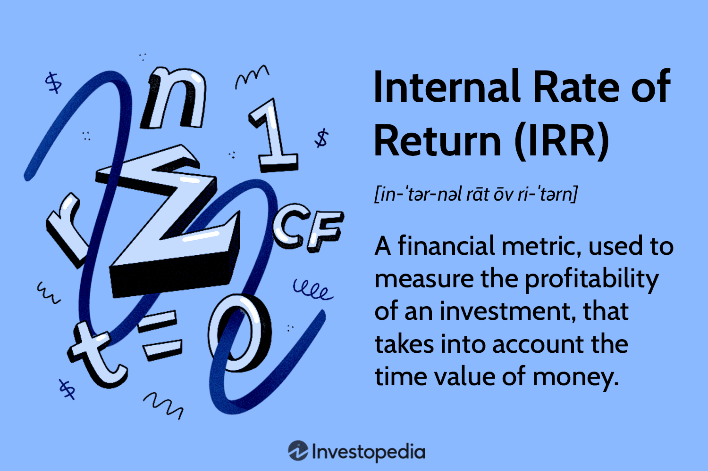

## Table of Contents

## What is the Internal Rate of Return (IRR)?

The Internal Rate of Return (IRR) is a way to measure how well an investment is doing. It's like a special percentage that shows the growth rate of your money over time. When you invest in something, like a business or a project, IRR helps you figure out if it's a good choice. You want the IRR to be higher than other ways you could use your money, like putting it in a bank.

To find the IRR, you need to look at all the money coming in and going out from the investment. It's the rate that makes the total value of all those cash flows equal to zero. This can be tricky to calculate because it involves some math, but there are tools and calculators that can help. If the IRR is higher than the cost of the money you're using (like interest rates on a loan), then the investment is probably a good one.

## How is IRR calculated?

Calculating the Internal Rate of Return (IRR) involves finding the discount rate that makes the net present value (NPV) of all cash flows from an investment equal to zero. This means you need to add up all the money you expect to get from the investment and all the money you need to put into it. You then use a formula to find the rate that makes these two amounts balance out to zero. This can be a bit tricky because it requires solving a complex equation, often done with trial and error or using special software or financial calculators.

To do it manually, you start by guessing a rate and calculating the NPV. If the NPV is positive, you try a higher rate; if it's negative, you try a lower rate. You keep adjusting until you find the rate that makes the NPV as close to zero as possible. This process can be time-consuming, so many people use financial calculators or software that can do the calculations quickly and accurately. Once you have the IRR, you can compare it to other rates, like the cost of borrowing money, to see if your investment is worth it.

## Why is IRR important in financial analysis?

IRR is important in financial analysis because it helps you figure out how good an investment is. It tells you the rate at which your money will grow if you put it into a project or a business. If the IRR is higher than the rate you could get from other places, like a bank, then the investment might be a smart choice. This way, you can compare different investments and pick the one that will make your money grow the most.

Also, IRR is useful because it takes into account all the money coming in and going out over the whole time of the investment. It gives you a single number that shows the overall success of the investment, which makes it easier to understand and compare. When you're deciding where to put your money, knowing the IRR helps you see if the investment will be worth it in the long run.

## Can you explain IRR with a simple example?

Let's say you have $100 and you want to invest it in a small project. The project will give you back $50 at the end of the first year and another $60 at the end of the second year. To find the IRR, you need to figure out the rate that makes the value of these payments equal to the $100 you put in at the start.

Using a calculator or software, you find that the IRR for this project is about 10%. This means if you invest your $100 and get back $50 after one year and $60 after two years, your money grows at a rate of 10% per year. If you can borrow money at a rate lower than 10%, then this project might be a good investment because it will grow your money faster than the cost of borrowing.

## What are the limitations of using IRR?

IRR is really helpful, but it has some problems. One big issue is that it assumes you can take the money you get back from the investment and put it into another project with the same IRR. But in real life, finding another project with the same good return can be tough. Also, IRR can be tricky when you have investments that give you money at different times. If you get a lot of money back early, the IRR might look really good, but if you need to wait a long time to get your money back, the IRR might not show how long you had to wait.

Another problem with IRR is that it might not work well when you're comparing different projects. If one project gives you back your money quickly and another takes a long time, the IRR might make the quick one look better, even if the slow one ends up giving you more money overall. Plus, IRR can be confusing if a project has a lot of ups and downs in cash flow. Sometimes, there can be more than one IRR, which makes it hard to know which one to use. So, while IRR is a good tool, it's smart to use it along with other ways to look at investments.

## How does IRR differ from other return metrics like NPV and ROI?

IRR, NPV, and ROI are all ways to measure how good an investment is, but they do it differently. IRR, or Internal Rate of Return, tells you the rate at which your money grows in an investment. It's like finding the percentage that makes all the money coming in and going out balance out to zero. This is useful because you can compare it to other rates, like what you could get from a bank or the cost of borrowing money. But IRR can be tricky because it assumes you can reinvest the money you get back at the same rate, which might not be true in real life.

NPV, or Net Present Value, looks at the total value of an investment by adding up all the money coming in and out, but it uses a specific discount rate to bring future money back to today's value. If the NPV is positive, the investment is worth more than what you put in. NPV is good because it shows you the actual dollar amount you gain or lose, but you need to pick a discount rate, which can be hard to decide on. ROI, or Return on Investment, is simpler. It's just a percentage that shows how much you've gained compared to what you put in. It's easy to understand and calculate, but it doesn't consider the time value of money like IRR and NPV do, so it might not be as accurate for comparing long-term investments.

In short, IRR gives you a growth rate, NPV gives you a dollar amount, and ROI gives you a simple percentage. Each has its place, and using them together can give you a fuller picture of how good an investment might be.

## What are the common applications of IRR in investment decisions?

IRR is often used by people and companies to decide if an investment is worth it. When you're thinking about starting a new project or buying a new business, you want to know if it will make your money grow. IRR helps you figure that out. If the IRR is higher than the rate you could get from other places, like a bank, then the investment might be a good choice. For example, if you're thinking about buying a rental property, you can use IRR to see if the money you'll get from rent will be better than other ways to use your money.

IRR is also useful for comparing different investments. Let's say you have two projects you can invest in. One project might give you back your money quickly, but the other might give you more money overall but take longer. IRR helps you see which one will grow your money faster. This is important because it helps you pick the best way to use your money. For instance, if you're a company deciding between two new products to launch, IRR can help you choose the one that will make your money grow the most.

## How can multiple IRRs occur and how should they be interpreted?

Sometimes, when you're figuring out the IRR for an investment, you might find more than one IRR. This happens when the cash flows from the investment go up and down a lot. Imagine you put money into a project, and then you get some money back, but then you have to put more money in later. This kind of pattern can make the math tricky, and you end up with more than one rate that makes the total value of the cash flows equal to zero.

When you have multiple IRRs, it can be confusing to know which one to use. The best way to handle this is to look at other ways to measure the investment, like the Net Present Value (NPV). If you use a specific discount rate to calculate the NPV, and it's positive, that's a good sign the investment is worth it. So, even if you have multiple IRRs, using NPV can help you make a better decision about whether to go ahead with the investment.

## What are the challenges in calculating IRR for non-conventional cash flows?

Calculating IRR can be tricky when the cash flows from an investment don't follow a simple pattern. Non-conventional cash flows happen when you have to put more money into a project after you've already started getting money back. This can make the math really hard because the IRR formula assumes a smooth flow of money in and out. When the cash flows go up and down a lot, you might end up with more than one IRR, which makes it confusing to know which one to use.

To deal with these challenges, you might need to use special software or financial calculators that can handle these complex situations. Even with these tools, it's important to look at other ways to measure the investment, like the Net Present Value (NPV). NPV can help you see if the investment is worth it, even if the IRR calculation is tricky. By using both IRR and NPV together, you can get a better idea of whether the investment will be good for your money.

## How does the scale of a project affect the IRR?

The size of a project can change how the IRR looks. If you have a small project, even a little bit of money coming back can make the IRR look really good. But if you have a big project, you need a lot more money coming back to get the same high IRR. So, a small project might have a high IRR because it doesn't take much to make your money grow, but a big project might have a lower IRR even if it brings in a lot more money overall.

Because of this, it's important not to just look at the IRR when deciding on a project. You should also think about how much money you need to put in and how much you'll get back. A big project with a lower IRR might still be a better choice than a small project with a higher IRR if it brings in a lot more money in the end. So, always look at the whole picture before making your decision.

## What role does IRR play in capital budgeting and project evaluation?

IRR plays a big role in capital budgeting and project evaluation because it helps you figure out if a project or investment is worth doing. When you're deciding where to put your money, you want to know if the project will make your money grow faster than other options, like putting it in a bank. IRR gives you a percentage that shows how fast your money will grow if you invest in the project. If the IRR is higher than the cost of borrowing money or other investment options, then the project might be a good choice. This way, you can compare different projects and pick the one that will make your money grow the most.

But IRR isn't perfect, and it's important to look at other things too. For example, the size of the project can change how the IRR looks. A small project might have a high IRR because it doesn't take much money to make it grow, but a big project might have a lower IRR even if it brings in a lot more money overall. So, you shouldn't just look at the IRR. You should also think about how much money you need to put in and how much you'll get back. By looking at the whole picture, you can make better choices about where to invest your money.

## How can IRR be used in conjunction with other financial metrics to make better investment decisions?

IRR is a great tool to help you decide if an investment is worth it, but it works even better when you use it with other financial metrics. One important metric to use alongside IRR is the Net Present Value (NPV). NPV shows you the actual dollar amount you'll gain or lose from an investment by taking into account the time value of money. If the NPV is positive, it means the investment is worth more than what you put in. By looking at both IRR and NPV, you can get a fuller picture of how good an investment might be. If the IRR is high and the NPV is positive, it's a strong sign that the investment is a smart choice.

Another useful metric to consider with IRR is the Return on Investment (ROI). ROI gives you a simple percentage that shows how much you've gained compared to what you put in. While ROI doesn't consider the time value of money like IRR and NPV do, it's easy to understand and can help you quickly compare different investments. If you see a high IRR and a good ROI, it can boost your confidence in the investment. Together, these metrics can help you see if an investment will make your money grow and if it's worth the time and effort. By using IRR along with NPV and ROI, you can make better and more informed decisions about where to put your money.

## What is Internal Rate of Return (IRR)?

Internal Rate of Return (IRR) is a financial metric used to evaluate the profitability of investments. It represents the discount rate at which the net present value (NPV) of cash flows from an investment equals zero. In simpler terms, IRR is the break-even [interest rate](/wiki/interest-rate-trading-strategies) that makes the present value of future cash inflows equal to the initial investment cost.

To calculate IRR, one must determine the discount rate ($r$) that satisfies the equation:

$$
NPV = \sum \left(\frac{C_t}{(1 + r)^t}\right) - C_0 = 0
$$

Here, $C_t$ represents the cash flow at time $t$, $r$ is the IRR, and $C_0$ is the initial investment cost. Unlike other financial metrics, IRR is expressed as a percentage, reflecting the annualized expected return of the investment.

IRR is significant in assessing the profitability of potential investments because it allows for easy comparison with the cost of capital and other investment opportunities. A project is generally considered acceptable if its IRR exceeds the opportunity cost of capital, indicating that it can generate returns sufficient to cover the cost of financing.

When compared to Net Present Value (NPV), IRR offers a unique perspective. While NPV provides the absolute value of expected profitability, IRR gives the rate of return, which can be particularly useful when comparing projects of different scales or durations. However, IRR can sometimes be misleading, particularly when dealing with non-conventional cash flows, where multiple IRRs might exist.

To illustrate IRR calculations, consider an investment project requiring an initial outlay of $1,000,000, with expected annual cash inflows of $250,000 for five years. The IRR can be estimated using financial software or a programming language like Python:

```python
import numpy as np

# Define cash flows: negative value for the initial investment
cash_flows = np.array([-1000000, 250000, 250000, 250000, 250000, 250000])

# Calculate IRR
irr = np.irr(cash_flows)

# Display IRR as a percentage
print(f"The Internal Rate of Return (IRR) is: {irr * 100:.2f}%")
```

In this scenario, if the IRR exceeds the required rate of return or the company's hurdle rate, the investment would be deemed worthy. As a tool for investment analysis, IRR provides a quantifiable measure to help investors and businesses make more informed decisions based on the expected profitability of projects.

## How can investments be evaluated using IRR?

Internal Rate of Return (IRR) is a critical financial metric used to assess the attractiveness of potential investments. It is particularly valuable because it provides a benchmark rate that makes the net present value (NPV) of cash flows from an investment zero, helping investors evaluate different projects on a comparable basis.

### Importance of IRR in Investment Evaluation and Decision-Making

IRR serves as a fundamental tool in investment evaluation because it facilitates comparing the profitability of several potential projects or investments. When the IRR exceeds the required rate of return or the cost of capital, the investment can be considered favorable. Conversely, an IRR below the cost of capital suggests that the project may not meet the desired return threshold and could be rejected. This characteristic makes IRR a vital metric, especially for companies seeking to maximize shareholder value and optimize capital allocation.

### Steps Involved in Using IRR to Compare Multiple Investment Opportunities

1. **Estimate Cash Flows**: Identify the initial investment required and project the expected future cash flows from the investment.

2. **Calculate IRR**: Use financial calculators or software to compute the IRR. For a series of cash flows $C_0, C_1, C_2, ..., C_n$, IRR is computed where the NPV equals zero:
$$
   NPV = C_0 + \frac{C_1}{(1+IRR)^1} + \frac{C_2}{(1+IRR)^2} + ... + \frac{C_n}{(1+IRR)^n} = 0

$$

3. **Compare IRRs**: Evaluate the IRRs of different projects against the company’s hurdle rate, which is often the weighted average cost of capital (WACC).

4. **Decision Making**: Select projects with an IRR exceeding the hurdle rate, considering qualitative factors and risk levels associated with each project.

### Advantages of Using IRR Over Traditional Analysis Techniques

IRR has several advantages over other financial metrics like payback period and accounting rate of return:

- **Time Value of Money**: IRR accounts for the time value of money, unlike the payback period.
- **Comprehensive Measure**: It provides a single rate which facilitates straightforward comparisons between projects of different scales and durations.
- **Clear Decision Rule**: The IRR decision rule is intuitive—accept if IRR exceeds the cost of capital.

### Limitations and Considerations When Using IRR

Despite its advantages, IRR is not without limitations:

- **Multiple IRRs**: Certain cash flow patterns may result in multiple IRRs, complicating decision-making.
- **Assumption of Constant Reinvestment**: IRR assumes that cash inflows are reinvested at the IRR, which may not be feasible or realistic.
- **Scale of Investment**: IRR does not consider the scale of investment, which can lead to misleading comparisons if solely relied upon.

### Real-World Case Studies Where IRR Played a Critical Role

IRR has been pivotal in numerous high-stake investment decisions. For instance, large corporations frequently use IRR to decide whether to embark on significant capital projects, such as building new manufacturing facilities or acquiring competitors. An example can be seen in the energy sector, where companies evaluate multi-billion-dollar investments in renewable energy projects based on IRR to meet both profitability goals and sustainability targets. 

Through such case studies, IRR proves to be an indispensable tool for maximizing returns, ensuring that capital is allocated efficiently, and achieving strategic investment objectives.

## References & Further Reading

[1]: ["Principles of Corporate Finance"](https://www.mheducation.com/highered/product/Principles-of-Corporate-Finance-Brealey.html) by Richard A. Brealey, Stewart C. Myers, and Franklin Allen

[2]: ["Valuation: Measuring and Managing the Value of Companies"](https://www.amazon.com/Valuation-Measuring-Managing-Companies-Finance/dp/1119610885) by McKinsey & Company Inc.

[3]: Damodaran, A. (2012). ["Investment Valuation: Tools and Techniques for Determining the Value of Any Asset."](https://books.google.com/books/about/Investment_Valuation.html?id=5SRHAAAAQBAJ) 3rd edition, Wiley Finance.

[4]: ["Algorithmic Trading & DMA: An introduction to direct access trading strategies"](https://www.amazon.com/Algorithmic-Trading-DMA-introduction-strategies/dp/0956399207) by Barry Johnson

[5]: Grant, J.L., & Moreland, J.W. (2011). ["Modern Portfolio Theory, the Capital Asset Pricing Model, and Arbitrage Pricing Theory: A User Guide."](https://journals.plos.org/plosone/article?id=10.1371/journal.pone.0305547) 

[6]: ["Python for Finance: Mastering Data-Driven Finance"](https://www.amazon.com/Python-Finance-Mastering-Data-Driven/dp/1492024333) by Yves Hilpisch