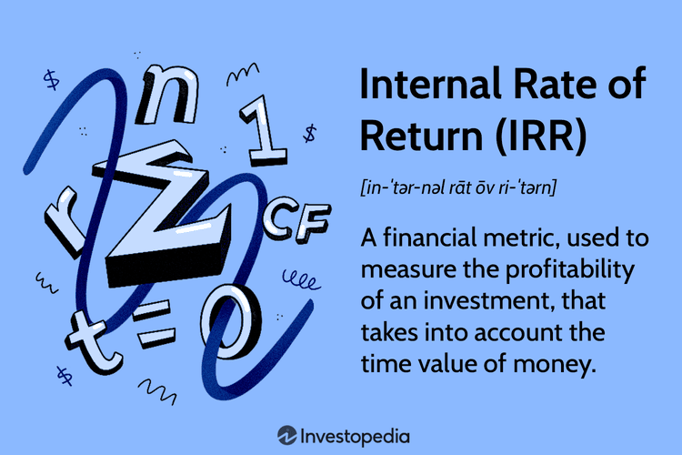

## Table of Contents

## What is the Internal Rate of Return (IRR)?

The Internal Rate of Return (IRR) is a way to figure out how well an investment is doing. It's like a special percentage that shows the expected profit from an investment over time. When you calculate the IRR, you're finding the rate at which the money you put in equals the money you get back, making the total value of your investment zero. It's a useful tool for comparing different investments because it gives you a single number to look at.

Think of IRR as a tool to help decide if an investment is worth it. If the IRR is higher than the cost of borrowing money or other rates you could get elsewhere, then the investment might be a good choice. For example, if you can borrow money at 5% and the IRR of your project is 10%, that's a good sign. But, IRR has its limits. It assumes you can reinvest any money you earn at the same rate, which isn't always possible. Also, if an investment has uneven cash flows, the IRR might be tricky to understand or might give more than one answer.

## How is the IRR calculated?

To calculate the Internal Rate of Return (IRR), you need to find the rate that makes the present value of all cash inflows equal to the present value of all cash outflows from an investment. This means you're looking for the rate that makes the net present value (NPV) of the investment equal to zero. You start with an initial guess for the IRR and then use a formula or a financial calculator to adjust this guess until you find the rate that satisfies this condition. The formula you use is similar to the one for NPV, but instead of solving for NPV, you're solving for the discount rate that makes NPV zero.

The calculation can be tricky because it often involves trial and error or using special software or financial calculators. For example, if you invest $100 today and expect to get $110 back in a year, you would need to find the rate that makes the present value of $110 in one year equal to $100 today. This rate turns out to be about 10%. In more complex cases with multiple cash flows at different times, the process becomes more complicated, and you might need to use iterative methods or specialized software to find the IRR accurately.

## What does the IRR tell us about an investment?

The Internal Rate of Return (IRR) tells us how well an investment is doing by giving us a single number to look at. It's like a special percentage that shows the expected profit from an investment over time. When we calculate the IRR, we're finding the rate at which the money we put in equals the money we get back, making the total value of our investment zero. This helps us compare different investments easily because we can see which one has a higher IRR.

If the IRR is higher than the cost of borrowing money or other rates we could get elsewhere, then the investment might be a good choice. For example, if we can borrow money at 5% and the IRR of our project is 10%, that's a good sign. But, IRR has its limits. It assumes we can reinvest any money we earn at the same rate, which isn't always possible. Also, if an investment has uneven cash flows, the IRR might be tricky to understand or might give more than one answer.

## Can you explain the IRR rule in simple terms?

The IRR rule is a simple way to decide if an investment is worth it. It says that if the IRR of an investment is higher than the cost of getting the money to invest, then the investment is a good choice. For example, if you can borrow money at 5% and the IRR of your project is 10%, then the project is likely worth doing because you're making more than you're spending on the money.

But the IRR rule isn't perfect. It assumes that you can take any money you earn and reinvest it at the same high rate, which isn't always possible. Also, if the investment has money coming in and out at different times, the IRR can be hard to figure out and might give more than one answer. So, while the IRR rule is helpful, it's best to use it along with other ways to check if an investment is good.

## How does the IRR compare to other investment metrics like NPV?

The Internal Rate of Return (IRR) and Net Present Value (NPV) are both used to see if an investment is good, but they do it in different ways. IRR is like a special percentage that shows the expected profit from an investment over time. It's the rate that makes the money you put in equal to the money you get back, making the total value of your investment zero. NPV, on the other hand, is a number that shows the total value of an investment today. It's calculated by adding up all the future cash flows, but bringing them back to today's value using a discount rate. If the NPV is positive, the investment is expected to make more money than it costs.

While IRR gives you a single percentage to compare different investments easily, NPV gives you a dollar amount that shows how much value an investment adds. IRR is great for quick comparisons, but it can be tricky if the investment has uneven cash flows or if you can't reinvest earnings at the same rate. NPV is more reliable because it uses a specific discount rate, which can be based on the cost of borrowing money or other rates you could get elsewhere. So, while IRR is helpful for a quick look, using both IRR and NPV together can give you a better picture of whether an investment is worth it.

## What are the limitations of using the IRR?

One big problem with using IRR is that it assumes you can take any money you earn from an investment and put it back into another investment at the same high rate. This isn't always possible. For example, if your IRR is 15%, you'd need to find another investment that also gives you 15% to keep that rate going, which can be hard. Also, IRR can be tricky if the investment has money coming in and out at different times. This can lead to more than one IRR, making it hard to know which one to use.

Another issue with IRR is that it doesn't tell you how big the investment is. Two investments might have the same IRR, but one might need a lot more money to start. So, IRR alone might not give you the full picture. It's best to use IRR along with other ways to check if an investment is good, like NPV, which can show you the total value added by the investment.

## Can the IRR be used for comparing projects of different sizes and durations?

The IRR can be used to compare projects of different sizes and durations, but it has some limitations. IRR gives you a single percentage that shows the expected profit from an investment over time. This makes it easy to compare different projects because you can see which one has a higher IRR. For example, if one project has an IRR of 10% and another has an IRR of 15%, the second project looks better. But, IRR doesn't tell you how much money you need to start the project or how long the project will last, which can be important when comparing projects of different sizes and durations.

Because of these limitations, it's not always the best idea to use IRR alone to compare projects. For example, a small project with a high IRR might need less money to start than a big project with a lower IRR, but the big project might still add more total value. Also, if one project lasts longer than another, the IRR might not show the full picture because it doesn't consider the time value of money over different periods. So, while IRR is a helpful tool, it's best to use it along with other metrics like NPV to get a better understanding of which project is really the better choice.

## How do you interpret multiple IRRs in a single project?

When a project has money coming in and out at different times, you might end up with more than one IRR. This happens because the cash flows can cross the zero line more than once, creating different rates that make the net present value zero. For example, if you invest money now, get some back in the middle of the project, and then have to pay more later, you could have two different IRRs. This can make it hard to decide which IRR to use because each one might tell a different story about the project's profitability.

To deal with multiple IRRs, you need to look at the project's cash flows carefully. One way to handle this is to use the Modified Internal Rate of Return (MIRR), which assumes you reinvest the money you earn at a different rate than the IRR. Another way is to use the NPV to see if the project adds value at different discount rates. By looking at these other metrics along with the IRR, you can get a better idea of whether the project is a good investment, even when there are multiple IRRs.

## What is the modified internal rate of return (MIRR) and how does it differ from IRR?

The Modified Internal Rate of Return (MIRR) is a way to figure out how well an investment is doing, just like the Internal Rate of Return (IRR), but it fixes some of the problems with IRR. MIRR looks at the money you put in, the money you get back, and how you can reinvest the money you earn. It uses two different rates: one for how you can reinvest the money you earn, and another for how you can borrow money to invest. This makes MIRR more realistic because it doesn't assume you can reinvest your earnings at the same high rate as the IRR.

The main difference between MIRR and IRR is that MIRR gives you a more accurate picture of an investment's value. IRR can be tricky if the investment has money coming in and out at different times, which can lead to more than one IRR. MIRR solves this by using a single rate that takes into account the cost of borrowing and the rate at which you can reinvest your earnings. So, while IRR is a quick way to compare investments, MIRR is better for understanding the true value of an investment over time.

## How can the IRR be applied in real-world financial decision-making?

The Internal Rate of Return (IRR) is a helpful tool for making real-world financial decisions, especially when you need to compare different investments. Imagine you're a business owner looking at two projects. One project needs a lot of money upfront but promises big returns over time, while the other needs less money but offers smaller returns. By calculating the IRR for each project, you can see which one gives you a higher percentage return on your investment. If the IRR of one project is higher than the cost of borrowing money or other rates you could get elsewhere, it might be a good choice. For example, if you can borrow money at 5% and the IRR of your project is 10%, that's a good sign that the project could be worth doing.

However, IRR isn't perfect and should be used along with other tools like Net Present Value (NPV). IRR assumes you can reinvest any money you earn at the same high rate, which isn't always possible. Also, if the cash flows from an investment are uneven, IRR can be hard to understand and might give you more than one answer. This is why it's important to look at other metrics too. For instance, NPV can show you the total value added by an investment in today's dollars, giving you a clearer picture of its worth. By using IRR alongside NPV, you can make better-informed decisions about which investments to pursue, considering both the rate of return and the overall value they bring.

## What are some common pitfalls to avoid when using the IRR?

One common pitfall when using the Internal Rate of Return (IRR) is assuming that you can reinvest any money you earn at the same high rate as the IRR. This isn't always possible. For example, if your project has an IRR of 15%, you'd need to find another investment that also gives you 15% to keep that rate going, which can be hard. This can make the IRR look better than it really is, leading you to make choices based on numbers that might not happen in real life.

Another pitfall is dealing with projects that have money coming in and out at different times. This can lead to more than one IRR, making it hard to know which one to use. For instance, if you invest money now, get some back in the middle of the project, and then have to pay more later, you could have two different IRRs. This can make it tricky to decide if the project is a good investment because each IRR might tell a different story about its profitability.

## How does the concept of IRR integrate with advanced financial modeling techniques?

The Internal Rate of Return (IRR) is a key part of advanced financial modeling because it helps us see how well an investment might do. In these models, IRR is often used alongside other tools like Net Present Value (NPV) to give a full picture of an investment's value. For example, in a financial model, you might use IRR to compare different projects quickly. If one project has an IRR of 10% and another has an IRR of 15%, the second project looks better at first glance. But, to make sure you're making the best choice, you'd also look at the NPV to see how much value each project adds in today's dollars.

However, IRR can be tricky in advanced financial models, especially when dealing with complex cash flows. If an investment has money coming in and out at different times, you might end up with more than one IRR, which can make it hard to decide which one to use. To solve this, advanced models might use the Modified Internal Rate of Return (MIRR), which takes into account the cost of borrowing money and the rate at which you can reinvest your earnings. This gives a more realistic view of the investment's value over time. By using IRR along with other metrics and techniques, financial models can help you make better decisions about which investments to pursue.

## What is the Understanding of Internal Rate of Return (IRR)?

The Internal Rate of Return (IRR) is a crucial financial metric employed by investors and businesses to assess the profitability and feasibility of potential investments. IRR is essentially the discount rate that makes the net present value (NPV) of all expected cash flows from an investment equal to zero. In mathematical terms, it is the rate $r$ that satisfies the following equation:

$$
0 = \sum_{t=0}^{n} \frac{C_t}{(1 + r)^t}
$$

where $C_t$ represents the cash flow at time $t$, and $n$ is the total number of periods.

A fundamental aspect of the IRR is that it provides a singular annualized rate of return, allowing for simplified comparison across various projects or investment opportunities. When the IRR of a particular investment exceeds the investor's required rate of return, often referred to as the cost of capital, the investment is generally regarded as favorable.

In investment analysis, IRR serves as a decision-making tool, helping investors determine the expected rate of growth an investment is projected to generate. This makes it an advantageous metric for evaluating the efficiency of projects or comparing the profitability of several investments, thus aiding in the strategic allocation of capital.

IRR allows stakeholders to identify whether an investment promises returns that surpass the costs incurred, thereby enabling a comprehensive evaluation of its potential profitability. However, while IRR provides valuable insights into potential returns, it is essential to consider the entire context of the financial environment, as relying solely on IRR may not always reflect the most accurate picture of an investment's true potential.

## How do you calculate IRR?

Calculating the Internal Rate of Return (IRR) involves determining the discount rate at which the net present value (NPV) of a series of cash flows equals zero. This process requires iterative methods, as the IRR is not typically solvable through direct algebraic means. The formula used to express the NPV is as follows:

$$
NPV = \sum_{t=0}^{n} \frac{C_t}{(1 + r)^t}
$$

Here, $C_t$ represents the cash flow at time $t$, $r$ is the discount rate (IRR), and $n$ is the total number of time periods. To find the IRR, you need to adjust $r$ to make the NPV equal zero:

$$
0 = \sum_{t=0}^{n} \frac{C_t}{(1 + \text{IRR})^t}
$$

Because finding the exact IRR through hand calculations can be cumbersome, especially for complex cash flow scenarios, investors and analysts often use computational tools like Excel or financial calculators. These tools implement numerical methods such as the Newton-Raphson method or other root-finding algorithms to estimate the IRR efficiently.

### Using Excel to Calculate IRR:

To calculate IRR using Excel, one can use the built-in `IRR` function. Here's a step-by-step guide:

1. **Enter the Cash Flow Sequence**: Populate a column with your cash flow amounts, with the initial investment being a negative value to represent an outflow.

2. **Apply the `IRR` Function**: 
   - Select a cell where you want the IRR result to appear.
   - Use the formula `=IRR(range)` where "range" refers to the cell range containing the cash flows.
   - Optionally, you can provide a guess rate (an initial estimate) if needed, with the syntax `=IRR(range, guess)`.

Excel will return the IRR as a decimal, which can be converted into a percentage by formatting the cell.

### Calculating IRR Using Python:

For more advanced scenarios or automated processes, Python can be utilized with libraries such as NumPy, which includes convenient financial functions. Below is an example using Python:

```python
import numpy as np

# Define cash flows
cash_flows = [-1000, 300, 400, 500, 600]

# Calculate IRR
irr = np.irr(cash_flows)

# Display IRR as a percentage
print(f"The IRR is: {irr * 100:.2f}%")
```

This code snippet defines an array `cash_flows` representing the series of cash inflows and outflows. The `np.irr` function computes the IRR, which is then printed as a percentage for easy interpretation.

IRR, due to its iterative calculation process, is susceptible to multiple IRRs in scenarios with alternating cash flow directions (positive to negative and vice versa). Additionally, if there is no IRR that zeroes the NPV, the function might fail to provide a valid rate. Tools like Excel and programming languages typically handle these complexities well, accommodating most practical scenarios investors encounter.

## What are the limitations of IRR?

The Internal Rate of Return (IRR) is a popular metric used in investment analysis; however, it is not without its limitations. One significant drawback of IRR is its assumption that all interim cash flows generated by a project are reinvested at the same rate as the IRR itself. This assumption can be unrealistic, as it implies that a company can continually reinvest cash flows at a consistent rate, which may not be feasible in fluctuating market conditions. 

Another limitation is IRR's inadequacy in accounting for the scale of a project. It focuses solely on the rate of return, irrespective of the project's size or the total value created. Consequently, a smaller project may exhibit a higher IRR compared to a larger project, even if the latter contributes more to a company's overall profits. This can lead decision-makers to favor smaller projects with higher IRR over larger, potentially more profitable ones.

Additionally, IRR might not accurately reflect the potential of projects with non-standard cash flow structures, such as those involving alternating periods of inflow and outflow. In such cases, there can be multiple IRRs, leading to ambiguity in project evaluation. An unconventional cash flow pattern can confuse the IRR calculation, providing multiple or no practical IRR solutions.

In scenarios where these limitations pose a problem, using the Modified Internal Rate of Return (MIRR) can be more informative. MIRR rectifies some of IRR's shortcomings by assuming the reinvestment of cash flows occurs at the firm's cost of capital rather than at the IRR itself. This adjustment results in a more realistic metric of profitability, particularly for projects with irregular cash flows. MIRR is calculated with the formula: 

$$
\text{MIRR} = \sqrt[n]{\frac{\text{Terminal Value of Positive Cash Flows}}{\text{Present Value of Negative Cash Flows}}} - 1
$$

where $n$ is the number of periods. By adopting MIRR, investors can gain a more reliable analysis, especially in cases involving complex financial structures or significant scale differences among projects. 

Understanding these limitations helps investors and analysts apply IRR appropriately and consider supplementary metrics to obtain a more comprehensive assessment of potential investments.

## How does IRR compare with other financial metrics?

The Internal Rate of Return (IRR) is a widely used financial metric, but it is not the only tool available for evaluating investment opportunities. Two other commonly used metrics are Return on Investment (ROI) and Net Present Value (NPV). Each of these metrics offers unique perspectives and advantages, and their comparison can provide a comprehensive analysis for investment decision-making.

**Internal Rate of Return (IRR)**

IRR is the discount rate at which the net present value (NPV) of all cash flows from an investment equals zero. It is expressed as a percentage and is particularly useful in comparing projects of similar scale and duration. The primary advantage of IRR is its ability to provide a simple percentage-based return on investment, facilitating easy comparison across various projects. However, IRR assumes the reinvestment of interim cash flows at the same rate, which might not be realistic for all investments.

**Return on Investment (ROI)**

ROI measures the profitability of an investment and is calculated as:

$$
\text{ROI} = \frac{\text{Net Profit}}{\text{Cost of Investment}} \times 100\%
$$

The simplicity of ROI lies in its straightforward calculation and interpretation. It provides a quick snapshot of an investment's efficiency. However, it does not account for the time value of money, which can be a significant drawback for long-term investments. ROI is most effective for short-term projects where time value is negligible.

**Net Present Value (NPV)**

NPV is a more sophisticated metric that calculates the dollar value of an investment by discounting future cash flows to the present value using a specific discount rate, usually the cost of capital. The formula for NPV is:

$$
\text{NPV} = \sum \frac{\text{Cash Flow}_t}{(1+r)^t} - \text{Initial Investment}
$$

where $r$ is the discount rate and $t$ is the time period. NPV is advantageous because it accounts for the time value of money, providing a measure of the absolute profitability of a project. A positive NPV indicates that the investment is expected to generate profit over and above the cost of capital. However, choosing an appropriate discount rate can sometimes be challenging, impacting the accuracy of NPV calculations.

**Comparative Analysis and Situational Use**

- **IRR vs. NPV:** IRR gives a percentage that is easy to compare across projects, while NPV provides the actual dollar value of the projected profits. NPV is generally considered superior when evaluating investments with varied cash flow patterns over time or when consistency in project scale is lacking.

- **IRR vs. ROI:** Both IRR and ROI provide a rate of return on investment, but IRR includes the time value of money, making it more suitable for long-term projects. ROI is quick and easy to compute but may not fully account for the temporal aspect of returns.

- **NPV vs. ROI:** NPV offers a deeper analysis by including the time value of money, while ROI provides an immediate sense of an investment's return relative to its cost. NPV should be used for projects with significant temporal elements, whereas ROI is useful for quick evaluations of project profitability.

Each metric provides unique insights, and choosing the appropriate one depends on the investor's specific needs and the nature of the investment. Combining these metrics can lead to more balanced and informed decision-making, allowing investors to capture both the rate and absolute value of potential returns.

## References & Further Reading

[1]: ["Principles of Corporate Finance"](https://www.mheducation.com/highered/product/principles-corporate-finance-brealey-myers/M9781264080946.html) by Richard Brealey, Stewart Myers, and Franklin Allen.

[2]: Damodaran, A. (2012). ["Investment Valuation: Tools and Techniques for Determining the Value of Any Asset."](https://books.google.com/books/about/Investment_Valuation.html?id=5SRHAAAAQBAJ) Wiley Finance.

[3]: ["The Real Estate Developer’s Handbook: How to Set Up, Operate, and Manage a Financially Successful Real Estate Development"](https://www.amazon.com/Real-Estate-Developers-Handbook-Financially/dp/1601380348) by Tanya Davis.

[4]: Fabozzi, F. J. (2000). ["The Handbook of Fixed Income Securities."](https://www.amazon.com/Handbook-Fixed-Income-Securities-Ninth/dp/1260473899) McGraw-Hill Education. 

[5]: ["Financial Management: Theory & Practice"](https://faculty.cengage.com/titles/9781337902601) by Eugene F. Brigham and Michael C. Ehrhardt.