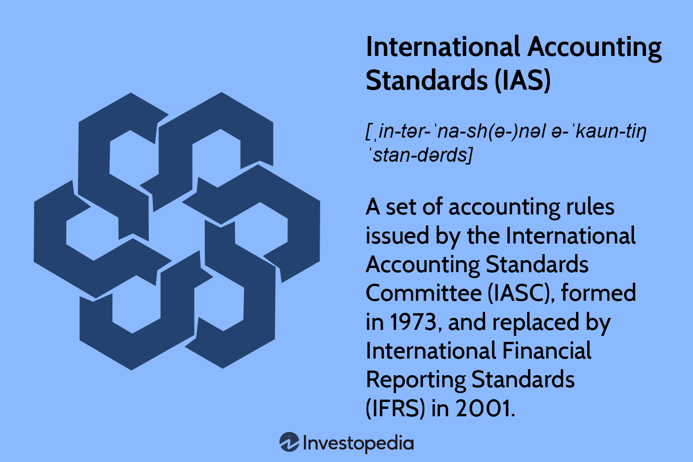

## Table of Contents

## What are International Accounting Standards (IAS)?

International Accounting Standards (IAS) are a set of rules that help companies around the world prepare their financial statements in a consistent way. These standards are created by the International Accounting Standards Board (IASB), which is a group of experts from different countries. The main goal of IAS is to make sure that financial information is clear and comparable, no matter where a company is located. This helps investors, creditors, and other users of financial statements to make better decisions.

IAS covers many different areas of accounting, like how to report revenue, how to value inventory, and how to account for leases. Each standard has specific rules and guidelines that companies must follow. For example, IAS 16 explains how to account for property, plant, and equipment, while IAS 18 deals with revenue recognition. By following these standards, companies can provide financial statements that are easier to understand and compare across different countries. This is important in today's global economy, where businesses often operate in multiple countries.

## Why were International Accounting Standards developed?

International Accounting Standards (IAS) were developed to help companies all over the world report their financial information in a similar way. Before IAS, different countries had their own rules for accounting. This made it hard for people to understand and compare financial statements from companies in different countries. For example, if an investor wanted to compare a company in the United States with one in Japan, the different accounting rules could make it confusing. IAS was created to solve this problem by setting common rules that everyone could follow.

The main goal of IAS is to make financial information clear and easy to compare. This is important for investors, creditors, and others who use financial statements to make decisions. When everyone follows the same rules, it's easier to trust the financial information and make good choices. The International Accounting Standards Board (IASB) is the group that creates and updates these standards. They work to make sure the rules stay relevant and useful as the global economy changes.

## Who develops and maintains the International Accounting Standards?

The International Accounting Standards Board (IASB) is the group that develops and maintains the International Accounting Standards (IAS). The IASB is made up of experts from different countries who work together to create rules that help companies report their financial information in a consistent way. Their main goal is to make sure that financial statements are clear and easy to compare, no matter where a company is located.

The IASB regularly updates the standards to keep them relevant and useful. They listen to feedback from companies, investors, and other users of financial statements to make sure the rules meet everyone's needs. By doing this, the IASB helps create a global language for accounting that makes it easier for people to understand and trust financial information from companies around the world.

## How do International Accounting Standards differ from national accounting standards?

International Accounting Standards (IAS) and national accounting standards are both sets of rules that help companies prepare their financial statements. The main difference is that IAS are created to be used by companies all over the world, while national accounting standards are made for companies in just one country. For example, the United States has its own set of rules called Generally Accepted Accounting Principles (GAAP), which are different from the rules used in other countries. IAS, on the other hand, are designed to be the same everywhere, so it's easier to compare financial information from companies in different countries.

Another difference is that IAS are made by the International Accounting Standards Board (IASB), which is a group of experts from many different countries. National accounting standards, like GAAP in the U.S., are usually made by a country's own accounting board or government agency. Because IAS are meant for global use, they often focus on making financial information clear and easy to compare across borders. National standards might focus more on meeting the specific needs of that country's economy and businesses.

## What is the process for adopting an International Accounting Standard?

The process for adopting an International Accounting Standard starts when the International Accounting Standards Board (IASB) identifies a need for a new standard or an update to an existing one. They might see a problem with how companies are reporting their financial information or get feedback from users of financial statements. The IASB then creates a draft of the new standard and shares it with the public. This is called an "exposure draft." People and organizations around the world can read the draft and give their opinions and suggestions. The IASB listens to this feedback and makes changes to the draft if needed.

After the feedback period, the IASB finalizes the standard. They vote on it, and if most of the board members agree, the new standard is approved. Once approved, the standard is published and becomes part of the International Financial Reporting Standards (IFRS). Countries and companies can then choose to adopt the new standard. Some countries might need to change their laws to allow the use of the new standard, while others might already have a process in place for adopting IAS. Companies usually have some time to get ready before they have to start using the new standard in their financial reporting.

## Can you explain the key principles behind IAS?

The key principles behind International Accounting Standards (IAS) are all about making financial information clear and easy to compare. The main idea is to have rules that everyone around the world can follow. This way, if someone wants to look at financial statements from a company in France and another in Brazil, they can understand and compare them easily. IAS helps make sure that companies report things like their income, expenses, and assets in a consistent way, no matter where they are located.

Another important principle is transparency. IAS wants companies to show all the important details in their financial statements so that people can trust the information. This means being open about how numbers are calculated and what methods are used. By being transparent, companies help investors and others make better decisions. The International Accounting Standards Board (IASB) works hard to keep these standards up to date and relevant, always listening to feedback from users to make sure the rules meet everyone's needs.

## How do International Accounting Standards impact financial reporting?

International Accounting Standards (IAS) make a big difference in how companies report their financial information. They set rules that help companies from different countries show their financial numbers in a similar way. This makes it easier for people like investors and creditors to understand and compare the financial statements of companies around the world. For example, if an investor wants to compare a company in Germany with one in Australia, IAS helps them see the financial information clearly and make better decisions.

Another way IAS impacts financial reporting is by making it more transparent. Companies have to follow specific rules about how they report things like their income, expenses, and assets. This means they need to be open about how they calculate their numbers and what methods they use. When companies follow IAS, it builds trust because people know the financial information is reliable and easy to understand. This is important for everyone who uses financial statements to make choices about where to invest their money or whether to lend money to a company.

## What are some common challenges companies face when implementing IAS?

When companies start using International Accounting Standards, they often run into some challenges. One big problem is the cost and time it takes to make the switch. Companies need to train their employees to understand the new rules, and they might need to change their accounting systems to fit the new standards. This can be expensive and take a lot of time. Also, companies might need to hire experts to help them make the transition, which adds to the cost.

Another challenge is that different countries might have their own rules that conflict with IAS. For example, a company might have to follow both its country's rules and IAS, which can be confusing and hard to manage. This can lead to extra work and the risk of making mistakes in the financial reports. Companies need to find a way to balance these different sets of rules while still following IAS correctly.

Lastly, understanding and applying IAS can be tricky because the standards can be complex and change over time. Companies need to keep up with these changes and make sure they are always following the latest rules. This requires ongoing training and updates to their accounting practices, which can be a continuous challenge.

## How do International Accounting Standards affect global business operations?

International Accounting Standards help companies around the world by making their financial reports easier to understand and compare. When businesses in different countries follow the same rules, it's simpler for investors and others to look at financial statements and make decisions. For example, if a company in the United States wants to buy a company in Germany, they can use the same accounting language to see how the German company is doing financially. This makes global business deals smoother and more trustworthy.

However, using International Accounting Standards can also be challenging for companies. They might need to spend a lot of time and money to learn the new rules and change their accounting systems. Sometimes, a company's home country might have different rules that they also need to follow, which can make things confusing. Despite these challenges, following International Accounting Standards can help companies show their financial health clearly to the world, which is important in today's global economy.

## What are the differences between IAS and International Financial Reporting Standards (IFRS)?

International Accounting Standards (IAS) and International Financial Reporting Standards (IFRS) are both sets of rules made by the International Accounting Standards Board (IASB). IAS were the original standards created by the IASB to help companies around the world report their financial information in a consistent way. Over time, the IASB started to create new standards called IFRS. IFRS are meant to replace and improve upon the older IAS. So, IFRS are the newer set of standards, while IAS are the older ones.

Even though IAS and IFRS are different, they work together. IAS are still used, but they are slowly being replaced by IFRS. For example, when the IASB makes a new standard, they might call it IFRS instead of IAS. This means that over time, more and more companies will use IFRS instead of IAS. The main goal of both IAS and IFRS is the same: to make financial information clear and easy to compare across different countries. But IFRS are the more modern and updated version of the rules.

## How are changes to International Accounting Standards communicated and implemented?

When the International Accounting Standards Board (IASB) wants to make a change to the International Accounting Standards, they start by sharing a draft of the new rule with everyone. This draft is called an exposure draft. They let people and companies from around the world read it and give their feedback. The IASB listens to what everyone says and might make changes to the draft based on the feedback. After this, they vote on the final version of the new standard. If most of the board members agree, the new standard is approved and published.

Once the new standard is approved, it becomes part of the International Financial Reporting Standards (IFRS). Countries and companies then have to decide how to adopt it. Some countries might need to change their laws to allow the new standard, while others might already have a system in place for adopting these changes. Companies usually get some time to prepare before they have to start using the new standard in their financial reports. This helps them train their staff and update their accounting systems to follow the new rules.

## What future developments can we expect in the field of International Accounting Standards?

In the future, we can expect the International Accounting Standards to keep changing and improving. The International Accounting Standards Board (IASB) is always working to make the rules better and more useful for everyone. They listen to what companies and people who use financial statements say, and they update the standards to fix any problems or to make them easier to understand. For example, they might make new rules about how to report things like climate change or digital assets, which are becoming more important in today's world.

Another thing we might see is more countries adopting these standards. Right now, many countries already use International Accounting Standards, but some still have their own rules. As more countries see the benefits of using the same accounting language, they might decide to switch to these standards. This would make it even easier for companies and investors to work together across different countries. The IASB will keep helping countries make this transition by providing guidance and support.

## References & Further Reading

[1]: ["International Financial Reporting Standards (IFRS)"](https://www.investopedia.com/terms/i/ifrs.asp) - IFRS Foundation. Provides comprehensive information about the current standards that succeeded IAS.

[2]: Lopez de Prado, M. (2018). ["Advances in Financial Machine Learning"](https://www.amazon.com/Advances-Financial-Machine-Learning-Marcos/dp/1119482089). Wiley. A book on the application of machine learning techniques in finance.

[3]: Chan, E. P. (2009). ["Quantitative Trading: How to Build Your Own Algorithmic Trading Business"](https://github.com/ftvision/quant_trading_echan_book). Wiley. Covers the development of algorithmic trading systems.

[4]: Jansen, S. (2020). ["Machine Learning for Algorithmic Trading"](https://github.com/stefan-jansen/machine-learning-for-trading). Packt Publishing. Discusses the use of machine learning in developing trading strategies.

[5]: Aronson, D. R. (2007). ["Evidence-Based Technical Analysis: Applying the Scientific Method and Statistical Inference to Trading Signals"](https://onlinelibrary.wiley.com/doi/book/10.1002/9781118268315). Wiley. Focuses on technical analysis using a scientific approach.