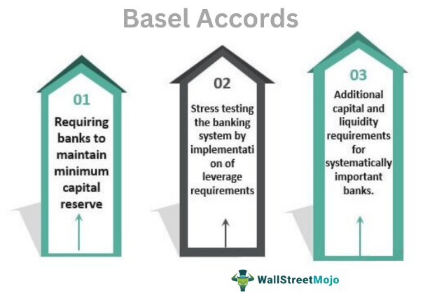

The global banking landscape has transformed considerably over the decades, marked by the inception and evolution of complex financial structures like the International Banking Facility (IBF). Established in the early 1980s, IBF serves as a significant mechanism allowing U.S.-based banks and financial institutions to effectively manage and operate services aimed at foreign clients, primarily involving deposits and loans. This facility uniquely enables these institutions to access exemptions from certain regulatory requirements, including specific Federal Reserve mandates and some state and local taxes, rendering the banking process more efficient and economically favorable.

IBFs offer an array of opportunities for banks eager to expand their international footprint while maintaining compliance within the United States' regulatory framework. By leveraging the special permissions granted under the IBF regulatory structure, U.S. banks can attract and manage foreign-source deposits and other international banking services, effectively bolstering their global market presence. These regulatory exemptions provide a strategic advantage, allowing banks to optimize operational costs and compete more aggressively in the international banking arena.

In recent years, financial technologies have ushered in new efficiencies and capabilities within the banking sector. Modern financial innovations, such as algorithmic trading, have transformed traditional operations by introducing unprecedented speed and precision in executing transactions. The intersection of IBFs with algorithmic trading technologies presents a new frontier in banking, combining established regulatory practices with cutting-edge technological advancements. This convergence holds the potential to redefine international banking operations, streamlining processes, enhancing decision-making, and mitigating risks efficiently.

This article examines the framework governing IBFs, the benefits and limitations intrinsic to their operation, and the potential of integrating algorithmic trading technologies into these specialized banking facilities. By understanding the intricate relationship between regulatory structures and technological advancements, financial institutions can strategically position themselves at the forefront of international banking innovation.

## Table of Contents

## Understanding International Banking Facilities (IBFs)

International Banking Facilities (IBFs) are specialized financial entities established by U.S. banks to streamline and manage their international banking transactions more effectively. Originating in the U.S., IBFs enjoy specific regulatory relaxations designed to bolster the competitiveness of domestic banks in the global marketplace. 

IBFs enable banks to handle international clients by dealing in deposits from foreign residents and some non-U.S. entities, which can be both borrowed and loaned in U.S. dollars. A significant advantage of establishing an IBF is that these transactions are exempt from certain Federal Reserve requirements. For instance, IBFs are not subject to reserve requirements typically applied to standard domestic deposits, providing banks with increased financial fluidity and efficiency when offering services to international clients.

Furthermore, IBFs benefit from exemptions from selected state and local taxes. This tax relief promotes a more favorable financial ecosystem for U.S. banks, allowing them to compete more efficiently on a global scale by offering attractive terms to foreign clients. This regulatory design is crafted to attract international banking business to the United States by reducing the operational and financial burdens traditionally associated with such transactions. 

By gaining a sophisticated understanding of these facilities, financial institutions can better leverage IBFs to strategically pursue opportunities in international markets. The unique operational structure afforded by IBFs thus enhances their competitive edge, enabling U.S. banks to expand their global footprint while optimizing both their financial strategies and compliance with regulatory standards. 

In summary, IBFs play a crucial role in assisting U.S. banks in navigating the intricacies of international markets. The regulatory exemptions they enjoy provide substantial benefits, making them an attractive and strategic tool for banks aiming to expand their international reach.

## Regulatory Framework for IBFs

The regulatory framework for International Banking Facilities (IBFs) was established by the Federal Reserve in 1981 with the primary objective of bolstering international financial activities by U.S.-based banks. This initiative came as a response to the increasing globalization of financial markets and the need for U.S. banks to remain competitive on an international scale.

Key regulations for the operation of IBFs require that they maintain distinctly separate accounting records from other domestic banking activities. This separation ensures transparency and compliance with specific regulatory requirements. U.S. banks are mandated to establish these records following precise jurisdictional guidelines that delineate the scope of IBF operations. These guidelines are crucial for accurately assessing IBF activities and for banks to provide correct financial reporting and compliance metrics to the authorities.

The design of the regulatory framework provides exemptions from certain Federal Reserve requirements and some state and local taxes, thereby encouraging U.S. banks to engage in international activities. Notably, IBFs are exempt from reserve requirements against deposits, which can significantly enhance the operational efficiency of U.S. banks dealing in international markets.

Despite these exemptions, IBFs operate under comprehensive federal oversight to ensure adherence to U.S. financial laws. This oversight is vital in maintaining the integrity of international transactions and protecting the broader financial system from potential abuses. Institutions operating IBFs are subject to regular audits and must comply with anti-money laundering (AML) and Know Your Customer (KYC) regulations, reflecting the emphasis on maintaining lawful and transparent financial operations.

Overall, the regulatory framework for IBFs is structured to balance the need for regulatory relief to encourage international banking activities while ensuring sufficient oversight to maintain compliance and systemic integrity.

## Benefits and Limitations of IBFs

International Banking Facilities (IBFs) play a critical role in enabling U.S. banks to manage and attract foreign-source deposits more effectively. By leveraging the regulatory exemptions associated with IBFs, financial institutions can extend their global reach and enhance their market presence internationally. This is primarily due to the ability of IBFs to engage in business with non-U.S. residents and foreign entities under a more relaxed regulatory framework. These facilities are exempt from certain Federal Reserve requirements, such as reserve requirements, thereby allowing banks to allocate resources more efficiently toward international operations.

However, despite these significant advantages, IBFs also present certain limitations that need to be carefully managed. One of the primary concerns is that IBFs are not insured by the Federal Deposit Insurance Corporation (FDIC). This lack of insurance increases the risk associated with deposits and transactions within an IBF, which can be a significant consideration for both banks and their clients. This uninsured status necessitates that financial institutions implement robust risk management strategies to safeguard against potential losses.

In the context of benefits, IBFs offer U.S. banks a conduit to manage foreign-source deposits with greater flexibility and reduced regulatory burden, thereby enhancing cost efficiency. These facilities enable banks to offer competitive interest rates to attract foreign deposits due to the reduction in reserve requirements. This enhanced capability allows U.S. banks to improve their international competitiveness and diversify their funding sources, which is crucial in maintaining financial stability and growth in a globalized economy.

Nevertheless, the limitations of IBFs must not be overlooked. The lack of FDIC insurance introduces a higher risk profile, demanding comprehensive due diligence and risk assessment procedures. Banks are required to maintain strict compliance with the regulatory frameworks governing IBFs, which, although more lenient than domestic frameworks, still demand high levels of scrutiny and accountability. Balancing these benefits and limitations requires sophisticated financial strategies and management systems.

In conclusion, the effectiveness of IBFs hinges on the ability to optimize the benefits while mitigating the inherent risks. Understanding and addressing these dynamics is critical for banks aiming to capitalize on the opportunities presented by IBF operations in the international finance sector. By doing so, banks not only enhance their global market presence but also contribute to the robust functioning of international banking activities.

## Algorithmic Trading in the Context of IBFs

Algorithmic trading has fundamentally transformed the way financial transactions are conducted, offering unprecedented speed, precision, and efficiency. This form of trading involves the use of advanced algorithms to execute orders based on a set of pre-defined criteria, enabling institutions to react swiftly to market conditions with minimal human intervention. For International Banking Facilities (IBFs), this capability is particularly advantageous given the fast-paced nature of international financial markets.

The integration of [algorithmic trading](/wiki/algorithmic-trading) within IBFs presents opportunities to optimize trading outcomes. By automating trade execution, banks can reduce transaction costs and limit human error, thereby increasing the overall efficiency of operations. Algorithms can assess numerous market variables simultaneously and make instant decisions to capture favorable pricing, even in volatile contexts. These capabilities not only enhance profitability but also allow IBFs to manage large volumes of transactions across different time zones effectively.

Nonetheless, the application of algorithmic trading in IBFs is not without challenges. Market risk, for instance, remains a critical concern. Although algorithms are designed to mitigate risk by executing trades at opportune moments, unexpected market shifts can still incur losses. To address these risks, IBFs incorporate sophisticated risk management techniques within their algorithms. Strategies may involve setting predefined risk controls and thresholds, regular monitoring of algorithm performance, and adjusting the strategies based on historical performance data and market analysis.

One approach to risk management in algorithmic trading is using statistical methods like Value at Risk (VaR). VaR estimates the potential loss in value of an asset or portfolio under normal market conditions for a specific time period at a given confidence level. For example, an IBF could use VaR to determine the maximum expected loss of a portfolio over a 10-day period with a 95% confidence level. 

However, to truly leverage algorithmic trading for optimal outcomes, IBFs must also focus on continually refining their algorithms. This requires a robust infrastructure that can handle large datasets and perform complex computations efficiently. Machine learning techniques are increasingly being employed to enhance the adaptiveness and accuracy of trading algorithms. These models learn from historical data and market trends, enabling more precise predictions and smarter trade execution strategies.

Given the sophisticated nature of algorithms and the rapid evolution of trading technologies, consistent technological updates and workforce training are essential. IBFs must ensure their personnel possess the necessary skills to develop and oversee complex algorithms, thereby maintaining a competitive edge in the global banking landscape.

In conclusion, algorithmic trading holds significant potential for IBFs to reimagine their operational frameworks. By harnessing the speed and analytical capabilities of modern algorithms, these facilities can achieve more streamlined and profitable international banking operations. However, the successful integration of such technologies demands rigorous risk management protocols and continuous advancements in both technological infrastructure and human expertise.

## Challenges and Opportunities of Integrating IBFs and Algor Trading

Integrating algorithmic trading within International Banking Facilities (IBFs) presents both significant challenges and notable opportunities. On the compliance front, IBFs must navigate a complex regulatory environment that governs both banking operations and trading algorithms. Algorithmic trading systems often require meticulous scrutiny to ensure adherence to market compliance standards, including those set forth by the Securities and Exchange Commission (SEC) and the Federal Reserve. This requires implementing robust risk management protocols and developing systems that can dynamically adapt to regulatory changes.

Operationally, the integration of algorithmic tools necessitates substantial technological upgrades. IBFs need to ensure their infrastructure is capable of handling high-frequency data and transactions. This includes deploying state-of-the-art servers and network systems to reduce latency and enhance the execution speed of trades. Moreover, there is a critical need for highly skilled personnel capable of developing, monitoring, and refining these algorithms, ensuring that they perform optimally in various market conditions.

In terms of opportunities, algorithmic trading offers enormous potential for IBFs by increasing efficiencies and improving the ability to analyze and respond to market trends. Algorithms can process vast amounts of data in real time, allowing institutions to identify profitable trading opportunities and execute trades at optimal prices. This capability is particularly beneficial in the fast-paced international banking environment, where reaction times are crucial for capitalizing on fleeting opportunities.

Moreover, strategic approaches to algorithmic trading can provide IBFs with a competitive edge. By leveraging [machine learning](/wiki/machine-learning) models, for instance, financial institutions can gain deeper insights into market behavior and predict future trends with greater accuracy. This foresight can guide the development of proactive trading strategies that enhance profitability while mitigating risks associated with market [volatility](/wiki/volatility-trading-strategies).

To strike a balance between these challenges and opportunities, IBFs should employ a combination of strategic measures. Collaborating with technology firms to build advanced algorithmic trading platforms and investing in continuous training for team members are prudent steps forward. Furthermore, developing a strong culture of compliance and operational excellence can help IBFs navigate the evolving landscape of algorithmic trading successfully. By embracing these strategies, IBFs can harness the potential of algorithmic trading while ensuring alignment with regulatory requirements and market dynamics.

## Conclusion

International Banking Facilities (IBFs) have established themselves as integral elements within the global banking landscape. They offer the dual advantage of facilitating international financial transactions while benefiting from specific regulatory exemptions. These exemptions allow U.S.-based banks to efficiently cater to foreign clients, thereby enhancing their competitive stance in the global market. However, the regulatory responsibilities associated with IBFs ensure that these facilities operate within the legal frameworks established by U.S. financial laws, maintaining transparency and reliability.

The advent of algorithmic trading marks a transformative phase in financial operations, characterized by unprecedented speed and precision in trade executions. As algorithmic trading gains prominence, IBFs find themselves at a strategic crossroads where they can leverage these technological advancements to redefine international banking operations. By integrating algorithmic strategies, IBFs can significantly optimize their trading outcomes, thereby enhancing operational efficiencies and market responsiveness.

Financial institutions that successfully navigate the intricate dynamics of IBFs and algorithmic trading stand to gain a significant foothold in international banking innovation. By balancing the benefits of technological integration with regulatory compliance, these institutions can harness the full potential of IBFs, positioning themselves at the forefront of a rapidly evolving global financial framework. Ultimately, the synergy between IBFs and algorithmic trading presents unprecedented opportunities, inviting financial entities to embrace new technological horizons for sustained growth and innovation in the banking sector.

## References & Further Reading

[1]: Board of Governors of the Federal Reserve System. ["International Banking Facilities Fact Sheet."](https://en.wikipedia.org/wiki/Federal_Reserve_Board_of_Governors) August 1982.

[2]: ["Financial Stability and the Importance of International Banking Facilities"](https://www.sciencedirect.com/science/article/pii/S1059056024006397) - International Monetary Fund publication.

[3]: [Marcos Lopez de Prado. "Advances in Financial Machine Learning."](https://www.amazon.com/Advances-Financial-Machine-Learning-Marcos/dp/1119482089) Wiley, 2018.

[4]: Committee on Payment and Settlement Systems. ["Algorithmic Trading in Financial Markets."](https://www.marketswiki.com/wiki/Committee_on_Payment_and_Settlement_Systems) Bank for International Settlements, November 2015.

[5]: ["Algorithmic Trading and Market Dynamics"](https://www.cmegroup.com/education/files/Algo_and_HFT_Trading_0610.pdf) by Jonathan Brogaard, Terrence Hendershott, and Ryan Riordan, SSRN Electronic Journal, 2014.

[6]: ["Quantitative Trading: How to Build Your Own Algorithmic Trading Business"](https://www.amazon.com/Quantitative-Trading-Build-Algorithmic-Business/dp/1119800064) by Ernest P. Chan, Wiley, 2008.

[7]: ["Banking and Financial Institutions: A Guide for Directors, Investors, and Borrowers"](https://archive.org/details/bankingfinancial0000gupb) by Benton E. Gup, Wiley, 2011.

[8]: ["International Finance: Theory into Practice"](https://www.jstor.org/stable/j.ctv30pnvq0) by Piet Sercu, Princeton University Press, 2009.