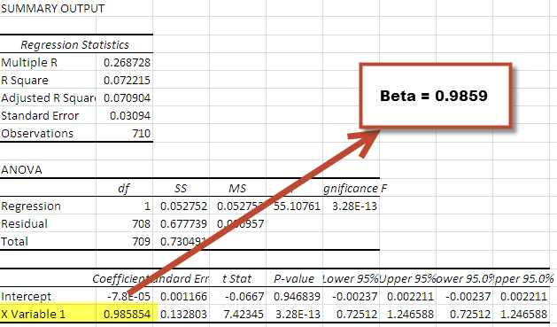

The world of investment is replete with both opportunities for significant returns and inherent risks that can potentially erode capital. For any investor, understanding these risks and implementing effective risk management strategies are vital steps towards achieving and sustaining financial goals. An essential concept within risk management is 'Beta,' a statistical measure that quantifies the volatility, or systematic risk, of a security or portfolio in relation to the overall market.

Beta serves as a reflection of a security's sensitivity to market movements. It offers investors insights into how much the price of a security is expected to vary in comparison to market fluctuations. A higher beta indicates that the security is more volatile than the market, while a lower beta suggests reduced volatility. This measure is fundamental in assessing risk, as it allows investors to compare the risk profile of a specific investment against the broader market.



This article is structured to explore the multifaceted nature of investment risk, with a particular focus on international beta—an extension of the traditional beta concept that incorporates global market dynamics instead of restricting analysis to a single local index. The calculation of international beta is crucial for enterprises operating across different geographic regions, as their share prices are more likely to align with global market indices.

Moreover, we will examine how international beta is calculated and its implementation in algorithmic trading, a field where its application can significantly influence risk management and enhance decision-making processes. Algorithmic trading strategies utilize beta to optimize portfolio allocations, adjusting to market conditions dynamically to balance risk and return effectively.

In international investments, the use of beta becomes even more pronounced, as it provides a broader perspective by incorporating global market movements. The potential of beta to optimize trading strategies through algorithmic solutions underscores its value in modern investment management practices. Through an exploration of these themes, this article aims to equip investors with a comprehensive understanding of how beta can be leveraged to navigate the complexities of international investments and algorithmic trading.

## Table of Contents

## What is Beta in Investment?

Beta is a statistical measure used to compare the volatility of an individual stock or portfolio to that of the broader market. It is an essential tool for investors seeking to understand and manage the risk associated with their investments. By quantifying how a particular security's price moves relative to the overall market, beta provides insights into the systematic risk, which pertains to market-wide influences that cannot be mitigated through diversification.

A beta value greater than 1 indicates that the security is more volatile than the market. For example, if a stock has a beta of 1.3, it is expected to move 30% more than the market in the same direction. Conversely, a beta less than 1 suggests less [volatility](/wiki/volatility-trading-strategies) compared to the market. For instance, a stock with a beta of 0.8 is expected to experience 20% less movement than the market.

Understanding beta allows investors to assess investment risk relative to market movements. If an investor prefers a more conservative approach, they might choose securities with a beta less than 1 to minimize exposure to market volatility. On the other hand, those willing to take on more risk in pursuit of higher returns may favor investments with a beta greater than 1.

Here is a Python example of how to calculate beta using historical stock and market return data:

```python
import numpy as np
import pandas as pd
import statsmodels.api as sm

# Assume stock_returns and market_returns are pandas Series of historical return data
def calculate_beta(stock_returns, market_returns):
    market_returns = sm.add_constant(market_returns)
    model = sm.OLS(stock_returns, market_returns).fit()
    beta = model.params[1]
    return beta

# Example usage, assuming stock_returns and market_returns are loaded with data
# stock_returns = pd.Series(...)
# market_returns = pd.Series(...)

beta_value = calculate_beta(stock_returns, market_returns)
print(f"The calculated beta is: {beta_value}")
```

This code performs a linear regression analysis to determine the beta of a stock in relation to the market, encapsulating how much the stock is likely to move with fluctuations in the market. By providing a quantifiable measure of risk, beta aids investors in making informed decisions aligned with their risk tolerance and investment goals.

## Calculating Beta: The Basics

Beta is a key metric in finance used to gauge the volatility of a stock or a portfolio in relation to the overall market. The calculation of beta is grounded in the principles of regression analysis, a statistical method used to determine the relationship between variables—specifically, the relationship between a security's returns and the market's returns.

The formula for beta is represented as:

$$
\beta = \frac{\text{Cov}(R_i, R_m)}{\text{Var}(R_m)}
$$

Where:
- $\text{Cov}(R_i, R_m)$ is the covariance between the return of the individual stock ($R_i$) and the return of the market ($R_m$).
- $\text{Var}(R_m)$ is the variance of the market returns.

The covariance measures how changes in the stock’s returns relate to changes in the market's returns. If the stock's returns and the market's returns move together, the covariance will be positive, indicating that when the market is up, the stock is also likely to be up, and vice versa. On the other hand, variance measures how much the market's returns diverge from its average return, reflecting the market’s overall volatility.

To perform this calculation computationally, Python can be employed using the pandas library to handle financial time-series data and numpy for mathematical operations. Below is an example of how beta can be computed:

```python
import pandas as pd
import numpy as np

# Assume `stock_data` and `market_data` are pandas DataFrames with 'Return' as a column
# stock_data = pd.read_csv('stock_returns.csv')
# market_data = pd.read_csv('market_returns.csv')

# Calculate covariance matrix
cov_matrix = np.cov(stock_data['Return'], market_data['Return'])

# Extract covariance of stock returns with the market
cov_stock_market = cov_matrix[0, 1]

# Calculate variance of the market
var_market = cov_matrix[1, 1]

# Calculate beta
beta = cov_stock_market / var_market
```

This process essentially allows investors to determine how sensitive a particular asset's price is to movements in the market. Consequently, beta plays a critical role in assessing investment risk, enabling investors to understand and predict the potential impact of market fluctuations on their portfolio or individual holdings. Understanding these dynamics through the computation of beta aids in creating balanced and well-informed investment strategies.

## International Beta: A Global Perspective

International beta extends the concept of traditional beta by incorporating global market movements instead of relying solely on local indices, such as the S&P 500. The importance of international beta is particularly pronounced for multinational companies whose share prices are more aligned with global indices. By focusing on international beta, investors can gain insights into the systemic risk associated with a stock or portfolio on a global scale, providing a more comprehensive understanding of volatility.

The methodology for calculating international beta mirrors that used in traditional beta calculations but substitutes a broad global index for the usual market index. A widely used reference for international beta is the MSCI World Index, which captures large and mid-cap representation across 23 developed markets countries. This index serves as a comprehensive gauge of global equity market performance.

The mathematical formula for computing beta remains consistent:

$$
\beta = \frac{\text{Cov}(R_i, R_m)}{\text{Var}(R_m)}
$$

Here, $R_i$ refers to the return of the security, and $R_m$ represents the return of the market index—in this context, a global index like the MSCI World Index. The covariance $\text{Cov}(R_i, R_m)$ measures how the security's returns move with global market returns, while $\text{Var}(R_m)$ reflects the volatility of the global market.

For practical implementation, consider using Python, which provides tools like NumPy and pandas for handling such statistical computations efficiently. Below is an example of how the calculation could be structured in Python:

```python
import numpy as np
import pandas as pd

# Sample data for stock and global index returns
returns_data = pd.DataFrame({
    'stock_return': [0.02, 0.015, 0.04, -0.01, 0.05],
    'global_index_return': [0.03, 0.02, 0.035, 0.0, 0.045]
})

# Calculate covariance between stock returns and global index returns
covariance = np.cov(returns_data['stock_return'], returns_data['global_index_return'])[0, 1]

# Calculate variance of global index returns
variance = np.var(returns_data['global_index_return'])

# Compute international beta
international_beta = covariance / variance

print(f"International Beta: {international_beta}")
```

Utilizing international beta allows investors to measure their investments' sensitivity to global market dynamics, thereby enhancing portfolio management strategies. By recognizing the interplay between regional and global market forces, investors can make informed decisions, especially when dealing with assets with exposure to multiple countries.

## Application of Beta in Algo Trading

Algorithmic trading, an essential aspect of modern financial markets, makes extensive use of beta analysis to refine investment strategies, manage risk, and make informed trading decisions. By integrating beta into algorithmic models, traders can optimize portfolio allocations to achieve the desired balance between risk and return. This integration allows algorithmic systems to assess a security’s systematic risk relative to the overall market and adjust investment portfolios accordingly.

Beta plays a crucial role in determining how assets within a portfolio might behave in response to market movements. A sophisticated [algorithmic trading](/wiki/algorithmic-trading) system will calculate the beta of individual securities and the portfolio to ensure that the aggregated risk is aligned with the investor's objectives. For instance, in designing a portfolio, an algorithm might allocate a higher proportion of assets to securities with lower betas in a volatile market, thus cushioning the portfolio from market swings.

The implementation of beta in algorithmic trading involves continuous monitoring and dynamic adjustment of bets. Through programming languages like Python, these systems can be coded to automatically rebalance portfolios based on predefined beta thresholds. Here's a basic illustration using Python:

```python
import numpy as np

# Simulated returns
market_returns = np.array([0.01, 0.02, -0.01, 0.015, -0.005])
stock_returns = np.array([0.015, 0.025, -0.015, 0.02, -0.01])

# Calculating beta
cov_matrix = np.cov(stock_returns, market_returns)
beta = cov_matrix[0, 1] / np.var(market_returns)

# Decision logic in an algorithmic trading model
if beta > 1:
    print("Consider reallocating to lower beta assets to reduce volatility exposure.")
else:
    print("Portfolio beta is within acceptable range. No reallocation needed.")
```

Moreover, algorithmic trading systems use beta to hedge positions. They deploy strategies that counterbalance high-risk assets with low-risk or market-neutral strategies. An algorithm, for example, may enter short positions in high-beta stocks while maintaining long positions in low-beta stocks, effectively reducing the net beta—and thereby the systematic risk—of the portfolio.

However, it is imperative for such systems to regularly update beta values as market conditions change. Market structures and dynamics can evolve rapidly, and a static beta model may lead to suboptimal trading performance. Algorithms use real-time data feeds to recalculate beta continuously, ensuring that the strategy adjusts dynamically to current conditions.

Incorporating beta into algorithmic trading not only enhances risk management but also enables algorithmic traders to position their strategies to exploit or guard against predicted market movements effectively. This strategic application is particularly beneficial during periods of market turbulence, where systematic analysis becomes indispensable.

## Limitations and Challenges of Using Beta

While beta is a useful tool in assessing investment risk, relying solely on it presents certain limitations and challenges. One key issue is that beta is derived from historical data, often calculated using a stock's past performance relative to a market index. As a result, it may not predict future volatility accurately. Market conditions, investor behavior, and unforeseen events can lead to shifts in stock performance that differ significantly from historical trends.

Another critical limitation is that beta only measures systematic risk, the type of risk that affects all market participants, such as economic changes or geopolitical events. It does not consider unsystematic risk, which is specific to an individual security or company and can arise from internal factors like management decisions or financial health. As such, investors relying on beta alone may miss vulnerabilities tied to specific assets.

The computation of beta typically assumes that stock returns follow a normal distribution. However, financial markets often exhibit irregularities and anomalies, with stock returns showing skewness and kurtosis that deviate from a normal distribution. These deviations can affect the accuracy of beta as a measure of risk, as it may not capture extreme movements or market events accurately.

For a more comprehensive risk analysis, investors might consider supplementing beta with other metrics and qualitative analysis to address its shortcomings. This approach can help manage investment portfolios more effectively by accounting for both systematic and unsystematic risks.

## Conclusion

Understanding investment risk and the role of beta in managing this risk is fundamental for investors. The concept of beta, a crucial measure of a security's volatility in relation to the market, provides key insights into how investments respond to market fluctuations. This understanding allows investors to make informed decisions, balancing potential returns against inherent risks.

International beta expands on this concept by incorporating global market movements, offering a broader perspective essential for international investments. By using indices such as the MSCI World Index, investors can capture the variability and risk associated with multinational companies and their exposure to diverse economic conditions. This approach is particularly beneficial for investors seeking diversification across different markets and geographies, where regional factors significantly impact performance.

Furthermore, leveraging beta through algorithmic trading strategies can significantly enhance investment performance. Algorithmic trading, with its data-driven approach, can dynamically adjust portfolio allocations and hedging strategies based on calculated beta values. This allows for an optimized balance between risk and return that aligns with investors' specific profiles and market conditions. By considering both historical data and real-time market information, algorithms can swiftly react to changes, ensuring efficient portfolio management.

Though beta provides valuable insights, it is imperative to acknowledge that it is based on historical data and does not account for unsystematic risks. Therefore, while it is a powerful tool in the investor's arsenal, it should be used in conjunction with other risk assessment and management strategies to achieve the best investment outcomes. In summary, a comprehensive understanding of beta's application offers significant advantages for managing risk and optimizing returns, making it an invaluable component of modern investment strategies.

## References & Further Reading

[1]: Ang, A. (2014). ["Asset Management: A Systematic Approach to Factor Investing."](https://www.amazon.com/Asset-Management-Systematic-Investing-Association/dp/0199959323) Oxford University Press.

[2]: Blitz, D., & Vliet, P. V. (2007). ["The Volatility Effect: Lower Risk without Lower Return"](https://papers.ssrn.com/sol3/papers.cfm?abstract_id=980865). Journal of Portfolio Management.

[3]: Fabozzi, F. J., & Markowitz, H. M. (2011). ["The Theory and Practice of Investment Management."](https://onlinelibrary.wiley.com/doi/book/10.1002/9781118267028) John Wiley & Sons.

[4]: Sharpe, W. F. (1964). ["Capital Asset Prices: A Theory of Market Equilibrium under Conditions of Risk."](https://onlinelibrary.wiley.com/doi/full/10.1111/j.1540-6261.1964.tb02865.x) The Journal of Finance.

[5]: MSCI. (2023). ["MSCI World Index."](https://investingintheweb.com/blog/msci-world-index-historical-data/) Available online: https://www.msci.com/world