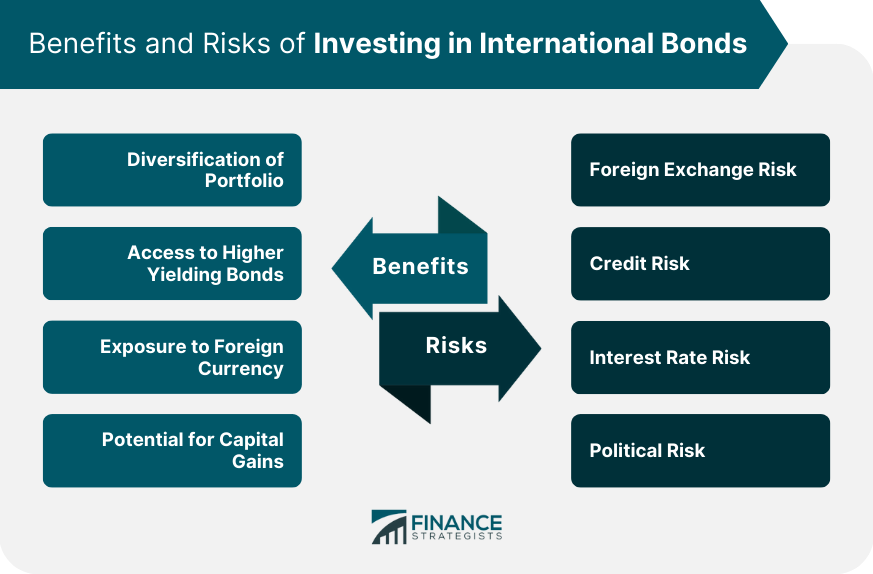

## Table of Contents

## What is an international bond?

An international bond is a type of bond that is issued in a country different from the one where the bond's currency is based. For example, a company based in Japan might issue a bond in the United States, and that bond would be denominated in U.S. dollars. These bonds are often used by companies and governments to raise money from international investors.

There are different types of international bonds, such as foreign bonds and Eurobonds. Foreign bonds are issued in a country's domestic market but by a foreign entity. For instance, a U.S. company issuing bonds in Japan would be creating a foreign bond. Eurobonds, on the other hand, are issued outside the jurisdiction of any single country and are usually denominated in a currency different from that of the country where they are issued. Both types help issuers tap into global capital markets and diversify their investor base.

## Why should someone consider investing in international bonds?

Someone should consider investing in international bonds because they can help spread out risk. When you invest in bonds from different countries, you are not putting all your money in one place. If one country's economy does badly, your other investments might still do well. This can protect your money and make your investment safer.

Also, international bonds can give you a chance to earn more money. Different countries have different interest rates. Sometimes, you can find higher interest rates in other countries than in your own. By investing in these bonds, you could earn more interest on your money. Plus, it's a good way to learn about and get involved in the global economy.

## What are the different types of international bonds?

International bonds come in different types, like foreign bonds and Eurobonds. Foreign bonds are issued in a country's domestic market but by a foreign company or government. For example, if a Japanese company issues bonds in the United States, those are foreign bonds. They help foreign entities raise money from investors in another country.

Eurobonds are another type of international bond. They are issued outside the jurisdiction of any single country and are often denominated in a currency different from the country where they are issued. For instance, a Eurobond might be issued in London but be denominated in U.S. dollars. Eurobonds help issuers tap into global capital markets and reach a wider range of investors.

Both foreign bonds and Eurobonds allow companies and governments to diversify their funding sources and manage their financial needs on a global scale. They offer investors a way to spread their risk and potentially earn higher returns by investing in different economies around the world.

## How do international bonds differ from domestic bonds?

International bonds and domestic bonds are different in where they are issued and who issues them. A domestic bond is issued in the same country as the currency it is denominated in. For example, a bond issued in the United States in U.S. dollars by a U.S. company is a domestic bond. On the other hand, an international bond is issued in a different country from where the currency is based. For instance, a Japanese company issuing a bond in the U.S. in U.S. dollars is an international bond.

Another difference is the types of international bonds, like foreign bonds and Eurobonds, which don't exist in domestic bonds. Foreign bonds are issued in a country's domestic market but by a foreign entity. Eurobonds are issued outside any single country's jurisdiction and often in a different currency. These types help issuers tap into global markets, while domestic bonds are more limited to the local market. So, international bonds can offer more variety and opportunities for both issuers and investors.

## What are the basic steps to start investing in international bonds?

To start investing in international bonds, you first need to do your research. Look into different countries and their bond markets. Find out about the interest rates they offer and how safe the investments are. You can use the internet, read financial news, or talk to a financial advisor to gather this information. Once you have a good understanding, decide which bonds interest you the most.

Next, you need to open an investment account that allows you to buy international bonds. Many online brokerages offer this service. You'll need to provide some personal information and might need to meet certain requirements, like having a minimum amount of money to invest. Once your account is set up, you can start buying the bonds you researched. Keep an eye on your investments and stay informed about the global economy, as it can affect your bonds.

## What are the common risks associated with international bond investing?

Investing in international bonds can come with risks. One big risk is currency risk. When you invest in bonds from another country, you are dealing with a different currency. If that currency loses value compared to your own, you could end up losing money, even if the bond itself does well. Another risk is political risk. Different countries have different governments and laws. If there is a change in government or new laws, it might affect the value of your bonds.

Another common risk is [interest rate](/wiki/interest-rate-trading-strategies) risk. If interest rates go up in the country where you invested, the value of your bonds might go down. This is because new bonds will be issued with higher interest rates, making your older bonds less attractive to other investors. There's also the risk of default. This means the country or company that issued the bond might not be able to pay you back. This can happen if their economy does badly or if they run into financial trouble. So, it's important to think about these risks before you start investing in international bonds.

## How does currency risk affect international bond investments?

Currency risk is a big deal when you invest in international bonds. It means that the value of the money you get back from your investment can change because of the exchange rate between the bond's currency and your own. For example, if you buy a bond in euros and you live in the U.S., the value of your investment in U.S. dollars can go up or down depending on how the euro does against the dollar. If the euro gets weaker, you'll get fewer dollars back when you cash in your bond, even if the bond itself does well.

This risk can make your investment less predictable. You might think you're making a good return on your bond, but if the currency you invested in loses value, your actual return in your home currency could be lower or even negative. To manage this risk, some investors use strategies like hedging, which means they take steps to protect against currency changes. But hedging can be complicated and might not always work perfectly. So, it's important to think about currency risk when you're deciding whether to invest in international bonds.

## What role does political risk play in international bond investing?

Political risk is a big thing to think about when you invest in international bonds. It means that changes in a country's government or laws can affect your investment. For example, if a new government comes to power and decides to change how bonds are paid back, your bond might lose value. Or if there's a war or a big political problem in the country where your bond is from, it could make it hard for the country to pay you back. So, when you're looking at international bonds, you need to think about how stable the country's politics are.

This risk can make your investment less safe. If you invest in a country with a lot of political problems, you might not get your money back when you expect to, or you might get less than you thought. To manage this risk, some investors look at how stable a country is before they invest. They might also spread their money out over bonds from different countries, so if one country has political trouble, their whole investment isn't in danger. So, understanding political risk can help you make smarter choices about where to put your money.

## How can interest rate changes impact international bonds?

Interest rate changes can have a big impact on international bonds. When interest rates go up in the country where you invested, the value of your bond might go down. This happens because new bonds will be issued with higher interest rates, making your older bond less attractive to other investors. They would rather buy the new bonds that pay more interest. So, if you want to sell your bond before it matures, you might have to sell it for less than you paid for it.

On the other hand, if interest rates go down, the value of your bond might go up. This is because your bond now pays a higher interest rate compared to new bonds being issued. Other investors would want to buy your bond because it gives them a better return. But, you need to remember that interest rates can change a lot, and what happens in one country might be different from what happens in another. So, when you invest in international bonds, you need to keep an eye on interest rates around the world.

## What are some advanced strategies for managing a portfolio of international bonds?

One advanced strategy for managing a portfolio of international bonds is diversification. This means spreading your money across bonds from different countries and in different currencies. By doing this, you can lower your risk. If one country's economy does badly, your other investments might still do well. Another part of this strategy is to look at different types of bonds, like foreign bonds and Eurobonds, to find the best opportunities. You can also use something called duration management, which means choosing bonds that will mature at different times. This can help you manage the risk of interest rate changes.

Another strategy is to use currency hedging. This is a way to protect your investment from changes in exchange rates. For example, if you buy a bond in euros but you live in the U.S., you can use hedging to reduce the risk that the euro will lose value against the dollar. Hedging can be complicated, but it can help make your investment more predictable. You might also want to consider active management, where you keep a close eye on the global economy and make changes to your portfolio as needed. This can help you take advantage of new opportunities and avoid big losses.

Lastly, you can use credit analysis to pick the best bonds. This means looking closely at the financial health of the countries or companies that issue the bonds. By choosing bonds from issuers that are more likely to pay you back, you can reduce the risk of default. Combining these strategies can help you build a strong and flexible portfolio of international bonds, which can lead to better returns and less risk.

## How do sovereign vs. corporate international bonds differ in terms of risk and return?

Sovereign international bonds and corporate international bonds have different levels of risk and return. Sovereign bonds are issued by governments, which usually makes them safer than corporate bonds. Governments can raise taxes or print money to pay back their debts, so they are less likely to default. But, this doesn't mean they are completely safe. If a country's economy does badly or if there are big political problems, the value of its bonds can still go down. Sovereign bonds often have lower interest rates because they are seen as safer, which means the return you get might be less than with corporate bonds.

Corporate international bonds, on the other hand, are issued by companies. These bonds can offer higher interest rates because they come with more risk. If a company runs into financial trouble, it might not be able to pay back its bonds. This is called default risk. The return on corporate bonds can be higher, but you need to be careful and do your research. You should look at the company's financial health and the stability of the country where it is based. By understanding these differences, you can make smarter choices about which bonds to invest in.

## What are the tax implications of investing in international bonds?

When you invest in international bonds, you need to think about taxes. Different countries have different rules about taxes on bonds. If you earn interest from a bond in another country, you might have to pay taxes in that country. But, you might also have to pay taxes in your own country on the same money. This is called double taxation. To avoid paying taxes twice, many countries have agreements called tax treaties. These treaties can help you get a credit or a refund for the taxes you paid in the other country.

Another thing to think about is how your country taxes foreign investments. Some countries tax the interest you earn from international bonds at a different rate than domestic bonds. You might also have to report your foreign investments on your tax return. This can be complicated, so it's a good idea to talk to a tax advisor. They can help you understand the rules and make sure you're paying the right amount of taxes. By knowing the tax implications, you can make better decisions about investing in international bonds.

## What are the risks associated with international bonds?

International bonds, while offering diversification and potential for higher yields, present unique risks that investors must consider. Among these risks, currency, credit, interest rate, political, and [liquidity](/wiki/liquidity-risk-premium) risks are particularly significant.

**Currency Risk**

Currency risk arises from fluctuations in exchange rates, which can significantly impact the returns on international bonds. When bonds are denominated in a foreign currency, the value of interest payments and principal repayments can vary based on the exchange rate movements between the foreign currency and the investor's home currency. For instance, if an investor purchases a bond denominated in euros but their base currency is the US dollar, any depreciation in the euro against the dollar will decrease the dollar value of income received. This risk can be expressed mathematically as:

$$
\text{Currency-Adjusted Return} = \frac{\text{Foreign Currency Return} \times \text{Exchange Rate Change}}{\text{Initial Exchange Rate}}
$$

Effective management of currency risk often involves strategies like hedging through derivatives such as currency futures or options.

**Credit Risk**

Credit risk is the possibility that the bond issuer, whether a foreign government or corporation, could default on its obligations. This risk is particularly critical for international bonds, as foreign entities may operate under different regulatory frameworks and economic conditions. Ratings provided by agencies like Moody’s, S&P, and Fitch can offer guidance on the creditworthiness of issuers, but investors should conduct thorough due diligence. Investors should keep in mind that sovereign bonds, while often considered safer, are not devoid of this risk, as countries can also face economic difficulties leading to defaults.

**Interest Rate Risk**

Interest rate risk involves the potential for bond prices to decline due to rising global interest rates. When rates increase, newly issued bonds come to market with higher yields, making existing bonds with lower rates less attractive, thus decreasing their market value. This inverse relationship can affect the total return on investment for bondholders who need or decide to sell bonds before maturity. To quantify this risk, duration, a measure of a bond's sensitivity to interest rate changes, is often used:

$$
\text{Price Change} = - (\text{Duration} \times \Delta \text{Yield})
$$

**Political Risk**

Political risk refers to changes in the political landscape of the issuing country that might adversely affect bond returns. This can include changes in government, policy shifts, geopolitical tensions, or regulatory changes. Such events can lead to market [volatility](/wiki/volatility-trading-strategies) or even result in the inability to convert foreign currency, severely impacting bond values and returns.

**Liquidity Risk**

Liquidity risk in international bonds concerns the difficulty of selling these securities quickly at their fair market value. Certain international bond markets may not offer the same level of liquidity as domestic markets, leading to wider bid-ask spreads and potential delays in executing trades. In times of market stress, these bonds might become even harder to sell without accepting significant price concessions. Investors can assess liquidity by examining factors such as the bond's average trading [volume](/wiki/volume-trading-strategy) and the accessibility of its market.

In conclusion, while international bonds can enhance portfolio diversification, they come with specific risks that necessitate careful evaluation. Employing strategies such as diversification, credit analysis, and active currency risk management can help mitigate these risks, facilitating more informed decision-making in the global bond market.

## What are Bond Investing Strategies?

Bond investing strategies play a crucial role in navigating the complexities of international bond markets. This section outlines key strategies such as diversification, hedging, and credit analysis, each offering unique benefits and protections.

**Diversification**

Diversification involves spreading investments across a variety of countries and currencies. This strategy helps mitigate risks associated with relying on a single market or currency. For example, an investor might allocate 30% of their bond investments to European bonds, 30% to Asian bonds, and the remaining 40% to North American bonds. By doing so, they are not overly reliant on the economic conditions of any single region. Should one region experience a downturn, the investor's entire portfolio is not adversely affected. The mathematical foundation of diversification can be understood through portfolio theory, which states that the risk of a portfolio ($\sigma_P$) can be reduced by combining assets that are not perfectly correlated:

$$
\sigma_P = \sqrt{\sum_{i=1}^{N}\sum_{j=1}^{N}w_iw_j\sigma_i\sigma_j\rho_{ij}}
$$

In this formula, $w_i$ and $w_j$ are the weights of the assets in the portfolio, $\sigma_i$ and $\sigma_j$ are the asset volatilities, and $\rho_{ij}$ is the correlation between assets $i$ and $j$.

**Hedging**

Hedging involves using financial instruments to protect against currency risk, which is the risk that currency exchange rates will adversely affect an investment's returns. Common currency hedging techniques involve the use of forward contracts, futures, options, or currency swaps. For instance, if an investor holds a bond denominated in euros but anticipates that the value of the euro might decline against their home currency, they might enter into a forward contract to lock in the current exchange rate. This ensures that they will not suffer a loss due to exchange rate fluctuations. In Python, a simple example of calculating a forward rate might look like this:

```python
def calculate_forward_rate(spot_rate, interest_rate_domestic, interest_rate_foreign, time_period):
    """Calculate the forward exchange rate."""
    forward_rate = spot_rate * ((1 + interest_rate_domestic*time_period) / (1 + interest_rate_foreign*time_period))
    return forward_rate

# Example calculation
spot_rate = 1.10  # Current spot rate (domestic currency per foreign currency unit)
interest_rate_domestic = 0.02  # Domestic interest rate
interest_rate_foreign = 0.01  # Foreign interest rate
time_period = 1  # Time period in years

forward_rate = calculate_forward_rate(spot_rate, interest_rate_domestic, interest_rate_foreign, time_period)
print(f"The forward rate is: {forward_rate}")
```

**Credit Analysis**

Credit analysis involves evaluating the creditworthiness of bond issuers to reduce credit risk, which is the risk of an issuer defaulting on their obligations. This analysis includes assessing the issuer's credit ratings, financial statements, and the economic conditions in the issuing country. Investors typically rely on credit rating agencies such as Moody's, S&P, and Fitch, which provide ratings that reflect the issuer’s ability to meet financial commitments. A detailed credit analysis might also involve examining economic indicators like GDP growth, unemployment rates, and fiscal policies, all of which can influence an issuer's credit status. By comprehensively analyzing these factors, investors can make informed decisions and choose bonds that align their risk tolerance and investment goals.

## References & Further Reading

[1]: Bodie, Z., Kane, A., & Marcus, A. J. (2017). ["Investments"](https://www.mheducation.com/highered/product/Investments-Bodie.html). McGraw-Hill Education.

[2]: ["International Bond Markets: A Behind the Scenes Look at Making Money in the Global Bond Markets"](https://www.investopedia.com/terms/i/internationalbond.asp) by David DeRosa

[3]: ["Algorithmic and High-Frequency Trading"](https://www.cambridge.org/us/universitypress/subjects/mathematics/mathematical-finance/algorithmic-and-high-frequency-trading) by Álvaro Cartea, Sebastian Jaimungal, and Jose Penalva

[4]: ["Handbook of Fixed-Income Securities"](https://www.amazon.com/Handbook-Fixed-Income-Securities-Ninth/dp/1260473899) by Frank J. Fabozzi

[5]: ["Currency Wars: The Making of the Next Global Crisis"](https://www.amazon.com/Currency-Wars-Making-Global-Crisis/dp/1591844495) by James Rickards

[6]: ["Fixed Income Securities: Tools for Today's Markets"](https://www.amazon.com/Fixed-Income-Securities-Markets-Finance/dp/1119835550) by Bruce Tuckman and Angel Serrat