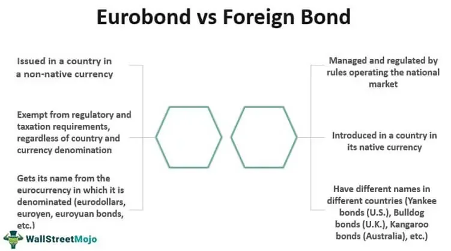

The financial landscape is vast and ever-changing, with numerous instruments available for investors to consider. Among these, international bonds are notably significant due to their potential for diversification and unique risk profiles. These bonds provide investors the opportunity to mitigate domestic market risks while participating in foreign economies, thus broadening their investment horizon.

The global bond market, in which international bonds play a vital role, has experienced significant transformations over the past few decades. These changes have been driven by various factors, including economic shifts, technological advancements, and innovations in trading mechanisms. For instance, the integration of electronic trading platforms has revolutionized how bonds are traded, increasing both the speed and transparency of transactions. Furthermore, economic events such as interest rate fluctuations and geopolitical uncertainties constantly reshape the market environment, affecting bond yields and investor strategies.

In recent years, the rise of algorithmic trading has further penetrated financial markets, altering the dynamics of how international bonds are traded. Algorithmic trading involves the use of complex algorithms to automate and execute trades at high speeds and volumes. This has introduced a new level of precision and efficiency into the trading process, enabling investors to capitalize on market inefficiencies and optimize trade executions based on real-time data analysis.

Understanding the intricacies of international bonds and their trading mechanisms is crucial for investors and financial strategists. With the continuous evolution of the financial ecosystem, leveraging these financial instruments effectively requires staying informed about market developments and technological advancements. This article aims to explore international bonds' complexities, assess the current state of the bond market, and evaluate the effects of algorithmic trading on these securities. This comprehensive understanding will equip investors with the knowledge needed to navigate the modern financial landscape successfully.

## Table of Contents

## Understanding International Bonds

International bonds constitute debt instruments issued by issuers domiciled outside the investor’s native country. These securities represent an essential element of a diversified investment portfolio, attracting investors keen on broadening their exposure beyond domestic financial markets. The issuance of international bonds is typically undertaken by foreign governments, multinational corporations, or supranational bodies, such as the International Monetary Fund or the World Bank, providing a wide array of investment avenues coupled with diverse risk profiles.

These bonds can be categorized based on several factors, including the currency in which they are issued, the legal jurisdiction that governs them, and the issuer's credit rating. The currency of issuance plays a crucial role as it directly impacts the currency risk that investors are subjected to. A U.S. investor purchasing a euro-denominated bond, for instance, assumes the risk of exchange rate fluctuations that could affect the bond's yield in U.S. dollar terms.

The legal jurisdiction governing international bonds outlines the rights and obligations of all parties involved, impacting how disputes are resolved and the enforcement of contract terms. Bonds issued under well-regulated and investor-friendly jurisdictions often attract more interest as they offer an additional layer of protection.

Credit ratings are another vital parameter, assessing the creditworthiness of the bond issuer. Ratings are provided by credit ratings agencies and range from high-grade bonds with low risk to high-yield, or "junk" bonds, which [carry](/wiki/carry-trading) a higher risk of default but offer the potential for higher returns.

Investors are attracted to international bonds for several reasons. These securities can offer higher yields compared to domestic bonds, particularly in cases where they are issued by emerging or frontier market entities. The geographic diversification achieved by investing in international bonds allows investors to benefit from diverse economic cycles and conditions, potentially reducing the overall [volatility](/wiki/volatility-trading-strategies) of their investment portfolio.

Moreover, international bonds can serve as a hedge against domestic economic downturns since the performance of these instruments is influenced by factors specific to their country or region of origin. Exposure to different macroeconomic environments allows investors to capitalize on growth opportunities in various parts of the world, thus optimizing their risk-return profiles.

In summary, international bonds are critical for achieving geographical diversification and enhancing yield prospects. The various factors that differentiate these bonds, coupled with the diverse issuer profiles, offer investors a rich tapestry of opportunities to tailor their investment strategies to meet specific financial goals and risk tolerance levels.

## Dynamics of the Global Bond Market

The global bond market represents one of the most substantial segments of the international financial system, essential for both funding and investment. It encompasses a diverse range of debt securities and offers a platform for issuers and investors across the globe to meet their financial objectives. This immense market plays a crucial role in capital allocation, risk management, and economic stability.

As emerging and frontier markets expand their economic and financial frameworks, their increasing participation in the bond market brings about significant opportunities and challenges. These markets provide new avenues for investment with potentially high returns; however, they also introduce higher volatility and risk. The economic and political stability of these regions can have profound impacts on bond yields and investor confidence. For example, a nascent bond market in a developing country may offer attractive yields, but investors must consider the associated risks of currency fluctuations, [liquidity](/wiki/liquidity-risk-premium) constraints, and political changes that could affect market performance.

The major components of the bond market include government debt, corporate bonds, and municipal securities. Each category presents distinct benefits and risks:

1. **Government Debt**: These bonds are considered low-risk investments as they are backed by national governments. However, the risk can vary depending on the country's economic health and credit rating. Sovereign bonds are vital for funding government operations and infrastructure projects.

2. **Corporate Bonds**: Issued by companies, these bonds typically offer higher yields compared to government securities, reflecting the greater risk associated with corporate credit profiles. Investors must evaluate the issuing company's financial health and market position.

3. **Municipal Securities**: These securities are issued by local governments or agencies to fund public projects such as schools, roads, and utilities. While generally considered safe, their risk can be influenced by the fiscal health of the issuing municipality and tax considerations.

Technological advancements and regulatory changes are continuously reshaping the bond market’s dynamics. Innovations such as electronic trading platforms, blockchain technology, and big data analytics have enhanced market transparency, reduced transaction costs, and improved liquidity. These tools allow for more accurate pricing, faster execution, and better access to market data. Furthermore, regulatory reforms aimed at increasing market oversight and protecting investors have led to a more stable and resilient bond market. Mechanisms such as the Dodd-Frank Act and the Basel III framework have introduced measures to mitigate systemic risks and enhance market stability.

In summary, understanding the dynamics of the global bond market involves recognizing its vast scale, the heterogeneity of its components, and the influence of technological and regulatory developments. Being aware of these factors is crucial for investors and policymakers working within this pivotal sector of the global economy.

## Evolution of Bond Market Trading

Bond trading has seen a profound transformation from traditional voice-based interactions to advanced electronic platforms, fundamentally changing the landscape for investors and traders alike. Initially, bond trading relied heavily on personal relationships and over-the-phone negotiations, often resulting in limited market access and higher transaction costs. However, the advent of electronic trading has dramatically improved these interactions by introducing automated systems that enable faster, more transparent, and more cost-effective trading experiences.

The shift to electronic platforms has lowered transaction costs by reducing the need for intermediaries and minimizing manual errors, allowing for more competitive pricing. Furthermore, execution speed has increased significantly, enabling traders to capitalize on fleeting market opportunities that were previously inaccessible due to slower manual processes. Market transparency has also been enhanced, as electronic platforms provide more comprehensive information about trade volumes, prices, and market trends, empowering investors with the data necessary to make informed decisions.

New trading styles have emerged as part of this electronic revolution. All-to-all trading platforms allow any participant to trade with any other, breaking down the traditional barriers that confined trades to a limited set of dealers. This democratization of trading access increases market liquidity and offers greater flexibility to bond investors. Portfolio trading, another innovative style, allows investors to trade a basket of bonds all at once, rather than executing each bond trade individually. This method simplifies the process of adjusting a portfolio to manage risk or respond to market changes, enhancing efficiency and strategic opportunities for investors.

Moreover, fixed income exchange-traded funds (ETFs) and [algorithmic trading](/wiki/algorithmic-trading) have played pivotal roles in reshaping bond market trading. Fixed income ETFs provide liquid and accessible means to invest in a diversified bond portfolio, making it easier for investors to enter and [exit](/wiki/exit-strategy) positions. These ETFs have led to increased liquidity in the underlying bond markets, as they require the buying and selling of bonds to replicate the performance of specific indices.

Algorithmic trading, which utilizes sophisticated algorithms to execute trades at high speed and [volume](/wiki/volume-trading-strategy), has further revolutionized the bond market. These algorithms analyze vast datasets in real-time to identify inefficiencies and precisely execute trades, often much faster than human traders could. As a result, algorithmic trading not only boosts liquidity but also enhances the ability of investors to achieve optimal trade execution.

Overall, the evolution of bond market trading reflects a broader trend towards automation and innovation in financial markets. These advancements have not only increased accessibility and efficiency but have also opened new avenues for both institutional and retail investors to participate in the bond market. As technology continues to progress, the bond trading ecosystem will likely see even more sophisticated tools and platforms emerging, further shaping the future of investments.

## The Impact of Algorithmic Trading

Algorithmic trading has transformed the bond market by leveraging computational algorithms to execute trades with unmatched speed and volume. This approach has redefined precision and efficiency in financial markets, particularly impacting the execution of complex bond trades. By analyzing vast datasets in real-time, algorithms enable investors to identify and exploit market inefficiencies, thereby optimizing trade execution.

The methodology entails utilizing automated systems that assess numerous variables, from market liquidity to price fluctuations, to make informed trading decisions. Real-time data processing and sophisticated modeling allow algorithms to adjust strategies dynamically, mitigating risks associated with market volatility. Moreover, the ability to execute large volumes of trades in milliseconds minimizes slippage, ensuring that trades align closely with intended prices.

As algorithmic trading continues to evolve, its significance in systematic bond trading is anticipated to grow. The scalability of algorithmic models facilitates the management of diversified portfolios, catering to both institutional and individual investors looking to capitalize on the intricacies of the bond market. Furthermore, the integration of [artificial intelligence](/wiki/ai-artificial-intelligence) and [machine learning](/wiki/machine-learning) into these algorithms is expected to enhance predictive analytics, offering deeper insights into market trends and price movements.

Algorithmic trading represents a pivotal shift in market strategies, where computational power and advanced analytics redefine investment decisions. Its impact on the bond market illustrates the broader transformation in financial markets, where technology and data drive the next generation of trading techniques and strategies. As this evolution progresses, algorithmic trading will likely continue to influence the landscape of global investments, opening new avenues for achieving investment success.

## Challenges and Risks of International Bonds and Algo Trading

International bonds are a crucial avenue for global diversification but come with inherent risks. Currency fluctuations, geopolitical uncertainties, and diverse regulatory environments are among the challenges that investors face when dealing with international bonds. Currency risk arises because the bond's value and interest payments are often denominated in a foreign currency. This exposes investors to exchange rate volatility, which can diminish returns or even lead to losses if the investor's home currency strengthens against the foreign currency. For instance, an investor holding a bond in Euros may face losses if the Euro depreciates relative to their domestic currency.

Geopolitical risks, encompassing political instability, war, or a shift in government policies, can drastically affect bond valuations and market confidence. International developments such as elections, policy changes, or diplomatic tensions can suddenly alter investment landscapes, impacting the creditworthiness of issuers and investors' perception of risk. Furthermore, the varying regulatory environments across countries can affect the enforceability of bond contracts and investor rights. Regulatory differences may involve distinct tax treatments, differing degrees of market transparency, and dissimilar disclosure requirements, which can lead to complexities and uncertainties for international investors.

Algorithmic trading presents its own set of challenges despite its advantages in terms of speed and precision. A significant concern is market disruption, where algorithms behaving unexpectedly or errors in coding can lead to flash crashes, causing dramatic short-term price swings and loss of liquidity. Execution errors also pose a risk, where bugs or unforeseen anomalies in algorithmic strategies may result in suboptimal trading outcomes or significant losses.

With algorithmic trading being heavily reliant on technology, it is subject to regulatory scrutiny as authorities mitigate risks tied to rapid trading and its potential to exacerbate market volatility. In this high-frequency environment, maintaining an effective regulatory framework is paramount to ensuring fair and stable markets. Regulatory bodies may enforce limits on trade speeds, review algorithms for compliance, and implement measures to quickly detect and counteract abnormal trading activities.

To navigate these risks efficiently, investors need a deep understanding of the intricacies involved with international bonds and algorithmic trading. A robust risk management framework is essential for assessing and mitigating the diverse risks. This includes currency hedging strategies to manage exchange rate risks and diversification across different geographies and currencies to balance geopolitical risks. Similarly, selecting algorithms with proven stability and regular testing for anomalies or errors can mitigate risks associated with algorithmic trading.

Ongoing market monitoring remains critical for investors to stay informed about potential risks and opportunities. Keeping abreast of regulatory updates ensures compliance and helps anticipate changes that might impact investment strategies. By diligently managing these factors, investors can enhance their ability to optimize returns while mitigating the associated risks of international bonds and algorithmic trading.

## Conclusion

International bonds represent a crucial element of global investment strategies, primarily due to their potential for diversification and yield enhancement. These instruments allow investors to access different economic conditions and [interest rate](/wiki/interest-rate-trading-strategies) environments outside their home country, providing a hedge against domestic market volatility. The ever-evolving dynamics of the bond market, influenced by technological advancements and market innovations, necessitate a comprehensive understanding by investors to effectively utilize these opportunities.

Algorithmic trading, characterized by its speed and precision, has revolutionized the way bonds are traded, offering improved execution and liquidity. The integration of computational algorithms in trading practices enables investors to analyze large datasets, identify market inefficiencies, and execute complex trades with high efficiency. As this technology continues to evolve, it plays an increasingly essential role in shaping market strategies and investment decisions.

Adaptability is key for investors aiming to capitalize on the benefits offered by international bonds and algorithmic trading. Staying informed about the latest technological advancements and trading techniques is critical for maintaining a competitive edge and optimizing returns. As the financial landscape continues to transform, the convergence of technology and finance promises to unlock new possibilities in the bond market, potentially enhancing global investment outcomes. Embracing these changes and incorporating them into investment strategies will be vital for achieving success in the future market environment.

## References & Further Reading

[1]: Fabozzi, F. J., & Mann, S. V. (2005). ["The Handbook of Fixed Income Securities"](https://www.mhebooklibrary.com/doi/book/10.1036/9781260473902?contentTab=true). McGraw-Hill.

[2]: Lopez de Prado, M. (2018). ["Advances in Financial Machine Learning"](https://www.amazon.com/Advances-Financial-Machine-Learning-Marcos/dp/1119482089). Wiley.

[3]: Jansen, S. (2018). ["Machine Learning for Algorithmic Trading: Predictive models to extract signals from market and alternative data for systematic trading strategies with Python"](https://github.com/stefan-jansen/machine-learning-for-trading). Packt Publishing.

[4]: Chan, E. P. (2009). ["Quantitative Trading: How to Build Your Own Algorithmic Trading Business"](https://github.com/ftvision/quant_trading_echan_book). Wiley.

[5]: Arora, P., & Bodkhe, U. (2020). ["Algorithmic Trading in the Financial Markets: An Introduction"](https://www.sciencedirect.com/science/article/pii/S0957417422006479). Springer.

[6]: International Monetary Fund. (2021). ["Global Financial Stability Report: Navigating the Financial Challenges of the COVID-19 Pandemic"](https://en.wikipedia.org/wiki/International_Monetary_Fund). International Monetary Fund.

[7]: Wyman, O. (2018). ["Annual Review of Global Trading, Hedge Funds, and Trading Technologies"](https://www.annualreviews.org/content/journals/10.1146/annurev-financial-110311-101741). Oliver Wyman.

[8]: Vasicek, O. (1977). "An Equilibrium Characterization of the Term Structure". Journal of Financial Economics, 5(2), 177-188.