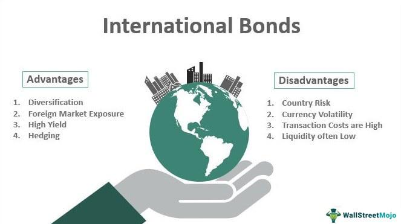

## Table of Contents

## What are international bonds?

International bonds are debt securities that are issued in a country different from the one where the bond issuer is based. For example, if a company from Japan issues bonds in the United States, those bonds are considered international bonds. These bonds help companies and governments raise money from investors around the world. They are usually denominated in a currency different from the issuer's home currency, which adds an extra layer of risk and potential reward for investors.

There are different types of international bonds, such as Eurobonds, which are issued in a currency not native to the country where they are issued. Another type is foreign bonds, which are issued by a foreign borrower but sold in the domestic market of another country and denominated in that country's currency. For example, a "Yankee bond" is a bond issued by a non-U.S. entity but sold in the U.S. and denominated in U.S. dollars. International bonds can be an important tool for diversifying an investment portfolio, but they also come with risks like currency fluctuations and political instability in the issuing country.

## How do international bonds differ from domestic bonds?

International bonds and domestic bonds are both ways for companies or governments to borrow money, but they have some key differences. International bonds are issued in a country different from where the issuer is based. For example, if a company from Germany issues bonds in the United States, those are international bonds. They are often denominated in a currency that is not the issuer's home currency. This can make them more complex because the value of the bond can change based on how the exchange rate between the two currencies moves.

Domestic bonds, on the other hand, are issued and sold within the same country. If a U.S. company issues bonds in the U.S. and they are denominated in U.S. dollars, those are domestic bonds. They are simpler because investors and issuers don't have to worry about currency exchange rates. However, domestic bonds might offer less opportunity for diversification since they are tied to the economic conditions of one country. Both types of bonds can be useful for investors, but they come with different levels of risk and potential reward.

## What are the main types of international bonds?

International bonds come in different types, but the main ones are Eurobonds and foreign bonds. Eurobonds are issued in a currency that is not the currency of the country where they are issued. For example, if a Japanese company issues bonds in Europe in U.S. dollars, those are Eurobonds. They are called Eurobonds because they were first issued in Europe, but now they can be issued anywhere. Eurobonds help companies and governments raise money from investors all over the world.

Foreign bonds are another type of international bond. These are issued by a foreign company or government but sold in the domestic market of another country and denominated in that country's currency. A common example is a "Yankee bond," which is a bond issued by a non-U.S. company but sold in the U.S. and denominated in U.S. dollars. Foreign bonds let issuers tap into new markets and give investors a chance to diversify their portfolios by investing in bonds from different countries.

## What are the benefits of investing in international bonds?

Investing in international bonds can help you spread out your money. When you put money into bonds from different countries, you're not just relying on one country's economy. If one country's economy is doing badly, your international bonds from other countries might still be doing well. This can help protect your money and make it safer.

Another benefit is that you might get higher returns. Sometimes, international bonds pay more interest than bonds from your own country. This can be because they are riskier, but if you're willing to take that risk, you could earn more money. Also, when you invest in bonds from different countries, you can take advantage of different interest rates and economic conditions around the world.

## What are the risks associated with international bonds?

Investing in international bonds comes with some risks. One big risk is the change in currency values. When you buy a bond in another country's currency, if that currency gets weaker compared to your own currency, you could lose money. For example, if you buy a bond in euros and the euro gets weaker compared to the U.S. dollar, you will get less money back when you convert it to dollars.

Another risk is political and economic instability in the country where the bond is issued. If the country's government changes or the economy goes into a recession, it could be harder for them to pay back the bond. This makes the bond riskier and could lower its value. You need to think about these risks when deciding to invest in international bonds.

## How can one invest in international bonds?

You can invest in international bonds by buying them directly from the issuer or through a broker. If you want to buy them directly, you need to find out which international companies or governments are issuing bonds and then contact them or their [agents](/wiki/agents) to buy the bonds. This can be a bit tricky because you need to know how to navigate the bond markets in different countries. A broker can make it easier because they have access to a wider range of bonds and can help you buy them. You just need to open an account with a brokerage firm that offers international bonds and tell them which bonds you want to buy.

Another way to invest in international bonds is through mutual funds or exchange-traded funds (ETFs) that focus on international bonds. These funds pool money from many investors and use it to buy a variety of international bonds. This can be a good option if you want to spread out your risk because you're not putting all your money into one bond. You can buy shares in these funds through a brokerage account or directly from the fund company. Just make sure to check the fees and understand how the fund works before you invest.

## What are some examples of well-known international bonds?

One famous example of an international bond is the Eurobond. A Eurobond is a bond that is issued in a currency different from the country where it is issued. For example, a Japanese company might issue a Eurobond in U.S. dollars in Europe. These bonds are popular because they help companies and governments raise money from investors all over the world. They can be a good way for investors to diversify their portfolios because they are not tied to just one country's economy.

Another example is the Yankee bond. A Yankee bond is a bond issued by a company or government from outside the U.S., but it is sold in the U.S. and is denominated in U.S. dollars. For instance, if a German company issues a bond in the U.S. in dollars, that's a Yankee bond. These bonds let foreign issuers tap into the large U.S. market and can offer U.S. investors a chance to invest in bonds from other countries. Both Eurobonds and Yankee bonds are important types of international bonds that help connect global markets.

## How do currency fluctuations affect international bonds?

Currency fluctuations can have a big impact on international bonds. When you buy a bond in a different country's currency, the value of your investment can change because of how that currency moves compared to your own. If the currency of the bond you bought gets weaker compared to your home currency, you might lose money. For example, if you buy a bond in euros and the euro gets weaker compared to the U.S. dollar, you will get less money back when you convert it to dollars. This is called currency risk, and it's something you have to think about when you invest in international bonds.

On the other hand, if the currency of the bond you bought gets stronger compared to your home currency, you could make more money. For example, if the euro gets stronger compared to the U.S. dollar, the value of your euro bond goes up when you convert it back to dollars. This can be good for your investment, but it also adds an extra layer of uncertainty. You never know for sure how currencies will move, so you have to be ready for your bond's value to go up or down because of currency changes.

## What role do international bonds play in portfolio diversification?

International bonds can help you spread out your money so it's not all tied to one country's economy. When you invest in bonds from different countries, you're not just relying on how well your own country is doing. If one country's economy is struggling, your international bonds from other countries might still be doing well. This can help protect your money and make your overall investment safer. It's like not putting all your eggs in one basket; if one basket falls, you still have eggs in the other baskets.

Another way international bonds help with diversification is by giving you a chance to earn more money. Sometimes, these bonds pay more interest than the bonds you can get in your own country. This can be because they are riskier, but if you're willing to take that risk, you could earn more. Also, by investing in bonds from different countries, you can take advantage of different interest rates and economic conditions around the world. This can help you build a stronger and more balanced investment portfolio.

## How are international bonds rated and what does it signify?

International bonds are rated by credit rating agencies like Moody's, Standard & Poor's (S&P), and Fitch. These agencies look at things like how likely the issuer is to pay back the money they borrowed and how stable the country's economy is. They give the bond a rating, which is usually a letter grade like AAA, AA, A, BBB, and so on. A higher rating, like AAA, means the bond is very safe and the issuer is very likely to pay back the money. A lower rating, like BB or below, means the bond is riskier and there's a bigger chance the issuer might not pay back the money.

These ratings are important because they help investors decide which bonds to buy. If you want a safe investment, you might choose a bond with a high rating. But if you're willing to take more risk for a chance at higher returns, you might choose a bond with a lower rating. The rating also affects the [interest rate](/wiki/interest-rate-trading-strategies) the bond pays. Bonds with lower ratings usually have to pay higher interest to attract investors because they are riskier. So, the rating tells you a lot about how safe the bond is and what kind of return you might expect.

## What are the tax implications of investing in international bonds?

When you invest in international bonds, you need to think about taxes. The interest you earn from these bonds might be taxed differently depending on where you live and where the bond is from. In some countries, the interest from foreign bonds is taxed at a higher rate than interest from bonds in your own country. Also, some countries have something called withholding tax, which means they take a bit of tax out of the interest before you get it. You might be able to get some of this tax back when you do your taxes, but it can be complicated.

Another thing to think about is how your country treats foreign income. Some countries let you claim a tax credit for taxes you paid in another country, so you don't get taxed twice on the same money. But you need to check the tax rules in your country and maybe talk to a tax expert to make sure you're doing everything right. The tax rules can be different for every country and every type of bond, so it's important to understand them before you invest in international bonds.

## How have international bonds performed historically compared to other investments?

International bonds have had ups and downs like other investments. Over the years, they've sometimes done better than domestic bonds and sometimes worse. It depends a lot on what's happening in the world. For example, if a country's economy is doing well, its bonds might do better than bonds from a country with a struggling economy. Also, if a country's currency gets stronger, the bonds from that country can give you a better return when you convert the money back to your own currency. But if the currency gets weaker, you might lose money even if the bond itself is doing okay.

Looking at the long term, international bonds can be a good way to spread out your money. They can help you balance out the risk in your investment portfolio because they don't always move in the same way as stocks or domestic bonds. Sometimes, when stocks go down, international bonds might go up, or at least not go down as much. This can help protect your money. But remember, they also come with their own risks, like currency changes and political problems in the countries where the bonds are from. So, while they can be a good part of your investment plan, you need to be ready for the ups and downs.

## References & Further Reading

[1]: Fabozzi, F. J., & Mann, S. V. (2005). ["The Handbook of Fixed Income Securities"](https://www.mhebooklibrary.com/doi/book/10.1036/9781260473902?contentTab=true). McGraw-Hill.

[2]: Lopez de Prado, M. (2018). ["Advances in Financial Machine Learning"](https://www.amazon.com/Advances-Financial-Machine-Learning-Marcos/dp/1119482089). Wiley.

[3]: Jansen, S. (2018). ["Machine Learning for Algorithmic Trading: Predictive models to extract signals from market and alternative data for systematic trading strategies with Python"](https://github.com/stefan-jansen/machine-learning-for-trading). Packt Publishing.

[4]: Chan, E. P. (2009). ["Quantitative Trading: How to Build Your Own Algorithmic Trading Business"](https://github.com/ftvision/quant_trading_echan_book). Wiley.

[5]: Arora, P., & Bodkhe, U. (2020). ["Algorithmic Trading in the Financial Markets: An Introduction"](https://www.sciencedirect.com/science/article/pii/S0957417422006479). Springer.

[6]: International Monetary Fund. (2021). ["Global Financial Stability Report: Navigating the Financial Challenges of the COVID-19 Pandemic"](https://en.wikipedia.org/wiki/International_Monetary_Fund). International Monetary Fund.

[7]: Wyman, O. (2018). ["Annual Review of Global Trading, Hedge Funds, and Trading Technologies"](https://www.annualreviews.org/content/journals/10.1146/annurev-financial-110311-101741). Oliver Wyman.

[8]: Vasicek, O. (1977). "An Equilibrium Characterization of the Term Structure". Journal of Financial Economics, 5(2), 177-188.