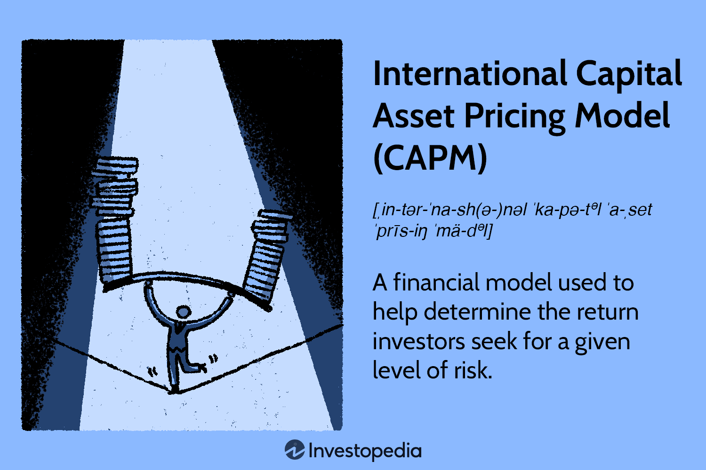

In today's financial landscape, understanding complex models and strategies is crucial for making informed investment decisions. Investment strategies have evolved significantly, leveraging advanced financial models to quantify and manage risks effectively. Among these models, the Capital Asset Pricing Model (CAPM) plays a pivotal role, providing a framework to quantify the relationship between expected return and risk. Traditional CAPM models focus primarily on domestic investments, ignoring additional complexities introduced by global markets. However, the International Capital Asset Pricing Model (ICAPM) extends this framework, considering factors such as exchange rate risk, making it critical for investors operating across borders. 

Algorithmic trading, which automates trading decisions using algorithmic processes, further underscores the importance of these models. By embedding models like ICAPM within trading algorithms, investors can enhance their decision-making processes, adapting swiftly to market changes and optimizing their portfolios. This convergence of financial modeling and technology demonstrates the need for investors to stay abreast of these developments, ensuring they can navigate the complexities of today's global financial markets effectively. Through this article, we provide a comprehensive overview of these concepts and their implication on global investment strategies, illustrating their interconnection and significance in modern finance.



## Table of Contents

## Understanding Financial Models and Pricing

Financial models serve as indispensable instruments in the evaluation of financial assets' potential performance. These models provide a structured approach to quantify financial risks and returns, which is essential for investors, portfolio managers, and policymakers. Among the plethora of financial models, the Capital Asset Pricing Model (CAPM) stands out as a cornerstone. CAPM is instrumental in determining the expected return on assets by juxtaposing their risk against the backdrop of the overall market.

The CAPM formula is expressed as:

$$

E(R_i) = R_f + \beta_i (E(R_m) - R_f) 
$$

where:
- $E(R_i)$ is the expected return on the asset,
- $R_f$ is the risk-free rate,
- $\beta_i$ represents the asset's sensitivity to market risk, and
- $E(R_m)$ is the expected return of the market.

The core objective of CAPM is to illustrate how asset risk translates into expected return. By comparing the asset's performance against the market, CAPM provides insights into whether an asset is accurately valued given its inherent risk.

In an international setting, financial models evolve to accommodate additional complexities such as exchange rate risks. This is a crucial adaptation, as global investments are subjected to various geopolitical and economic factors that domestic models might not account for. Thus, pricing models are expanded with additional components to address risks associated with exchange rate fluctuations.

For international investments, the traditional CAPM framework is extended to include exchange rate considerations. This extension involves the adaptation of the CAPM to the International Capital Asset Pricing Model (ICAPM), which incorporates multiple currency exposures and differential interest rates along with traditional market risks.

The ICAPM can be expressed as:

$$

E(R_i) = R_f + \beta_i (E(R_m) - R_f) + \sum \lambda_j \Phi_{ij} 
$$

where $\Phi_{ij}$ represents the sensitivity of the asset to currency risk factor $j$, and $\lambda_j$ is the risk premium associated with that currency factor.

By integrating exchange rate dynamics, international pricing models like ICAPM offer a more comprehensive framework for evaluating foreign investments. This enhanced evaluation is critical for investors who aim to optimize their portfolios on a global scale, ensuring that they are compensated for the additional risks undertaken through cross-border investments.

## International Capital Asset Pricing Model (ICAPM)

The International Capital Asset Pricing Model (ICAPM) is a refinement of the traditional Capital Asset Pricing Model (CAPM), tailored to account for the complexities of global investing, particularly foreign exchange risks. This model is pivotal for investors looking to optimize portfolios that span multiple countries and currencies.

The ICAPM integrates critical financial components to provide a more comprehensive risk assessment. Primarily, the model evaluates the risk-free rate, which serves as a benchmark for investors seeking a minimal risk yield. Unlike the standard CAPM, the ICAPM adjusts the risk-free rate to reflect the sovereign risks associated with different currencies and can vary across different geographic borders.

Another central element of the ICAPM is the market risk premium, symbolizing the expected return on the market above the risk-free rate. In an international context, this premium not only accounts for domestic market [volatility](/wiki/volatility-trading-strategies) but also the systematic risk of international market exposure. This is captured through a global market portfolio, which includes diverse financial assets from various countries.

The most distinguishing feature of ICAPM is its incorporation of exchange rate premiums. Exchange rate fluctuations can significantly affect the value of foreign investments, introducing additional risk that is not present in domestic-only models. The exchange rate premium adjusts for potential variations in currency value, providing a quantified risk return relationship contingent on currency stability and expected movements.

Mathematically, the ICAPM can be represented as:

$$
E(R_i) = R_f + \beta_{iM} (E(R_M) - R_f) + \beta_{iFX} E(S)
$$

Where:
- $E(R_i)$ is the expected return of the asset.
- $R_f$ is the risk-free interest rate, often adjusted for the specific country.
- $\beta_{iM}$ is the sensitivity of the asset's returns to the market portfolio returns.
- $E(R_M)$ is the expected return of the global market portfolio.
- $\beta_{iFX}$ is the sensitivity of the asset's returns to changes in exchange rates.
- $E(S)$ is the expected change in the exchange rate.

The ICAPM provides a strategic framework for investors to weigh global market dynamics and their impact on investment portfolios. By incorporating foreign exchange considerations and a globally diversified market view, the model enables investors to achieve a more accurate risk-adjusted return profile. Consequently, it is an invaluable tool for those engaged in international asset allocation, as it informs strategy concerning currency exposure and cross-border investment risks.

## Comparing ICAPM with Standard CAPM

The Capital Asset Pricing Model (CAPM) is a fundamental tool in finance, used primarily to determine the expected return on an asset based on its systemic risk relative to the market. CAPM operates under the assumption of a closed economy and is primarily focused on domestic investments. It is expressed mathematically by the formula:

$$

E(R_i) = R_f + \beta_i (E(R_m) - R_f) 
$$

where:
- $E(R_i)$ is the expected return on the investment,
- $R_f$ is the risk-free rate,
- $\beta_i$ is the beta of the investment, a measure of its volatility relative to the market,
- $E(R_m)$ is the expected market return.

In contrast, the International Capital Asset Pricing Model (ICAPM) is an extension that integrates international finance variables, making it suitable for global investments. A key distinction of the ICAPM is its consideration of exchange rate risks, which are pivotal in cross-border investments. This modification acknowledges the reality that foreign investments are subject to additional layers of risk due to currency exchange rate fluctuations.

The ICAPM adapts the CAPM equation to:

$$

E(R_i) = R_f + \beta_i (E(R_m) - R_f) + \beta_{[FX](/wiki/fx-anomaly)} (E(S)) 
$$

Here, $\beta_{FX}$ represents the sensitivity of the asset's returns to exchange rate variations, and $E(S)$ is the expected change in the currency exchange rate.

The inclusion of exchange rate risk in ICAPM offers a more nuanced risk evaluation, enabling investors to predict returns more accurately by accounting for foreign exchange movements. It is particularly advantageous for hedging against potential losses in international markets, providing a mechanism to balance potential gains with currency risk exposure.

Investors utilizing the ICAPM can tailor their strategies to better navigate the complex interactions between domestic and international market forces. This ability to [factor](/wiki/factor-investing) in international dynamics makes the model particularly valuable in the global economy, where capital flows are increasingly interlinked across national borders. This comprehensive approach aids in optimizing portfolios to align with both home and global market conditions, thereby potentially increasing returns while managing the risks inherent in cross-border investments.

## The Role of Algorithmic Trading

Algorithmic trading employs advanced financial models, such as the Capital Asset Pricing Model (CAPM) and its international counterpart (ICAPM), to automate trading decisions. This approach leverages computational algorithms to analyze large datasets, enhancing the precision with which these models predict asset returns by factoring in diverse market variables, including risk and return dynamics. 

The automation of trading decisions through algorithms focuses on exploiting patterns and executing strategies at speeds impossible for human traders. By integrating CAPM, which traditionally evaluates expected return based on systematic risk, with algorithmic processes, traders can routinely update their models to reflect real-time data inputs. This continuous process helps optimize investment strategies by quickly adapting to market conditions.

ICAPM extends these capabilities to global markets by incorporating exchange rate risks, thus adding another dimension of data to be processed and analyzed. Algorithmic trading systems can manage this complexity, allowing for the development of multi-currency strategies that adjust to both asset price movements and currency fluctuations. For example, if an asset's expected return changes due to market dynamics, the algorithm can swiftly rebalance the portfolio to maintain an optimal risk-return profile.

An example of Python code to simulate a basic [algorithmic trading](/wiki/algorithmic-trading) decision-making process using CAPM might look like the following:

```python
import numpy as np

# Function to calculate expected return using CAPM
def expected_return(risk_free_rate, beta, market_return):
    return risk_free_rate + beta * (market_return - risk_free_rate)

# Example parameters
risk_free_rate = 0.02
beta = 1.1
market_return = 0.06

# Calculate expected return
exp_return = expected_return(risk_free_rate, beta, market_return)

# Trading decision based on expected return
def trading_decision(expected_return, current_return):
    if expected_return > current_return:
        return "Buy"
    else:
        return "Sell"

# Example current return
current_return = 0.05
decision = trading_decision(exp_return, current_return)

print(f"Trading Decision: {decision}")
```

This simplistic model demonstrates the potential for automated trading strategies to incorporate CAPM calculations. While such models may start at a basic level, they can be expanded with more complex algorithms that account for global market interactions and factor in additional risks associated with ICAPM.

In summary, algorithmic trading provides the crucial capability to harness financial models for systematic and efficient portfolio management. This synergy allows investors to react promptly to continually evolving market landscapes, optimizing portfolio performance through timely and informed decision-making processes.

## Benefits of Using ICAPM in Algorithmic Trading

The International Capital Asset Pricing Model (ICAPM) offers significant advantages when used in algorithmic trading. By integrating international risks, such as exchange rate fluctuations and varying interest rates, ICAPM provides a more comprehensive framework for global investment strategies. This structured approach facilitates the automation of investment strategies, allowing traders to optimize returns while efficiently managing cross-border risks.

One of the primary benefits of using ICAPM in algorithmic trading is the potential for improved risk management. Traditional CAPM may fall short in a global context as it primarily considers domestic risk factors. ICAPM, on the other hand, includes an additional layer of analysis, incorporating foreign exchange risk and international market volatility. This enables traders to better predict and hedge against potential market disruptions, resulting in more robust and resilient portfolios.

Algorithmic trading systems, equipped with ICAPM insights, can automate the process of rebalancing portfolios to maintain optimal asset allocation. For example, the ICAPM formula is:

$$
E(R_i) = R_f + \beta_{i} (E(R_m) - R_f) + \gamma_{i}E(S)
$$

where:

- $E(R_i)$ is the expected return on asset $i$,
- $R_f$ represents the risk-free rate,
- $\beta_{i}$ is the sensitivity of the returns of asset $i$ to the returns of the market,
- $E(R_m)$ is the expected return of the market portfolio,
- $\gamma_{i}$ denotes the sensitivity of the asset's returns to exchange rate changes,
- $E(S)$ is the expected change in the exchange rate.

Traders can incorporate this formula into their algorithms to continuously assess and adjust their holdings in response to market shifts. This real-time capability is particularly valuable in fast-moving global markets where delays in response can lead to significant financial losses.

Moreover, ICAPM aids in crafting diversified portfolios that are well-suited to global market conditions. By accounting for diverse risk factors across multiple markets, ICAPM allows traders to construct portfolios with a balance of assets that are likely to yield positive returns or maintain stability, despite fluctuations in specific regions. This strategic diversification is crucial for minimizing unsystematic risk—risk that is unique to a particular country or sector—thereby enhancing the overall risk-return profile of investments.

In sum, ICAPM enhances algorithmic trading by providing a sophisticated method for risk assessment and portfolio diversification in international contexts. Automating these processes leads to more efficient strategy implementation, ensuring that investment decisions are consistently aligned with the dynamic nature of global financial markets.

## Challenges and Limitations

One of the primary challenges associated with the International Capital Asset Pricing Model (ICAPM) is the accurate estimation of exchange rate risk premiums. These premiums are critical because they capture the potential impact of currency fluctuations on international investments. Estimating them precisely is difficult due to the inherent volatility and unpredictability of foreign exchange markets, which can be influenced by a wide range of factors including geopolitical events, monetary policies, and economic indicators.

The foundational assumptions made by both the Capital Asset Pricing Model (CAPM) and ICAPM—such as the uniformity of the risk-free rate and the efficiency of markets—do not always align with real-world situations. The assumption that a uniform risk-free rate is available to all investors across different countries overlooks the differences in sovereign credit risk and [interest rate](/wiki/interest-rate-trading-strategies) policies. Additionally, market efficiency, a cornerstone of these models, implies that asset prices fully reflect all available information. In reality, information asymmetries and behavioral biases frequently lead to market inefficiencies, challenging the validity of these models in practical applications.

For algorithmic traders, the limitations of ICAPM are further compounded by factors such as transaction costs and market volatility, which are not addressed by the basic ICAPM model. Transaction costs can significantly impact profitability, especially in high-frequency trading environments where trades are executed rapidly and frequently. Market volatility, driven by various endogenous and exogenous factors, adds another layer of complexity that algorithmic strategies must navigate. To mitigate these issues, algorithmic traders often incorporate advanced techniques and additional layers of analysis, such as using [machine learning](/wiki/machine-learning) algorithms to predict short-term price movements or incorporating transaction cost models to optimize execution strategies. Despite these enhancements, the inherent assumptions and limitations of the ICAPM mean that it must be used alongside other tools and methodologies to provide a more comprehensive risk assessment in the context of international investments.

## Conclusion

The International Capital Asset Pricing Model (ICAPM) stands as a significant evolution in financial modeling, especially important for managing international investments. By integrating foreign exchange risks into the traditional Capital Asset Pricing Model (CAPM), ICAPM provides a more comprehensive framework for assessing expected returns on a global scale. This model considers various factors, including the risk-free rate, market risk premium, and exchange rate premiums, allowing investors to effectively quantify and manage the impact of global market dynamics on their portfolios.

When paired with algorithmic trading, ICAPM offers a robust mechanism for handling complex portfolios across diverse markets. Algorithmic trading allows for the automation of investment strategies and the real-time adjustment of portfolios, enhancing precision in decision-making and optimizing returns. The use of ICAPM in these algorithms helps in efficiently managing cross-border risks by incorporating a structured approach to account for international variables. This alignment ensures that portfolios remain well-diversified and responsive to shifts in global market conditions.

In today's fast-paced global economy, staying informed of sophisticated models like ICAPM is crucial for investors and traders. The ability to leverage such advanced financial models can provide a competitive edge, as they facilitate informed decision-making and risk management across multiple markets. Thus, understanding and applying ICAPM within the context of algorithmic trading can be instrumental in achieving strategic investment objectives in international domains.

## References & Further Reading

[1]: ["International Finance and Open-Economy Macroeconomics"](https://link.springer.com/book/10.1007/978-3-662-49862-0) by Giancarlo Gandolfo

[2]: ["Global Investing: The Professional's Guide to the World Capital Markets"](https://www.amazon.com/Global-Investing-Professionals-Capital-Markets/dp/007031683X) by Roger G. Ibbotson and Gary P. Brinson

[3]: ["Algorithmic and High-Frequency Trading"](https://www.amazon.com/Algorithmic-High-Frequency-Trading-Mathematics-Finance/dp/1107091144) by Álvaro Cartea, Sebastian Jaimungal, and José Penalva

[4]: ["Modern Portfolio Theory and Investment Analysis"](https://books.google.com/books/about/Modern_Portfolio_Theory_and_Investment_A.html?id=181CEAAAQBAJ) by Edwin J. Elton, Martin J. Gruber, Stephen J. Brown, and William N. Goetzmann

[5]: ["The International CAPM and a General Multifactor Model of Asset Prices"](https://pages.stern.nyu.edu/~alynch/courses/B01.231160/ff06S06.pdf) by Bruno Solnik, Journal of International Finance and Economics

[6]: ["Capital Asset Pricing Model: Theory and Evidence"](https://digitalcommons.dartmouth.edu/cgi/viewcontent.cgi?article=3446&context=facoa) by Eugene F. Fama, Kenneth R. French, Journal of Economic Perspectives

[7]: ["Exchange Rate Dynamics"](https://www.nber.org/system/files/chapters/c6834/c6834.pdf) by Martin D. D. Evans