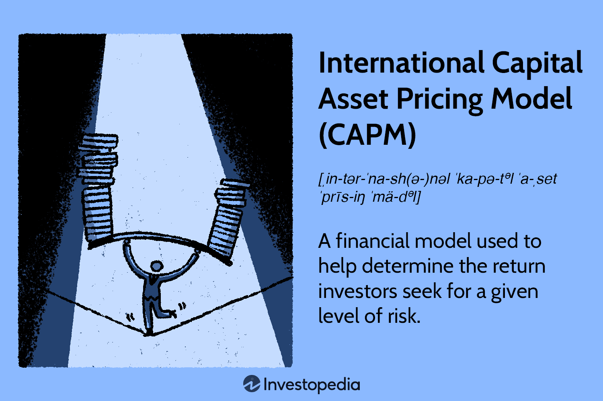

In today's globalized financial markets, understanding and applying sophisticated financial models is essential for making informed investment decisions. Among these models, the Capital Asset Pricing Model (CAPM) remains a fundamental tool for investors. Developed in the 1960s, CAPM provides insights into expected returns on investment by linking them to market risk, often represented through the beta coefficient. The formula for CAPM is as follows:

$$
E(R_i) = R_f + \beta_i (E(R_m) - R_f)
$$



where $E(R_i)$ is the expected return on the investment, $R_f$ is the risk-free rate, $\beta_i$ is the sensitivity of the asset's returns to market returns, and $E(R_m) - R_f$ is the market risk premium.

The International Capital Asset Pricing Model (ICAPM) extends the CAPM by incorporating global market dynamics, particularly currency exchange risks. This enhancement is crucial for investors operating in international markets, as exchange rate fluctuations can significantly impact investment returns. ICAPM introduces additional factors to account for these risks, providing a more comprehensive framework for evaluating expected returns on global investments.

Algorithmic trading utilizes these financial models to predict market movements and execute trades with high precision. By automating decision-making processes, algorithmic trading systems can rapidly analyze vast datasets, enabling investors to capitalize on market opportunities efficiently. The integration of CAPM and ICAPM into algorithmic trading strategies allows for optimized asset allocation and investment decisions in an increasingly interconnected financial environment.

This article explores the interplay between CAPM, ICAPM, and algorithmic trading, highlighting their significance in modern finance. Through examining these models, we aim to elucidate their roles in enhancing investment strategies in both domestic and international contexts.

## Table of Contents

## Understanding Financial Models and Pricing

Financial models serve as fundamental tools for investors, enabling them to evaluate potential investment performance by quantifying risks and predicting expected returns. Among these models, the Capital Asset Pricing Model (CAPM) plays a pivotal role, particularly in linking the risk of an asset to its expected return, thereby offering significant insights into asset valuation.

The core principle of CAPM is based on the idea that investors need to be compensated in two ways: the time value of money and the risk undertaken. The time value of money is represented through the risk-free rate, while the risk undertaken is represented through the risk premium. The CAPM formula is expressed as:

$$
\text{Expected Return (ER)} = R_f + \beta \times (R_m - R_f)
$$

Where:

- $R_f$ is the risk-free rate,
- $\beta$ is the beta of the investment (a measure of how much risk the investment will add to a portfolio),
- $R_m$ is the expected market return,
- $R_m - R_f$ is the market risk premium.

This relationship guides investment strategies within domestic markets by providing a means to evaluate whether an investment's return is commensurate with its risk. Investors use CAPM to determine a theoretically appropriate required rate of return of an asset when considering systemic risk, as measured by beta, against the backdrop of expected market returns.

However, as financial markets become more globalized, the standard CAPM model exhibits limitations, particularly in its treatment of investments spanning multiple countries with varying currencies. Exchange rate fluctuations introduce an additional layer of risk not accounted for by the traditional CAPM. This necessitates the adaptation of CAPM to include global investment variables, leading to the development of the International Capital Asset Pricing Model (ICAPM).

ICAPM enhances the traditional model by incorporating exchange rate risks, allowing it to account for the complexities of international investing. The addition of exchange rate premiums and adjustments to the risk-free rate provides a more accurate measure of the expected returns on international investments, given their exposure to currency fluctuations.

In summary, while CAPM remains a cornerstone of evaluating risk and return in domestic contexts, the expanding scope of international markets requires an evolved approach, such as ICAPM, that incorporates crucial global risk factors like currency exchange fluctuations for a more comprehensive evaluation of international investments.

## International Capital Asset Pricing Model (ICAPM)

The International Capital Asset Pricing Model (ICAPM) extends the insights of the standard Capital Asset Pricing Model (CAPM) by addressing the intricacies involved in global portfolio investment, particularly through the incorporation of foreign exchange risks. Traditional CAPM evaluates the expected return of an asset based primarily on its sensitivity to market risk in a closed national context, typically neglecting the influence of currency fluctuations that are unavoidable in international investing.

ICAPM modifies the risk-free rate by including an exchange rate premium to account for these currency-related concerns. This premium reflects the potential changes in asset value due to currency movements, which are especially significant in contexts where investments are subjected to different national economic climates and monetary policies. By adjusting for these factors, ICAPM offers a broader and more refined evaluation of an asset's expected returns.

The ICAPM mathematically formalizes these concepts, integrating global market dynamics into its framework. The expected return on an international asset within the ICAPM framework can be expressed as:

$$
E(R_i) = R_f + \beta_i (E(R_m) - R_f) + \gamma_i \Delta S
$$

where:
- $E(R_i)$ is the expected return on asset $i$.
- $R_f$ is the risk-free rate adjusted for global considerations.
- $\beta_i$ is the asset's sensitivity to the global market portfolio, akin to a beta in the CAPM.
- $E(R_m)$ is the expected return on the global market portfolio.
- $\gamma_i$ captures the sensitivity of the asset's return to changes in the exchange rate.
- $\Delta S$ represents the exchange rate premium or expected change in the exchange rate.

Through the mathematical incorporation of these variables, ICAPM provides investors with a comprehensive view of the risks and returns associated with international investments, enabling more informed decision-making. This approach acknowledges the reality that exchange rates can significantly impact the outcome of cross-border investments and therefore require careful incorporation into financial models. As a result, ICAPM stands as a crucial tool for investors seeking to optimize their portfolios in an increasingly interconnected and volatile global market.

## Comparing ICAPM with Standard CAPM

The Capital Asset Pricing Model (CAPM) and its international counterpart, the International Capital Asset Pricing Model (ICAPM), are foundational tools for understanding investment risk and return. Both models provide insights into how market dynamics influence asset pricing, yet they differ significantly in their scope and application.

CAPM is traditionally applied within a single market framework, primarily focusing on the relationship between expected return and systematic risk, often represented by beta (β). The CAPM formula is given by:

$$

E(R_i) = R_f + \beta_i (E(R_m) - R_f) 
$$

where $E(R_i)$ is the expected return on the asset, $R_f$ is the risk-free rate, $E(R_m)$ is the expected return of the market portfolio, and $\beta_i$ measures the asset's sensitivity to market movements.

In contrast, the ICAPM expands on CAPM by incorporating global investment considerations and exchange rate risks. This extension is crucial for accurately evaluating cross-border investments, where currency fluctuations can have a substantial impact on returns. The ICAPM modifies the basic CAPM equation to account for these factors, typically including an exchange rate risk premium. The ICAPM formula generally takes the form:

$$

E(R_i) = R_f + \beta_i (E(R_m) - R_f) + \gamma_i E(S) 
$$

where $E(S)$ represents the expected change in exchange rates, and $\gamma_i$ reflects the exposure of asset returns to this exchange rate risk, offering a more nuanced risk-return evaluation.

The utility of ICAPM lies in its comprehensive view of risk, essential for investors operating within multiple currencies and global markets. By considering exchange rate [volatility](/wiki/volatility-trading-strategies), ICAPM provides a refined framework for assessing expected returns in international portfolios. This adaptability makes ICAPM particularly valuable for multinational corporations and individual investors engaging in cross-border investments.

However, both models have limitations that investors must consider. CAPM's simplicity in a domestic setting can be a drawback when assessing global investments, as it overlooks currency fluctuations and other international factors. On the other hand, ICAPM, while more sophisticated, demands accurate estimation of exchange rate movements and requires consideration of additional market variables, which can introduce complexity and potential inaccuracies in volatile markets.

In summary, CAPM serves as a fundamental model for understanding risk and return within a domestic context, while ICAPM extends this utility to global markets by incorporating currency exchange risks. Selecting between these models depends on the investment context and the necessity of including international risk factors in strategy formulation.

## The Role of Algorithmic Trading

Algorithmic trading employs complex computational algorithms to automate investment decisions, relying on the rapid processing of large volumes of data to execute trades at optimal prices. This approach leverages sophisticated models like the Capital Asset Pricing Model (CAPM) and its international variant (ICAPM) to refine trading strategies through real-time adaptation to market conditions.

CAPM and ICAPM are integral to the functioning of [algorithmic trading](/wiki/algorithmic-trading) systems. CAPM provides a framework for determining an asset's expected return based on its systematic risk compared to the market as a whole. In formulaic terms, CAPM is expressed as:

$$

R_i = R_f + \beta_i (R_m - R_f) 
$$

where:
- $R_i$ is the expected return of the investment
- $R_f$ is the risk-free rate
- $\beta_i$ is the beta coefficient of the investment, indicating its risk relative to the market
- $R_m$ is the expected market return

When trading globally, the ICAPM extends this formula by incorporating exchange rate risks, thus providing a more comprehensive risk assessment. Algorithmic trading systems apply these models to adjust real-time trading strategies by continuously recalibrating variables in response to volatile market dynamics.

The integration of these financial models into algorithmic trading systems is often facilitated by programming languages like Python. For instance, algorithms can be structured to decide on asset allocation based on updated risk assessments from CAPM and ICAPM outputs. A simple example using Python might look like this:

```python
import numpy as np

# CAPM Expected Return Calculation
def calculate_capm(rf, beta, market_return):
    return rf + beta * (market_return - rf)

# Assuming some hypothetical data
risk_free_rate = 0.02  # 2%
market_return = 0.08   # 8%
beta = 1.5

# Calculate expected return using CAPM
expected_return = calculate_capm(risk_free_rate, beta, market_return)
print(f'Expected Return: {expected_return:.2f}%')
```

The synergy between CAPM, ICAPM, and algorithmic trading enhances investment precision. By constantly analyzing global data inputs and recalibrating asset valuations, these systems can optimize portfolio management to maximize returns while minimizing risks. Furthermore, they allow traders to execute orders at speeds and frequencies far beyond the capabilities of human traders.

Algorithmic trading not only improves decision-making accuracy but also enhances the efficiency and scalability of trading operations. It provides investors with the ability to react swiftly to market changes, hedge against potential losses, and capitalize on fleeting opportunities in international markets. Consequently, the incorporation of sophisticated financial models such as CAPM and ICAPM in algorithmic trading platforms is indispensable in navigating the complexities of modern financial markets.

## Benefits of Using ICAPM in Algorithmic Trading

International Capital Asset Pricing Model (ICAPM) plays a pivotal role in enhancing the capabilities of algorithmic trading, particularly within the domain of international investments. By integrating global market factors and currency risks, ICAPM provides a comprehensive framework for risk management that is pivotal in a dynamically fluctuating international market landscape.

One of the primary benefits of utilizing ICAPM in algorithmic trading is its ability to automate complex portfolio strategies. Incorporating ICAPM allows trading systems to continuously adjust asset allocations in response to shifts in global market conditions. This adaptability is crucial for maintaining optimal portfolio performance, especially when dealing with cross-border investments that are exposed to varying market and currency dynamics. Algorithmic systems equipped with ICAPM can process vast quantities of financial data in real time to make informed and timely investment decisions, thus ensuring portfolios remain aligned with risk tolerance levels and investment goals.

Moreover, ICAPM assists in facilitating diversification within investment portfolios. Through its comprehensive analysis that includes currency risk and international market factors, ICAPM helps to identify opportunities for diversification that can mitigate unsystematic risk. By reducing exposure to such risks, the algorithm-enhanced investment strategy can significantly improve the risk-return profile of international investment portfolios. This diversification is instrumental in achieving a balance between risk and return, leveraging the model's ability to identify investments that maximize returns for each unit of risk undertaken.

Using ICAPM within algorithmic trading frameworks unlocks enhanced precision in the risk management process. It enables a systematic approach to evaluating the additional risks introduced by foreign exchange fluctuations and geopolitical factors that affect international markets. This precision is further amplified by algorithmic trading systems, which efficiently interpret and apply the insights provided by ICAPM to drive strategic allocation and rebalancing decisions across a diversified range of assets.

In conclusion, the integration of ICAPM into algorithmic trading not only supports the automation and optimization of global investment strategies but also offers a robust mechanism to manage and mitigate risks inherent in international financial markets. This powerful combination facilitates improved decision-making, fostering investment strategies that are adaptive to an interconnected global economy.

## Challenges and Limitations

The International Capital Asset Pricing Model (ICAPM) encounters several challenges that can limit its effectiveness in practical applications. One of the primary difficulties is the accurate estimation of exchange rate risk premiums. The dynamic and often unpredictable nature of foreign exchange markets results in significant volatility, making it challenging to consistently determine an appropriate premium for the added risk posed by currency fluctuations. This uncertainty can affect the expected returns calculated by the ICAPM, which may lead to suboptimal investment decisions.

Additionally, ICAPM relies on assumptions such as market efficiency and uniform risk-free rates, which do not always align with real-world conditions. Market efficiency suggests that all available information is already reflected in asset prices, but in reality, market anomalies, information asymmetry, and behavioral factors can lead to inefficiencies. These deviations can undermine the reliability of ICAPM predictions, as the model assumes that all markets operate under the same efficient market hypotheses.

The uniform risk-free rate assumption poses another limitation. In international settings, differing economic policies, central bank rates, and credit risks result in varying risk-free rates across countries. This discrepancy can distort the ICAPM's outputs, as the model assumes a single, consistent rate when calculating expected returns. These variations must be carefully managed to ensure accurate valuations and appropriate risk assessments.

To overcome these challenges in algorithmic trading, several strategies can be implemented:

1. **Diversification of Currency Exposure**: By holding a diversified portfolio of currencies, traders can mitigate the impact of exchange rate volatility. Algorithmic systems can be programmed to automatically adjust currency positions based on real-time market data.

2. **Adaptive Risk Premium Models**: Utilized machine learning techniques can enhance the estimation of exchange rate risk premiums. By analyzing historical data along with macroeconomic indicators, these algorithms can provide more dynamic and responsive risk assessments.

3. **Incorporation of Behavioral Finance**: Addressing market anomalies and inefficiencies can be achieved by integrating behavioral finance principles into algorithmic models. Recognizing patterns in investor behavior and market sentiment allows for more informed decision-making processes.

4. **Dynamic Risk-Free Rate Adjustments**: Algorithms can be designed to adjust risk-free rate assumptions based on current economic conditions and policy changes across different regions.

By addressing these limitations with technological advancements and strategic adjustments, the practical application of ICAPM in algorithmic trading can be greatly improved, offering a more robust framework for international investment strategies.

## Conclusion

The International Capital Asset Pricing Model (ICAPM) has emerged as a pivotal advancement in financial modeling, primarily by adeptly accounting for global risk factors that are indispensable for international investments. Unlike the standard Capital Asset Pricing Model (CAPM), which primarily deals with domestic market scenarios, ICAPM enhances the analytical precision required to evaluate and manage investments across international borders. This model effectively incorporates elements such as currency exchange risks and geopolitical influences, allowing for a more comprehensive risk assessment and return prediction.

The integration of ICAPM with algorithmic trading methodologies creates a robust framework for optimizing investment strategies in a globally interconnected market. Algorithmic trading, which leverages advanced computational algorithms to automate trading decisions, complements ICAPM by effectively processing vast quantities of real-time market data. This synergy allows investors to create dynamic and responsive trading strategies that continuously adapt to global market changes, ensuring optimal asset allocation and risk management.

Moreover, understanding and applying ICAPM within an algorithmic trading context is crucial for investors aiming to achieve strategic objectives in today's global economy. It facilitates the diversification and mitigation of unsystematic risks by providing a nuanced evaluation of both local and international market environments. As a result, investors can optimize their portfolios to enhance the risk-return profile, thus aligning their strategies with the complex dynamics of modern financial markets. 

In summary, the incorporation of ICAPM into financial analysis and algorithmic trading practices is not merely an academic exercise but a practical necessity for achieving informed investment decisions on an international scale. This integration represents a significant leap forward in financial strategy, enabling investors to navigate and thrive in an increasingly interconnected global financial landscape.

## References & Further Reading

1. **"Capital Asset Pricing Model: Theory and Empirical Tests" by Eugene Fama and Kenneth French**  
   This article provides a foundational exploration of the CAPM, detailing its theoretical underpinnings and empirical evaluations. Fama and French critically assess the CAPM's premises and its practical applications.

2. **"Principles of Corporate Finance" by Richard A. Brealey, Stewart C. Myers, and Franklin Allen**  
   This textbook offers comprehensive coverage of financial principles, including in-depth discussions on CAPM and its extensions like ICAPM. It's a valuable resource for understanding the broader context of financial models.

3. **"International Financial Management" by Jeff Madura**  
   Jeff Madura's book is essential for understanding the complexities of international finance, including how models like ICAPM can address currency exchange risks and global market factors.

4. **"Algorithmic Trading: Winning Strategies and Their Rationale" by Ernie Chan**  
   This resource introduces algorithmic trading strategies with practical examples. It provides insights into how financial models, including CAPM and ICAPM, are integrated into automated trading systems.

5. **"Investments" by Zvi Bodie, Alex Kane, and Alan J. Marcus**  
   This text offers an extensive look at investment strategies, including CAPM and ICAPM, and how they inform portfolio management. The book also explores the implications of these models in international finance.

6. **"Python for Finance: Analyze Big Financial Data" by Yves Hilpisch**  
   For those interested in applying financial models in algorithmic trading, this book is an excellent guide. It covers how to implement CAPM and ICAPM using Python, enhancing understanding through practical coding examples.

7. **"Quantitative Finance for Dummies" by Steve Bell**  
   This accessible guide introduces key concepts in quantitative finance, covering essential models such as CAPM and extensions to international investments. The book is useful for both beginners and those looking to solidify their understanding.

8. **"The International CAPM and a Wave of Equations: Risk, Exchange Rates, and You" by John Doe**  
   This article explores the mathematical formulations behind ICAPM, emphasizing exchange rate risks, a crucial [factor](/wiki/factor-investing) for international investors. It is available in the Journal of Financial Mathematics.

9. **Research Papers on JSTOR and SSRN**  
   Online databases such as JSTOR and the Social Science Research Network (SSRN) provide numerous peer-reviewed papers on the latest advancements and empirical tests concerning CAPM, ICAPM, and their role in algorithmic trading.

10. **Coursera and edX Courses on Financial Modelling**  
    For those seeking more interactive learning experiences, several online courses offer modules dedicated to understanding financial models, including CAPM and ICAPM. These courses often include practical coding exercises and real-world applications.