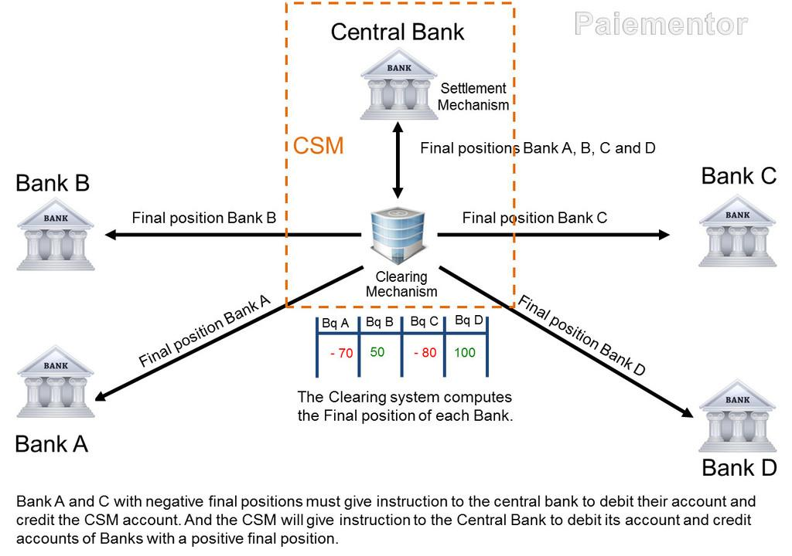

## Table of Contents

## What is an International Clearing System?

An International Clearing System is a network that helps banks and financial institutions in different countries to transfer money and settle payments. It makes sure that when someone sends money from one country to another, the money reaches the right place safely and quickly. This system is very important for businesses and people who need to make payments across borders.

There are a few big international clearing systems, like SWIFT and CHIPS. They use special codes and rules to make sure everything works smoothly. Without these systems, sending money between countries would be much harder and take a lot longer. They help make the world's financial system work better and more efficiently.

## Why are International Clearing Systems important for global trade?

International Clearing Systems are very important for global trade because they make it easy and safe to send money from one country to another. When businesses in different countries need to pay each other, these systems help them do it quickly. Without these systems, sending money would take a long time and might not be safe. This would make it hard for businesses to buy and sell things across borders.

These systems also help make sure that the money goes to the right place. They use special codes and rules to keep everything organized. This is important because if the money goes to the wrong place, it can cause big problems for businesses. By using International Clearing Systems, companies can trust that their payments will be handled correctly, which helps them do more business around the world.

## How does an International Clearing System work?

An International Clearing System works by connecting banks and financial institutions around the world. When someone needs to send money to another country, they tell their bank. The bank then uses the clearing system to send a message to the bank in the other country. This message includes all the important details, like how much money to send and where it should go. The system uses special codes to make sure the message is clear and correct.

Once the message reaches the other bank, it checks everything and makes sure the money is ready to be sent. The clearing system then helps to make sure the money is taken out of the sender's account and put into the receiver's account. This all happens quickly, usually within a few days. The system keeps track of all the transactions to make sure everything is done right and nobody loses money. This way, people and businesses can send money across the world safely and easily.

## What are the main components of an International Clearing System?

The main components of an International Clearing System include a network of banks and financial institutions, a messaging system, and a set of rules and standards. The network connects banks all over the world so they can send and receive money from each other. The messaging system is like a special language that the banks use to talk to each other. It uses codes and messages to make sure everyone understands what needs to be done. The rules and standards are important because they make sure that all the banks follow the same steps when they are sending and receiving money.

Another key component is the clearing and settlement process. This is how the system makes sure that when money is sent from one bank to another, it is taken out of the sender's account and put into the receiver's account correctly. The system keeps track of all the transactions to make sure nobody loses money and everything is done right. Without these components working together, it would be hard for banks to send money across borders quickly and safely.

## Can you name some major International Clearing Systems?

There are a few major International Clearing Systems that help banks send money around the world. One of the biggest is SWIFT, which stands for Society for Worldwide Interbank Financial Telecommunication. SWIFT is used by banks to send messages to each other about money transfers. It's like a special language that helps banks understand what they need to do. Another important system is CHIPS, which stands for Clearing House Interbank Payments System. CHIPS is mainly used for sending large amounts of money between banks in the United States and other countries.

These systems are very important because they make it easier and safer for businesses and people to send money across borders. Without them, it would take a long time to send money and there could be more mistakes. SWIFT and CHIPS help make sure that when someone sends money, it gets to the right place quickly and correctly. They use special codes and rules to keep everything organized and safe.

## What are the differences between various International Clearing Systems?

Different International Clearing Systems have some key differences. SWIFT, for example, is mainly used for sending messages between banks about money transfers. It acts like a special language that helps banks understand each other. On the other hand, CHIPS is used for actually moving large amounts of money, especially between banks in the United States and other countries. While SWIFT focuses on the communication part, CHIPS is more about the actual transfer of funds.

Another important difference is in the way these systems operate. SWIFT is a global network that connects thousands of banks around the world, making it very widespread. It uses standardized codes to make sure messages are clear and accurate. CHIPS, however, is more focused on high-value transactions and works within a more specific network. It's faster for large transfers because it settles payments in real-time. These differences mean that each system has its own strengths and is used for different kinds of international payments.

Overall, while both SWIFT and CHIPS help with international money transfers, they serve different purposes. SWIFT is crucial for the communication needed to set up these transfers, while CHIPS is key for quickly moving large sums of money. Understanding these differences helps banks choose the right system for their needs, making global trade smoother and more efficient.

## How do International Clearing Systems handle different currencies?

International Clearing Systems handle different currencies by using special codes and rules to make sure everything works smoothly. When someone sends money from one country to another, the system needs to know which currencies are involved. For example, if someone in the United States wants to send dollars to someone in Europe who uses euros, the system will use a special code to tell the banks about the exchange rate. This helps the banks know how many euros they need to give the person in Europe for the dollars they received.

Once the banks know the exchange rate, the International Clearing System helps them move the money from one currency to another. This process is called currency conversion. The system makes sure that the right amount of money is taken out of the sender's account in their currency and the correct amount is put into the receiver's account in their currency. This way, even though people use different kinds of money around the world, the system can still help them send money to each other safely and correctly.

## What are the risks associated with using International Clearing Systems?

Using International Clearing Systems can have some risks. One big risk is that something could go wrong with the messages between banks. If the codes or messages are not clear, the money might go to the wrong place or not get there at all. This can cause big problems for people and businesses who need to send money across borders. Another risk is that someone might try to steal the money while it's being sent. Even though these systems have strong security, there is always a small chance that hackers could find a way to take the money.

Another risk is that the exchange rates between different currencies can change quickly. If someone sends money from one country to another, the amount of money the receiver gets might be different from what was expected because the exchange rate changed. This can be a problem for businesses that need to know exactly how much money they will get. Also, sometimes these systems can be slow, and it might take a few days for the money to reach the other side. This can be a problem if the money is needed quickly.

## How do regulatory frameworks impact International Clearing Systems?

Regulatory frameworks are very important for International Clearing Systems. They make sure that these systems follow rules and laws in different countries. This helps keep everything safe and fair. For example, banks have to follow rules about checking who is sending and receiving money to stop illegal activities like money laundering. These rules can be different in each country, so the systems have to be careful to follow all of them. This can make things more complicated, but it's important for keeping the system trustworthy and secure.

Sometimes, regulatory frameworks can also make it harder for International Clearing Systems to work smoothly. If the rules in one country are very strict, it might take longer to send money there. This can slow down the whole process and make it more expensive. But, these rules are there to protect everyone and make sure that the money is sent correctly and safely. Even though it can be challenging, International Clearing Systems have to follow these rules to keep working and help people and businesses send money around the world.

## What technological advancements have influenced International Clearing Systems?

Technological advancements have made International Clearing Systems faster and safer. One big change is the use of computers and the internet. Now, banks can send messages to each other instantly, which makes it quicker to move money from one country to another. Special software helps keep track of all the transactions and makes sure everything is done right. This has made it easier for businesses and people to send money across borders without waiting a long time.

Another important advancement is the use of better security measures. Banks use special codes and encryption to keep the messages and money safe from hackers. This helps make sure that when someone sends money, it gets to the right place without anyone stealing it. Also, new technology like blockchain and [artificial intelligence](/wiki/ai-artificial-intelligence) is starting to be used to make these systems even better. These technologies can help make the process more efficient and less likely to have mistakes, which is good for everyone using the system.

## How do International Clearing Systems ensure security and prevent fraud?

International Clearing Systems use special ways to keep money safe and stop bad people from stealing it. They use codes and special computer tricks called encryption to make sure the messages between banks are secret and safe. Only the banks that are supposed to see the messages can read them. This helps keep the money safe while it's being sent from one country to another. The systems also check who is sending and receiving the money very carefully. This is called "know your customer" rules, and it helps stop people from using the system to do bad things like money laundering.

Another way these systems keep things safe is by watching all the transactions very closely. They use special computer programs to look for anything that seems strange or wrong. If they see something that doesn't look right, they can stop the money from being sent and check what's going on. This helps catch any fraud before it causes big problems. By using these smart ways to keep an eye on everything, International Clearing Systems can make sure that sending money across borders is as safe as possible.

## What future trends are expected in the development of International Clearing Systems?

In the future, International Clearing Systems are expected to get even better and faster because of new technology. One big trend is the use of blockchain. Blockchain is like a special kind of computer record that everyone can see but nobody can change. It can help make sending money across borders quicker and safer. Another trend is the use of artificial intelligence, or AI. AI can help the systems look for anything strange in the money transfers and stop fraud before it happens. These technologies will make it easier for people and businesses to send money around the world without waiting a long time or worrying about their money being stolen.

Another important trend is that these systems will work together more. Right now, different systems like SWIFT and CHIPS do different things, but in the future, they might work together more to make everything smoother. This will help make sending money across borders even easier and faster. Also, as more countries use these systems, the rules and laws about sending money will become more similar around the world. This will make it easier for the systems to follow all the rules and keep everything safe and fair.

## What is the International Clearing System?

The international clearing system is an essential component in the landscape of global financial transactions, facilitating the smooth execution of trade between parties operating in different countries. It ensures that cross-border transactions are settled efficiently and securely, thereby maintaining the seamless functioning of international trade.

At its core, the international clearing system operates through a network of international clearinghouses. These entities coordinate and settle trades across various markets, acting as intermediaries to ensure that each transaction is recorded with accuracy and transparency. This system plays a pivotal role in mitigating risks associated with international trade by ensuring that both parties involved in a transaction fulfill their contractual obligations. By doing so, it diminishes the potential for disputes and enhances trust between trading partners.

A crucial function of the international clearing system is maintaining trade accuracy. This involves the precise matching and verification of trade details, ensuring that the transaction terms agreed upon by the parties are faithfully executed. Additionally, the clearing system is responsible for mitigating risks that arise due to counterparty defaults or market fluctuations. Through mechanisms such as netting and the imposition of margin requirements, it reduces the impact of these risks, thereby protecting the integrity of the financial markets.

To illustrate this function mathematically, consider a simple netting process where two parties, A and B, have agreed to multiple transactions. Suppose party A needs to pay party B amounts $x_1, x_2, \ldots, x_n$ and conversely, party B owes party A amounts $y_1, y_2, \ldots, y_m$. The net obligation for these transactions is calculated as:

$$
\text{Net Obligation} = \left( \sum_{i=1}^{n} x_i \right) - \left( \sum_{j=1}^{m} y_j \right)
$$

By consolidating these transactions, the clearing system significantly reduces the operational burden involved in settling each trade individually.

In summary, the international clearing system ensures the efficient execution and settlement of international trades by coordinating through a network of clearinghouses, maintaining accuracy, mitigating risks, and making sure all parties uphold their contractual duties. This foundational role is crucial for the fluidity and reliability of global trade.

## References & Further Reading

[1]: Kroszner, R. S. (2006). ["The Role of Clearinghouses and Settlement in Futures Markets."](https://www.semanticscholar.org/paper/Lessons-from-Financial-Crises%3A-The-Role-of-Kroszner/01053b8686e602a7f0975096199be7c246c9e31f) Federal Reserve Board.

[2]: Pirrong, C. (2012). ["The Economics of Central Clearing: Theory and Practice."](https://www.eachccp.eu/wp-content/uploads/2015/12/ISDAdiscussion_CCP_Pirrong.pdf) Bank of England, Financial Stability Paper No. 18.

[3]: Lopez de Prado, M. (2018). ["Advances in Financial Machine Learning."](https://www.amazon.com/Advances-Financial-Machine-Learning-Marcos/dp/1119482089) Wiley.

[4]: Satoshi, N. (2008). ["Bitcoin: A Peer-to-Peer Electronic Cash System."](https://nakamotoinstitute.org/library/bitcoin/) Bitcoin.org.

[5]: Lin, L., & Michalski, R. S. (2007). ["An Application of Machine Learning Methods to Predict Stock Prices."](https://www.semanticscholar.org/paper/Machine-Learning-and-Data-Mining%3B-Methods-and-Michalski-Bratko/c21ce2fd906ef6b5c669d55458bd956155eda14f) IEEE Transactions on Neural Networks.

[6]: Hull, J. C. (2018). ["Options, Futures, and Other Derivatives."](https://www.semanticscholar.org/paper/Options%2C-Futures%2C-and-Other-Derivatives-Hull/89bdee500c8623864fc9eb7a471546aa713acc44) Pearson.

[7]: Domowitz, I., & Steil, B. (1999). ["Automation, trading costs, and the structure of the trading services industry."](https://www.nomurafoundation.or.jp/en/wordpress/wp-content/uploads/2014/09/19971011_Ian_Domowitz_-_Benn_Steil.pdf) Brookings-Wharton Papers on Financial Services.