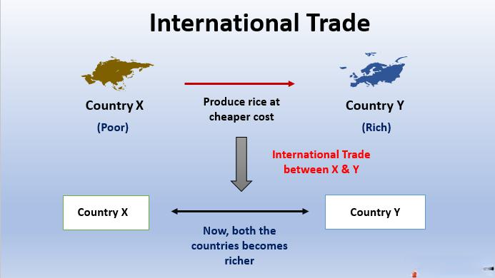

In the modern economic landscape, global business commerce mechanisms such as international trade and algorithmic trading have emerged as pivotal drivers of economic growth and connectivity. International commerce, realized through the exchange of goods, services, and capital across borders, facilitates global economic integration. This integration is crucial for fostering economic development, innovation, and market expansion, enabling nations to leverage their comparative advantages and achieve economic prosperity.

This article embarks on an exploration of the complex world of international commerce, concentrating on two primary facets: trade and emerging technologies like algorithmic trading. International trade, a cornerstone of global commerce, involves the structured exchange of goods and services across national boundaries and is shaped by trade agreements, tariffs, and intricate regulations. Algorithmic trading, on the other hand, represents a technological advancement in financial markets, utilizing computer algorithms to manage and execute trading processes with speed and precision.

Understanding global trade from multiple perspectives allows us to grasp the intricacies and benefits introduced by these evolving commerce mechanisms. International trade contributes to economic growth by opening new markets, increasing competition, and facilitating access to resources. Algorithmic trading enhances market efficiency, liquidity, and transaction cost reduction, reinforcing the robustness of financial markets.

However, alongside these benefits, potential risks accompany the integration and reliance on such mechanisms. The rapid adoption of algorithmic trading raises concerns regarding market volatility and systemic risks. Additionally, disparities in trade policies and agreements can lead to economic dependencies and conflicts among nations.

In examining the future direction of global trade, the role of algorithms and digital transformation is increasingly prominent. Technological advancements continue to reshape trade practices and financial markets, signaling a transformative era in global commerce. This article will navigate these topics, providing insights into the underlying mechanisms and dynamics that shape modern international commerce, and suggesting how stakeholders can optimize strategies to harness opportunities and mitigate challenges in this evolving landscape.

## Table of Contents

## Understanding International Commerce

International commerce serves as a critical facilitator in the global exchange of goods, services, capital, and information across different nations, significantly contributing to worldwide economic integration. The process involves a myriad of activities such as import and export transactions, foreign direct investments (FDI), and comprehensive cross-border logistics operations that ensure the seamless movement of resources between countries.

Historically, the dynamics of international commerce have evolved remarkably, beginning from ancient barter systems and the Silk Road trade routes to the contemporary intricacies of the digital marketplace. The transformation over centuries has been influenced by technological advances, policy reforms, and international trade agreements that have collectively lowered barriers and streamlined transactions.

Key activities in international commerce include import and export transactions, which form the backbone of global trade. These transactions often involve complex layers of legal, financial, and logistical considerations to ensure compliance with international standards and local regulations. For example, importers and exporters must navigate tariffs, customs duties, and various trade agreements designed to facilitate or restrict trade between countries.

Foreign Direct Investment (FDI) is another important component, encompassing investments made by a company or individual in one country into business interests located in another. This type of investment is crucial for economic growth as it creates jobs, spreads technology, and enhances productivity in the host country.

Cross-border logistics is pivotal in international commerce, encompassing the management of the flow of goods and services from one country to another. The efficiency of logistics operations can significantly affect the speed and cost of international trade, influencing competitive advantages in the global market.

Looking ahead, the future trends in international commerce are poised to be shaped by continuous technological advancements, such as [artificial intelligence](/wiki/ai-artificial-intelligence), blockchain technology, and the Internet of Things (IoT). These technologies are expected to further revolutionize trade processes by increasing transparency, reducing transaction costs, and enhancing security. Additionally, a growing emphasis on sustainability and ethical practices is likely to redefine trade principles, aligning them with global Environmental, Social, and Governance ([ESG](/wiki/esg-investing)) criteria.

In sum, understanding the dynamics of international commerce is crucial for comprehending how globalized trade operates, its historical transformations, and the emerging trends likely to influence it in the future. This understanding aids businesses and policymakers in crafting strategies that leverage the opportunities offered by the integrated global market while mitigating associated challenges.

## The Mechanisms of International Trade

International trade serves as a fundamental part of international commerce, enabling the exchange of goods and services across national borders. This section analyzes the mechanisms and policies that facilitate such trade interactions, underpinning the global economy.

Trade agreements play a pivotal role in international trade by creating a structured framework for cooperation and exchange between countries. These agreements, whether bilateral or multilateral, aim to reduce barriers, such as tariffs and quotas, to encourage free trade. Notable examples include the North American Free Trade Agreement (NAFTA), now succeeded by the United States-Mexico-Canada Agreement (USMCA), and the European Union's single market agreements. Such treaties are designed to harmonize standards, reduce import-export tariffs, and foster economic collaboration.

Tariffs are taxes levied on imported goods, acting as a crucial tool for governments to control the [volume](/wiki/volume-trading-strategy) of trade and protect domestic industries from excessive foreign competition. While tariffs can generate government revenue, their imposition often leads to higher prices for consumers and potential retaliatory actions from trading partners. Therefore, international trade policies strive to manage and negotiate these tariffs to balance economic interests effectively.

Import-export regulations and customs procedures are integral to international trade, setting the rules and guidelines for the exchange of goods. These regulations ensure that products entering or leaving a country meet specific standards, such as safety, quality, and environmental regulations. Customs procedures, including the documentation and inspection of shipments, play a vital role in validating compliance and maintaining the security and efficiency of trade operations.

Different trade policies and conventions further influence international trade practices by dictating the terms of trade relations. For instance, the World Trade Organization (WTO) provides a legal and institutional framework for international trade by negotiating trade agreements and resolving disputes among member countries. Similarly, conventions like the International Commercial Terms (Incoterms) set clear terms of sale and delivery between buyer and seller, reducing potential conflicts and ambiguities in trade transactions.

These mechanisms collectively shape the landscape of international trade, impacting how countries engage in economic exchanges. Understanding their implications is essential for businesses and policymakers to navigate and optimize their strategies within the global trade ecosystem.

## Algorithmic Trading in Global Markets

Algorithmic trading refers to the utilization of computer algorithms to execute trading instructions in financial markets with speed and precision. These algorithms analyze multiple market variables, including price, volume, and time, to make informed trading decisions. The primary advantage of [algorithmic trading](/wiki/algorithmic-trading) is its capacity to execute orders at speeds unattainable by human traders, leading to faster and more efficient trading processes.

One of the significant contributions of algorithmic trading is enhancing market [liquidity](/wiki/liquidity-risk-premium). Liquidity refers to the ability of the market to accommodate large trade volumes without substantially affecting the asset's price. Algorithmic trading increases liquidity by generating a continuous flow of buy and sell orders, enabling markets to function more efficiently. According to several studies, algorithmic traders provide necessary liquidity during various market conditions, ensuring smoother trading operations ([Hendershott et al., 2011](https://www.nber.org/papers/w16862)).

Furthermore, algorithmic trading reduces transaction costs. Transaction costs include both explicit costs such as fees and implicit costs like the market impact of a trade. Algorithms can minimize these costs through techniques like optimal execution strategies, which spread orders over time to reduce market impact. For instance, a common algorithmic strategy is the Volume Weighted Average Price (VWAP), used to execute orders in line with the trading volume profile of an asset.

The benefits of algorithmic trading extend to increased market efficiency. Market efficiency implies the reflection of all available information in asset prices, allowing for fair asset valuation. Algorithms continuously analyze vast datasets and execute trades based on minute price differentials, which contributes to narrowing these differentials and aligning prices closer to their intrinsic values. This process increases the informational efficiency of markets and reduces [arbitrage](/wiki/arbitrage) opportunities.

However, algorithmic trading is not without risks. One primary concern is market [volatility](/wiki/volatility-trading-strategies). Algorithms, particularly high-frequency trading ([HFT](/wiki/high-frequency-trading-strategies)) algorithms, can exacerbate market movements during periods of stress, as seen during events like the "Flash Crash" of 2010. These rapid price movements raise concerns about systemic risks. Addressing these risks involves the implementation of advanced risk management strategies and market safeguards, such as circuit breakers and trading halts, that help prevent excessive volatility and promote market stability ([U.S. Securities and Exchange Commission, 2010](https://www.sec.gov/news/studies/2010/marketevents-report.pdf)).

In sum, while algorithmic trading significantly enhances market dynamics by improving liquidity, reducing costs, and promoting efficiency, it also mandates robust risk mitigation strategies to safeguard against potential market disturbances. The continuous evolution of algorithms and technology presents ongoing opportunities and challenges within global financial markets.

## Benefits and Challenges of Global Business Commerce

Global business commerce has revolutionized the way markets operate by providing enhanced opportunities and diverse resources that are pivotal for economic growth and innovation. As businesses expand beyond their national borders, they tap into new consumer bases, access varied resources, such as raw materials and technology, and engage in the dynamic exchange of knowledge. This expansion facilitates better resource allocation and promotes competitive markets, leading to increased efficiency and productivity.

### Benefits of Global Business Commerce

1. **Market Expansion**: By transcending geographical limitations, businesses can enter new markets, increasing their consumer base and revenue streams. Firms can exploit economies of scale, reducing costs and maximizing profits.

2. **Access to Resources and Innovation**: Engaging in global business commerce allows companies to access a wide array of resources, including advanced technologies and specialized skills. This access fosters innovation, as businesses can adopt new processes and create cutting-edge products by leveraging global expertise and technologies.

3. **Economic Growth**: The interconnectedness of global markets stimulates economic growth by increasing trade volumes and creating employment opportunities. As businesses grow and invest in different regions, they contribute to local and global economic development.

4. **Diversification and Risk Management**: Operating in multiple markets provides businesses with the ability to diversify their revenue streams and spread economic risks. This diversification can safeguard against market volatility and economic downturns in a single region.

### Challenges of Global Business Commerce

Despite the numerous benefits, businesses face several challenges in the global marketplace. Successfully navigating these obstacles requires strategic planning and adaptation.

1. **Cultural Differences**: Understanding and respecting cultural variations is crucial for international success. Businesses must adapt their strategies to meet diverse consumer preferences and cultural norms, necessitating investment in cultural competence and local expertise.

2. **Economic Dependency**: Relying heavily on specific markets or resources can expose businesses to risks such as political instability, economic sanctions, or trade wars. Diversifying supply chains and markets can mitigate these dependencies.

3. **Regulatory Complexities**: Navigating differing legal and regulatory environments presents a significant hurdle. Companies must comply with various international laws, trade regulations, and environmental standards, which can be both costly and time-consuming.

### Strategies for Navigating Challenges

To effectively manage these challenges, businesses can employ several strategies:

- **Cultural Intelligence and Localization**: Developing a deep understanding of local cultures and customizing products and marketing efforts can enhance consumer engagement and brand loyalty.

- **Diversification of Supply Chains**: Building flexible and diverse supply chain networks can reduce dependency risks and improve resilience to disruptions.

- **Compliance and Risk Management**: Investing in regulatory knowledge and developing robust compliance systems can help businesses navigate legal challenges and maintain smooth operations. Utilizing technology and data analytics can streamline compliance processes.

- **Collaborative Alliances**: Forming strategic partnerships and alliances can provide businesses with local expertise and shared resources, allowing for smoother market entry and greater competitive advantage.

In conclusion, while global business commerce offers substantial advantages by connecting markets and resources, businesses must be equipped with strategies to overcome cultural, economic, and regulatory challenges. By doing so, they can fully capitalize on the opportunities at hand and contribute to sustainable economic growth.

## Impact of Trade Agreements and Policies

Trade agreements and international policies are crucial in setting the rules and expectations for global trade. They are designed to facilitate trade by reducing barriers, thus fostering economic cooperation and promoting economic growth across borders. The primary objective is to create a stable and predictable trading environment that supports international economic integration.

One of the significant trade agreements in recent history is the United States-Mexico-Canada Agreement (USMCA), which replaced the North American Free Trade Agreement (NAFTA) in 2020. The USMCA aimed to modernize trade relations between the three countries by addressing digital trade, labor standards, and environmental protection, among other areas [1]. This agreement has had a substantial impact on trade flows in North America, enhancing market access for goods and services while introducing more stringent intellectual property and labor provisions.

The European Union (EU) represents another critical framework impacting global commerce. As a single market, the EU allows for the free movement of goods, services, capital, and labor among its member states [2]. The EU's common trade policy enables it to negotiate as a single entity in international trade agreements, thus wielding significant influence over global trade norms and practices.

Trading blocs like the European Union and associations such as the Association of Southeast Asian Nations (ASEAN) play pivotal roles in shaping trade policies—negotiating collective trade agreements that influence regional and global market dynamics. These blocs offer businesses opportunities to access larger markets with reduced tariffs and improved regulatory coherence.

Regulatory changes also significantly impact international business strategies. Adjustments in trade regulations can lead to shifts in supply chains, necessitating businesses to adapt quickly to remain competitive. For instance, the introduction of stringent data protection regulations, such as the GDPR in the EU, has affected how companies handle cross-border data transfers, thus influencing international business strategies around compliance and privacy.

Furthermore, global political dynamics, such as Brexit, have demonstrated the impact of major policy shifts on international trade. The United Kingdom's departure from the EU necessitated the renegotiation of trade agreements, impacting trade relations not only within Europe but globally.

In conclusion, trade agreements and policies shape the landscape of global trade by influencing economic cooperation and regulatory practices. By reducing barriers to trade, these agreements enable countries to benefit from increased market access and economic growth, while also posing challenges that require strategic adaptation by businesses. As the global economic landscape continues to evolve, the role of trade agreements and policies in facilitating and regulating international commerce will remain vital.

References:

[1] Office of the United States Trade Representative. United States-Mexico-Canada Agreement. Retrieved from: https://ustr.gov/usmca

[2] European Union. The European Single Market. Retrieved from: https://europa.eu/european-union/topics/single-market_en

## Future Trends in International Trade and Commerce

Emerging trends in international trade and commerce are increasingly shaped by digitalization and the integration of sustainability practices. These developments are largely driven by technological advancements and the incorporation of Environmental, Social, and Governance (ESG) criteria.

### Digitalization of Trade Processes

The digitalization of trade processes marks a significant transformation in how international commerce is conducted. Technologies such as blockchain, artificial intelligence (AI), and the Internet of Things (IoT) are revolutionizing the efficiency and transparency of supply chains. For instance, blockchain technology enables secure and immutable record-keeping, which is crucial for tracking the provenance of goods and ensuring compliance with trade regulations [1].

AI plays a pivotal role by enhancing data analytics and predictive capabilities, allowing businesses to optimize logistics, manage supply chain risks, and improve decision-making processes. For example, using AI-driven predictive analytics, companies can foresee demand fluctuations and adjust their supply strategies accordingly, thereby reducing inventory costs and enhancing service levels.

IoT contributes to improved supply chain management by providing real-time monitoring and data collection. Devices equipped with sensors enable detailed tracking of goods, from temperature control in perishable items to location tracking in logistics, ensuring quality and timeliness in delivery.

### Integration of Sustainability Practices

The integration of sustainability practices in international trade is underpinned by growing consumer awareness and regulatory pressures to address environmental and social issues. Companies are adopting ESG criteria to guide their trade practices, impacting operational strategies and stakeholder engagement. Sustainable practices include reducing carbon footprints, adopting circular economy principles, and enhancing transparency in sourcing practices.

Governments and international bodies are reinforcing these trends by implementing policies that mandate sustainable practices. For instance, the European Union’s Green Deal aims to make sustainable products the norm, influencing international suppliers to adopt greener practices to access EU markets[2].

### Geopolitical Shifts and Global Trade Networks

Geopolitical shifts are profoundly impacting international trade networks, reshaping economic alliances and trade routes. The rise of protectionism and trade tensions, exemplified by U.S.-China trade relations, are leading to shifts in global supply chains as companies seek to diversify and mitigate risks.

The emergence of regional trade agreements, such as the Regional Comprehensive Economic Partnership (RCEP), facilitates trade in Asia-Pacific, influencing global trade dynamics and encouraging the realignment of supply chains[3].

Moreover, the increasing relevance of digital geopolitics, including cybersecurity concerns and digital sovereignty, necessitates careful navigation by multinational enterprises. These factors are critical in determining the strategic direction of global trade networks and require adaptive strategies to ensure resilience and competitiveness in international markets.

### Conclusion

As international commerce evolves, digitalization, sustainability, and geopolitical shifts will continue to shape the trade landscape. Technologies such as blockchain, AI, and IoT are enhancing efficiency, while sustainability practices are becoming integral to trade operations. Meanwhile, geopolitical shifts demand agile and resilient supply chain strategies. Collectively, these trends offer opportunities for innovation and growth, necessitating a proactive approach from stakeholders in international trade.

**References:**

1. Nakamoto, S. (2008). Bitcoin: A Peer-to-Peer Electronic Cash System.
2. European Commission. (2020). A European Green Deal: Striving to be the first climate-neutral continent.
3. ASEAN. (2020). Regional Comprehensive Economic Partnership (RCEP).

## Conclusion

International commerce and algorithmic trading are integral to the fabric of the global economy, presenting both significant opportunities and inherent challenges. As global trade expands, businesses and nations must recognize and comprehend these mechanisms' complexities to leverage their full potential effectively. By understanding the intricate dynamics of international commerce, stakeholders are empowered to optimize strategies, ensuring robust growth and adept adaptation amidst evolving market landscapes.

One of the primary opportunities presented by international commerce is the increased access to diverse markets and resources. This broadens the potential for economic growth, innovation, and partnerships across borders. However, this interconnectedness also draws attention to various challenges, including cultural differences, economic dependency, and regulatory complexities that businesses must navigate skillfully.

Algorithmic trading, on the other hand, revolutionizes the financial sector by offering fast and efficient trade executions. With the aid of complex algorithms, trading processes become more streamlined, enhancing liquidity and reducing transaction costs. Despite these advantages, risks such as market volatility and technical failures pose significant threats, necessitating controlled implementation and risk management strategies.

As technological advancements continue, the landscape of global commerce is likely to transform further. Innovations in digital communication and data processing are expected to bridge existing market gaps, making international commerce more inclusive and accessible. Emerging trends such as the digitalization of trade and integration of sustainability practices highlight critical pathways for future developments. Furthermore, as nations navigate geopolitical shifts, adaptive strategies will be essential to maintain competitive advantages in a globalized economy.

In conclusion, the interplay between international commerce and technology is accelerating changes within global markets. By capitalizing on the benefits and mitigating the challenges, businesses can foster sustainable growth and innovation, setting the stage for a new era in global commerce.

## References & Further Reading

1. Black, F. (1986). ["Noise."](https://onlinelibrary.wiley.com/doi/abs/10.1111/j.1540-6261.1986.tb04513.x) Journal of Finance, 41(3), 529-543.

2. Hendershott, T., Jones, C. M., & Menkveld, A. J. (2011). ["Does Algorithmic Trading Improve Liquidity?"](https://onlinelibrary.wiley.com/doi/full/10.1111/j.1540-6261.2010.01624.x) Journal of Finance, 66(1), 1-33.

3. U.S. Securities and Exchange Commission. (2010). ["Findings Regarding the Market Events of May 6, 2010."](https://www.sec.gov/news/studies/2010/marketevents-report.pdf)

4. Office of the United States Trade Representative. ["United States-Mexico-Canada Agreement."](https://ustr.gov/trade-agreements/free-trade-agreements/united-states-mexico-canada-agreement)

5. European Union. ["The European Single Market."](https://en.wikipedia.org/wiki/European_single_market)

6. Nakamoto, S. (2008). ["Bitcoin: A Peer-to-Peer Electronic Cash System."](https://nakamotoinstitute.org/library/bitcoin/)

7. European Commission. (2020). ["A European Green Deal: Striving to be the first climate-neutral continent."](https://ec.europa.eu/newsroom/know4pol/items/664852/en)

8. ASEAN. (2020). ["Regional Comprehensive Economic Partnership (RCEP)."](https://www.asean.org/wp-content/uploads/2020/11/Summary-of-the-RCEP-Agreement.pdf)