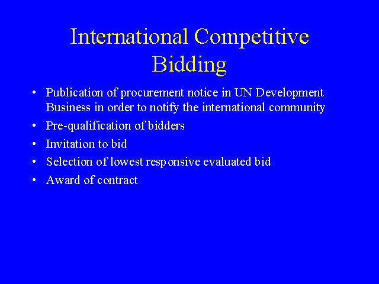

## Table of Contents

## What is International Competitive Bidding (ICB)?

International Competitive Bidding (ICB) is a method used by organizations, especially in the public sector, to purchase goods, services, or works from suppliers around the world. It is designed to ensure that the best possible value is obtained by encouraging competition among international suppliers. This process is often used by governments and international organizations like the World Bank to procure items in a fair and transparent manner.

In ICB, a detailed set of bidding documents is prepared and made available to potential bidders from different countries. These documents outline the specifications of what is needed, the terms of the contract, and the criteria for evaluation. Bidders then submit their proposals, which are evaluated based on factors like price, quality, and the bidder's ability to meet the project's requirements. The goal is to select the bid that offers the best overall value, promoting efficiency and fairness in the procurement process.

## Why is ICB important in global trade and procurement?

International Competitive Bidding (ICB) is important in global trade and procurement because it helps countries and organizations get the best deals. When different companies from around the world can bid on a project, it creates competition. This competition often leads to lower prices and better quality because each company wants to win the contract. By using ICB, countries can save money and get high-quality goods and services, which is good for their economy.

ICB also makes the procurement process fair and transparent. When everyone follows the same rules and the bidding process is open to all, it reduces the chance of corruption or favoritism. This fairness helps build trust between countries and companies, making global trade smoother and more reliable. In the end, ICB helps create a level playing field where the best offer wins, benefiting both the buyer and the global market.

## What are the key principles of ICB?

The key principles of International Competitive Bidding (ICB) are fairness and transparency. Fairness means that all bidders, no matter where they are from, have the same chance to win the contract. This is important because it helps prevent any one company or country from getting special treatment. Transparency means that the whole bidding process is open and clear. Everyone can see how the bids are evaluated and how the winner is chosen. This helps stop corruption and builds trust in the system.

Another important principle is competition. ICB encourages companies from around the world to bid on projects. When many companies compete, it often leads to lower prices and better quality. This is good for the organization buying the goods or services because they get more value for their money. The last principle is efficiency. ICB aims to make the procurement process quick and effective. By having clear rules and a structured process, ICB helps get the job done faster and with fewer problems.

## How does ICB differ from other bidding processes?

International Competitive Bidding (ICB) is different from other bidding processes because it invites companies from all over the world to bid. This means that a project can get bids from many different countries, not just one. Other bidding processes might only allow companies from a certain country or region to bid. This makes ICB more open and can lead to more competition, which often results in better prices and quality.

Another way ICB differs is in its focus on fairness and transparency. In ICB, the rules are very clear, and everyone can see how the bids are judged. This helps stop corruption and makes sure that the best bid wins. Other bidding processes might not be as open or might have less strict rules, which can sometimes lead to unfair advantages for certain companies. By being open and fair, ICB helps build trust and encourages more companies to take part.

## What are the steps involved in conducting an ICB?

Conducting an International Competitive Bidding (ICB) starts with preparing a detailed set of bidding documents. These documents explain what is needed, like the type of goods or services, and include the terms of the contract and how bids will be judged. Once the documents are ready, they are shared with potential bidders from around the world. Companies then have time to study the documents and prepare their bids, which they submit by a certain deadline.

After the bids are in, a team reviews them to see which one is the best. They look at things like the price, the quality of the goods or services, and whether the company can do the job well. The team uses the rules in the bidding documents to decide which bid is the winner. Once the winning bid is chosen, the contract is signed, and the company starts working on the project. This whole process helps make sure that the project gets the best value and is done fairly.

## Who can participate in an ICB?

Any company from around the world can take part in an International Competitive Bidding (ICB). It does not matter where the company is located. As long as the company can meet the requirements listed in the bidding documents, they are welcome to bid. This means that big companies and small companies, from rich countries and poor countries, all have a chance to win the contract.

The only thing that matters is that the company follows the rules set out in the bidding documents. These rules explain what the company needs to do to be eligible to bid. If a company can meet these rules, they can join the bidding process. This openness helps make sure that the best company wins the contract, no matter where they are from.

## What documentation is required for an ICB?

To take part in an International Competitive Bidding (ICB), companies need to prepare a set of documents. These documents include the bidding documents, which explain what the project needs and the rules for bidding. Companies also need to provide information about their company, like their experience and financial records. This helps show that they can do the job well.

Another important part of the documentation is the actual bid. This is where the company says how much they will charge and how they will do the work. The bid needs to follow the rules in the bidding documents. All these documents together help the people running the ICB choose the best company for the job.

## How are bids evaluated in an ICB?

In an International Competitive Bidding (ICB), bids are evaluated based on a set of clear rules that are written in the bidding documents. These rules help make sure that the process is fair and that the best bid wins. The people who evaluate the bids look at things like the price the company is asking for, the quality of the goods or services they will provide, and whether the company has the experience and resources to do the job well. They might also consider how quickly the company can start and finish the project.

The evaluation team compares all the bids to see which one offers the best value. They use a scoring system or a checklist to make sure they are judging all the bids in the same way. If a bid does not meet the basic requirements, it might be thrown out right away. The winning bid is the one that scores the highest based on all the factors that were set out in the bidding documents. This helps make sure that the project gets the best deal possible.

## What are the common challenges faced in ICB?

One common challenge in International Competitive Bidding (ICB) is the complexity of the process. It can be hard for companies to understand all the rules and prepare their bids correctly. They need to read a lot of documents and make sure they meet all the requirements. This can take a lot of time and effort. If a company makes a mistake, their bid might not be accepted, even if they could have offered a good deal.

Another challenge is the time it takes to complete the bidding process. ICB involves many steps, from preparing the bidding documents to evaluating the bids and choosing a winner. This can take months, which can delay the start of the project. Sometimes, companies might not want to wait that long to find out if they won the contract. Also, the need to be fair and transparent can make the process even slower, as every step has to be done carefully and openly.

## How does ICB ensure fairness and transparency?

International Competitive Bidding (ICB) makes sure things are fair and clear by having strict rules that everyone must follow. These rules are written down in the bidding documents, so all companies know exactly what they need to do. The same rules apply to every company, no matter where they are from. This means no one gets special treatment, and everyone has the same chance to win the contract. If a company thinks something is not fair, they can check the rules and see how the bids are being judged.

ICB also keeps everything open so people can see what is happening. The bidding process is shared with the public, and anyone can look at the bidding documents and see how the bids are being evaluated. This openness helps stop cheating and corruption because it is harder to do something wrong when everyone can see what you are doing. By being open and fair, ICB builds trust and makes sure the best company wins the contract.

## What role do international organizations play in ICB?

International organizations, like the World Bank and the United Nations, play a big role in International Competitive Bidding (ICB). They help set the rules and make sure that countries follow them. These organizations often provide money for big projects, so they want to make sure that the money is spent wisely. They do this by using ICB to find the best companies to work on the projects. By helping with ICB, these organizations make sure that the process is fair and that the best value is found for the money being spent.

These organizations also help countries that might not have a lot of experience with ICB. They give advice and support to make sure that the bidding process goes smoothly. They can also watch over the process to make sure it is done correctly and that there is no cheating. By doing all of this, international organizations help make global trade and procurement better and more trustworthy.

## What are the advanced strategies for optimizing outcomes in ICB?

To make International Competitive Bidding (ICB) work better, it's important to use good planning and clear communication. Before starting the bidding process, it helps to do a lot of research to understand the market and what companies can offer. This way, the bidding documents can be written to match what is really needed and attract the best companies. It's also good to talk clearly with everyone involved, like the companies that might bid and the people who will use the goods or services. By keeping everyone in the loop and answering questions quickly, the process can go more smoothly and more companies might want to bid.

Another way to get better results in ICB is by using technology and being flexible. Using online platforms can make it easier for companies from around the world to see the bidding documents and submit their bids. This can increase competition and lead to better deals. Also, being ready to change the bidding process if something unexpected happens can help keep things moving forward. For example, if there are not enough good bids, the rules might be changed a bit to get more companies interested. By planning well, talking clearly, using technology, and being flexible, ICB can work better and give the best results.

## References & Further Reading

[1]: ["World Bank Procurement Guidelines"](https://projects.worldbank.org/en/projects-operations/products-and-services/brief/procurement-policies-and-guidance): Framework for procurement activities emphasizing transparency, fairness, and best value.

[2]: ["International Trade Agreements and Competitive Global Bidding"](https://bidhive.com/international-trade-agreements-and-competitive-global-bidding-what-you-need-to-know/): An insightful resource by Bidhive on strategic nuances and compliance for competitive global bidding.

[3]: ["International Competitive Bidding Overview"](https://www.investopedia.com/terms/i/int_competitve_bidding.asp): A guide from Investopedia detailing the international competitive bidding process and strategic implications.

[4]: ["Advances in Financial Machine Learning"](https://www.amazon.com/Advances-Financial-Machine-Learning-Marcos/dp/1119482089) by Marcos Lopez de Prado: Comprehensive insights into the application of machine learning in financial systems, relevant for algorithmic trading in procurement.

[5]: ["Quantitative Trading: How to Build Your Own Algorithmic Trading Business"](https://www.amazon.com/Quantitative-Trading-Build-Algorithmic-Business/dp/1119800064) by Ernest P. Chan: Offers foundational knowledge on creating algorithmic trading strategies, applicable to procurement processes.

