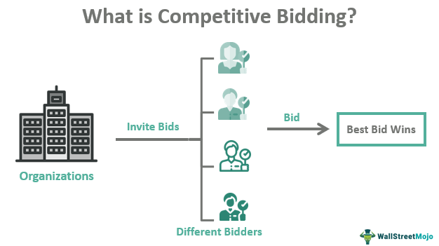

The global business environment is characterized by intense competition, with companies striving to seize opportunities in international tenders. These tenders serve as a crucial mechanism for international trade and economic development, facilitating the procurement of goods and services through structured bidding processes. International tenders are integral for organizations aiming to expand their market presence and optimize procurement costs while adhering to global standards and regulations.

The fusion of procurement processes with algorithmic trading techniques offers a transformative approach to enhancing efficiency in competitive bidding. Algorithmic trading, known for its use in financial markets, can significantly streamline procurement operations by employing data-driven analytics to inform strategic decision-making. This methodology enables companies to make faster and more informed decisions, thereby improving their competitive edge in the bidding process.



This article outlines the intricate relationship between procurement processes, international tenders, competitive bidding, and algorithmic trading. It seeks to provide valuable insights into how businesses can strategically leverage these elements to extend their reach in international markets. By understanding and effectively employing these components, companies can navigate the complexities of global trade, ensure compliance with international standards, and capture lucrative opportunities across borders. This strategic approach is essential for businesses aiming to bolster their international presence and achieve sustainable growth in a rapidly evolving global marketplace.

## Table of Contents

## Understanding Procurement Processes

Procurement processes are essential mechanisms that facilitate the acquisition of goods and services within organizations, ensuring that transactions are conducted efficiently and ethically. These processes are comprised of systematic methods designed to achieve optimal results in terms of cost-effectiveness, quality, and timeliness. At the heart of procurement is the principle of fairness, which mandates equal opportunity for all potential suppliers through transparent practices and competitive bidding.

International procurement, a critical facet of global trade, demands adherence to detailed regulations and international standards. Entities engaged in this activity must navigate a complex landscape marked by diverse legal requirements and cultural nuances. The World Trade Organization's Agreement on Government Procurement (GPA) is an example of an international treaty that outlines principles for non-discrimination, transparency, and procedural fairness, aiming to harmonize procurement practices across borders [World Bank Guidelines: Procurement of Goods, Works and Non-Consulting Services].

A pivotal aspect of effective procurement is the establishment of clear strategic objectives that align with the organization's financial and operational goals. This involves not only securing goods and services at the best possible value (price, quality, and terms) but also fostering long-term supplier relationships. Successful procurement strategies take into consideration the geographic and economic factors impacting supply chains, thus varying significantly in different contexts. For instance, a company operating in a developing market might focus more on cost minimization due to budget constraints, whereas an enterprise in a developed market may prioritize sustainable sourcing to meet regulatory and consumer demands.

Transparency in procurement is achieved through the dissemination of comprehensive and accessible tender documents, fair evaluation criteria, and open communication lines between procurers and suppliers. Such transparency bolsters trust among stakeholders and mitigates risks related to corrupt practices. Furthermore, competitive bidding is employed as a mechanism to ensure that multiple suppliers have the opportunity to present offers, encouraging innovation and competitive pricing.

The effectiveness of procurement processes is further examined through the lens of ethical standards. Practicing ethics in procurement implies that organizations commit to conduct free from fraud, corruption, and favoritism, ensuring equality and respect toward all participating parties. This ethical underpinning is crucial as it protects organizational reputation and even operational viability in international markets where regulatory scrutiny is high.

In summary, understanding procurement processes requires an appreciation of their systemic nature and strategic importance. By complying with international standards, promoting transparency, and upholding ethical principles, organizations can master procurement processes that not only support their own objectives but also contribute positively to global trade dynamics.

## Global Landscape of International Tenders

International tenders serve as a gateway for firms seeking to participate in the competitive global marketplace. They represent opportunities for companies to expand their reach by entering new markets and leveraging international contracts to boost their economic footprint. The issuance of international tenders is often tied to complex bidding processes governed by a suite of international agreements and regulations. These frameworks aim to ensure transparency, fairness, and competitiveness, creating a level playing field for all participants. 

Countries and organizations typically issue these tenders as a strategic measure to stimulate competition among suppliers, which in turn enhances procurement outcomes such as cost-efficiency, innovation, and quality improvement. The overarching goal of such competitive dynamics is to optimize value for public and private sector investments within a structured framework. Success in securing international tenders can profoundly influence a company's global presence, potentially increasing its market share and revenue streams. A notable example is the World Bank's procurement guidelines, which emphasize competitive bidding as a means to achieve cost-effective and high-quality procurement outcomes [World Bank Guidelines].

Given the multifaceted nature of international tenders, understanding and adapting to regional trade agreements is paramount. These agreements, which may differ across geographical areas and economic blocks, dictate various compliance requirements that companies must fulfill. Failure to adhere to these stipulations can lead to disqualification from bidding processes or legal ramifications. Therefore, firms looking to compete in international tenders must conduct thorough research on applicable trade laws and regulations, ensuring they align their strategies to fulfill all requisite criteria.

Moreover, international tenders often require firms to demonstrate a robust understanding of compliance needs that include environmental standards, local content stipulations, and labor laws. This necessitates a strategic approach to deciphering and satisfying both overarching international regulations as well as specific local requirements. By successfully navigating these challenges, companies not only enhance their bidding potential but also solidify their reputation as reliable partners on a global scale.

References such as Bidhive and Investopedia provide valuable insights into the strategies and practices vital to thriving in international competitive bidding [Bidhive; Investopedia]. These resources elucidate the practical steps and considerations companies must undertake to effectively participate in and win international tenders, emphasizing the critical role regional trade agreements play in this context.

## Competitive Bidding: A Strategic Approach

Competitive bidding represents a fundamental element of procurement processes, designed to ensure organizations obtain the best value for their resources. This process involves the submission of proposals that meticulously meet all stipulated requirements while offering competitive pricing and superior quality. Companies seeking success in competitive bidding must possess a deep understanding of the client's needs, prevailing competition, and current market conditions.

The strategic approach to competitive bidding involves the employment of specialized bid managers and consultants who tailor proposals to meet specific client demands and stand out among competitors. These professionals analyze market trends and regulatory frameworks, ensuring that bids are not only compliant but also compelling in their value proposition.

Technology and data analysis are increasingly pivotal in enhancing the precision and success of competitive bids. Advanced data analytics can help firms identify optimal pricing strategies and uncover insights into competitor behavior, leveraging historical data and market trends. By deploying [machine learning](/wiki/machine-learning) algorithms, companies can predict client needs and customize their bids accordingly. For example, predictive analytics can model client preferences based on previous bidding outcomes, using Python libraries such as Scikit-learn or TensorFlow to train models on historical data.

Incorporating technology enables firms to refine their bidding strategies iteratively. Algorithms can be coded to evaluate different bid scenarios, assess the risk of underpricing or overpricing, and suggest the most competitive bid within constraints, thereby optimizing the chances of successful contract award.

Thus, competitive bidding, when undertaken strategically, harnesses the synergy of experienced professionals, comprehensive market understanding, and cutting-edge technology to secure procurement success.

## Algorithmic Trading in Procurement

Algorithmic trading, originally a mainstay of financial markets, is increasingly finding application in procurement. At its core, it employs sophisticated algorithms and data analytics to streamline and enhance the bidding process. By automating decision-making, companies can achieve faster and more efficient bidding, reducing human error and subjectivity. This efficiency not only hastens the procurement cycle but also increases the likelihood of successful bid submissions by ensuring proposals are timely and competitive.

Optimization of procurement costs is another pivotal advantage. Algorithmic trading tools analyze vast datasets, identifying patterns and trends within supply chains. By leveraging these insights, firms can predict market shifts and price variations, thus securing better pricing for goods and services. This strategic foresight is especially beneficial for managing supply chain risks, allowing companies to preemptively address potential disruptions.

Integration of [algorithmic trading](/wiki/algorithmic-trading) with procurement systems offers real-time insights, vital for maintaining a competitive edge. These systems use predictive analytics to simulate different procurement scenarios, helping firms model potential outcomes effectively. This capability enables businesses to align their procurement strategies with overarching financial objectives, ensuring that procurement activities contribute positively to the bottom line.

Python, with its robust libraries such as NumPy and Pandas, is often employed for building these algorithmic models. For instance, using Pandas for time-series analysis can help predict price trends, while NumPy can optimize resource allocation through linear programming. Here's a simple example in Python that demonstrates how optimization can be used in procurement:

```python
import numpy as np
from scipy.optimize import linprog

# Coefficients for the objective function (e.g., costs)
c = [20, 30, 40]  # Costs per unit for three different suppliers
# Coefficients for the inequality constraints (e.g., capacities)
A = [[1, 2, 0], [0, 1, 1], [1, 0, 2]]
# Right-hand side of the inequality constraints (e.g., demand)
b = [40, 30, 50]

# Bounds for each variable (e.g., minimum and maximum purchase quantities)
x_bounds = [(0, None), (0, None), (0, None)]

# Optimize the cost
result = linprog(c, A_ub=A, b_ub=b, bounds=x_bounds, method='highs')

print(f'Minimized Cost: {result.fun}')
print(f'Optimal Solution: {result.x}')
```

In this example, the linear programming model optimizes the procurement costs based on supplier constraints and demands. This type of optimization is instrumental in aligning procurement processes with financial targets, facilitating savings, and ensuring resource efficiency. 

Overall, the application of algorithmic trading in procurement signifies a strategic advancement, promising thorough analysis and robust decision-making capabilities for firms looking to sustain a competitive advantage internationally.

## Leveraging Technology for Strategic Advantage

Technology is revolutionizing procurement by incorporating automation, [artificial intelligence](/wiki/ai-artificial-intelligence) (AI), and machine learning to streamline processes and enhance strategic advantages. Automation reduces the manual workload, accelerates procurement cycles, and eliminates human errors, ensuring a more efficient procurement process. This transformation allows organizations to adhere to international standards, meeting compliance requirements with greater ease.

Digital tools are integral in simplifying procurement processes by providing platforms that manage and track procurement activities. These tools enable organizations to ensure transparency and accountability, which are critical components in adhering to international procurement standards. By leveraging digital solutions, companies can also integrate various procurement functions into a cohesive platform, enhancing operational efficiency.

Companies use technology to identify market trends, optimize resource allocation, and forecast demand through advanced data analytics. By analyzing large datasets, businesses can gain insights into market dynamics, enabling them to anticipate shifts in demand and strategically align their resource distribution. Predictive analytics, supported by machine learning algorithms, allows companies to make informed decisions, minimizing waste and improving supply chain efficiency.

AI-driven insights are pivotal in crafting precise bids. Utilizing AI, businesses can analyze buyer histories, preferences, and market conditions to tailor their proposals, ensuring they align with the specific needs and expectations of potential clients. This precision enhances the likelihood of success in competitive bidding scenarios by providing superior value propositions.

Strategic partnerships with technology providers are advantageous for companies looking to elevate their procurement capabilities. By collaborating with these providers, organizations can access innovative solutions and expertise, enhancing their ability to predict outcomes and plan strategically. These partnerships can involve the integration of cutting-edge technology into procurement practices, offering a competitive edge in international markets.

Overall, the integration of technology not only boosts efficiency but also aligns procurement strategies with dynamic market environments, ensuring that companies maintain a competitive edge in global commerce.

## Challenges and Opportunities in International Bidding

Navigating international tenders presents a myriad of challenges that businesses must address effectively to succeed in the global marketplace. One significant hurdle is regulatory compliance, as different countries impose varied laws and standards on procurement processes. These regulations can range from environmental standards to specific labor laws, necessitating thorough research and understanding of each jurisdiction's requirements. Businesses often need to ensure compliance with international trade agreements, like those outlined by the World Trade Organization, which aim to standardize and simplify the bidding processes across borders.

Cultural differences also pose a substantial challenge. Each market has its unique business practices, negotiation styles, and decision-making protocols. Misunderstanding or neglecting these cultural nuances can lead to communication breakdowns and ultimately impact the success of a tender bid. For example, the concept of 'face' in East Asian markets emphasizes the importance of respect and reputation, which can significantly influence business interactions.

Logistical complexities add another layer of difficulty. International tenders often involve intricate supply chain considerations, including shipping regulations, taxes, and tariffs, which vary from one country to another. Efficiently managing these logistics requires a robust infrastructure and proficient management of resources to avoid delays and additional costs.

Despite these challenges, numerous opportunities exist in international bidding. Expanding market reach is one of the most apparent advantages. Successfully navigating international tenders allows businesses to tap into new customer bases and increase their global footprint, enhancing revenue potential. Additionally, participating in these tenders offers businesses the chance to build global networks, fostering relationships and partnerships that can drive innovation and open doors to new markets.

Strategic analysis and adaptability are crucial for overcoming obstacles and capitalizing on these opportunities. Businesses must continuously analyze market conditions, adjust strategies, and remain flexible to unexpected changes. This approach helps in identifying market-specific needs and tailoring offerings accordingly, giving companies a competitive edge.

Collaborative efforts with local partners can further facilitate success in international bidding. These partnerships can aid in understanding local market dynamics and regulatory landscapes, providing insights that are critical for crafting competitive bids. Moreover, local partners can help bridge cultural gaps, enhancing communication and trust with potential clients.

Continuous learning and market research are essential for maintaining relevance and competitiveness in international bidding. This involves staying updated with geopolitical changes, advancements in technology, and emerging market trends. Companies that emphasize strategic flexibility—adapting to new data and modifying their approach as necessary—are more likely to succeed in capturing international tender opportunities.

In conclusion, the landscape of international bidding is fraught with challenges but also laden with opportunities. By strategically addressing regulatory requirements, cultural differences, and logistical hurdles, and by leveraging partnerships and continuously enhancing their knowledge base, businesses can successfully navigate and thrive in the international tendering arena.

## Conclusion

The intertwined nature of procurement processes, international tenders, competitive bidding, and algorithmic trading plays a vital role in modern global commerce. As these elements continue to shape the business landscape, companies must adopt strategic approaches to navigate the complexities of procurement successfully. Leveraging technology and actionable insights is crucial in influencing the outcomes of competitive bids, allowing for more informed decision-making and enhanced efficiency.

Incorporating algorithmic trading can optimize procurement costs, streamline supply chain management, and provide real-time insights, offering companies a significant competitive edge. Sophisticated algorithms can model procurement scenarios, providing predictive analytics that align with strategic financial objectives. As international trade agreements become increasingly integral to global commerce, companies should capitalize on these opportunities to strengthen their global presence and market share.

Continuous adaptation is essential in the ever-evolving landscape of international trade. By embracing new technologies and strategies, companies can respond more effectively to market demands and regulatory changes. Data-driven decisions and innovative strategies are set to be the cornerstone of future procurement success, leading to more efficient operations and expanding business capabilities across borders.

In summary, the future of procurement lies in the effective integration of technology, strategic insight, and global cooperation, positioning businesses to thrive in a complex and competitive international environment.

## References

- **World Bank Guidelines: Procurement of Goods, Works, and Non-Consulting Services**: These guidelines provide a comprehensive framework for procurement activities, emphasizing transparency, fairness, and best value in procurement transactions. They serve as a critical reference for understanding procurement policies and their application in international tenders. [Source](https://www.worldbank.org/en/projects-operations/products-and-services/brief/procurement-new-framework).

- **Bidhive: International Trade Agreements and Competitive Global Bidding**: Bidhive explores the intricate dynamics of international trade agreements and their role in enabling competitive global bidding. This resource is valuable for understanding the strategic nuances and compliance requirements for organizations participating in international tenders. [Source](https://bidhive.com/international-trade-agreements-and-competitive-bidding/).

- **Investopedia: International Competitive Bidding Overview**: Investopedia provides an accessible overview of the international competitive bidding process, outlining the strategic implications and procedural steps involved. It helps clarify how firms can position themselves competitively in global bidding landscapes. [Source](https://www.investopedia.com/terms/i/international-competitive-bidding.asp).

- **Various Global Trade Agreements and Economic Reports**: Numerous trade agreements and economic reports offer insights into international procurement trends and regulatory environments. These documents are essential for companies aiming to expand their global presence through strategic bidding and procurement practices. Examples include NAFTA, the EU Single Procurement Document, and reports from the WTO and OECD.

## References & Further Reading

[1]: ["World Bank Procurement Guidelines"](https://projects.worldbank.org/en/projects-operations/products-and-services/brief/procurement-policies-and-guidance): Framework for procurement activities emphasizing transparency, fairness, and best value.

[2]: ["International Trade Agreements and Competitive Global Bidding"](https://bidhive.com/international-trade-agreements-and-competitive-global-bidding-what-you-need-to-know/): An insightful resource by Bidhive on strategic nuances and compliance for competitive global bidding.

[3]: ["International Competitive Bidding Overview"](https://www.investopedia.com/terms/i/int_competitve_bidding.asp): A guide from Investopedia detailing the international competitive bidding process and strategic implications.

[4]: ["Advances in Financial Machine Learning"](https://www.amazon.com/Advances-Financial-Machine-Learning-Marcos/dp/1119482089) by Marcos Lopez de Prado: Comprehensive insights into the application of machine learning in financial systems, relevant for algorithmic trading in procurement.

[5]: ["Quantitative Trading: How to Build Your Own Algorithmic Trading Business"](https://www.amazon.com/Quantitative-Trading-Build-Algorithmic-Business/dp/1119800064) by Ernest P. Chan: Offers foundational knowledge on creating algorithmic trading strategies, applicable to procurement processes.

